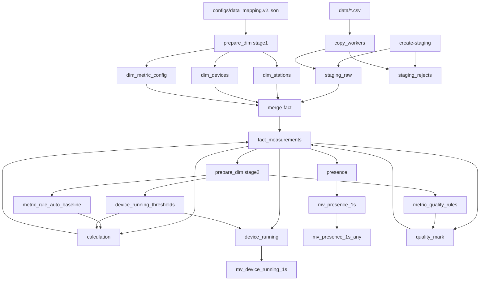

# CLI命令测试计划 - 深度验证：数据流图与SQL汇总

**创建时间**: 2025-11-02  
**版本**: v1.0  
**目的**: 汇总所有9个阶段的数据流图和关联验证SQL，便于执行测试

---

## 📊 完整数据流图（所有9个阶段）



---

## 🔗 跨阶段关联验证SQL汇总

### 1. 阶段1 → 阶段3 (prepare-dim stage1 → ingest-copy)

**验证点**：staging_raw中的名称是否都存在于维度表

```sql
-- 验证station_name
SELECT DISTINCT sr.station_name
FROM staging_raw sr
LEFT JOIN dim_stations s ON s.name = sr.station_name
WHERE s.id IS NULL;
-- 预期：0行

-- 验证device_name
SELECT DISTINCT sr.station_name, sr.device_name
FROM staging_raw sr
LEFT JOIN dim_stations s ON s.name = sr.station_name
LEFT JOIN dim_devices d ON d.station_id = s.id AND d.name = sr.device_name
WHERE d.id IS NULL;
-- 预期：0行

-- 验证metric_key
SELECT DISTINCT sr.metric_key
FROM staging_raw sr
LEFT JOIN dim_metric_config m ON m.metric_key = sr.metric_key
WHERE m.id IS NULL;
-- 预期：0行
```

### 2. 阶段1 → 阶段4 (prepare-dim stage1 → merge-fact)

**验证点**：fact_measurements的外键是否都有效

```sql
-- 验证station_id
SELECT DISTINCT fm.station_id
FROM fact_measurements fm
LEFT JOIN dim_stations s ON fm.station_id = s.id
WHERE s.id IS NULL;
-- 预期：0行

-- 验证device_id
SELECT DISTINCT fm.device_id
FROM fact_measurements fm
LEFT JOIN dim_devices d ON fm.device_id = d.id
WHERE d.id IS NULL;
-- 预期：0行

-- 验证metric_id
SELECT DISTINCT fm.metric_id
FROM fact_measurements fm
LEFT JOIN dim_metric_config m ON fm.metric_id = m.id
WHERE m.id IS NULL;
-- 预期：0行
```

### 3. 阶段3 → 阶段4 (ingest-copy → merge-fact)

**验证点**：staging_raw与fact_measurements的数据一致性

```sql
-- 统计staging_raw的数据量
SELECT COUNT(*) as staging_total FROM staging_raw;

-- 统计fact_measurements的数据量
SELECT COUNT(*) as fact_total FROM fact_measurements;

-- 去重率
SELECT 
    (SELECT COUNT(*) FROM staging_raw) as staging_total,
    (SELECT COUNT(*) FROM fact_measurements) as fact_total,
    ROUND((1.0 - (SELECT COUNT(*) FROM fact_measurements)::numeric / (SELECT COUNT(*) FROM staging_raw)::numeric) * 100, 2) as dedup_ratio_percent;
-- 预期：去重率在0-10%范围内

-- 时间范围对比
SELECT 
    (SELECT MIN("DataTime") FROM staging_raw) as staging_min,
    (SELECT MAX("DataTime") FROM staging_raw) as staging_max,
    (SELECT MIN(ts_bucket) FROM fact_measurements) as fact_min,
    (SELECT MAX(ts_bucket) FROM fact_measurements) as fact_max;
-- 预期：时间范围一致（考虑时区转换）
```

### 4. 阶段4 → 阶段5 (merge-fact → prepare-dim stage2)

**验证点**：fact_measurements是否有足够数据生成规则

```sql
-- 验证fact_measurements有数据
SELECT COUNT(*) FROM fact_measurements;
-- 预期：> 0

-- 验证fact_measurements的时间范围
SELECT 
    MIN(ts_bucket) as min_time,
    MAX(ts_bucket) as max_time,
    COUNT(*) as total_rows
FROM fact_measurements;
-- 预期：时间范围覆盖预期窗口

-- 验证原始指标是否存在（用于生成规则）
SELECT m.metric_key, COUNT(*) as row_count
FROM fact_measurements fm
JOIN dim_metric_config m ON fm.metric_id = m.id
WHERE m.metric_key IN ('pump_active_power', 'pump_frequency', 'pump_current_a', 'pump_current_b', 'pump_current_c')
GROUP BY m.metric_key
ORDER BY m.metric_key;
-- 预期：所有原始指标都存在，row_count > 0
```

### 5. 阶段5 → 阶段6 (prepare-dim stage2 → calculation)

**验证点**：规则表是否为计算指标生成了规则

```sql
-- 验证规则表是否为计算指标生成了规则
SELECT m.metric_key, COUNT(*) as rule_count
FROM dim_metric_config m
LEFT JOIN metric_quality_rules q ON q.metric_id = m.id
WHERE m.metric_key IN ('pump_flow_rate', 'pump_head', 'pump_efficiency')
GROUP BY m.metric_key;
-- 预期：所有计算指标都有规则，rule_count > 0
```

### 6. 阶段5 → 阶段7 (prepare-dim stage2 → device_running)

**验证点**：每个设备是否都有运行阈值

```sql
-- 验证每个设备是否都有运行阈值
SELECT d.id, d.name, t.i_on, t.i_off, t.p_on, t.p_off
FROM dim_devices d
LEFT JOIN device_running_thresholds t ON t.device_id = d.id
WHERE d.type = 'pump' AND t.device_id IS NULL;
-- 预期：0行（所有泵设备都有阈值）

-- 验证阈值的滞回效应
SELECT * FROM device_running_thresholds 
WHERE i_on <= i_off OR p_on <= p_off OR f_on <= f_off;
-- 预期：0行（确保滞回）
```

### 7. 阶段6 → 阶段7 (calculation → device_running)

**验证点**：计算指标是否可用于device_running

```sql
-- 验证计算指标是否可用于device_running
SELECT m.metric_key, COUNT(*) as row_count
FROM fact_measurements fm
JOIN dim_metric_config m ON fm.metric_id = m.id
WHERE m.metric_key IN ('pump_flow_rate', 'pump_active_power', 'pump_current_a')
  AND fm.ts_bucket >= '2025-05-31 18:00:00' AND fm.ts_bucket < '2025-05-31 20:00:00'
GROUP BY m.metric_key;
-- 预期：所有指标都存在，row_count > 0
```

### 8. 阶段6 → 阶段8 (calculation → presence)

**验证点**：计算指标的存在性

```sql
-- 验证计算指标的存在性
SELECT 
    m.metric_key,
    COUNT(DISTINCT fm.ts_bucket) as present_seconds,
    7200 as total_seconds,
    ROUND(COUNT(DISTINCT fm.ts_bucket)::numeric / 7200 * 100, 2) as presence_percent
FROM fact_measurements fm
JOIN dim_metric_config m ON fm.metric_id = m.id
WHERE m.metric_key IN ('pump_flow_rate', 'pump_head', 'pump_efficiency')
  AND fm.ts_bucket >= '2025-05-31 18:00:00' AND fm.ts_bucket < '2025-05-31 20:00:00'
GROUP BY m.metric_key;
-- 预期：presence_percent > 90%
```

### 9. 阶段7 → 阶段8 (device_running → presence)

**验证点**：运行状态与存在性的一致性

```sql
-- 验证运行状态与存在性的一致性
SELECT 
    d.name as device_name,
    COUNT(DISTINCT r.ts_bucket) as running_seconds,
    COUNT(DISTINCT p.ts_bucket) as presence_seconds
FROM dim_devices d
LEFT JOIN mv_device_running_1s r ON r.device_id = d.id
LEFT JOIN mv_presence_1s_any p ON p.device_id = d.id
WHERE r.ts_bucket >= '2025-05-31 18:00:00' AND r.ts_bucket < '2025-05-31 20:00:00'
GROUP BY d.name
ORDER BY d.name;
-- 预期：running_seconds ≤ presence_seconds（运行时必然有数据）
```

---

## 🔍 数据一致性验证SQL汇总

### 1. baseline与quality_rules一致性

```sql
-- 验证质量规则是否基于baseline生成
SELECT 
    b.station_id, b.device_id, b.metric_id,
    b.p05 as baseline_p05, q.value_min as quality_min,
    b.p95 as baseline_p95, q.value_max as quality_max,
    b.spike_abs as baseline_spike, q.spike_abs as quality_spike
FROM metric_rule_auto_baseline b
JOIN metric_quality_rules q ON 
    (b.station_id IS NOT DISTINCT FROM q.station_id) AND
    (b.device_id IS NOT DISTINCT FROM q.device_id) AND
    b.metric_id = q.metric_id
WHERE 
    ABS(b.p05 - q.value_min) > 0.001 OR
    ABS(b.p95 - q.value_max) > 0.001 OR
    ABS(b.spike_abs - q.spike_abs) > 0.001;
-- 预期：0行（完全一致）
```

### 2. staging_raw与fact_measurements数值一致性

```sql
-- 对比staging_raw和fact_measurements的数值
SELECT 
    sr."DataValue"::numeric as staging_value,
    fm.value as fact_value,
    ABS(sr."DataValue"::numeric - fm.value) as diff
FROM staging_raw sr
JOIN dim_stations s ON s.name = sr.station_name
JOIN dim_devices d ON d.station_id = s.id AND d.name = sr.device_name
JOIN dim_metric_config m ON m.metric_key = sr.metric_key
JOIN fact_measurements fm ON fm.station_id = s.id AND fm.device_id = d.id AND fm.metric_id = m.id
WHERE ABS(sr."DataValue"::numeric - fm.value) > 0.001
LIMIT 10;
-- 预期：0行或极少行（精度误差 < 0.001）
```

### 3. 计算指标数据量一致性

```sql
-- 计算前：统计原始指标数据量
SELECT m.metric_key, COUNT(*) as row_count
FROM fact_measurements fm
JOIN dim_metric_config m ON fm.metric_id = m.id
WHERE m.metric_key IN ('pump_active_power', 'pump_frequency', 'main_pipeline_flow_rate')
GROUP BY m.metric_key;

-- 计算后：统计计算指标数据量
SELECT m.metric_key, COUNT(*) as row_count
FROM fact_measurements fm
JOIN dim_metric_config m ON fm.metric_id = m.id
WHERE m.metric_key IN ('pump_flow_rate', 'pump_head', 'pump_efficiency')
  AND fm.source_hint LIKE 'calculation_%'
GROUP BY m.metric_key;

-- 验证：计算指标数据量应与原始指标一致（或略少）
```

---

## 📋 边界条件测试SQL汇总

### 1. 数据缺失场景

```sql
-- 场景1：验证staging_raw为空时merge-fact的行为
SELECT COUNT(*) FROM staging_raw;
-- 如果为0，则merge-fact不应插入新数据

-- 场景2：验证fact_measurements为空时prepare-dim stage2的行为
SELECT COUNT(*) FROM fact_measurements;
-- 如果为0，则规则表应为空

-- 场景3：验证缺少稳态数据时baseline生成的行为
SELECT COUNT(*) FROM fact_measurements WHERE quality_status=0 AND operation_phase=1;
-- 如果为0，则baseline可能使用quality=0的数据（回退策略）
```

### 2. 数据异常场景

```sql
-- 场景1：验证负值数据的处理
SELECT * FROM fact_measurements 
WHERE value < 0 AND metric_id IN (SELECT id FROM dim_metric_config WHERE metric_key LIKE '%power%')
LIMIT 10;
-- 负功率应被标记为异常或拒绝

-- 场景2：验证超出有效范围的数据
SELECT m.metric_key, fm.value, m.valid_min, m.valid_max
FROM fact_measurements fm
JOIN dim_metric_config m ON fm.metric_id = m.id
WHERE (fm.value < m.valid_min OR fm.value > m.valid_max)
  AND m.valid_min IS NOT NULL AND m.valid_max IS NOT NULL
LIMIT 10;
-- 超出范围的数据应被标记为异常

-- 场景3：验证重复数据的去重
SELECT station_id, device_id, metric_id, ts_bucket, COUNT(*) as dup_count
FROM fact_measurements
GROUP BY station_id, device_id, metric_id, ts_bucket
HAVING COUNT(*) > 1;
-- 预期：0行（UNIQUE约束确保无重复）
```

### 3. 性能边界场景

```sql
-- 场景1：统计数据量
SELECT 
    (SELECT COUNT(*) FROM fact_measurements) as fact_count,
    (SELECT COUNT(*) FROM staging_raw) as staging_count,
    (SELECT COUNT(*) FROM metric_rule_auto_baseline) as baseline_count,
    (SELECT COUNT(*) FROM device_running_thresholds) as threshold_count,
    (SELECT COUNT(*) FROM mv_device_running_1s) as running_count,
    (SELECT COUNT(*) FROM mv_presence_1s) as presence_count;
-- 用于评估性能测试的数据规模

-- 场景2：统计时间范围
SELECT 
    MIN(ts_bucket) as min_time,
    MAX(ts_bucket) as max_time,
    EXTRACT(EPOCH FROM (MAX(ts_bucket) - MIN(ts_bucket))) / 3600 as hours
FROM fact_measurements;
-- 用于评估时间窗口大小
```

---

## 🎯 业务逻辑验证SQL汇总

### 1. 物理规律验证

```sql
-- 验证泵效率在合理范围内
SELECT * FROM fact_measurements 
WHERE metric_id = (SELECT id FROM dim_metric_config WHERE metric_key='pump_efficiency')
  AND (value < 0 OR value > 0.85);
-- 预期：0行（效率在0-85%范围内）

-- 验证泵流量在合理范围内
SELECT * FROM fact_measurements 
WHERE metric_id = (SELECT id FROM dim_metric_config WHERE metric_key='pump_flow_rate')
  AND (value < 0 OR value > 1000);
-- 预期：0行（流量在0-1000 m³/h范围内）

-- 验证功率单位一致性
SELECT metric_key, unit, value_type
FROM dim_metric_config
WHERE metric_key LIKE '%power%' AND unit NOT IN ('kW', 'W', 'MW');
-- 预期：0行（功率单位应为kW/W/MW）
```

### 2. 业务规则验证

```sql
-- 验证泵设备必须有运行阈值
SELECT d.id, d.name, d.type
FROM dim_devices d
LEFT JOIN device_running_thresholds t ON t.device_id = d.id
WHERE d.name LIKE '%泵%' AND t.device_id IS NULL;
-- 预期：0行

-- 验证质量规则覆盖率
SELECT 
    COUNT(DISTINCT m.id) as total_metrics,
    COUNT(DISTINCT q.metric_id) as metrics_with_rules,
    ROUND(COUNT(DISTINCT q.metric_id)::numeric / COUNT(DISTINCT m.id) * 100, 2) as coverage_percent
FROM dim_metric_config m
LEFT JOIN metric_quality_rules q ON q.metric_id = m.id;
-- 预期：coverage_percent > 80%

-- 验证计算指标完整性
SELECT m.metric_key, COUNT(*) as row_count
FROM dim_metric_config m
LEFT JOIN fact_measurements fm ON fm.metric_id = m.id AND fm.source_hint LIKE 'calculation_%'
WHERE m.metric_key IN ('pump_flow_rate', 'pump_head', 'pump_efficiency', 'pump_shaft_power', 'pump_torque')
GROUP BY m.metric_key
ORDER BY m.metric_key;
-- 预期：所有计算指标都有数据，row_count > 0
```

---

## 📊 总结

本文档汇总了所有9个阶段的：
1. **完整数据流图**：展示所有阶段的数据流转路径
2. **跨阶段关联验证SQL**：验证阶段间的依赖关系和数据一致性
3. **数据一致性验证SQL**：验证同一数据在不同表中的一致性
4. **边界条件测试SQL**：验证数据缺失、异常、性能边界场景
5. **业务逻辑验证SQL**：验证物理规律和业务规则

所有SQL都可直接执行，用于测试验证。

