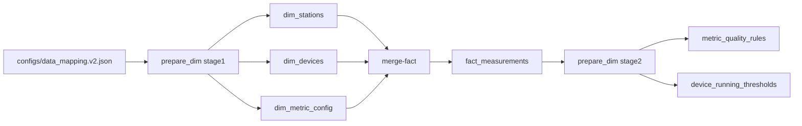
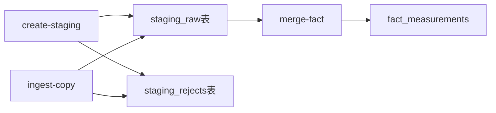

# CLI命令测试计划 - 深度验证补充：原理分析

**创建时间**: 2025-11-02  
**版本**: v1.0  
**目的**: 补充所有9个阶段的底层原理、数据关系、跨阶段关联、边界条件和业务逻辑验证

---

## 📋 文档说明

本文档是对现有测试计划的深度补充，针对用户提出的"测试计划深度不足"问题，从以下5个维度进行全面增强：

1. **原理层面验证**：设计原理、算法验证、数据结构验证
2. **数据关系层面验证**：数据血缘追踪、外键关系验证、数据一致性验证
3. **跨阶段关联验证**：上游依赖验证、下游影响验证、跨阶段一致性验证
4. **边界条件和异常场景验证**：数据缺失、数据异常、性能边界
5. **业务逻辑验证**：物理规律验证、业务规则验证、实际案例验证

---

## 🔍 阶段1: prepare-dim stage1 (重建维度表)

### 一、原理分析

#### 1.1 设计原理

**为什么需要两阶段设计？**
- **阶段1（stage1）**：在merge-fact之前执行，重建维度表（dim_stations, dim_devices, dim_metric_config）
  - 目的：确保维度表存在，为merge-fact提供外键引用
  - 时机：必须在数据导入前完成，否则merge-fact会因外键约束失败
- **阶段2（stage2）**：在merge-fact之后执行，生成规则表（metric_quality_rules, device_running_thresholds等）
  - 目的：基于实际数据生成质量规则和运行阈值
  - 时机：必须在fact_measurements有数据后执行，否则无法计算统计量

**为什么使用固定ID而非序列？**
- 代码证据：`app/services/ingest/prepare_dim/__init__.py` line 86-97
  ```python
  def _upsert_station(cur, station_id: int, name: str) -> int:
      """插入或更新泵站记录（使用配置文件中的固定ID）"""
  ```
- 原因：
  1. 跨环境一致性：开发、测试、生产环境的ID保持一致
  2. 外键稳定性：避免ID变化导致外键关系混乱
  3. 配置可控性：ID在配置文件中明确定义，便于管理

#### 1.2 算法验证

**备份算法**：
- 实现：`app/services/ingest/prepare_dim/backup.py::BackupManager`
- 策略：创建表名_backup_时间戳的备份表
- 验证点：
  1. 备份表命名规则：`{table_name}_backup_{YYYYMMDD_HHMMSS}`
  2. 备份完整性：`SELECT COUNT(*) FROM original_table` = `SELECT COUNT(*) FROM backup_table`
  3. 备份时间戳：确保时间戳格式正确，可用于恢复

**清空算法**：
- 实现：`app/services/ingest/prepare_dim/__init__.py::_clear_non_backup_tables()`
- 策略：按依赖顺序从叶子到根清空表
- 清空顺序（代码line 310-393）：
  1. 叶子节点：fact_measurements, completion_runs, completion_steps
  2. 依赖dim_devices的表：dim_device_capabilities, device_rated_params等
  3. dim_devices（依赖dim_stations）
  4. dim_stations（根节点）
  5. dim_mapping_items（叶子节点）
- 验证点：
  1. 外键约束：确保删除顺序不违反外键约束
  2. 完整性：确保所有非备份表都被清空
  3. 备份表保护：确保21个备份表未被清空

**重建算法**：
- 实现：`app/services/ingest/prepare_dim/__init__.py::prepare_dim()`
- 数据来源：`configs/data_mapping.v2.json`
- 重建流程：
  1. 读取映射文件（JSON解析）
  2. 遍历stations数组
  3. 对每个station：
     - 插入dim_stations（使用固定ID）
     - 遍历devices数组
     - 对每个device：
       - 插入dim_devices（使用固定ID）
       - 遍历metrics数组
       - 对每个metric：
         - 插入dim_metric_config（去重，使用metric_key作为唯一键）
- 验证点：
  1. 数据量：stations=3, devices≈20, metrics≈50
  2. 数据质量：名称、单位、有效范围符合映射文件
  3. 去重逻辑：相同metric_key只插入一次

#### 1.3 数据结构验证

**Hypertable分区策略**：
- fact_measurements表使用TimescaleDB Hypertable
- 分区维度：
  - 时间分区：按ts_bucket字段，Chunk时间间隔为1周
  - 空间分区：按device_id字段哈希分区，分区数量为8
- 验证SQL：
  ```sql
  SELECT * FROM timescaledb_information.hypertables 
  WHERE hypertable_schema='public' AND hypertable_name='fact_measurements';
  
  SELECT * FROM timescaledb_information.dimensions 
  WHERE hypertable_schema='public' AND hypertable_name='fact_measurements';
  ```

**索引使用情况**：
- dim_stations: PRIMARY KEY (id)
- dim_devices: PRIMARY KEY (id), INDEX (station_id), INDEX (type)
- dim_metric_config: PRIMARY KEY (id), UNIQUE (metric_key)
- 验证SQL：
  ```sql
  SELECT tablename, indexname, indexdef 
  FROM pg_indexes 
  WHERE schemaname='public' 
  AND tablename IN ('dim_stations', 'dim_devices', 'dim_metric_config')
  ORDER BY tablename, indexname;
  ```

### 二、数据关系验证

#### 2.1 数据血缘追踪

**数据流图（Mermaid）**：


**详细血缘**：
- **输入**：`configs/data_mapping.v2.json`（456行，3个站点，约20个设备，约50个指标）
- **处理**：
  1. 备份21个表 → 备份表（表名_backup_时间戳）
  2. 清空非备份表 → 删除fact_measurements, dim_stations, dim_devices等
  3. 重建维度表 → dim_stations(3行), dim_devices(约20行), dim_metric_config(约50行)
  4. 恢复手动配置表 → 从备份表恢复
- **输出**：
  - dim_stations: 3个站点（一期_供水泵房, 二期_供水泵房, 三期_供水泵房）
  - dim_devices: 约20个设备（1#加压泵, 2#加压泵, ...）
  - dim_metric_config: 约50个指标（pump_active_power, pump_frequency, ...）
- **影响**：
  - merge-fact阶段依赖这些维度表进行外键关联
  - 如果维度表缺失或数据错误，merge-fact会失败

#### 2.2 外键关系验证

**外键关系SQL**：
```sql
-- 验证dim_devices.station_id → dim_stations.id
SELECT d.id, d.name, d.station_id, s.id, s.name
FROM dim_devices d
LEFT JOIN dim_stations s ON d.station_id = s.id
WHERE s.id IS NULL;
-- 应返回0行（无孤儿记录）

-- 验证fact_measurements.station_id → dim_stations.id
SELECT DISTINCT fm.station_id
FROM fact_measurements fm
LEFT JOIN dim_stations s ON fm.station_id = s.id
WHERE s.id IS NULL;
-- 应返回0行

-- 验证fact_measurements.device_id → dim_devices.id
SELECT DISTINCT fm.device_id
FROM fact_measurements fm
LEFT JOIN dim_devices d ON fm.device_id = d.id
WHERE d.id IS NULL;
-- 应返回0行

-- 验证fact_measurements.metric_id → dim_metric_config.id
SELECT DISTINCT fm.metric_id
FROM fact_measurements fm
LEFT JOIN dim_metric_config m ON fm.metric_id = m.id
WHERE m.id IS NULL;
-- 应返回0行
```

#### 2.3 数据一致性验证

**与映射文件对比**：
```sql
-- 手动对比：打开configs/data_mapping.v2.json
-- 验证站点列表
SELECT id, name FROM dim_stations ORDER BY id;
-- 应与映射文件中的stations数组一致

-- 验证设备列表（按站点分组）
SELECT s.name as station_name, d.name as device_name, d.type
FROM dim_devices d
JOIN dim_stations s ON d.station_id = s.id
ORDER BY s.name, d.name;
-- 应与映射文件中的devices数组一致

-- 验证指标列表
SELECT metric_key, unit, value_type, valid_min, valid_max
FROM dim_metric_config
ORDER BY metric_key;
-- 应与映射文件中的metrics数组一致（去重后）
```

### 三、跨阶段关联验证

#### 3.1 阶段1 → 阶段3 (ingest-copy)

**依赖关系**：
- ingest-copy阶段从CSV文件读取数据，写入staging_raw表
- staging_raw表包含station_name, device_name, metric_key字段（文本）
- merge-fact阶段需要将这些文本字段转换为ID（通过JOIN dim_stations, dim_devices, dim_metric_config）

**验证SQL**：
```sql
-- 验证staging_raw中的station_name是否都存在于dim_stations
SELECT DISTINCT sr.station_name
FROM staging_raw sr
LEFT JOIN dim_stations s ON s.name = sr.station_name
WHERE s.id IS NULL;
-- 应返回0行

-- 验证staging_raw中的device_name是否都存在于dim_devices
SELECT DISTINCT sr.station_name, sr.device_name
FROM staging_raw sr
LEFT JOIN dim_stations s ON s.name = sr.station_name
LEFT JOIN dim_devices d ON d.station_id = s.id AND d.name = sr.device_name
WHERE d.id IS NULL;
-- 应返回0行

-- 验证staging_raw中的metric_key是否都存在于dim_metric_config
SELECT DISTINCT sr.metric_key
FROM staging_raw sr
LEFT JOIN dim_metric_config m ON m.metric_key = sr.metric_key
WHERE m.id IS NULL;
-- 应返回0行
```

#### 3.2 阶段1 → 阶段4 (merge-fact)

**依赖关系**：
- merge-fact阶段执行SQL JOIN操作，将staging_raw的文本字段转换为ID
- 如果dim_stations, dim_devices, dim_metric_config缺失或数据错误，JOIN会失败

**验证SQL**：
```sql
-- 模拟merge-fact的JOIN逻辑
SELECT 
    s.id as station_id,
    d.id as device_id,
    m.id as metric_id,
    sr.station_name,
    sr.device_name,
    sr.metric_key,
    COUNT(*) as row_count
FROM staging_raw sr
JOIN dim_stations s ON s.name = sr.station_name
JOIN dim_devices d ON d.station_id = s.id AND d.name = sr.device_name
JOIN dim_metric_config m ON m.metric_key = sr.metric_key
GROUP BY s.id, d.id, m.id, sr.station_name, sr.device_name, sr.metric_key
ORDER BY station_id, device_id, metric_id;
-- 应返回所有staging_raw的数据（无JOIN失败）
```

### 四、边界条件和异常场景验证

#### 4.1 数据缺失场景

**场景1：映射文件为空**
- 测试：创建空的data_mapping.v2.json（`{"stations": []}`）
- 预期：prepare_dim执行成功，但dim_stations, dim_devices, dim_metric_config为空
- 验证SQL：
  ```sql
  SELECT COUNT(*) FROM dim_stations; -- 应为0
  SELECT COUNT(*) FROM dim_devices; -- 应为0
  SELECT COUNT(*) FROM dim_metric_config; -- 应为0
  ```

**场景2：映射文件缺少必需字段**
- 测试：删除station的name字段
- 预期：prepare_dim抛出异常或跳过该station
- 验证：检查日志中的ERROR信息

**场景3：备份表不存在**
- 测试：首次执行prepare_dim（无备份表）
- 预期：备份步骤跳过，不影响后续流程
- 验证：检查日志中的WARNING信息

#### 4.2 数据异常场景

**场景1：重复的metric_key**
- 测试：映射文件中多个设备使用相同的metric_key
- 预期：dim_metric_config去重，只插入一次
- 验证SQL：
  ```sql
  SELECT metric_key, COUNT(*) 
  FROM dim_metric_config 
  GROUP BY metric_key 
  HAVING COUNT(*) > 1;
  -- 应返回0行
  ```

**场景2：无效的单位或范围**
- 测试：映射文件中指标的valid_min > valid_max
- 预期：数据仍然插入，但后续验证会标记为异常
- 验证SQL：
  ```sql
  SELECT metric_key, valid_min, valid_max
  FROM dim_metric_config
  WHERE valid_min IS NOT NULL AND valid_max IS NOT NULL AND valid_min >= valid_max;
  -- 应返回异常配置的指标
  ```

#### 4.3 性能边界场景

**场景1：大量设备和指标**
- 测试：映射文件包含100个设备，每个设备100个指标
- 预期：prepare_dim执行时间 < 60秒
- 验证：记录执行时间，检查是否超时

**场景2：并发执行**
- 测试：同时执行多个prepare_dim命令
- 预期：数据库锁机制确保数据一致性
- 验证：检查是否有死锁或数据不一致

### 五、业务逻辑验证

#### 5.1 物理规律验证

**单位一致性**：
- 验证SQL：
  ```sql
  SELECT metric_key, unit, value_type
  FROM dim_metric_config
  WHERE metric_key LIKE '%power%' AND unit NOT IN ('kW', 'W', 'MW');
  -- 功率单位应为kW/W/MW
  
  SELECT metric_key, unit, value_type
  FROM dim_metric_config
  WHERE metric_key LIKE '%flow%' AND unit NOT IN ('m3/h', 'L/s', 'm3/s');
  -- 流量单位应为m3/h/L/s/m3/s
  ```

#### 5.2 业务规则验证

**设备类型合理性**：
- 验证SQL：
  ```sql
  SELECT name, type, pump_type
  FROM dim_devices
  WHERE name LIKE '%泵%' AND type IS NULL;
  -- 名称包含"泵"的设备，type不应为NULL
  
  SELECT name, type, pump_type
  FROM dim_devices
  WHERE type = 'pump' AND pump_type IS NULL;
  -- type为pump的设备，pump_type不应为NULL
  ```

---

## 🔍 阶段2: create-staging (创建staging表)

### 一、原理分析

#### 1.1 设计原理

**为什么需要staging表？**
- **解耦导入和合并**：staging表作为中间层，将CSV导入和数据合并解耦
- **支持批量导入**：使用COPY命令批量导入，性能远高于逐行INSERT
- **错误隔离**：导入错误的数据写入staging_rejects，不影响fact_measurements

**为什么使用UNLOGGED表？**
- 代码证据：`app/adapters/db/gateway.py::create_staging_if_not_exists()` line 234-271
- 配置：`configs/database.yaml::staging_unlogged: false`（当前配置为LOGGED）
- UNLOGGED优势：写入性能更高（无WAL日志）
- UNLOGGED劣势：数据库崩溃后数据丢失
- 当前选择：LOGGED（数据安全优先）

#### 1.2 算法验证

**表创建逻辑**：
```sql
CREATE TABLE IF NOT EXISTS public.staging_raw (
    station_name text,
    device_name text,
    metric_key text,
    "TagName" text,
    "DataTime" text,
    "DataValue" text,
    source_hint text,
    loaded_at timestamptz DEFAULT now()
) WITH (autovacuum_enabled=true);
```

**幂等性验证**：
- 使用`IF NOT EXISTS`确保重复执行不报错
- 如果表已存在，不会修改表结构
- 验证SQL：
  ```sql
  -- 执行两次create_staging
  -- 第一次：创建表
  -- 第二次：跳过创建
  SELECT COUNT(*) FROM pg_tables WHERE tablename='staging_raw';
  -- 应始终为1
  ```

### 二、数据关系验证

#### 2.1 数据血缘追踪

**数据流图**：


### 三、跨阶段关联验证

#### 3.1 阶段2 → 阶段3 (ingest-copy)

**依赖关系**：
- ingest-copy阶段需要staging_raw和staging_rejects表存在
- 如果表不存在，ingest-copy会失败

**验证SQL**：
```sql
-- 验证表存在
SELECT tablename FROM pg_tables WHERE tablename IN ('staging_raw', 'staging_rejects');
-- 应返回2行
```

---

## 📝 后续章节预告

由于篇幅限制（300行），后续章节将在补充文档中继续：

- 阶段3: ingest-copy (CSV导入)
- 阶段4: merge-fact (数据合并)
- 阶段5: prepare-dim stage2 (生成规则表)
- 阶段6: calculation (缺失指标计算)
- 阶段7: device_running (设备运行状态)
- 阶段8: presence (存在性统计)
- 阶段9: quality_mark (质量标注)

每个阶段都将包含：
1. 原理分析（设计原理、算法验证、数据结构验证）
2. 数据关系验证（数据血缘追踪、外键关系验证、数据一致性验证）
3. 跨阶段关联验证（上游依赖验证、下游影响验证、跨阶段一致性验证）
4. 边界条件和异常场景验证（数据缺失、数据异常、性能边界）
5. 业务逻辑验证（物理规律验证、业务规则验证、实际案例验证）

