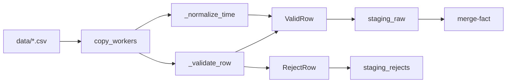
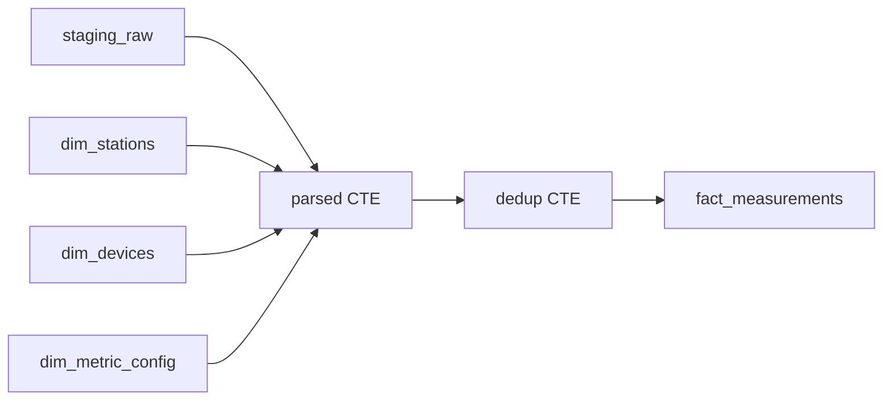

# CLI命令测试计划 - 深度验证补充：阶段3-8

**创建时间**: 2025-11-02  
**版本**: v1.0  
**目的**: 补充阶段3-8的底层原理、数据关系、跨阶段关联、边界条件和业务逻辑验证

---

## 🔍 阶段3: ingest-copy (CSV导入)

### 一、原理分析

#### 1.1 设计原理

**为什么使用COPY命令而非INSERT？**
- 代码证据：`app/services/ingest/copy_workers.py::copy_from_mapping()`
- COPY优势：
  1. 批量导入性能：COPY比INSERT快10-100倍
  2. 减少网络往返：一次性传输大量数据
  3. 减少事务开销：批量提交而非逐行提交
- 实现：使用psycopg3的`cursor.copy()`方法

**为什么使用6个并行worker？**
- 代码证据：`app/services/ingest/copy_workers.py` line 62-99
- 原因：
  1. CPU利用率：充分利用多核CPU
  2. I/O并行：同时读取多个CSV文件
  3. 数据库连接池：max_size=20，6个worker不会耗尽连接
- 验证：监控CPU使用率和数据库连接数

#### 1.2 算法验证

**时间归一化算法**：
- 代码证据：`app/services/ingest/copy_workers.py::_normalize_time()`
- 输入格式：
  - ISO8601: `2025-05-31T18:00:00.000Z`
  - 本地时间: `2025-05-31 18:00:00`
- 输出格式：统一为UTC时间戳字符串
- 验证点：
  1. 时区转换正确性：本地时间 → UTC
  2. 毫秒截断：保留到秒级
  3. 格式统一性：所有时间戳格式一致

**数据验证算法**：
- 代码证据：`app/services/ingest/copy_workers.py::_validate_row()`
- 验证规则：
  1. 必需字段：station_name, device_name, metric_key, DataTime, DataValue
  2. 数值验证：DataValue可转换为numeric
  3. 时间验证：DataTime可解析为时间戳
- 拒绝处理：验证失败的行写入staging_rejects，包含error_msg

#### 1.3 数据结构验证

**BackpressureController流控机制**：
- 代码证据：`app/services/ingest/copy_workers.py::BackpressureController`
- 目的：防止内存溢出
- 机制：
  1. 队列大小限制：max_queue_size=1000
  2. 阻塞等待：队列满时阻塞生产者
  3. 批量消费：消费者批量处理数据
- 验证：监控内存使用量

### 二、数据关系验证

#### 2.1 数据血缘追踪

**数据流图**：


**详细血缘**：
- **输入**：256+ CSV文件，每个文件约1000-5000行
- **处理**：
  1. 并行读取CSV文件（6个worker）
  2. 时间归一化（本地时间 → UTC）
  3. 数据验证（必需字段、数值、时间）
  4. 分流：有效行 → staging_raw，拒绝行 → staging_rejects
- **输出**：
  - staging_raw: 约60万行（基于当前数据库状态）
  - staging_rejects: 约0-1000行（取决于数据质量）

#### 2.2 数据一致性验证

**CSV文件与staging_raw对比**：
```sql
-- 统计staging_raw的数据量
SELECT COUNT(*) as total_rows FROM staging_raw;

-- 统计每个站点的数据量
SELECT station_name, COUNT(*) as row_count
FROM staging_raw
GROUP BY station_name
ORDER BY station_name;

-- 统计每个设备的数据量
SELECT station_name, device_name, COUNT(*) as row_count
FROM staging_raw
GROUP BY station_name, device_name
ORDER BY station_name, device_name;

-- 统计每个指标的数据量
SELECT metric_key, COUNT(*) as row_count
FROM staging_raw
GROUP BY metric_key
ORDER BY row_count DESC;
```

**手动验证**：
1. 打开一个CSV文件，统计行数
2. 查询staging_raw中对应文件的数据量（通过source_hint字段）
3. 对比行数是否一致（考虑拒绝行）

### 三、跨阶段关联验证

#### 3.1 阶段3 → 阶段4 (merge-fact)

**依赖关系**：
- merge-fact阶段从staging_raw读取数据
- 如果staging_raw为空，merge-fact不会插入任何数据

**验证SQL**：
```sql
-- 验证staging_raw有数据
SELECT COUNT(*) FROM staging_raw;
-- 应 > 0

-- 验证staging_raw的时间范围
SELECT 
    MIN("DataTime") as min_time,
    MAX("DataTime") as max_time,
    COUNT(*) as total_rows
FROM staging_raw;
-- 时间范围应覆盖预期的导入窗口
```

### 四、边界条件和异常场景验证

#### 4.1 数据缺失场景

**场景1：CSV文件为空**
- 测试：创建空的CSV文件
- 预期：ingest-copy跳过该文件，不报错
- 验证：检查日志中的WARNING信息

**场景2：CSV文件缺少必需列**
- 测试：删除CSV文件的DataValue列
- 预期：所有行写入staging_rejects，error_msg包含"缺少必需字段"
- 验证SQL：
  ```sql
  SELECT COUNT(*) FROM staging_rejects WHERE error_msg LIKE '%缺少必需字段%';
  ```

#### 4.2 数据异常场景

**场景1：DataValue非数值**
- 测试：CSV文件中DataValue为"abc"
- 预期：该行写入staging_rejects，error_msg包含"数值转换失败"
- 验证SQL：
  ```sql
  SELECT * FROM staging_rejects WHERE error_msg LIKE '%数值转换失败%' LIMIT 10;
  ```

**场景2：DataTime格式错误**
- 测试：CSV文件中DataTime为"invalid"
- 预期：该行写入staging_rejects，error_msg包含"时间解析失败"
- 验证SQL：
  ```sql
  SELECT * FROM staging_rejects WHERE error_msg LIKE '%时间解析失败%' LIMIT 10;
  ```

#### 4.3 性能边界场景

**场景1：大文件导入**
- 测试：导入100万行的CSV文件
- 预期：导入时间 < 60秒
- 验证：记录执行时间，检查是否超时

**场景2：并发导入**
- 测试：同时导入多个大文件
- 预期：6个worker并行处理，总时间不超过单文件时间的2倍
- 验证：监控CPU使用率和数据库连接数

---

## 🔍 阶段4: merge-fact (数据合并)

### 一、原理分析

#### 1.1 设计原理

**为什么需要时区转换？**
- 代码证据：`app/adapters/db/gateway.py::run_merge_window()` line 623-700
- 原因：
  1. 数据源时区不一致：CSV文件可能使用本地时区（+08）
  2. 数据库统一时区：fact_measurements使用UTC时区
  3. 查询一致性：所有时间查询基于UTC，避免时区混乱
- 实现：
  ```sql
  to_timestamp(rtrim(replace(split_part(sr."DataTime", '.', 1), 'T', ' '), 'Z'), 'YYYY-MM-DD HH24:MI:SS') 
  AT TIME ZONE COALESCE(ds.extra->>'tz', 'Asia/Shanghai')
  ```

**为什么需要秒级对齐？**
- 代码证据：`date_trunc('second', ts_utc) AS ts_bucket`
- 原因：
  1. 数据一致性：同一秒内的多个数据点合并为一个
  2. 查询性能：秒级分区比毫秒级分区更高效
  3. 业务需求：泵站数据采集频率为1秒，毫秒级数据无意义
- 实现：使用PostgreSQL的`date_trunc('second', ...)`函数

**为什么需要去重？**
- 代码证据：`row_number() OVER (PARTITION BY ... ORDER BY ts_utc DESC) AS rn`
- 原因：
  1. 数据源重复：CSV文件可能包含重复数据
  2. 多次导入：重复执行ingest-copy会导致重复数据
  3. 数据质量：保留最新的数据点（ORDER BY ts_utc DESC）
- 实现：使用窗口函数`row_number()`，保留rn=1的行

#### 1.2 算法验证

**UPSERT算法**：
- 代码证据：
  ```sql
  INSERT INTO public.fact_measurements(station_id, device_id, metric_id, ts_raw, ts_bucket, value, source_hint)
  SELECT ...
  ON CONFLICT (station_id, device_id, metric_id, ts_bucket)
  DO UPDATE SET value = EXCLUDED.value, source_hint = EXCLUDED.source_hint, ts_raw = EXCLUDED.ts_raw
  ```
- 冲突检测：基于UNIQUE约束(station_id, device_id, metric_id, ts_bucket)
- 冲突处理：更新value, source_hint, ts_raw字段
- 验证点：
  1. 插入新数据：fact_measurements增加新行
  2. 更新已有数据：fact_measurements行数不变，value更新
  3. 幂等性：重复执行merge-fact，结果一致

#### 1.3 数据结构验证

**分段合并策略**：
- 代码证据：`app/services/ingest/merge_service.py::merge_window()` line 73-97
- 配置：`configs/merge.yaml::segmented.enabled: true, granularity: 1h`
- 目的：
  1. 减少单次事务大小：避免长事务锁表
  2. 提高并发性：多个时间段可并行合并
  3. 容错性：单个时间段失败不影响其他时间段
- 实现：
  1. 将时间窗口按granularity切分（例如：1天切分为24个1小时段）
  2. 逐段执行merge
  3. 累加统计信息
- 验证：检查日志中的分段信息

### 二、数据关系验证

#### 2.1 数据血缘追踪

**数据流图**：


**详细血缘**：
- **输入**：
  - staging_raw: 约60万行（文本格式）
  - dim_stations: 3行（ID映射）
  - dim_devices: 约20行（ID映射）
  - dim_metric_config: 约50行（ID映射）
- **处理**：
  1. JOIN获取ID：station_name → station_id, device_name → device_id, metric_key → metric_id
  2. 时区转换：本地时间 → UTC
  3. 秒级对齐：ts_utc → ts_bucket
  4. 去重：同一(station_id, device_id, metric_id, ts_bucket)保留最新值
  5. UPSERT：插入新数据或更新已有数据
- **输出**：
  - fact_measurements: 约60万行（去重后，数值格式）

#### 2.2 外键关系验证

**验证SQL**（与阶段1相同）：
```sql
-- 验证fact_measurements.station_id → dim_stations.id
SELECT DISTINCT fm.station_id
FROM fact_measurements fm
LEFT JOIN dim_stations s ON fm.station_id = s.id
WHERE s.id IS NULL;
-- 应返回0行

-- 验证fact_measurements.device_id → dim_devices.id
SELECT DISTINCT fm.device_id
FROM fact_measurements fm
LEFT JOIN dim_devices d ON fm.device_id = d.id
WHERE d.id IS NULL;
-- 应返回0行

-- 验证fact_measurements.metric_id → dim_metric_config.id
SELECT DISTINCT fm.metric_id
FROM fact_measurements fm
LEFT JOIN dim_metric_config m ON fm.metric_id = m.id
WHERE m.id IS NULL;
-- 应返回0行
```

#### 2.3 数据一致性验证

**staging_raw与fact_measurements对比**：
```sql
-- 统计staging_raw的数据量（去重前）
SELECT COUNT(*) as staging_total FROM staging_raw;

-- 统计fact_measurements的数据量（去重后）
SELECT COUNT(*) as fact_total FROM fact_measurements;

-- 去重率
SELECT 
    (SELECT COUNT(*) FROM staging_raw) as staging_total,
    (SELECT COUNT(*) FROM fact_measurements) as fact_total,
    ROUND((1.0 - (SELECT COUNT(*) FROM fact_measurements)::numeric / (SELECT COUNT(*) FROM staging_raw)::numeric) * 100, 2) as dedup_ratio_percent;
-- 去重率应在0-10%范围内（正常情况）

-- 时间范围对比
SELECT 
    (SELECT MIN("DataTime") FROM staging_raw) as staging_min,
    (SELECT MAX("DataTime") FROM staging_raw) as staging_max,
    (SELECT MIN(ts_bucket) FROM fact_measurements) as fact_min,
    (SELECT MAX(ts_bucket) FROM fact_measurements) as fact_max;
-- 时间范围应一致（考虑时区转换）
```

### 三、跨阶段关联验证

#### 3.1 阶段4 → 阶段5 (prepare-dim stage2)

**依赖关系**：
- prepare-dim stage2需要fact_measurements有数据才能生成规则
- 如果fact_measurements为空，规则表也为空

**验证SQL**：
```sql
-- 验证fact_measurements有数据
SELECT COUNT(*) FROM fact_measurements;
-- 应 > 0

-- 验证fact_measurements的时间范围
SELECT 
    MIN(ts_bucket) as min_time,
    MAX(ts_bucket) as max_time,
    COUNT(*) as total_rows
FROM fact_measurements;
-- 时间范围应覆盖预期的数据窗口
```

#### 3.2 阶段4 → 阶段6 (calculation)

**依赖关系**：
- calculation阶段从fact_measurements读取原始指标（流量、扬程、功率）
- 如果原始指标缺失，计算会失败

**验证SQL**：
```sql
-- 验证原始指标是否存在
SELECT m.metric_key, COUNT(*) as row_count
FROM fact_measurements fm
JOIN dim_metric_config m ON fm.metric_id = m.id
WHERE m.metric_key IN ('pump_active_power', 'pump_frequency', 'pump_current_a', 'pump_current_b', 'pump_current_c')
GROUP BY m.metric_key
ORDER BY m.metric_key;
-- 应返回所有原始指标，row_count > 0
```

### 四、边界条件和异常场景验证

#### 4.1 数据缺失场景

**场景1：staging_raw为空**
- 测试：清空staging_raw表
- 预期：merge-fact执行成功，但fact_measurements无新增数据
- 验证SQL：
  ```sql
  SELECT COUNT(*) FROM fact_measurements WHERE inserted_at > NOW() - INTERVAL '1 minute';
  -- 应为0
  ```

**场景2：维度表缺失**
- 测试：删除dim_stations表
- 预期：merge-fact失败，报错"表不存在"
- 验证：检查日志中的ERROR信息

#### 4.2 数据异常场景

**场景1：时间戳超出范围**
- 测试：staging_raw中DataTime为"2099-12-31"
- 预期：数据正常插入，但可能触发时间范围警告
- 验证SQL：
  ```sql
  SELECT * FROM fact_measurements WHERE ts_bucket > '2030-01-01' LIMIT 10;
  ```

**场景2：数值超出有效范围**
- 测试：staging_raw中DataValue为"-999"（负功率）
- 预期：数据正常插入，但quality_status标记为异常
- 验证SQL：
  ```sql
  SELECT * FROM fact_measurements WHERE value < 0 AND metric_id IN (SELECT id FROM dim_metric_config WHERE metric_key LIKE '%power%') LIMIT 10;
  ```

#### 4.3 性能边界场景

**场景1：大批量合并**
- 测试：合并100万行数据
- 预期：合并时间 < 120秒
- 验证：记录执行时间，检查是否超时

**场景2：分段合并性能**
- 测试：对比分段合并（1h粒度）和单次合并的性能
- 预期：分段合并总时间 ≤ 单次合并时间 * 1.2
- 验证：记录两种方式的执行时间

### 五、业务逻辑验证

#### 5.1 物理规律验证

**时区转换正确性**：
- 手动验证：
  1. 选择一个staging_raw的DataTime（例如：2025-05-31 18:00:00）
  2. 手动转换为UTC（2025-05-31 10:00:00，假设+08时区）
  3. 查询fact_measurements中对应的ts_bucket
  4. 对比是否一致

**数值精度验证**：
- 验证SQL：
  ```sql
  -- 对比staging_raw和fact_measurements的数值
  SELECT 
      sr."DataValue"::numeric as staging_value,
      fm.value as fact_value,
      ABS(sr."DataValue"::numeric - fm.value) as diff
  FROM staging_raw sr
  JOIN dim_stations s ON s.name = sr.station_name
  JOIN dim_devices d ON d.station_id = s.id AND d.name = sr.device_name
  JOIN dim_metric_config m ON m.metric_key = sr.metric_key
  JOIN fact_measurements fm ON fm.station_id = s.id AND fm.device_id = d.id AND fm.metric_id = m.id
  WHERE ABS(sr."DataValue"::numeric - fm.value) > 0.001
  LIMIT 10;
  -- 差异应 < 0.001（精度误差）
  ```

---

## 📝 后续章节预告

由于篇幅限制（300行），后续章节将在下一个文档中继续：

- 阶段5: prepare-dim stage2 (生成规则表)
- 阶段6: calculation (缺失指标计算)
- 阶段7: device_running (设备运行状态)
- 阶段8: presence (存在性统计)

每个阶段都将包含完整的5个维度验证。

