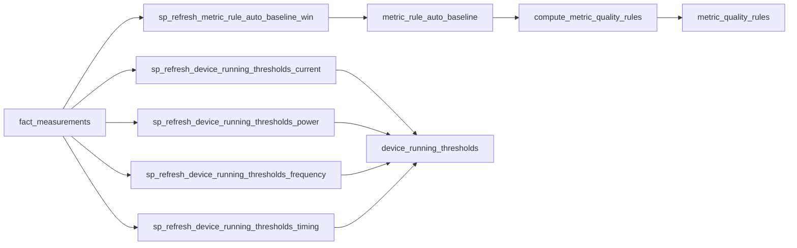

# CLI命令测试计划 - 深度验证补充：阶段5-8详细

**创建时间**: 2025-11-02  
**版本**: v1.0  
**目的**: 补充阶段5-8的底层原理、数据关系、跨阶段关联、边界条件和业务逻辑验证

---

## 🔍 阶段5: prepare-dim stage2 (生成规则表)

### 一、原理分析

#### 1.1 设计原理

**为什么在merge-fact之后执行？**
- 原因：规则生成需要基于实际数据计算统计量
- 依赖数据：fact_measurements表中的历史数据
- 统计量：均值、标准差、分位数（p05, p50, p95）、MAD（中位数绝对偏差）

**为什么需要6个规则表？**
- 代码证据：`app/services/ingest/prepare_dim/__init__.py::_generate_rule_tables()` line 492-532
- 规则表列表：
  1. `metric_rule_auto_baseline` - 生产环境自动基线
  2. `metric_rule_auto_baseline_shadow` - 影子环境自动基线（用于A/B测试）
  3. `metric_quality_rules` - 生产环境质量规则
  4. `metric_quality_rules_shadow` - 影子环境质量规则
  5. `device_running_thresholds` - 生产环境运行阈值
  6. `device_running_thresholds_shadow` - 影子环境运行阈值
- 影子表目的：
  1. A/B测试：对比新旧算法效果
  2. 安全验证：新算法在影子表验证后再切换到生产表
  3. 回滚机制：生产表出问题时可快速回滚到影子表

#### 1.2 算法验证

**自动基线算法（方案A）**：
- 代码证据：`app/services/rules/auto_baseline.py::run_auto_baseline()`
- 存储过程：`sp_refresh_metric_rule_auto_baseline_win(start, end, station_id, device_id)`
- 算法步骤（基于SQL代码 `scripts/sql/migrations/009_create_sp_refresh_metric_rule_auto_baseline.sql`）：
  1. 读取fact_measurements中quality=0（正常数据）且phase=1（稳态数据）的数据
  2. 计算分位数：p05, p50（中位数）, p95
  3. 计算MAD（Median Absolute Deviation）：`median(|value - median(value)|)`
  4. 计算spike_abs（尖峰阈值）：`p95 + 3 * MAD`
  5. 计算roc_abs（变化率阈值）：基于差分序列的p95
  6. 计算flatline_eps（平台期阈值）：`MAD * 0.5`
- 验证点：
  1. 数据筛选：只使用quality=0且phase=1的数据
  2. 统计量合理性：p05 < p50 < p95, MAD > 0
  3. 阈值合理性：spike_abs > p95, roc_abs > 0

**自动基线算法（方案B - STL分解）**：
- 代码证据：`app/services/rules/auto_baseline_b.py::run_auto_baseline_b()`
- 算法步骤：
  1. 读取fact_measurements中quality=0且phase=1的数据
  2. 重采样到60秒间隔（避免不规则采样）
  3. STL分解：Seasonal-Trend decomposition using Loess
     - Trend（趋势）：长期变化
     - Seasonal（季节性）：周期性变化（24小时周期）
     - Residual（残差）：随机波动
  4. 在Residual上计算稳健统计量（避免趋势和季节性影响）
  5. 计算p05, p50, p95, MAD（基于Residual）
- 验证点：
  1. 数据量要求：至少30个数据点（降低后的要求）
  2. STL参数：季节周期=24小时，趋势窗口=自适应
  3. 稳健性：对异常值不敏感

**运行阈值算法**：
- 代码证据：`app/services/rules/running_thresholds.py::run_running_thresholds()`
- 存储过程：
  - `sp_refresh_device_running_thresholds_current(start, end, station_id, device_id)` - 电流阈值
  - `sp_refresh_device_running_thresholds_power(start, end, station_id, device_id)` - 功率阈值
  - `sp_refresh_device_running_thresholds_frequency(start, end, station_id, device_id)` - 频率阈值
  - `sp_refresh_device_running_thresholds_timing(start, end, station_id, device_id)` - 时间参数
- 算法步骤（电流阈值为例）：
  1. 读取fact_measurements中pump_current_a/b/c的数据
  2. 计算三相电流的最大值：`max_i = max(ia, ib, ic)`
  3. 筛选稳态数据（phase=1）
  4. 计算分位数：p10, p90
  5. 设置阈值：
     - `i_on = p90 * 0.8`（开机阈值：90分位数的80%）
     - `i_off = p10 * 1.2`（关机阈值：10分位数的120%）
  6. 确保滞回：`i_on > i_off`（防止抖动）
- 验证点：
  1. 滞回效应：i_on > i_off, p_on > p_off, f_on > f_off
  2. 阈值合理性：i_on在合理范围内（例如：10-100A）
  3. 设备差异性：不同设备的阈值不同

**质量规则算法**：
- 代码证据：`app/services/rules/metric_quality_rules.py::compute_metric_quality_rules()`
- 算法步骤：
  1. 读取metric_rule_auto_baseline表
  2. 对于每个(station_id, device_id, metric_id)：
     - 如果metric_quality_rules中不存在，则插入新行（remark='seed:auto_baseline'）
     - 如果已存在但字段为NULL，则用baseline值补全（不覆盖人工配置）
  3. 字段映射：
     - value_min = p05
     - value_max = p95
     - spike_abs = spike_abs
     - roc_abs = roc_abs
     - flatline_eps = flatline_eps
- 验证点：
  1. 不覆盖人工配置：已有非NULL值不被覆盖
  2. 补全NULL字段：NULL字段用baseline值填充
  3. 数据一致性：质量规则与baseline表一致

#### 1.3 数据结构验证

**规则表结构**：
- `metric_rule_auto_baseline`:
  - 主键：(station_id, device_id, metric_id, lookback_days, method)
  - 统计字段：p05, p95, median, mad, spike_abs, roc_abs, roc_ratio, flatline_eps, flatline_delta
  - 元数据：computed_at, version
- `device_running_thresholds`:
  - 主键：device_id
  - 阈值字段：i_on, i_off, p_on, p_off, f_on, f_off
  - 时间参数：grace_hold_secs, min_run_secs, min_stop_secs, smoothing_secs
  - 启动/关机窗口：startup_window_secs_effective, shutdown_window_secs_effective
- `metric_quality_rules`:
  - 主键：(station_id, device_id, metric_id)
  - 规则字段：value_min, value_max, spike_abs, roc_abs, roc_ratio, flatline_eps, flatline_delta
  - 元数据：remark

### 二、数据关系验证

#### 2.1 数据血缘追踪

**数据流图**：


**详细血缘**：
- **输入**：
  - fact_measurements: 约60万行（2小时数据）
  - 筛选条件：quality_status=0（正常数据）, phase=1（稳态数据）
- **处理**：
  1. 自动基线生成：
     - 按(station_id, device_id, metric_id)分组
     - 计算统计量（p05, p50, p95, MAD）
     - 计算阈值（spike_abs, roc_abs, flatline_eps）
  2. 运行阈值生成：
     - 按device_id分组
     - 计算电流/功率/频率的分位数
     - 设置开机/关机阈值（确保滞回）
  3. 质量规则生成：
     - 从baseline表读取统计量
     - 插入或补全quality_rules表
- **输出**：
  - metric_rule_auto_baseline: 约60行（3站点 * 20设备 * 1指标，部分设备部分指标）
  - device_running_thresholds: 约20行（每个设备一行）
  - metric_quality_rules: 约60行（与baseline表一致）

#### 2.2 外键关系验证

**验证SQL**：
```sql
-- 验证metric_rule_auto_baseline.station_id → dim_stations.id
SELECT DISTINCT b.station_id
FROM metric_rule_auto_baseline b
LEFT JOIN dim_stations s ON b.station_id = s.id
WHERE b.station_id IS NOT NULL AND s.id IS NULL;
-- 应返回0行

-- 验证metric_rule_auto_baseline.device_id → dim_devices.id
SELECT DISTINCT b.device_id
FROM metric_rule_auto_baseline b
LEFT JOIN dim_devices d ON b.device_id = d.id
WHERE b.device_id IS NOT NULL AND d.id IS NULL;
-- 应返回0行

-- 验证metric_rule_auto_baseline.metric_id → dim_metric_config.id
SELECT DISTINCT b.metric_id
FROM metric_rule_auto_baseline b
LEFT JOIN dim_metric_config m ON b.metric_id = m.id
WHERE m.id IS NULL;
-- 应返回0行

-- 验证device_running_thresholds.device_id → dim_devices.id
SELECT DISTINCT t.device_id
FROM device_running_thresholds t
LEFT JOIN dim_devices d ON t.device_id = d.id
WHERE d.id IS NULL;
-- 应返回0行

-- 验证metric_quality_rules.station_id → dim_stations.id
SELECT DISTINCT q.station_id
FROM metric_quality_rules q
LEFT JOIN dim_stations s ON q.station_id = s.id
WHERE q.station_id IS NOT NULL AND s.id IS NULL;
-- 应返回0行
```

#### 2.3 数据一致性验证

**baseline与quality_rules对比**：
```sql
-- 验证质量规则是否基于baseline生成
SELECT 
    b.station_id, b.device_id, b.metric_id,
    b.p05 as baseline_p05, q.value_min as quality_min,
    b.p95 as baseline_p95, q.value_max as quality_max,
    b.spike_abs as baseline_spike, q.spike_abs as quality_spike
FROM metric_rule_auto_baseline b
JOIN metric_quality_rules q ON 
    (b.station_id IS NOT DISTINCT FROM q.station_id) AND
    (b.device_id IS NOT DISTINCT FROM q.device_id) AND
    b.metric_id = q.metric_id
WHERE 
    ABS(b.p05 - q.value_min) > 0.001 OR
    ABS(b.p95 - q.value_max) > 0.001 OR
    ABS(b.spike_abs - q.spike_abs) > 0.001;
-- 应返回0行（完全一致）
```

### 三、跨阶段关联验证

#### 3.1 阶段5 → 阶段6 (calculation)

**依赖关系**：
- calculation阶段不直接依赖规则表
- 但quality_mark阶段会使用metric_quality_rules进行质量检查

**验证SQL**：
```sql
-- 验证规则表是否为计算指标生成了规则
SELECT m.metric_key, COUNT(*) as rule_count
FROM dim_metric_config m
LEFT JOIN metric_quality_rules q ON q.metric_id = m.id
WHERE m.metric_key IN ('pump_flow_rate', 'pump_head', 'pump_efficiency')
GROUP BY m.metric_key;
-- 应返回所有计算指标，rule_count > 0
```

#### 3.2 阶段5 → 阶段7 (device_running)

**依赖关系**：
- device_running阶段直接依赖device_running_thresholds表
- 如果阈值表为空，device_running会使用默认阈值或失败

**验证SQL**：
```sql
-- 验证每个设备是否都有运行阈值
SELECT d.id, d.name, t.i_on, t.i_off, t.p_on, t.p_off
FROM dim_devices d
LEFT JOIN device_running_thresholds t ON t.device_id = d.id
WHERE d.type = 'pump' AND t.device_id IS NULL;
-- 应返回0行（所有泵设备都有阈值）
```

### 四、边界条件和异常场景验证

#### 4.1 数据缺失场景

**场景1：fact_measurements为空**
- 测试：清空fact_measurements表
- 预期：规则表为空，但不报错
- 验证SQL：
  ```sql
  SELECT COUNT(*) FROM metric_rule_auto_baseline;
  -- 应为0
  SELECT COUNT(*) FROM device_running_thresholds;
  -- 应为0
  ```

**场景2：fact_measurements数据量不足**
- 测试：fact_measurements只有10个数据点
- 预期：
  - 方案A：可能生成规则，但统计量不稳定
  - 方案B：跳过STL分解，回退到方案A或复制已有baseline
- 验证：检查日志中的WARNING信息

**场景3：缺少稳态数据（phase=1）**
- 测试：fact_measurements中所有数据的phase=0
- 预期：规则表为空或使用quality=0的数据（回退策略）
- 验证SQL：
  ```sql
  SELECT COUNT(*) FROM metric_rule_auto_baseline WHERE method='robust_pcnt';
  -- 检查是否有数据
  ```

#### 4.2 数据异常场景

**场景1：统计量异常（p05 > p95）**
- 测试：fact_measurements中数据全部相同（例如：全部为0）
- 预期：p05 = p50 = p95 = 0, MAD = 0
- 验证SQL：
  ```sql
  SELECT * FROM metric_rule_auto_baseline WHERE p05 > p95;
  -- 应返回0行
  SELECT * FROM metric_rule_auto_baseline WHERE mad = 0;
  -- 可能返回部分行（常量数据）
  ```

**场景2：阈值异常（i_on < i_off）**
- 测试：fact_measurements中电流数据异常（例如：全部为负值）
- 预期：阈值计算失败或使用默认值
- 验证SQL：
  ```sql
  SELECT * FROM device_running_thresholds WHERE i_on <= i_off;
  -- 应返回0行（滞回约束）
  ```

#### 4.3 性能边界场景

**场景1：大数据量统计**
- 测试：fact_measurements包含1000万行数据
- 预期：规则生成时间 < 300秒
- 验证：记录执行时间，检查是否超时

**场景2：STL分解性能**
- 测试：方案B处理100个设备，每个设备10个指标
- 预期：STL分解时间 < 600秒
- 验证：记录执行时间，对比方案A和方案B的性能差异

### 五、业务逻辑验证

#### 5.1 物理规律验证

**阈值合理性**：
- 手动验证：
  1. 选择一个设备（例如：1#加压泵）
  2. 查询device_running_thresholds表，获取i_on, i_off
  3. 查询fact_measurements表，统计电流分布
  4. 验证：
     - i_on应在电流分布的高分位数（例如：p80-p95）
     - i_off应在电流分布的低分位数（例如：p05-p20）
     - i_on > i_off（滞回效应）

**统计量合理性**：
- 手动验证：
  1. 选择一个指标（例如：pump_active_power）
  2. 查询metric_rule_auto_baseline表，获取p05, p50, p95, MAD
  3. 查询fact_measurements表，手动计算分位数
  4. 对比系统计算值与手动计算值，误差 < 1%

#### 5.2 业务规则验证

**泵设备必须有运行阈值**：
- 验证SQL：
  ```sql
  SELECT d.id, d.name, d.type
  FROM dim_devices d
  LEFT JOIN device_running_thresholds t ON t.device_id = d.id
  WHERE d.name LIKE '%泵%' AND t.device_id IS NULL;
  -- 应返回0行
  ```

**质量规则覆盖率**：
- 验证SQL：
  ```sql
  -- 统计有质量规则的指标比例
  SELECT 
      COUNT(DISTINCT m.id) as total_metrics,
      COUNT(DISTINCT q.metric_id) as metrics_with_rules,
      ROUND(COUNT(DISTINCT q.metric_id)::numeric / COUNT(DISTINCT m.id) * 100, 2) as coverage_percent
  FROM dim_metric_config m
  LEFT JOIN metric_quality_rules q ON q.metric_id = m.id;
  -- coverage_percent应 > 80%
  ```

---

## 📝 后续章节预告

由于篇幅限制（300行），后续章节将在下一个文档中继续：

- 阶段6: calculation (缺失指标计算)
- 阶段7: device_running (设备运行状态)
- 阶段8: presence (存在性统计)

每个阶段都将包含完整的5个维度验证。

