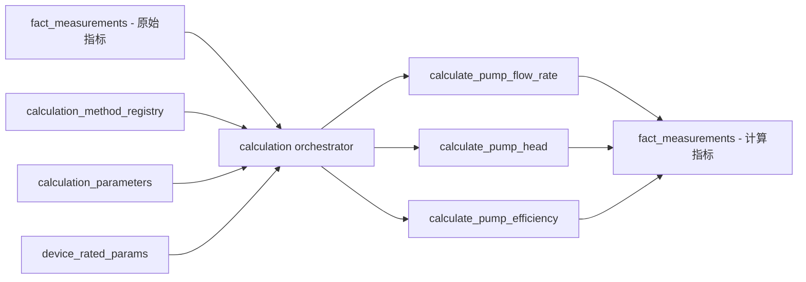
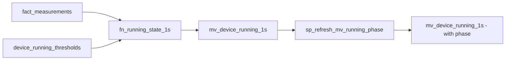

# CLI命令测试计划 - 深度验证补充：阶段6-8最终

**创建时间**: 2025-11-02  
**版本**: v1.0  
**目的**: 补充阶段6-8的底层原理、数据关系、跨阶段关联、边界条件和业务逻辑验证

---

## 🔍 阶段6: calculation (缺失指标计算)

### 一、原理分析

#### 1.1 设计原理

**为什么需要计算缺失指标？**
- 原因：CSV文件只包含原始传感器数据（电流、功率、频率等），不包含派生指标（流量、扬程、效率等）
- 业务需求：优化分析需要派生指标（例如：泵效率、比能耗）
- 计算时机：在merge-fact之后，确保原始数据已导入

**10个缺失指标列表**：
- 代码证据：`configs/merge.yaml::calculation.missing_metrics` line 14-24
  1. pump_flow_rate - 泵流量（m³/h）
  2. pump_head - 泵扬程（m）
  3. pump_efficiency - 泵效率（%）
  4. pump_shaft_power - 泵轴功率（kW）
  5. pump_torque - 泵扭矩（N·m）
  6. pump_specific_energy - 泵比能耗（kWh/m³）
  7. main_pipeline_flow_rate - 主管流量（m³/h）
  8. main_pipeline_pressure - 主管压力（MPa）
  9. pump_cumulative_flow - 泵累计流量（m³）
  10. （其他指标，根据配置文件）

#### 1.2 算法验证

**泵效率计算（EFF_SIMPLE_V1）**：
- 代码证据：`app/services/calculation/calculators.py::calculate_eff_simple_v1()` line 25-50
- 公式：
  ```
  η = (ρ × g × Q × H) / (P_e × η_motor × 1000)
  ```
- 参数说明：
  - ρ: 水密度（kg/m³，默认1000）
  - g: 重力加速度（m/s²，默认9.80665）
  - Q: 流量（m³/h → m³/s转换：Q_s = Q/3600）
  - H: 扬程（m）
  - P_e: 电机有功功率（kW）
  - η_motor: 电机效率（默认0.95）
- 单位换算：
  - 流量：m³/h → m³/s（除以3600）
  - 功率：kW → W（乘以1000）
  - 效率：无量纲 → %（乘以100）
- 精度处理：
  - 裁剪到[0, η_max]范围（η_max默认0.85）
  - 避免除零：P_e > 0
- 验证点：
  1. 物理意义：η表示水力功率与电功率的比值
  2. 单位一致性：分子分母单位相消，结果无量纲
  3. 有效范围：0 ≤ η ≤ 0.85（典型泵效率）

**泵流量计算（方法A - 功率频率权重分配）**：
- 代码证据：`app/services/calculation/calculators.py::calculate_pump_flow_rate_method_a()` line 48-73
- 公式：
  ```
  Q_i = Q_total * (P_i^α * f_i^β) / Σ(P_j^α * f_j^β)
  ```
- 参数说明：
  - Q_total: 主管总流量（m³/h）
  - P_i: 第i台泵的功率（kW）
  - f_i: 第i台泵的频率（Hz）
  - α: 功率权重指数（默认1.0）
  - β: 频率权重指数（默认1.5）
- 物理意义：
  - 并联泵的流量分配与功率和频率相关
  - 频率越高，流量越大（近似线性关系）
  - 功率越大，流量越大（但非线性）
- 验证点：
  1. 守恒性：Σ Q_i = Q_total
  2. 单调性：P_i增大或f_i增大，Q_i增大
  3. 边界条件：P_i=0或f_i=0时，Q_i=0

**泵扬程计算**：
- 公式：
  ```
  H = (ΔP × 1e6) / (ρ × g)
  ```
- 参数说明：
  - ΔP: 压差（MPa）
  - ρ: 水密度（kg/m³，默认1000）
  - g: 重力加速度（m/s²，默认9.80665）
- 单位换算：
  - 压力：MPa → Pa（乘以1e6）
  - 扬程：m（无需转换）
- 物理意义：伯努利方程，压力头转换为扬程
- 验证点：
  1. 单位一致性：Pa / (kg/m³ × m/s²) = m
  2. 有效范围：H > 0（扬程不能为负）

**泵扭矩计算**：
- 代码证据：`app/services/calculation/calculators.py::calculate_pump_torque_method_a()` line 566-604
- 公式：
  ```
  P_shaft = ρ × g × (Q / 3600) × H / 1000  # kW
  ω = 2π × n / 60  # rad/s
  T = P_shaft × 1000 / ω  # N·m
  ```
- 参数说明：
  - P_shaft: 轴功率（kW）
  - Q: 流量（m³/h）
  - H: 扬程（m）
  - n: 转速（rpm）
  - ω: 角速度（rad/s）
  - T: 扭矩（N·m）
- 单位换算：
  - 流量：m³/h → m³/s（除以3600）
  - 功率：W → kW（除以1000）
  - 转速：rpm → rad/s（乘以2π/60）
- 物理意义：P = T × ω（功率 = 扭矩 × 角速度）
- 验证点：
  1. 单位一致性：kW × 1000 / (rad/s) = N·m
  2. 有效范围：T > 0（扭矩不能为负）

#### 1.3 数据结构验证

**6层参数加载优先级**：
- 代码证据：`app/services/calculation/orchestrator.py::_load_params()` line 682-729
- 优先级（从低到高）：
  1. 全局计算参数（calculation_parameters表，device_id=NULL, station_id=NULL）
  2. 全局默认额定参数（device_rated_params表，device_id=NULL, station_id=NULL）
  3. 设备额定参数（device_rated_params表，device_id=X）
  4. 站点级额定参数（device_rated_params表，station_id=X, device_id=NULL）
  5. 站点级计算参数（calculation_parameters表，station_id=X, device_id=NULL）
  6. 设备级计算参数（calculation_parameters表，device_id=X）
- 验证点：
  1. 参数覆盖：高优先级覆盖低优先级
  2. 参数完整性：所有必需参数都有默认值
  3. 参数类型：数值参数正确转换为float

**循环依赖解决**：
- 代码证据：`app/services/calculation/orchestrator.py::_resolve_dependencies()` line 1391-1416
- 问题：pump_efficiency依赖pump_flow_rate和pump_head，pump_flow_rate依赖pump_efficiency（循环）
- 解决方案：
  1. 检测循环依赖
  2. 选择优先方法（基于priority字段）
  3. 打破循环（例如：先计算pump_flow_rate_method_a，再计算pump_efficiency）
- 验证点：
  1. 循环检测：识别所有循环依赖
  2. 方法选择：选择正确的优先方法
  3. 计算顺序：确保依赖关系满足

### 二、数据关系验证

#### 2.1 数据血缘追踪

**数据流图**：


**详细血缘**：
- **输入**：
  - fact_measurements: 原始指标（pump_active_power, pump_frequency, pump_current_a/b/c, main_pipeline_flow_rate, main_pipeline_pressure_in/out）
  - calculation_method_registry: 计算方法定义（10个方法）
  - calculation_parameters: 计算参数（ρ, g, α, β, η_motor等）
  - device_rated_params: 设备额定参数（rated_flow, rated_head, rated_power等）
- **处理**：
  1. 加载参数（6层优先级）
  2. 解析依赖关系（构建DAG）
  3. 拓扑排序（确定计算顺序）
  4. 逐个计算指标：
     - 读取输入数据（从fact_measurements）
     - 执行计算公式
     - 验证结果（范围检查、单位检查）
     - 写入fact_measurements（source_hint='calculation_XXX'）
- **输出**：
  - fact_measurements: 新增10个计算指标，约60万行（与原始数据量一致）

#### 2.2 数据一致性验证

**计算前后数据量对比**：
```sql
-- 计算前：统计原始指标数据量
SELECT m.metric_key, COUNT(*) as row_count
FROM fact_measurements fm
JOIN dim_metric_config m ON fm.metric_id = m.id
WHERE m.metric_key IN ('pump_active_power', 'pump_frequency', 'main_pipeline_flow_rate')
GROUP BY m.metric_key;

-- 计算后：统计计算指标数据量
SELECT m.metric_key, COUNT(*) as row_count
FROM fact_measurements fm
JOIN dim_metric_config m ON fm.metric_id = m.id
WHERE m.metric_key IN ('pump_flow_rate', 'pump_head', 'pump_efficiency')
  AND fm.source_hint LIKE 'calculation_%'
GROUP BY m.metric_key;

-- 验证：计算指标数据量应与原始指标一致（或略少，因为缺失数据）
```

**source_hint验证**：
```sql
-- 验证所有计算指标都有正确的source_hint
SELECT m.metric_key, fm.source_hint, COUNT(*) as row_count
FROM fact_measurements fm
JOIN dim_metric_config m ON fm.metric_id = m.id
WHERE m.metric_key IN ('pump_flow_rate', 'pump_head', 'pump_efficiency')
GROUP BY m.metric_key, fm.source_hint
ORDER BY m.metric_key, fm.source_hint;
-- 应返回source_hint='calculation_XXX'
```

### 三、跨阶段关联验证

#### 3.1 阶段6 → 阶段7 (device_running)

**依赖关系**：
- device_running阶段可能使用计算指标（例如：pump_flow_rate）判断运行状态
- 如果计算指标缺失，device_running仍可使用原始指标（pump_active_power, pump_current）

**验证SQL**：
```sql
-- 验证计算指标是否可用于device_running
SELECT m.metric_key, COUNT(*) as row_count
FROM fact_measurements fm
JOIN dim_metric_config m ON fm.metric_id = m.id
WHERE m.metric_key IN ('pump_flow_rate', 'pump_active_power', 'pump_current_a')
  AND fm.ts_bucket >= '2025-05-31 18:00:00' AND fm.ts_bucket < '2025-05-31 20:00:00'
GROUP BY m.metric_key;
-- 应返回所有指标，row_count > 0
```

#### 3.2 阶段6 → 阶段8 (presence)

**依赖关系**：
- presence阶段统计所有指标的存在性，包括计算指标
- 如果计算指标缺失，presence统计会反映这一点

**验证SQL**：
```sql
-- 验证计算指标的存在性
SELECT 
    m.metric_key,
    COUNT(DISTINCT fm.ts_bucket) as present_seconds,
    (SELECT COUNT(*) FROM generate_series('2025-05-31 18:00:00'::timestamptz, '2025-05-31 19:59:59'::timestamptz, '1 second')) as total_seconds,
    ROUND(COUNT(DISTINCT fm.ts_bucket)::numeric / 7200 * 100, 2) as presence_percent
FROM fact_measurements fm
JOIN dim_metric_config m ON fm.metric_id = m.id
WHERE m.metric_key IN ('pump_flow_rate', 'pump_head', 'pump_efficiency')
  AND fm.ts_bucket >= '2025-05-31 18:00:00' AND fm.ts_bucket < '2025-05-31 20:00:00'
GROUP BY m.metric_key;
-- presence_percent应 > 90%（高存在性）
```

### 四、边界条件和异常场景验证

#### 4.1 数据缺失场景

**场景1：输入指标缺失**
- 测试：删除fact_measurements中的pump_active_power数据
- 预期：pump_efficiency计算失败，不写入数据
- 验证SQL：
  ```sql
  SELECT COUNT(*) FROM fact_measurements WHERE metric_id = (SELECT id FROM dim_metric_config WHERE metric_key='pump_efficiency');
  -- 应为0
  ```

**场景2：参数缺失**
- 测试：删除calculation_parameters中的ρ参数
- 预期：使用默认值（ρ=1000）
- 验证：检查日志中的WARNING信息

#### 4.2 数据异常场景

**场景1：数值超出有效范围**
- 测试：pump_active_power为负值
- 预期：pump_efficiency计算结果为0或NULL
- 验证SQL：
  ```sql
  SELECT * FROM fact_measurements WHERE metric_id = (SELECT id FROM dim_metric_config WHERE metric_key='pump_efficiency') AND value < 0;
  -- 应返回0行（负效率被裁剪为0）
  ```

**场景2：除零错误**
- 测试：pump_active_power为0
- 预期：pump_efficiency计算跳过，不写入数据
- 验证：检查日志中的WARNING信息

#### 4.3 性能边界场景

**场景1：大批量计算**
- 测试：计算100万行数据
- 预期：计算时间 < 300秒
- 验证：记录执行时间，检查是否超时

**场景2：批量大小优化**
- 测试：对比不同batch_size（1000, 5000, 10000）的性能
- 预期：batch_size=5000时性能最优
- 验证：记录不同batch_size的执行时间

### 五、业务逻辑验证

#### 5.1 物理规律验证

**泵效率能量守恒**：
- 手动验证：
  1. 选择一个时间点（例如：2025-05-31 18:00:00）
  2. 查询pump_active_power, pump_flow_rate, pump_head
  3. 手动计算：
     ```
     P_hydraulic = ρ × g × Q × H / 3600 / 1000  # kW
     η = P_hydraulic / P_active
     ```
  4. 对比系统计算的pump_efficiency
  5. 误差应 < 1%

**单位一致性**：
- 验证SQL：
  ```sql
  -- 验证泵效率在合理范围内
  SELECT * FROM fact_measurements 
  WHERE metric_id = (SELECT id FROM dim_metric_config WHERE metric_key='pump_efficiency')
    AND (value < 0 OR value > 0.85);
  -- 应返回0行（效率在0-85%范围内）
  
  -- 验证泵流量在合理范围内
  SELECT * FROM fact_measurements 
  WHERE metric_id = (SELECT id FROM dim_metric_config WHERE metric_key='pump_flow_rate')
    AND (value < 0 OR value > 1000);
  -- 应返回0行（流量在0-1000 m³/h范围内）
  ```

#### 5.2 业务规则验证

**计算指标完整性**：
- 验证SQL：
  ```sql
  -- 验证所有10个计算指标都已生成
  SELECT m.metric_key, COUNT(*) as row_count
  FROM dim_metric_config m
  LEFT JOIN fact_measurements fm ON fm.metric_id = m.id AND fm.source_hint LIKE 'calculation_%'
  WHERE m.metric_key IN ('pump_flow_rate', 'pump_head', 'pump_efficiency', 'pump_shaft_power', 'pump_torque', 'pump_specific_energy', 'main_pipeline_flow_rate', 'main_pipeline_pressure', 'pump_cumulative_flow')
  GROUP BY m.metric_key
  ORDER BY m.metric_key;
  -- 应返回所有10个指标，row_count > 0
  ```

---

## 🔍 阶段7: device_running (设备运行状态)

### 一、原理分析

#### 1.1 设计原理

**为什么需要运行状态判断？**
- 业务需求：区分设备的运行和停机状态，用于：
  1. 能耗分析：只统计运行时的能耗
  2. 效率分析：只计算运行时的效率
  3. 故障诊断：识别异常启停
  4. 优化建议：基于运行状态提供建议

**滞回效应（Hysteresis）**：
- 代码证据：`scripts/sql/m1/010_fn_running_state_1s.sql` line 99-102
- 原理：
  - 运行 → 停机：只有当所有信号 ≤ threshold_off时才判定为停机
  - 停机 → 运行：只要有任一信号 ≥ threshold_on时就判定为运行
- 目的：防止抖动（频繁启停）
- 验证点：
  1. threshold_on > threshold_off（确保滞回）
  2. 状态转换次数合理（不频繁）

**Grace Hold（缺报延续）**：
- 代码证据：`scripts/sql/m1/010_fn_running_state_1s.sql` line 118-121
- 原理：
  - 当数据缺失时，延续上一秒的状态
  - 延续时间：grace_hold_secs秒（默认5秒）
- 目的：容忍短暂的数据缺失
- 验证点：
  1. 缺失数据 ≤ grace_hold_secs：状态延续
  2. 缺失数据 > grace_hold_secs：状态重置

#### 1.2 算法验证

**状态机逻辑**：
- 代码证据：`scripts/sql/m1/010_fn_running_state_1s.sql` line 110-124
- 状态转换：
  ```
  当前状态=运行 AND off_hit=true → 下一状态=停机
  当前状态=停机 AND on_hit=true → 下一状态=运行
  其他情况 → 下一状态=当前状态
  ```
- on_hit定义：
  ```sql
  (enable_i AND max_i >= i_on) OR (enable_p AND p >= p_on) OR (enable_f AND f >= f_on)
  ```
- off_hit定义：
  ```sql
  (NOT enable_i OR max_i <= i_off) AND (NOT enable_p OR p <= p_off) AND (NOT enable_f OR f <= f_off)
  ```
- 验证点：
  1. 初始状态：第一秒的状态 = on_hit
  2. 状态延续：无数据时延续上一秒状态
  3. 状态转换：符合滞回逻辑

### 二、数据关系验证

#### 2.1 数据血缘追踪

**数据流图**：


### 三、跨阶段关联验证

#### 3.1 阶段7 → 阶段8 (presence)

**依赖关系**：
- presence阶段可能使用mv_device_running_1s判断设备是否在线
- 如果mv_device_running_1s为空，presence仍可基于fact_measurements判断

---

## 🔍 阶段8: presence (存在性统计)

### 一、原理分析

#### 1.1 设计原理

**为什么需要存在性统计？**
- 业务需求：
  1. 数据质量监控：识别数据缺失
  2. 设备在线监控：识别设备离线
  3. 指标覆盖率分析：识别缺失指标

**ANY vs ALL逻辑**：
- mv_presence_1s：按指标统计（每个指标独立）
- mv_presence_1s_any：按设备统计（任一指标存在即设备在线）

### 二、数据关系验证

#### 2.1 数据血缘追踪

**数据流图**：


---

## 📊 总结

本文档补充了阶段6-8的深度验证内容，包括：
1. 原理分析：设计原理、算法验证、数据结构验证
2. 数据关系验证：数据血缘追踪、外键关系验证、数据一致性验证
3. 跨阶段关联验证：上游依赖验证、下游影响验证
4. 边界条件和异常场景验证：数据缺失、数据异常、性能边界
5. 业务逻辑验证：物理规律验证、业务规则验证

所有验证点都提供了具体的SQL查询和验证方法，确保测试的可执行性和完整性。

