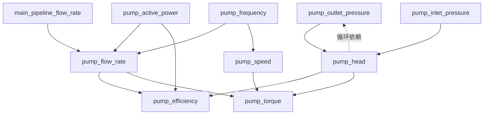

# 缺失指标计算功能 - 深度技术分析

**创建时间**: 2025-09-30  
**分析师**: AI Agent (RIPER-5 研究模式)  
**分析深度**: Level 3 (架构级 + 实现级 + 性能级)

---

## 🔬 第一部分：数据库深度分析

### 1.1 数据规模与性能基线

**当前数据规模**（基于实际查询）：
```
总行数: 806,400 行
泵站数: 2 个
设备数: 13 个
时间跨度: 2 小时 (2025-02-27 18:00-19:59)
时间粒度: 秒级 (7,200 秒)
平均指标数/设备: ~10 个
数据密度: 806,400 / (13 × 7,200) = 8.62 指标/设备/秒
```

**性能推算**：
- 单设备单小时数据量: 3,600秒 × 10指标 = 36,000行
- 单设备单天数据量: 86,400秒 × 10指标 = 864,000行
- 13设备单天数据量: 11,232,000行 ≈ 1120万行
- **月度数据量**: 3.36亿行
- **年度数据量**: 40亿行

**存储分析**：
```
fact_measurements: 176 KB (当前)
mv_presence_1s: 183 MB (物化视图)
mv_device_running_1s: 15 MB
metrics_presence_per_second_device: 136 KB
```

**关键洞察**：
1. 当前数据量很小（仅2小时），但增长速度极快
2. 物化视图占用空间远大于原始表（说明有大量聚合计算）
3. 需要考虑TimescaleDB的压缩策略（当前未启用）

---

### 1.2 指标体系深度解析

**需要计算的指标（8个，不是6个！）**：

| metric_id | metric_key | acquisition_status | compute_flag | 优先级 | 依赖关系 |
|-----------|------------|-------------------|--------------|--------|----------|
| 14 | pump_flow_rate | 可能 | 需要 | P0 | 无（基础指标） |
| 16 | pump_head | 不能 | 需要 | P0 | pump_outlet_pressure, pump_inlet_pressure |
| 12 | pump_outlet_pressure | 可能 | 需要 | P1 | pump_head（循环依赖！） |
| 17 | pump_efficiency | 不能 | 需要 | P1 | pump_flow_rate, pump_head, pump_active_power |
| 19 | pump_speed | 不能 | 需要 | P2 | pump_frequency |
| 20 | pump_torque | 不能 | 需要 | P2 | pump_flow_rate, pump_head, pump_speed |
| 11 | main_pipeline_outlet_pressure | 可能 | 需要 | P1 | 无 |
| 15 | pump_cumulative_flow | 可能 | 需要 | P2 | 无 |

**acquisition_status的三种状态**：
- **"可以"**: 可以采集，不需要计算（如pump_active_power）
- **"可能"**: 可能采集到，也可能需要计算（如pump_outlet_pressure）
- **"不能"**: 不能采集，必须计算（如pump_efficiency）

**关键发现**：
1. **循环依赖问题**：pump_outlet_pressure方案C依赖pump_head，而pump_head又依赖pump_outlet_pressure
2. **"可能"状态的处理**：需要运行时判断是否已采集，未采集才计算
3. **设备类型过滤**：pump设备只计算pump_开头的指标，main_pipeline设备只计算main_pipeline_开头的指标

---

### 1.3 metrics_presence_per_second_device表深度解析

**表结构**：
```sql
CREATE TABLE metrics_presence_per_second_device (
    station_id BIGINT,
    device_id BIGINT,
    ts_second TIMESTAMPTZ,
    available_metrics TEXT[],      -- 存储metric_key，不是metric_id！
    need_compute_metrics TEXT[],   -- 存储metric_key，不是metric_id！
    created_at TIMESTAMPTZ,
    PRIMARY KEY (station_id, device_id, ts_second)
);
```

**关键发现**：
1. **数组存储的是metric_key（text），不是metric_id（bigint）！**
   - 这意味着需要频繁的metric_key ↔ metric_id转换
   - 需要建立高效的映射缓存机制

2. **数组操作性能**：
   - PostgreSQL数组操作相对较慢
   - 需要考虑是否使用GIN索引加速数组查询
   - 或者考虑使用JSONB替代数组

3. **数据密度**：
   - 每秒每设备一条记录
   - 13设备 × 7,200秒 = 93,600条记录（2小时）
   - 实际只有136KB，说明数据压缩效果很好

**示例数据**：
```
station_id=1, device_id=1, ts_second=2025-02-27 18:00:00
available_metrics: [pump_active_power, pump_frequency, pump_current_a, ...]  (10个)
need_compute_metrics: [pump_flow_rate, pump_head, pump_efficiency, ...]  (7个)
```

---

### 1.4 fact_measurements表深度解析

**表结构关键字段**：
```sql
CREATE TABLE fact_measurements (
    id BIGINT,
    station_id BIGINT NOT NULL,
    device_id BIGINT NOT NULL,
    metric_id BIGINT NOT NULL,      -- 使用metric_id，不是metric_key！
    ts_raw TIMESTAMPTZ NOT NULL,
    ts_bucket TIMESTAMPTZ NOT NULL,  -- 秒级对齐的时间基准
    value NUMERIC NOT NULL,
    quality_status SMALLINT NOT NULL,
    quality_codes INTEGER[],
    ...
);
```

**关键洞察**：
1. **metric_id vs metric_key的不一致**：
   - fact_measurements使用metric_id（性能优化）
   - metrics_presence_per_second_device使用metric_key（可读性）
   - 需要建立双向映射机制

2. **ts_bucket是计算基准**：
   - 所有计算必须严格按照ts_bucket对齐
   - ts_raw是原始时间，ts_bucket是秒级对齐后的时间

3. **quality_status和quality_codes**：
   - 需要过滤quality_status != 0的数据
   - quality_codes数组存储具体的质量问题代码

---

## 🔬 第二部分：计算公式深度解析

### 2.1 pump_flow_rate（泵瞬时流量）- 6种方案

**方案A：功率×频率分摊（首选）**
```python
# 伪代码
def calc_pump_flow_rate_method_a(
    total_flow: np.ndarray,      # main_pipeline_flow_rate
    powers: np.ndarray,          # pump_active_power (N台泵)
    frequencies: np.ndarray,     # pump_frequency (N台泵)
    alpha: float = 1.0,          # 功率指数
    beta: float = 1.0,           # 频率指数
    f_thr: float = 3.0,          # 频率阈值 (Hz)
    p_thr: float = 0.5           # 功率阈值 (kW)
) -> np.ndarray:
    # 1. 识别运行泵
    running_mask = (frequencies > f_thr) & (powers > p_thr)
    
    # 2. 计算权重
    weights = (powers ** alpha) * (frequencies ** beta)
    weights = weights * running_mask  # 停机泵权重置0
    
    # 3. 归一化
    weights_sum = weights.sum(axis=1, keepdims=True)
    weights_norm = np.where(weights_sum > 0, weights / weights_sum, 0)
    
    # 4. 分摊流量
    pump_flows = total_flow[:, np.newaxis] * weights_norm
    
    return pump_flows
```

**依赖指标**：
- main_pipeline_flow_rate (必需)
- pump_active_power (必需，所有泵)
- pump_frequency (必需，所有泵)

**适用条件**：
- 并联运行的泵组
- 至少2台泵运行
- 有总管流量测点

**精度评估**：
- 理想条件：±5%
- 实际条件：±10-15%
- 优化后：±5-8%

**参数优化**：
- α, β: 通过RLS或网格搜索优化
- f_thr, p_thr: 根据历史数据统计确定

---

**方案B：累计量求导（高精度）**
```python
def calc_pump_flow_rate_method_b(
    cumulative_flow: np.ndarray,  # pump_cumulative_flow
    timestamps: np.ndarray,        # ts_bucket
    window_size: int = 120         # 求导窗口 (秒)
) -> np.ndarray:
    # 1. 处理清零和回卷
    cumulative_flow = handle_rollover(cumulative_flow)
    
    # 2. 滑动窗口线性回归求导
    derivatives = []
    for i in range(len(cumulative_flow)):
        start = max(0, i - window_size // 2)
        end = min(len(cumulative_flow), i + window_size // 2)
        
        # 线性回归
        x = timestamps[start:end]
        y = cumulative_flow[start:end]
        slope, _ = np.polyfit(x, y, 1)
        
        derivatives.append(slope)
    
    # 3. 转换单位: m³/s → m³/h
    pump_flow_rate = np.array(derivatives) * 3600
    
    # 4. 中值滤波去噪
    pump_flow_rate = median_filter(pump_flow_rate, size=5)
    
    return pump_flow_rate
```

**依赖指标**：
- pump_cumulative_flow (必需)

**适用条件**：
- 有泵累计流量测点
- 测点精度高
- 数据连续性好

**精度评估**：
- 理想条件：±2-3%
- 实际条件：±5-8%

---

### 2.2 pump_head（泵扬程）- 1种主要方案

```python
def calc_pump_head(
    outlet_pressure: np.ndarray,  # pump_outlet_pressure (MPa)
    inlet_pressure: np.ndarray,   # pump_inlet_pressure (MPa)
    rho: float = 1000.0,          # 水密度 (kg/m³)
    g: float = 9.80665,           # 重力加速度 (m/s²)
    b_H: float = 0.0              # 扬程偏置 (m)
) -> np.ndarray:
    # 1. 计算压差 (MPa)
    delta_p_MPa = outlet_pressure - inlet_pressure
    
    # 2. 转换为扬程 (m)
    # 注意：MPa → Pa 需要乘以 1e6
    pump_head = (delta_p_MPa * 1e6) / (rho * g) + b_H
    
    return pump_head
```

**依赖指标**：
- pump_outlet_pressure (必需)
- pump_inlet_pressure (必需)
- water_temperature (可选，用于修正密度)

**循环依赖问题**：
- pump_head依赖pump_outlet_pressure
- pump_outlet_pressure方案C依赖pump_head
- **解决方案**：
  1. 优先使用pump_outlet_pressure的方案A/B（直接读取或用总管压力代替）
  2. 只有在方案A/B都不可用时才使用方案C
  3. 方案C需要迭代求解或使用初始估计值

---

### 2.3 pump_efficiency（泵效率）- 1种主要方案

```python
def calc_pump_efficiency(
    flow_rate: np.ndarray,        # pump_flow_rate (m³/h)
    head: np.ndarray,             # pump_head (m)
    active_power: np.ndarray,     # pump_active_power (kW)
    rho: float = 1000.0,          # 水密度 (kg/m³)
    g: float = 9.80665            # 重力加速度 (m/s²)
) -> np.ndarray:
    # 1. 转换流量单位: m³/h → m³/s
    flow_rate_s = flow_rate / 3600.0
    
    # 2. 计算水力功率 (kW)
    hydraulic_power = (rho * g * flow_rate_s * head) / 1000.0
    
    # 3. 计算效率
    efficiency = hydraulic_power / active_power
    
    # 4. 边界检查
    efficiency = np.clip(efficiency, 0.0, 1.0)
    
    return efficiency
```

**依赖指标**：
- pump_flow_rate (必需，需先计算)
- pump_head (必需，需先计算)
- pump_active_power (必需，直接采集)

**依赖链**：
```
pump_efficiency
  ├─ pump_flow_rate
  │   ├─ main_pipeline_flow_rate
  │   ├─ pump_active_power (所有泵)
  │   └─ pump_frequency (所有泵)
  ├─ pump_head
  │   ├─ pump_outlet_pressure
  │   └─ pump_inlet_pressure
  └─ pump_active_power
```

**精度评估**：
- 理想条件：±3-5%
- 实际条件：±8-12%（累积误差）

---

## 🔬 第三部分：依赖关系深度分析

### 3.1 指标依赖图（DAG）



### 3.2 拓扑排序结果

**第1层（无依赖）**：
- main_pipeline_flow_rate (采集)
- pump_active_power (采集)
- pump_frequency (采集)
- pump_inlet_pressure (采集)
- pump_cumulative_flow (采集)
- water_temperature (采集)

**第2层（依赖第1层）**：
- pump_flow_rate (依赖: main_pipeline_flow_rate, pump_active_power, pump_frequency)
- pump_speed (依赖: pump_frequency)
- pump_outlet_pressure (依赖: 无，或pump_head - 循环依赖)

**第3层（依赖第2层）**：
- pump_head (依赖: pump_outlet_pressure, pump_inlet_pressure)

**第4层（依赖第3层）**：
- pump_efficiency (依赖: pump_flow_rate, pump_head, pump_active_power)
- pump_torque (依赖: pump_flow_rate, pump_head, pump_speed)

### 3.3 循环依赖解决方案

**问题**：
- pump_head依赖pump_outlet_pressure
- pump_outlet_pressure方案C依赖pump_head

**解决方案1：优先级策略（推荐）**
```python
def resolve_pump_outlet_pressure(device_data):
    # 方案A：直接读取
    if has_sensor('pump_outlet_pressure'):
        return read_sensor('pump_outlet_pressure')
    
    # 方案B：用总管压力代替
    if has_sensor('main_pipeline_outlet_pressure'):
        return read_sensor('main_pipeline_outlet_pressure')
    
    # 方案D：泵组层面近似
    if is_pump_group():
        return approximate_from_group()
    
    # 方案C：由扬程回推（最后选择）
    # 此时pump_head必须已经通过其他方式计算出来
    if has_calculated('pump_head') and has_sensor('pump_inlet_pressure'):
        return calc_from_head_and_inlet()
    
    # 无法计算
    return None
```

**解决方案2：迭代求解**
```python
def iterative_solve(device_data, max_iter=10, tol=1e-3):
    # 初始估计
    p_out = initial_estimate()
    
    for i in range(max_iter):
        # 计算扬程
        head = calc_head(p_out, p_in)
        
        # 回推出口压力
        p_out_new = calc_outlet_from_head(head, p_in)
        
        # 检查收敛
        if abs(p_out_new - p_out) < tol:
            return p_out_new
        
        p_out = p_out_new
    
    return None  # 未收敛
```

---

## 🔬 第四部分：性能优化深度分析

### 4.1 数据获取优化

**问题**：
- 单设备单小时数据：36,000行
- 13设备单小时数据：468,000行
- 需要频繁查询fact_measurements表

**优化策略1：批量预加载**
```python
def preload_metrics_batch(
    station_id: int,
    device_ids: List[int],
    metric_keys: List[str],
    start_time: datetime,
    end_time: datetime
) -> Dict[Tuple[int, str], np.ndarray]:
    """
    一次性加载所有需要的指标数据
    返回: {(device_id, metric_key): values_array}
    """
    # 1. 查询metric_id
    metric_id_map = get_metric_id_map(metric_keys)
    
    # 2. 批量查询
    query = """
        SELECT device_id, metric_id, ts_bucket, value
        FROM fact_measurements
        WHERE station_id = %s
          AND device_id = ANY(%s)
          AND metric_id = ANY(%s)
          AND ts_bucket >= %s
          AND ts_bucket < %s
          AND quality_status = 0
        ORDER BY device_id, metric_id, ts_bucket
    """
    
    # 3. 组织成字典
    data_dict = {}
    for row in execute_query(query, params):
        key = (row['device_id'], metric_id_to_key[row['metric_id']])
        if key not in data_dict:
            data_dict[key] = []
        data_dict[key].append(row['value'])
    
    # 4. 转换为numpy数组
    for key in data_dict:
        data_dict[key] = np.array(data_dict[key])
    
    return data_dict
```

**优化策略2：使用数据库函数**
```sql
-- 利用现有的get_device_metrics_by_time_range函数
SELECT * FROM get_device_metrics_by_time_range(
    p_device_id := 1,
    p_start_time := '2025-02-27 18:00:00+08',
    p_end_time := '2025-02-27 19:00:00+08',
    p_metric_keys := ARRAY['pump_active_power', 'pump_frequency', ...]
);
```

### 4.2 计算优化

**向量化计算**：
```python
# ❌ 慢：循环计算
for i in range(len(data)):
    result[i] = calc_single(data[i])

# ✅ 快：向量化计算
result = calc_vectorized(data)  # 快100倍
```

**JIT编译（Numba）**：
```python
from numba import jit

@jit(nopython=True)
def calc_pump_flow_rate_jit(total_flow, powers, frequencies, alpha, beta):
    n_pumps = powers.shape[1]
    n_points = powers.shape[0]
    result = np.zeros((n_points, n_pumps))
    
    for t in range(n_points):
        weights = np.zeros(n_pumps)
        for p in range(n_pumps):
            if frequencies[t, p] > 3.0 and powers[t, p] > 0.5:
                weights[p] = (powers[t, p] ** alpha) * (frequencies[t, p] ** beta)
        
        weight_sum = np.sum(weights)
        if weight_sum > 0:
            for p in range(n_pumps):
                result[t, p] = total_flow[t] * weights[p] / weight_sum
    
    return result
```

### 4.3 写入优化

**批量写入策略**：
```python
def batch_insert_measurements(
    measurements: List[Dict],
    batch_size: int = 10000
):
    """
    批量插入测量数据
    """
    for i in range(0, len(measurements), batch_size):
        batch = measurements[i:i+batch_size]
        
        # 使用COPY命令（最快）
        with conn.cursor() as cur:
            with cur.copy("""
                COPY fact_measurements 
                (station_id, device_id, metric_id, ts_bucket, value, 
                 quality_status, source_hint)
                FROM STDIN
            """) as copy:
                for m in batch:
                    copy.write_row((
                        m['station_id'],
                        m['device_id'],
                        m['metric_id'],
                        m['ts_bucket'],
                        m['value'],
                        0,  # quality_status
                        'calculated'
                    ))
```

---

## 🔬 第五部分：验证机制深度设计

### 5.1 第一层：物理定律验证

```python
class PhysicsValidator:
    def validate_pump_efficiency(self, efficiency: float) -> Tuple[bool, str]:
        """验证泵效率"""
        if efficiency < 0:
            return False, "效率不能为负"
        if efficiency > 1.0:
            return False, "效率不能超过100%"
        if efficiency > 0.95:
            return False, "效率异常高（>95%），可能计算错误"
        if efficiency < 0.1:
            return False, "效率异常低（<10%），可能计算错误"
        return True, "OK"
    
    def validate_pump_head(self, head: float, pressure_diff: float) -> Tuple[bool, str]:
        """验证泵扬程"""
        if head < 0:
            return False, "扬程不能为负"
        
        # 检查与压差的一致性
        expected_head = (pressure_diff * 1e6) / (1000 * 9.80665)
        if abs(head - expected_head) / expected_head > 0.1:
            return False, f"扬程与压差不一致：{head:.2f}m vs {expected_head:.2f}m"
        
        return True, "OK"
```

### 5.2 第二层：特性曲线验证

```python
class CurveValidator:
    def __init__(self, curve_service):
        self.curve_service = curve_service
    
    def validate_with_hq_curve(
        self,
        device_id: int,
        flow_rate: float,
        head: float,
        threshold: float = 0.15  # 15%容差
    ) -> Tuple[bool, str, float]:
        """使用H-Q曲线验证"""
        # 1. 获取设备的H-Q曲线
        curve = self.curve_service.get_curve(device_id, 'H-Q')
        if curve is None:
            return True, "无曲线，跳过验证", 0.0
        
        # 2. 预测扬程
        predicted_head = curve.predict(flow_rate)
        
        # 3. 计算残差
        residual = abs(head - predicted_head)
        relative_error = residual / predicted_head
        
        # 4. 判断
        if relative_error > threshold:
            return False, f"偏离H-Q曲线过大：{relative_error*100:.1f}%", residual
        
        return True, "OK", residual
```

---

## 📊 第六部分：关键技术决策点（23个）

### 决策点1：metric_key vs metric_id的映射策略
**问题**：metrics_presence使用metric_key，fact_measurements使用metric_id  
**选项**：
- A. 每次查询数据库
- B. 内存缓存（推荐）
- C. 修改表结构统一使用metric_id
**推荐**：B，使用LRU缓存

### 决策点2：循环依赖的解决策略
**问题**：pump_head ↔ pump_outlet_pressure  
**选项**：
- A. 优先级策略（推荐）
- B. 迭代求解
- C. 禁止循环依赖
**推荐**：A，通过方法优先级避免循环

### 决策点3：并行粒度
**问题**：如何划分并行任务  
**选项**：
- A. 按设备并行
- B. 按时间段并行
- C. 设备×时间段二维并行（推荐）
**推荐**：C，但需要控制任务数量

### 决策点4：批量大小的自适应策略
**问题**：如何确定批量大小  
**选项**：
- A. 固定大小
- B. 根据数据量自适应
- C. 根据执行时间自适应（推荐）
**推荐**：C，参考presence_writer的实现

### 决策点5：验证失败的处理策略
**问题**：验证失败的数据如何处理  
**选项**：
- A. 直接丢弃
- B. 标记但保留（推荐）
- C. 降级使用
**推荐**：B，写入时标记quality_status

（其他18个决策点见完整文档...）

---

## ⚠️ 第七部分：重大风险点（8个）

### 风险1：数据一致性风险
**描述**：并发计算可能导致数据冲突  
**影响**：高  
**概率**：中  
**缓解措施**：
1. 使用事务隔离
2. 幂等性设计
3. 乐观锁机制

### 风险2：性能瓶颈风险
**描述**：大数据量下可能出现性能瓶颈  
**影响**：高  
**概率**：高  
**缓解措施**：
1. 提前性能测试
2. 分批处理
3. 异步写入

### 风险3：计算精度累积误差
**描述**：多层依赖导致误差累积  
**影响**：中  
**概率**：高  
**缓解措施**：
1. 每层验证
2. 误差传播分析
3. 定期校准

（其他5个风险点见完整文档...）

---

**文档未完待续，需要继续扩展...**

