# prepare-dim 重构全面调研报告

**调研日期**: 2025-10-20  
**调研模式**: RIPER-5 研究模式  
**调研范围**: 数据库表结构、数据生成机制、依赖关系、当前实现

---

## 📋 执行摘要

本次调研全面分析了 `prepare-dim` 数据初始化流程的现状，包括：
- ✅ 项目整体架构和目录结构
- ✅ 数据库所有相关表的完整结构（20个表）
- ✅ 当前 `prepare-dim` 流程的实现逻辑
- ✅ 18个表的数据来源和生成机制
- ✅ 表依赖关系的详细分析
- ✅ 备份系统的实现状态

**关键发现**：
1. 当前已实现两阶段 `prepare-dim` 流程（stage 1 和 stage 2）
2. 已实现17个表的版本化备份系统（BackupManager）
3. 三大维度表（dim_stations, dim_devices, dim_metric_config）的生成机制已明确
4. 规则表生成函数已实现（6个函数）
5. 配置表初始化逻辑已实现（4个表）

---

## 🗂️ 第一部分：项目现状调研

### 1.1 项目整体架构

**项目根目录**: `d:\Augment\diwuban`

**核心目录结构**:
```
diwuban/
├── app/
│   ├── services/
│   │   ├── ingest/
│   │   │   └── prepare_dim/
│   │   │       ├── __init__.py          # 主流程实现
│   │   │       └── backup.py            # 备份管理器
│   │   ├── rules/                       # 规则表生成函数
│   │   │   ├── auto_baseline.py
│   │   │   ├── auto_baseline_b.py
│   │   │   ├── metric_quality_rules.py
│   │   │   ├── metric_quality_rules_b.py
│   │   │   ├── running_thresholds.py
│   │   │   └── running_thresholds_b.py
│   │   └── calculation/
│   │       └── dependency_analyzer.py   # 计算顺序分析器
├── backups/                             # 备份目录（17个表）
├── configs/
│   └── data_mapping.v2.json            # 站点/设备/指标映射
├── scripts/
│   ├── sql/
│   │   └── calculation/
│   │       ├── init_methods.sql        # 计算方法注册表
│   │       └── init_params.sql         # 计算参数
│   └── migrations/
│       └── 20250829_seed_device_rated_params.sql
└── docs/
    ├── 数据库表快速参考.md
    └── 数据库表全面分析报告.md
```

### 1.2 当前 prepare-dim 流程实现

**文件位置**: `app/services/ingest/prepare_dim/__init__.py`

**主函数签名**:
```python
def prepare_dim(settings: Settings, mapping_path: Path, stage: int | None = None) -> Dict[str, Any]
```

**两阶段执行逻辑**:

#### Stage 1（在 merge-fact 前执行）
```
1.1 备份17个表（无条件执行）
    ├── A类：手动配置表（6个）
    ├── B类：配置表（4个）
    ├── C类：维度表（1个）
    └── D类：规则表（6个）

1.2 清空非备份表（5个）
    ├── fact_measurements
    ├── completion_runs
    ├── completion_steps
    ├── dim_devices
    ├── dim_stations
    └── dim_mapping_items

1.3 重建维度表（3个）
    ├── dim_metric_config（从备份恢复）
    ├── dim_stations（从 data_mapping.v2.json）
    └── dim_devices（从 data_mapping.v2.json）

1.4 恢复10个配置表（从备份）
    ├── dim_device_capabilities
    ├── dim_metric_metadata_override
    ├── pump_characteristic_curves
    ├── quality_code_dict
    ├── calculation_validation_config
    ├── metric_capability_policy
    ├── calculation_parameters
    ├── device_rated_params
    ├── calculation_method_registry
    └── metric_calculation_order

1.5 重建4个配置表（从SQL脚本或代码生成）
    ├── calculation_method_registry（init_methods.sql）
    ├── calculation_parameters（init_params.sql）
    ├── device_rated_params（20250829_seed_device_rated_params.sql）
    └── metric_calculation_order（DependencyAnalyzer.save_to_database()）
```

#### Stage 2（在 merge-fact 后执行）
```
2.1 清空规则表（6个）
    ├── metric_rule_auto_baseline
    ├── metric_rule_auto_baseline_shadow
    ├── metric_quality_rules
    ├── metric_quality_rules_shadow
    ├── device_running_thresholds
    └── device_running_thresholds_shadow

2.2 生成规则表（6个函数）
    ├── run_auto_baseline_b() → metric_rule_auto_baseline_shadow
    ├── run_auto_baseline() → metric_rule_auto_baseline
    ├── compute_metric_quality_rules_shadow() → metric_quality_rules_shadow
    ├── run_running_thresholds_b() → device_running_thresholds_shadow
    ├── run_running_thresholds() → device_running_thresholds
    └── compute_metric_quality_rules() → metric_quality_rules

2.3 生成映射表（TODO）
    └── dim_mapping_items
```

### 1.3 备份系统实现状态

**文件位置**: `app/services/ingest/prepare_dim/backup.py`

**核心类**: `BackupManager`

**功能特性**:
- ✅ 支持17个表的版本化备份
- ✅ 备份格式：SQL INSERT语句（带 ON CONFLICT DO UPDATE）
- ✅ 版本管理：保留最新60个版本
- ✅ 增量备份：只备份变化的表（行数 + MD5校验）
- ✅ 备份目录：`backups/<table_name>/<table_name>_v<version>_<timestamp>.sql`

**备份文件示例**:
```
backups/dim_metric_config/dim_metric_config_v1_20251020_083101.sql
```

**备份内容示例**:
```sql
-- 备份表: dim_metric_config
-- 时间: 2025-10-20 08:31:01
-- 行数: 54
-- MD5: d8efa65df20616b2a2277bab9c1d5913

INSERT INTO dim_metric_config (id, metric_key, unit, unit_display, ...) 
VALUES (12, 'pump_outlet_pressure', 'MPa', '泵出口压力', ...)
ON CONFLICT (id) DO UPDATE SET ...
```

---

## 📊 第二部分：数据库表结构调研

### 2.1 核心维度表（3个）

#### 2.1.1 dim_stations（泵站维度表）

**当前行数**: 1  
**预期行数**: 1-2  
**数据来源**: `configs/data_mapping.v2.json`

**表结构**:
| 字段名 | 类型 | 约束 | 说明 |
|--------|------|------|------|
| id | BIGSERIAL | PK | 主键 |
| name | TEXT | NOT NULL | 站点名称 |
| extra | JSONB | NULL | 扩展信息 |
| created_at | TIMESTAMPTZ | DEFAULT now() | 创建时间 |
| is_active | BOOLEAN | DEFAULT true | 是否激活 |

**数据生成方式**:
- 从 `data_mapping.v2.json` 的 `stations` 数组读取
- 使用 `_upsert_station(cur, sname)` 函数插入
- UPSERT 策略：`ON CONFLICT (name) DO UPDATE`

**当前数据**:
```json
{
  "stations": [
    {
      "name": "二期供水泵房",
      "devices": [...]
    }
  ]
}
```

#### 2.1.2 dim_devices（设备维度表）

**当前行数**: 8  
**预期行数**: 8-13  
**数据来源**: `configs/data_mapping.v2.json`

**表结构**:
| 字段名 | 类型 | 约束 | 说明 |
|--------|------|------|------|
| id | BIGSERIAL | PK | 主键 |
| station_id | BIGINT | FK → dim_stations(id) | 站点ID |
| name | TEXT | NOT NULL | 设备名称 |
| type | TEXT | NOT NULL | 设备类型 |
| pump_type | TEXT | NULL | 泵类型 |
| extra | JSONB | NULL | 扩展信息 |
| created_at | TIMESTAMPTZ | DEFAULT now() | 创建时间 |
| is_active | BOOLEAN | DEFAULT true | 是否激活 |

**数据生成方式**:
- 从 `data_mapping.v2.json` 的 `stations[].devices` 数组读取
- 使用 `_upsert_device(cur, sid, dname, dtype_norm, pump_type_norm, extra)` 函数插入
- UPSERT 策略：`ON CONFLICT (station_id, name) DO UPDATE`

**设备类型规范化**:
```python
# pump 类型
if k in ("pump", "pumps"):
    dtype_norm = "pump"

# clear_water_pool 类型
elif k in ("clear_water_pool", "clearwaterpool", "clear_water", "clearpool", "pool"):
    dtype_norm = "clear_water_pool"

# other 类型
elif k in ("other", "others"):
    dtype_norm = "other"
```

#### 2.1.3 dim_metric_config（指标配置表）

**当前行数**: 54  
**预期行数**: 50-60  
**数据来源**: 备份文件（`backups/dim_metric_config/`）

**表结构**:
| 字段名 | 类型 | 约束 | 说明 |
|--------|------|------|------|
| id | BIGSERIAL | PK | 主键 |
| metric_key | TEXT | UNIQUE NOT NULL | 指标键 |
| unit | TEXT | NOT NULL | 单位 |
| unit_display | TEXT | NULL | 显示单位 |
| decimals_policy | TEXT | DEFAULT 'as_is' | 小数策略 |
| fixed_decimals | SMALLINT | NULL | 固定小数位 |
| value_type | TEXT | NULL | 值类型 |
| valid_min | NUMERIC | NULL | 最小有效值 |
| valid_max | NUMERIC | NULL | 最大有效值 |
| created_at | TIMESTAMPTZ | DEFAULT now() | 创建时间 |
| updated_at | TIMESTAMPTZ | DEFAULT now() | 更新时间 |

**数据生成方式**:
- **Stage 1**: 从备份恢复（`backup_manager.restore_table(cur, "dim_metric_config")`）
- 备份文件包含54个指标的完整定义
- 使用 `INSERT ... ON CONFLICT (id) DO UPDATE` 实现幂等性

**指标示例**:
```sql
INSERT INTO dim_metric_config (id, metric_key, unit, unit_display, ...) VALUES
(1, 'pump_frequency', 'Hz', '泵变频器频率', ...),
(2, 'pump_voltage_a', 'V', '泵A相电压', ...),
(3, 'pump_current_a', 'A', '泵A相电流', ...),
...
```

---

### 2.2 配置和规则表（15个）

#### 2.2.1 A类：手动配置表（6个）

这些表需要人工配置或从备份恢复，不能自动生成。

##### dim_device_capabilities（设备能力配置）

**当前行数**: 1  
**预期行数**: 8-13（每个设备一行）  
**数据来源**: 手动配置或备份恢复

**表结构**:
| 字段名 | 类型 | 约束 | 说明 |
|--------|------|------|------|
| device_id | BIGINT | PK, FK → dim_devices(id) | 设备ID |
| vfd_enabled | BOOLEAN | NULL | 是否启用变频 |
| freq_min | DOUBLE PRECISION | NULL | 最小频率 |
| freq_max | DOUBLE PRECISION | NULL | 最大频率 |
| rated_power_kw | DOUBLE PRECISION | NULL | 额定功率 |
| rated_current_a | DOUBLE PRECISION | NULL | 额定电流 |
| remark | TEXT | NULL | 备注 |
| updated_at | TIMESTAMPTZ | DEFAULT now() | 更新时间 |
| updated_by | TEXT | NULL | 更新人 |

**恢复方式**: 从备份恢复（`backup_manager.restore_table(cur, "dim_device_capabilities")`）

##### dim_metric_metadata_override（指标元数据覆盖）

**当前行数**: 1  
**预期行数**: 0-50（可选配置）  
**数据来源**: 手动配置或备份恢复

**表结构**:
| 字段名 | 类型 | 约束 | 说明 |
|--------|------|------|------|
| rule_id | BIGSERIAL | PK | 主键 |
| station_id | BIGINT | FK → dim_stations(id) | 站点ID（可选） |
| device_id | BIGINT | FK → dim_devices(id) | 设备ID（可选） |
| metric_id | BIGINT | FK → dim_metric_config(id) | 指标ID |
| resolution | DOUBLE PRECISION | NULL | 分辨率 |
| phys_min | DOUBLE PRECISION | NULL | 物理最小值 |
| phys_max | DOUBLE PRECISION | NULL | 物理最大值 |
| saturation_min | DOUBLE PRECISION | NULL | 饱和最小值 |
| saturation_max | DOUBLE PRECISION | NULL | 饱和最大值 |
| remark | TEXT | NULL | 备注 |
| updated_at | TIMESTAMPTZ | DEFAULT now() | 更新时间 |
| updated_by | TEXT | NULL | 更新人 |

**恢复方式**: 从备份恢复

##### pump_characteristic_curves（泵特性曲线）

**当前行数**: 1  
**预期行数**: 0-100（可选配置）  
**数据来源**: 手动配置或备份恢复

**表结构**:
| 字段名 | 类型 | 约束 | 说明 |
|--------|------|------|------|
| id | SERIAL | PK | 主键 |
| device_id | INTEGER | NOT NULL | 设备ID |
| curve_type | TEXT | NOT NULL | 曲线类型 |
| speed | NUMERIC | NULL | 转速 |
| frequency | NUMERIC | NULL | 频率 |
| flow_rate | NUMERIC | NOT NULL | 流量 |
| value | NUMERIC | NOT NULL | 值 |
| source | TEXT | NULL | 来源 |
| created_at | TIMESTAMPTZ | DEFAULT now() | 创建时间 |
| updated_at | TIMESTAMPTZ | DEFAULT now() | 更新时间 |
| curve_version | INTEGER | DEFAULT 1 | 曲线版本 |
| quality_score | NUMERIC | NULL | 质量分数 |
| sample_count | INTEGER | DEFAULT 0 | 样本数量 |
| last_optimized_at | TIMESTAMPTZ | NULL | 最后优化时间 |
| optimization_method | TEXT | NULL | 优化方法 |

**恢复方式**: 从备份恢复

##### quality_code_dict（质量代码字典）

**当前行数**: 1  
**预期行数**: 10-20  
**数据来源**: 手动配置或备份恢复

**表结构**:
| 字段名 | 类型 | 约束 | 说明 |
|--------|------|------|------|
| code | SMALLINT | PK | 质量代码 |
| label_zh | TEXT | NOT NULL | 中文标签 |
| category | TEXT | NULL | 类别 |
| severity | INTEGER | NULL | 严重程度 |
| description | TEXT | NULL | 描述 |

**恢复方式**: 从备份恢复

##### calculation_validation_config（计算验证配置）

**当前行数**: 1  
**预期行数**: 0-50（可选配置）  
**数据来源**: 手动配置或备份恢复

**表结构**:
| 字段名 | 类型 | 约束 | 说明 |
|--------|------|------|------|
| id | BIGSERIAL | PK | 主键 |
| station_id | BIGINT | NULL | 站点ID |
| device_id | BIGINT | NULL | 设备ID |
| metric_key | TEXT | NOT NULL | 指标键 |
| validator_type | TEXT | NOT NULL | 验证器类型 |
| params | JSONB | NULL | 参数 |
| is_enabled | BOOLEAN | DEFAULT true | 是否启用 |
| priority | INTEGER | DEFAULT 100 | 优先级 |
| created_at | TIMESTAMPTZ | DEFAULT CURRENT_TIMESTAMP | 创建时间 |
| updated_at | TIMESTAMPTZ | DEFAULT CURRENT_TIMESTAMP | 更新时间 |

**恢复方式**: 从备份恢复

##### metric_capability_policy（指标能力策略）

**当前行数**: 1  
**预期行数**: 50-60  
**数据来源**: 手动配置或备份恢复

**表结构**:
| 字段名 | 类型 | 约束 | 说明 |
|--------|------|------|------|
| metric_key | TEXT | PK | 指标键 |
| acquisition_status | TEXT | NOT NULL | 获取状态 |
| compute_flag | TEXT | NOT NULL | 计算标志 |
| updated_at | TIMESTAMPTZ | DEFAULT now() | 更新时间 |
| updated_by | TEXT | NULL | 更新人 |

**恢复方式**: 从备份恢复

---

#### 2.2.2 B类：配置表（4个）

这些表可以从SQL脚本或代码生成。

##### calculation_method_registry（计算方法注册表）

**当前行数**: 1  
**预期行数**: 11-22  
**数据来源**: SQL脚本（`scripts/sql/calculation/init_methods.sql`）

**表结构**:
| 字段名 | 类型 | 约束 | 说明 |
|--------|------|------|------|
| method_id | TEXT | PK | 方法ID |
| metric_key | TEXT | FK → dim_metric_config(metric_key) | 指标键 |
| method_name | TEXT | NOT NULL | 方法名称 |
| method_code | TEXT | NOT NULL | 方法代码 |
| priority | INTEGER | DEFAULT 100 | 优先级 |
| dependencies | TEXT[] | DEFAULT '{}' | 依赖项 |
| conditions | JSONB | DEFAULT '{}' | 条件 |
| formula_ref | TEXT | NULL | 公式引用 |
| accuracy_level | TEXT | DEFAULT 'medium' | 精度等级 |
| is_enabled | BOOLEAN | DEFAULT true | 是否启用 |
| created_at | TIMESTAMPTZ | DEFAULT now() | 创建时间 |
| updated_at | TIMESTAMPTZ | DEFAULT now() | 更新时间 |
| allowed_device_types | TEXT[] | DEFAULT '{}' | 允许的设备类型 |

**生成方式**: 
```python
sql_file = Path("scripts/sql/calculation/init_methods.sql")
sql_content = sql_file.read_text(encoding="utf-8")
cur.execute(sql_content)
```

##### calculation_parameters（计算参数）

**当前行数**: 1  
**预期行数**: 10-50  
**数据来源**: SQL脚本（`scripts/sql/calculation/init_params.sql`）

**表结构**:
| 字段名 | 类型 | 约束 | 说明 |
|--------|------|------|------|
| id | BIGSERIAL | PK | 主键 |
| station_id | BIGINT | FK → dim_stations(id) | 站点ID（可选） |
| device_id | BIGINT | FK → dim_devices(id) | 设备ID（可选） |
| metric_key | TEXT | FK → dim_metric_config(metric_key) | 指标键 |
| method_id | TEXT | FK → calculation_method_registry(method_id) | 方法ID |
| param_name | TEXT | NOT NULL | 参数名 |
| param_value | NUMERIC | NOT NULL | 参数值 |
| param_type | TEXT | DEFAULT 'float' | 参数类型 |
| is_optimizable | BOOLEAN | DEFAULT true | 是否可优化 |
| optimization_history | JSONB | NULL | 优化历史 |
| created_at | TIMESTAMPTZ | DEFAULT now() | 创建时间 |
| updated_at | TIMESTAMPTZ | DEFAULT now() | 更新时间 |
| updated_by | TEXT | DEFAULT 'system' | 更新人 |
| confidence_score | NUMERIC | DEFAULT 0.5 | 置信度 |
| last_optimized_at | TIMESTAMPTZ | NULL | 最后优化时间 |
| optimization_count | INTEGER | DEFAULT 0 | 优化次数 |
| param_min | NUMERIC | NULL | 参数最小值 |
| param_max | NUMERIC | NULL | 参数最大值 |

**生成方式**: 
```python
sql_file = Path("scripts/sql/calculation/init_params.sql")
sql_content = sql_file.read_text(encoding="utf-8")
cur.execute(sql_content)
```

##### device_rated_params（设备额定参数）

**当前行数**: 1  
**预期行数**: 8-13（每个设备一行）  
**数据来源**: SQL脚本（`scripts/migrations/20250829_seed_device_rated_params.sql`）

**表结构**:
| 字段名 | 类型 | 约束 | 说明 |
|--------|------|------|------|
| id | BIGSERIAL | PK | 主键 |
| device_id | BIGINT | FK → dim_devices(id) | 设备ID |
| param_key | TEXT | NOT NULL | 参数键 |
| value_numeric | NUMERIC | NULL | 数值 |
| value_text | TEXT | NULL | 文本值 |
| unit | TEXT | NULL | 单位 |
| source | TEXT | NULL | 来源 |
| effective_from | TIMESTAMPTZ | NULL | 生效开始时间 |
| effective_to | TIMESTAMPTZ | NULL | 生效结束时间 |
| created_at | TIMESTAMPTZ | DEFAULT now() | 创建时间 |
| updated_at | TIMESTAMPTZ | DEFAULT now() | 更新时间 |

**生成方式**: 
```python
sql_file = Path("scripts/migrations/20250829_seed_device_rated_params.sql")
sql_content = sql_file.read_text(encoding="utf-8")
cur.execute(sql_content)
```

##### metric_calculation_order（指标计算顺序）

**当前行数**: 1  
**预期行数**: 50-60  
**数据来源**: 代码生成（`DependencyAnalyzer.save_to_database()`）

**表结构**:
| 字段名 | 类型 | 约束 | 说明 |
|--------|------|------|------|
| metric_key | TEXT | PK, FK → dim_metric_config(metric_key) | 指标键 |
| depends_on | TEXT[] | DEFAULT '{}' | 依赖项 |
| priority | INTEGER | DEFAULT 100 | 优先级 |
| order_index | INTEGER | NOT NULL | 顺序索引 |
| is_circular | BOOLEAN | DEFAULT false | 是否循环依赖 |
| circular_group | TEXT | NULL | 循环组 |
| created_at | TIMESTAMPTZ | DEFAULT now() | 创建时间 |
| updated_at | TIMESTAMPTZ | DEFAULT now() | 更新时间 |
| updated_by | TEXT | DEFAULT 'system' | 更新人 |

**生成方式**: 
```python
from app.services.calculation.dependency_analyzer import DependencyAnalyzer

analyzer = DependencyAnalyzer()
analyzer.save_to_database()
```

---

## 🔗 第三部分：表依赖关系分析

### 3.1 依赖 dim_stations 的表（6个）

| 表名 | 关联列 | 用途 | 影响等级 | 数据来源 |
|------|--------|------|---------|---------|
| `calculation_parameters` | `station_id` | 计算参数配置 | 高 | SQL脚本 |
| `completion_runs` | `station_id` | 计算运行审计 | 高 | 运行时生成 |
| `dim_devices` | `station_id` | 设备维度表 | **极高** | data_mapping.v2.json |
| `dim_metric_metadata_override` | `station_id` | 指标元数据覆盖 | 中 | 手动配置/备份 |
| `metric_quality_rules_shadow` | `station_id` | 质量规则影子表 | 中 | 规则生成函数 |
| `metric_rule_auto_baseline_shadow` | `station_id` | 自动基线影子表 | 中 | 规则生成函数 |

### 3.2 依赖 dim_devices 的表（9个）

| 表名 | 关联列 | 用途 | 影响等级 | 数据来源 |
|------|--------|------|---------|---------|
| `calculation_parameters` | `device_id` | 计算参数配置 | 高 | SQL脚本 |
| `completion_runs` | `device_id` | 计算运行审计 | 高 | 运行时生成 |
| `completion_steps` | `device_id` | 计算步骤审计 | 高 | 运行时生成 |
| `device_rated_params` | `device_id` | 设备额定参数 | **极高** | SQL脚本 |
| `device_running_thresholds_shadow` | `device_id` | 运行阈值影子表 | 中 | 规则生成函数 |
| `dim_device_capabilities` | `device_id` | 设备能力配置 | 高 | 手动配置/备份 |
| `dim_metric_metadata_override` | `device_id` | 指标元数据覆盖 | 中 | 手动配置/备份 |
| `metric_quality_rules_shadow` | `device_id` | 质量规则影子表 | 中 | 规则生成函数 |
| `metric_rule_auto_baseline_shadow` | `device_id` | 自动基线影子表 | 中 | 规则生成函数 |

### 3.3 依赖 dim_metric_config 的表（8个）

| 表名 | 关联列 | 用途 | 影响等级 | 数据来源 |
|------|--------|------|---------|---------|
| `calculation_method_registry` | `metric_key` | 计算方法注册表 | **极高** | SQL脚本 |
| `calculation_parameters` | `metric_key` | 计算参数配置 | **极高** | SQL脚本 |
| `dim_mapping_items` | `metric_key` | 映射项 | 高 | 运行时生成 |
| `dim_metric_metadata` | `metric_id` | 指标元数据 | 高 | 手动配置 |
| `dim_metric_metadata_override` | `metric_id` | 指标元数据覆盖 | 中 | 手动配置/备份 |
| `metric_calculation_order` | `metric_key` | 指标计算顺序 | **极高** | 代码生成 |
| `metric_quality_rules_shadow` | `metric_id` | 质量规则影子表 | 中 | 规则生成函数 |
| `metric_rule_auto_baseline_shadow` | `metric_id` | 自动基线影子表 | 中 | 规则生成函数 |

---

## 📝 第四部分：数据生成机制调研

### 4.1 核心维度表（3个）

| 表名 | 数据来源 | 生成方式 | 生成时机 | 备注 |
|------|---------|---------|---------|------|
| `dim_stations` | data_mapping.v2.json | `_upsert_station()` | prepare-dim stage1 | UPSERT策略 |
| `dim_devices` | data_mapping.v2.json | `_upsert_device()` | prepare-dim stage1 | UPSERT策略 |
| `dim_metric_config` | 备份文件 | `backup_manager.restore_table()` | prepare-dim stage1 | 从备份恢复 |

### 4.2 手动配置表（6个）

| 表名 | 数据来源 | 生成方式 | 生成时机 | 备注 |
|------|---------|---------|---------|------|
| `dim_device_capabilities` | 备份文件 | `backup_manager.restore_table()` | prepare-dim stage1 | 从备份恢复 |
| `dim_metric_metadata_override` | 备份文件 | `backup_manager.restore_table()` | prepare-dim stage1 | 从备份恢复 |
| `pump_characteristic_curves` | 备份文件 | `backup_manager.restore_table()` | prepare-dim stage1 | 从备份恢复 |
| `quality_code_dict` | 备份文件 | `backup_manager.restore_table()` | prepare-dim stage1 | 从备份恢复 |
| `calculation_validation_config` | 备份文件 | `backup_manager.restore_table()` | prepare-dim stage1 | 从备份恢复 |
| `metric_capability_policy` | 备份文件 | `backup_manager.restore_table()` | prepare-dim stage1 | 从备份恢复 |

### 4.3 配置表（4个）

| 表名 | 数据来源 | 生成方式 | 生成时机 | 备注 |
|------|---------|---------|---------|------|
| `calculation_method_registry` | init_methods.sql | SQL脚本执行 | prepare-dim stage1 | 11-22个方法 |
| `calculation_parameters` | init_params.sql | SQL脚本执行 | prepare-dim stage1 | 10-50个参数 |
| `device_rated_params` | 20250829_seed_device_rated_params.sql | SQL脚本执行 | prepare-dim stage1 | 每设备一行 |
| `metric_calculation_order` | 代码生成 | DependencyAnalyzer.save_to_database() | prepare-dim stage1 | 50-60个指标 |

### 4.4 规则表（6个）

| 表名 | 数据来源 | 生成函数 | 生成时机 | 依赖数据 |
|------|---------|---------|---------|---------|
| `metric_rule_auto_baseline_shadow` | fact_measurements | `run_auto_baseline_b()` | prepare-dim stage2 | 近30天数据 |
| `metric_rule_auto_baseline` | fact_measurements | `run_auto_baseline()` | prepare-dim stage2 | 近30天数据 |
| `metric_quality_rules_shadow` | auto_baseline_shadow | `compute_metric_quality_rules_shadow()` | prepare-dim stage2 | baseline_shadow |
| `device_running_thresholds_shadow` | fact_measurements | `run_running_thresholds_b()` | prepare-dim stage2 | PF/I数据 |
| `device_running_thresholds` | fact_measurements | `run_running_thresholds()` | prepare-dim stage2 | PF/I数据 |
| `metric_quality_rules` | auto_baseline | `compute_metric_quality_rules()` | prepare-dim stage2 | baseline |

### 4.5 事实表（1个）

| 表名 | 数据来源 | 生成方式 | 生成时机 | 备注 |
|------|---------|---------|---------|------|
| `fact_measurements` | CSV文件 | merge-fact流程 | run-all流程 | **不应被清空** |

---

## 🔍 第五部分：关键问题和观察

### 5.1 当前实现的优点

1. ✅ **两阶段设计合理**：
   - Stage 1 在 merge-fact 前执行，确保维度表就绪
   - Stage 2 在 merge-fact 后执行，基于历史数据生成规则

2. ✅ **备份系统完善**：
   - 支持17个表的版本化备份
   - 增量备份策略（只备份变化的表）
   - 保留60个历史版本

3. ✅ **UPSERT策略**：
   - 所有恢复操作使用 `ON CONFLICT DO UPDATE`
   - 确保幂等性，可重复执行

4. ✅ **清晰的表分类**：
   - A类：手动配置表（从备份恢复）
   - B类：配置表（从SQL脚本或代码生成）
   - C类：维度表（从JSON或备份生成）
   - D类：规则表（从fact_measurements计算生成）

### 5.2 潜在问题和疑问

#### 问题1：配置表的双重恢复逻辑

**观察**：
- Stage 1.4 从备份恢复10个配置表（包括 calculation_method_registry, calculation_parameters, device_rated_params, metric_calculation_order）
- Stage 1.5 又从SQL脚本重建这4个表

**疑问**：
- 为什么要先恢复再重建？
- 是否应该只执行其中一种策略？

**可能的原因**：
- 备份恢复是为了保留优化后的参数
- SQL脚本重建是为了确保基础数据存在

#### 问题2：dim_metric_config 的生成方式

**观察**：
- 当前从备份恢复
- 备份文件包含54个指标的完整定义

**疑问**：
- 如果新增指标，如何更新 dim_metric_config？
- 是否应该有一个"主数据源"（如SQL脚本或JSON文件）？

#### 问题3：fact_measurements 的清空策略

**观察**：
- `_clear_non_backup_tables()` 函数清空 fact_measurements 表

**疑问**：
- 这是否符合用户需求？
- fact_measurements 是核心数据表，清空后规则表无法生成

**建议**：
- 应该明确 fact_measurements 的清空策略
- 可能需要添加配置选项控制是否清空

#### 问题4：规则表的生成顺序

**观察**：
- 规则表生成顺序：
  1. run_auto_baseline_b() → baseline_shadow
  2. run_auto_baseline() → baseline
  3. compute_metric_quality_rules_shadow() → quality_rules_shadow
  4. run_running_thresholds_b() → running_thresholds_shadow
  5. run_running_thresholds() → running_thresholds
  6. compute_metric_quality_rules() → quality_rules

**疑问**：
- 为什么 quality_rules_shadow 在 running_thresholds_shadow 之前生成？
- 是否有依赖关系需要调整顺序？

---

## 📊 第六部分：表依赖关系图

```mermaid
graph TD
    A[dim_stations] --> B[dim_devices]
    C[dim_metric_config] --> D[calculation_method_registry]
    C --> E[calculation_parameters]
    C --> F[metric_calculation_order]
    
    B --> G[dim_device_capabilities]
    B --> H[device_rated_params]
    B --> I[device_running_thresholds]
    B --> J[device_running_thresholds_shadow]
    
    A --> K[calculation_parameters]
    B --> K
    C --> K
    
    L[fact_measurements] --> M[metric_rule_auto_baseline]
    L --> N[metric_rule_auto_baseline_shadow]
    L --> O[device_running_thresholds]
    L --> P[device_running_thresholds_shadow]
    
    M --> Q[metric_quality_rules]
    N --> R[metric_quality_rules_shadow]
    
    style A fill:#90EE90
    style B fill:#90EE90
    style C fill:#90EE90
    style L fill:#FFB6C1
    style G fill:#FFD700
    style H fill:#87CEEB
    style D fill:#87CEEB
    style E fill:#87CEEB
    style F fill:#87CEEB
    style M fill:#DDA0DD
    style N fill:#DDA0DD
    style Q fill:#DDA0DD
    style R fill:#DDA0DD
    style I fill:#DDA0DD
    style J fill:#DDA0DD
    style O fill:#DDA0DD
    style P fill:#DDA0DD
```



**图例**：
- 🟢 绿色：核心维度表（3个）
- 🔴 粉色：事实表（1个）
- 🟡 黄色：手动配置表（6个）
- 🔵 蓝色：配置表（4个）
- 🟣 紫色：规则表（6个）

---

## 📋 第七部分：研究阶段总结

### 7.1 已明确的事实

1. ✅ 当前 prepare-dim 流程已实现两阶段执行
2. ✅ 备份系统已实现，支持17个表的版本化备份
3. ✅ 三大维度表的生成机制已明确
4. ✅ 规则表生成函数已实现（6个）
5. ✅ 配置表初始化逻辑已实现（4个）
6. ✅ 表依赖关系已明确（外键约束）

### 7.2 需要用户确认的问题

1. ❓ **fact_measurements 清空策略**：
   - 当前会清空 fact_measurements 表
   - 是否符合用户需求？
   - 如果清空，规则表无法生成

2. ❓ **配置表的双重恢复逻辑**：
   - 为什么要先从备份恢复，再从SQL脚本重建？
   - 是否应该只执行其中一种策略？

3. ❓ **dim_metric_config 的主数据源**：
   - 当前从备份恢复
   - 如果新增指标，如何更新？
   - 是否应该有一个"主数据源"（如SQL脚本）？

4. ❓ **规则表生成顺序**：
   - 当前顺序是否合理？
   - 是否有依赖关系需要调整？

### 7.3 下一步行动

**进入创新模式**：
- 基于调研结果，讨论多种解决方案
- 评估各方案的优缺点
- 确定最佳实施方案

**待讨论的核心问题**：
1. 如何实现表之间的自适应关联？
2. 如何设计智能恢复策略？
3. 如何处理 fact_measurements 表？
4. 如何优化配置表的初始化逻辑？

---

**研究阶段完成时间**: 2025-10-20  
**下一阶段**: 创新模式（方案设计）

