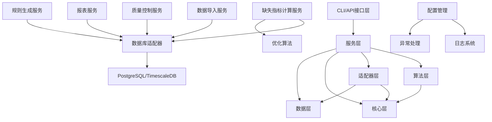

# 项目功能模块架构分析报告

**项目名称**：水泵站监测与优化系统  
**分析日期**：2025-10-22  
**分析版本**：v1.0  
**技术栈**：Python 3.13 + FastAPI + PostgreSQL 16 + TimescaleDB 2.11+

---

## 📊 模块总览

### 统计摘要

| 类别 | 数量 | 说明 |
|------|------|------|
| **核心功能模块** | 10个 | 按业务逻辑分层 |
| **Python包** | 15个 | app目录下的主要包 |
| **数据库表** | 280+个 | 包含维度表、事实表、配置表、分区表 |
| **API端点** | 20+个 | RESTful API接口 |
| **CLI命令** | 23个 | 命令行工具 |
| **配置文件** | 9个 | YAML格式配置 |

### 模块层级结构

```
水泵站监测与优化系统
├── 接口层（Interface Layer）
│   ├── Web API接口（FastAPI）
│   └── CLI命令接口（Typer）
├── 服务层（Service Layer）
│   ├── 数据导入服务
│   ├── 缺失指标计算服务
│   ├── 质量控制服务
│   ├── 报表服务
│   ├── 规则生成服务
│   └── 系统管理服务
├── 算法层（Algorithm Layer）
│   ├── 机器学习算法
│   ├── 深度学习算法
│   ├── 优化算法
│   └── 数据处理算法
├── 适配器层（Adapter Layer）
│   ├── 数据库适配器
│   ├── 文件系统适配器
│   └── 日志适配器
├── 核心层（Core Layer）
│   ├── 配置管理
│   ├── 异常处理
│   ├── 日志系统
│   └── 工具函数
└── 数据层（Data Layer）
    ├── 数据模型（Models）
    ├── 数据模式（Schemas）
    └── 数据库表（PostgreSQL + TimescaleDB）
```

---

## 🏗️ 核心功能模块详细分析

### 模块1：数据导入模块（Data Ingestion Module）

**路径**：`app/services/ingest/`

**核心职责**：
- CSV文件批量导入
- 数据验证和清洗
- 维度表准备和管理
- 数据合并和去重

**主要组件**：

| 组件名称 | 文件路径 | 核心功能 |
|---------|---------|---------|
| prepare_dim | `prepare_dim/__init__.py` | 维度表准备（2阶段执行） |
| create_staging | `create_staging.py` | 创建临时表（staging_raw/staging_rejects） |
| copy_workers | `copy_workers.py` | 并发COPY导入CSV |
| merge_service | `merge_service.py` | 集合式合并（tz→UTC→秒级对齐→去重→UPSERT） |
| run_all | `run_all.py` | 端到端导入流程编排 |
| check_mapping | `check_mapping.py` | 数据映射一致性检查 |
| backpressure | `backpressure.py` | 背压控制 |

**依赖的数据库表**：
- **维度表**：`dim_stations`, `dim_devices`, `dim_metric_config`, `dim_mapping_items`
- **临时表**：`staging_raw`, `staging_rejects`
- **事实表**：`fact_measurements`
- **配置表**：17个备份表（calculation_method_registry等）

**对外提供的CLI命令**：
- `prepare-dim` - 准备维表与映射（两阶段执行）
- `create-staging` - 创建/幂等staging表
- `ingest-copy` - 并发COPY导入CSV
- `merge-fact` - 集合式合并到事实表
- `run-all` - 一键执行完整流程
- `check-mapping` - 只读一致性检查

**配置文件**：
- `configs/data_mapping.v2.json` - 数据映射配置
- `configs/ingest.yaml` - 导入配置
- `configs/merge.yaml` - 合并配置

**关键特性**：
- ✅ 两阶段维度表准备（阶段1：重建维度表，阶段2：生成规则表）
- ✅ 并发COPY导入（高性能）
- ✅ 时区转换和秒级对齐
- ✅ 去重和UPSERT策略
- ✅ 备份和恢复机制（17个配置表）

---

### 模块2：缺失指标计算模块（Missing Metrics Calculation Module）

**路径**：`app/services/calculation/`

**核心职责**：
- 缺失指标识别和计算
- 依赖关系分析和拓扑排序
- 计算方法选择和参数优化
- 物理验证和特性曲线优化
- 循环依赖求解

**主要组件**：

| 组件名称 | 文件路径 | 核心功能 |
|---------|---------|---------|
| CalculationOrchestrator | `orchestrator.py` | 端到端编排（加载→依赖→选择→计算→验证→写入） |
| DependencyAnalyzer | `dependency_analyzer.py` | 依赖分析、拓扑排序、Tarjan循环分组 |
| MethodSelector | `method_selector.py` | 按优先级/条件/依赖选择计算方法 |
| MetricMapper | `metric_mapper.py` | metric_key ↔ metric_id 高效映射 |
| PhysicsValidator | `validator.py` | 范围/物理一致性/特性曲线校验 |
| ParameterOptimizer | `parameter_optimizer.py` | RLS算法参数优化 |
| CurveOptimizer | `curve_optimizer.py` | 特性曲线优化和数据库更新 |
| CyclicSolver | `cyclic_solver.py` | 循环依赖求解器 |
| AdaptiveBatchManager | `adaptive_batch.py` | 自适应批量管理 |
| PerformanceMonitor | `performance_monitor.py` | 性能监控和统计 |
| StatsCollector | `stats_collector.py` | 统计信息收集 |
| Calculators | `calculators/` | 具体计算方法实现 |

**依赖的数据库表**：
- **配置表**：`calculation_method_registry`, `calculation_parameters`, `calculation_validation_config`
- **事实表**：`fact_measurements`
- **物化视图**：`mv_device_running_1s`, `mv_presence_1s`
- **曲线表**：`pump_characteristic_curves`
- **日志表**：`calculation_failures_log`, `calculation_performance_metrics`

**对外提供的CLI命令**：
- `missing-metrics:compute` - 批量计算缺失指标
- `calc` - 缺失指标计算功能命令组

**配置文件**：
- `configs/compute.example.yaml` - 计算配置示例

**关键特性**：
- ✅ 依赖关系自动分析（拓扑排序）
- ✅ 循环依赖求解（Tarjan算法）
- ✅ 多种计算方法（A/B/C/D/E/F/G/H）
- ✅ RLS参数优化（数值稳定性保护）
- ✅ 物理验证（3层配置：范围/物理/曲线）
- ✅ 自适应批处理（基于吞吐/内存动态调整）
- ✅ 性能监控和统计

---

### 模块3：质量控制模块（Quality Control Module）

**路径**：`app/services/quality/`

**核心职责**：
- 数据质量标注
- 质量规则生成和管理
- 设备运行状态判断
- 质量码分布统计

**主要组件**：

| 组件名称 | 文件路径 | 核心功能 |
|---------|---------|---------|
| mark_window | `mark_window.py` | 质量标注（调用sp_mark_quality_window） |
| full_pass | `full_pass.py` | 全量质量标注 |

**依赖的数据库表**：
- **配置表**：`metric_quality_rules`, `metric_quality_rules_shadow`, `quality_code_dict`
- **事实表**：`fact_measurements`
- **日志表**：`quality_profile_log`, `quality_diagnosis_log`

**对外提供的CLI命令**：
- `quality:codes:dist-window` - 按时间窗导出质量码分布
- `quality:codes:dist-recent` - 近24h/7d质量码分布

**关键特性**：
- ✅ 多种质量规则（101/111/121/401/701/702/751等）
- ✅ 质量码字典管理
- ✅ 质量诊断日志
- ✅ 质量分布统计

---

### 模块4：报表服务模块（Reporting Service Module）

**路径**：`app/services/reporting/`

**核心职责**：
- 数据质量报表生成
- 存在性统计
- 质量码分布报表
- 规则差异报表

**主要组件**：

| 组件名称 | 文件路径 | 核心功能 |
|---------|---------|---------|
| data_quality | `data_quality.py` | 数据质量报表 |
| data_report_cli | `data_report_cli.py` | 数据报表CLI |
| presence_writer | `presence_writer.py` | 存在性统计写入 |
| presence_cli | `presence_cli.py` | 存在性统计CLI |
| code_dist | `code_dist.py` | 质量码分布统计 |
| rules_diff_report | `rules_diff_report.py` | 规则差异报表 |

**依赖的数据库表**：
- **统计表**：`metrics_presence_per_second_device`（分区表）
- **事实表**：`fact_measurements`
- **配置表**：`metric_quality_rules`

**对外提供的CLI命令**：
- `data-report` - 生成数据质量报表
- `presence:compute` - 统计存在性

**关键特性**：
- ✅ 数据质量统计（覆盖/越界/拒绝）
- ✅ 存在性统计（按秒×站×设备）
- ✅ 分区表管理（按周分区）
- ✅ 增量+滚动7天更新

---

### 模块5：规则生成模块（Rules Generation Module）

**路径**：`app/services/rules/`

**核心职责**：
- 质量规则自动生成
- 基线规则生成
- 运行阈值规则生成
- 规则版本管理（影子表机制）

**主要组件**：

| 组件名称 | 文件路径 | 核心功能 |
|---------|---------|---------|
| metric_quality_rules | `metric_quality_rules.py` | 质量规则生成（版本A） |
| metric_quality_rules_b | `metric_quality_rules_b.py` | 质量规则生成（版本B） |
| auto_baseline | `auto_baseline.py` | 自动基线规则生成（版本A） |
| auto_baseline_b | `auto_baseline_b.py` | 自动基线规则生成（版本B） |
| running_thresholds | `running_thresholds.py` | 运行阈值规则生成（版本A） |
| running_thresholds_b | `running_thresholds_b.py` | 运行阈值规则生成（版本B） |
| seed_from_data | `seed_from_data.py` | 从数据生成规则种子 |

**依赖的数据库表**：
- **规则表**：`metric_quality_rules`, `metric_rule_auto_baseline`, `device_running_thresholds`
- **影子表**：`metric_quality_rules_shadow`, `metric_rule_auto_baseline_shadow`, `device_running_thresholds_shadow`
- **事实表**：`fact_measurements`

**关键特性**：
- ✅ 影子表机制（A/B版本切换）
- ✅ 从历史数据自动生成规则
- ✅ 规则版本管理
- ✅ 规则差异对比

---

## 📦 接口层模块

### 模块6：Web API接口模块（Web API Module）

**路径**：`app/api/v1/`

**核心职责**：
- 提供RESTful API接口
- 数据查询和聚合
- 设备管理
- 监控接口

**主要组件**：

| 组件名称 | 文件路径 | 核心功能 |
|---------|---------|---------|
| router | `router.py` | API路由汇总 |
| data_timeseries | `endpoints/data_timeseries.py` | 时序数据端点 |
| data_admin | `endpoints/data_admin.py` | 管理与清单端点 |
| monitoring | `endpoints/monitoring.py` | 监控接口 |

**API端点列表**：
- `GET /api/v1/data/measurements` - 查询测量数据
- `GET /api/v1/data/stations` - 查询泵站列表
- `GET /api/v1/data/devices` - 查询设备列表
- `GET /api/v1/monitoring/db-health` - 数据库健康检查

**配置文件**：
- `configs/web.yaml` - Web服务配置

**关键特性**：
- ✅ RESTful API设计
- ✅ 分页和筛选
- ✅ 时序数据聚合
- ✅ CORS支持
- ✅ Swagger文档（/docs）

---

### 模块7：CLI命令模块（CLI Command Module）

**路径**：`app/cli/`

**核心职责**：
- 提供命令行工具
- 流程编排
- 系统管理

**主要组件**：

| 组件名称 | 文件路径 | 核心功能 |
|---------|---------|---------|
| main | `main.py` | CLI主入口（23个命令） |
| calculation | `calculation.py` | 计算相关命令 |

**CLI命令列表**（23个）：

#### 核心流程命令（6个）
1. `version` - 版本检查和存活测试
2. `prepare-dim` - 准备维表与映射（两阶段执行）
3. `create-staging` - 创建/幂等staging表
4. `ingest-copy` - 并发COPY导入CSV
5. `merge-fact` - 集合式合并到事实表
6. `run-all` - 一键执行完整流程（prepare-dim → create-staging → ingest-copy → merge-fact）

#### 数据处理命令（3个）
7. `data-report` - 生成数据质量报表（覆盖/越界/拒绝统计）
8. `check-mapping` - 只读一致性检查与路径建议
9. `presence:compute` - 统计存在性（按秒×站×设备）

#### 质量控制命令（3个）
10. `quality:codes:dist-window` - 按时间窗导出质量码分布
11. `quality:codes:dist-recent` - 近24h/7d质量码分布
12. `quality:full-pass` - 完整质量标注流程（相位→基线→标注）

#### 规则管理命令（3个）
13. `rules:diff:report` - 生成A（正式）与B（影子）的差异报告
14. `baseline:auto:compute` - 自动基线规则生成
15. `device-phase:compute` - 设备相位计算

#### 计算功能命令（4个）
16. `missing-metrics:compute` - 批量计算缺失指标
17. `calc:init-tables` - 初始化计算相关数据库表
18. `calc:init-methods` - 初始化计算方法注册表
19. `calc:init-params` - 初始化计算参数表

#### 管理工具命令（4个）
20. `db-ping` - 数据库连接测试（免密）
21. `admin-clear-db` - 清空数据库（危险，仅限DEV）
22. `refresh-all` - 刷新所有物化视图
23. `calc` - 计算功能命令组（包含多个子命令）

**关键特性**：
- ✅ 基于Typer框架
- ✅ 丰富的帮助信息
- ✅ 参数验证
- ✅ 错误处理

---

## 🔧 适配器层模块

### 模块8：数据库适配器模块（Database Adapter Module）

**路径**：`app/adapters/db/`

**核心职责**：
- 数据库连接池管理
- 事务处理
- SQL执行封装
- 健康监控

**主要组件**：

| 组件名称 | 文件路径 | 核心功能 |
|---------|---------|---------|
| pool | `pool.py` | 连接池管理（psycopg3） |
| gateway | `gateway.py` | 数据库网关（高层API） |
| transaction | `transaction.py` | 事务管理 |
| connection_lease | `connection_lease.py` | 连接租约管理 |
| health_monitor | `health_monitor.py` | 健康监控 |
| pool_telemetry | `pool_telemetry.py` | 连接池遥测 |
| exec_wrapper | `exec_wrapper.py` | SQL执行封装 |
| device_running_sql | `device_running_sql.py` | 设备运行状态SQL |

**配置文件**：
- `configs/database.yaml` - 数据库配置

**关键特性**：
- ✅ 连接池管理（最小/最大连接数）
- ✅ 事务支持（ACID）
- ✅ 连接租约（防止泄漏）
- ✅ 健康检查
- ✅ 性能监控

---

## 🧠 算法层模块

### 模块9：算法模块（Algorithm Module）

**路径**：`app/algorithms/`

**核心职责**：
- 机器学习算法
- 深度学习算法
- 优化算法
- 数据处理算法

**主要组件**：

| 子模块 | 路径 | 核心功能 |
|--------|------|---------|
| machine_learning | `machine_learning/` | 传统ML（sklearn/Optuna） |
| deep_learning | `deep_learning/` | 深度学习（PyTorch/TF） |
| optimization | `optimization/` | 多目标优化/启发式 |
| data_processing | `data_processing/` | 插值/异常/质量评估 |
| pipelines | `pipelines/` | 训练/评估/发布流水线 |
| model_registry | `model_registry/` | 模型版本与元数据 |
| physics_based_calculations | `physics_based_calculations.py` | 基于物理的计算 |

**关键特性**：
- ✅ 模块化设计
- ✅ 模型版本管理
- ✅ 训练流水线
- ✅ 物理约束验证

---

## ⚙️ 核心层模块

### 模块10：核心基础设施模块（Core Infrastructure Module）

**路径**：`app/core/`

**核心职责**：
- 配置管理
- 异常处理
- 日志系统
- 工具函数

**主要组件**：

| 组件名称 | 文件路径 | 核心功能 |
|---------|---------|---------|
| config | `config/` | 配置加载和验证 |
| logging | `logging/` | 日志系统 |
| exceptions | `exceptions.py` | 异常定义 |
| error_handling_manager | `error_handling_manager.py` | 错误处理管理器 |
| circuit_breaker | `circuit_breaker.py` | 熔断器 |
| retry | `retry.py` | 重试机制 |
| time_utils | `time_utils.py` | 时间工具 |
| types | `types.py` | 类型定义 |

**配置文件**（9个）：
1. `configs/database.yaml` - 数据库配置
2. `configs/logging.yaml` - 日志配置
3. `configs/system.yaml` - 系统配置
4. `configs/web.yaml` - Web服务配置
5. `configs/ingest.yaml` - 导入配置
6. `configs/merge.yaml` - 合并配置
7. `configs/error_handling.yaml` - 错误处理配置
8. `configs/device_running.yaml` - 设备运行配置
9. `configs/adaptive_performance.yaml` - 自适应性能配置

**关键特性**：
- ✅ 统一配置管理（YAML）
- ✅ 结构化日志（JSON格式）
- ✅ 异常分类和处理
- ✅ 熔断器和重试机制
- ✅ 时区处理（Asia/Shanghai）

---

## 📄 数据层模块

### 数据模型（Models）

**路径**：`app/models/`

**主要模型**：
- `Station` - 泵站模型
- `Device` - 设备模型
- `OperationData` - 运行数据模型
- `Curve` - 特性曲线模型
- `Optimization` - 优化模型

### 数据模式（Schemas）

**路径**：`app/schemas/`

**主要模式**：
- Pydantic模式（入参/出参契约）
- 数据验证
- 序列化/反序列化

### 数据库表（280+个）

**分类统计**：

| 表类型 | 数量 | 说明 |
|--------|------|------|
| 维度表 | 7个 | dim_stations, dim_devices等 |
| 事实表 | 1个 | fact_measurements（时序数据） |
| 物化视图 | 3个 | mv_device_running_1s等 |
| 临时表 | 2个 | staging_raw, staging_rejects |
| 影子表 | 3个 | 规则版本管理 |
| 分区表 | 200+个 | metrics_presence_per_second_device（按周分区） |
| 配置表 | 20+个 | 计算/质量/规则配置 |
| 日志表 | 10+个 | 性能/质量/失败日志 |
| 其他 | 30+个 | 监控/优化/审计表 |

**核心表说明**：

1. **维度表**：
   - `dim_stations` - 泵站维度
   - `dim_devices` - 设备维度
   - `dim_metric_config` - 指标配置
   - `dim_mapping_items` - 映射项

2. **事实表**：
   - `fact_measurements` - 测量数据（时序数据，TimescaleDB超表）

3. **物化视图**：
   - `mv_device_running_1s` - 设备运行状态（1秒粒度）
   - `mv_presence_1s` - 存在性统计（1秒粒度）
   - `mv_metric_60s_stats` - 指标统计（60秒粒度）

4. **配置表**：
   - `calculation_method_registry` - 计算方法注册表
   - `calculation_parameters` - 计算参数
   - `metric_quality_rules` - 质量规则
   - `pump_characteristic_curves` - 泵特性曲线

---

## 🔗 模块依赖关系

### 依赖关系图（Mermaid）



### 关键依赖说明

1. **接口层 → 服务层**：
   - CLI命令调用服务层函数
   - API端点调用服务层函数

2. **服务层 → 适配器层**：
   - 所有服务通过数据库适配器访问数据库
   - 文件操作通过文件系统适配器

3. **服务层 → 算法层**：
   - 缺失指标计算服务使用优化算法
   - 曲线拟合服务使用机器学习算法

4. **所有层 → 核心层**：
   - 所有模块使用配置管理
   - 所有模块使用日志系统
   - 所有模块使用异常处理

---

## 🛠️ 关键技术栈

### 后端技术

| 技术 | 版本 | 用途 |
|------|------|------|
| Python | 3.13 | 主要编程语言 |
| FastAPI | 最新 | Web框架 |
| Typer | 最新 | CLI框架 |
| Pydantic | v2 | 数据验证 |
| psycopg3 | 最新 | PostgreSQL驱动 |
| NumPy | 最新 | 数值计算 |
| Pandas | 最新 | 数据处理 |

### 数据库技术

| 技术 | 版本 | 用途 |
|------|------|------|
| PostgreSQL | 16 | 关系数据库 |
| TimescaleDB | 2.11+ | 时序数据扩展 |
| 分区表 | - | 数据分区（按周） |
| 物化视图 | - | 性能优化 |
| 存储过程 | - | 业务逻辑 |

### 前端技术

| 技术 | 版本 | 用途 |
|------|------|------|
| HTML/CSS/JS | - | 可视化界面 |
| Swagger UI | - | API文档 |

### 开发工具

| 工具 | 用途 |
|------|------|
| mypy | 类型检查 |
| pytest | 单元测试 |
| black | 代码格式化 |
| flake8 | 代码检查 |

---

## 📈 性能优化特性

1. **数据库层面**：
   - ✅ 连接池管理（最小/最大连接数）
   - ✅ 分区表（按周分区，200+个分区）
   - ✅ 物化视图（预计算聚合）
   - ✅ 索引优化
   - ✅ COPY批量导入

2. **应用层面**：
   - ✅ 自适应批处理（基于吞吐/内存动态调整）
   - ✅ 并发处理（多进程/多线程）
   - ✅ 缓存机制（依赖关系缓存）
   - ✅ 背压控制
   - ✅ 熔断器和重试机制

3. **算法层面**：
   - ✅ 拓扑排序（依赖优化）
   - ✅ 循环依赖求解（Tarjan算法）
   - ✅ RLS参数优化（数值稳定性）
   - ✅ 特性曲线优化

---

## 🔒 质量保证特性

1. **数据质量**：
   - ✅ 多层验证（范围/物理/曲线）
   - ✅ 质量码标注（101/111/121/401/701/702/751等）
   - ✅ 质量规则自动生成
   - ✅ 质量诊断日志

2. **代码质量**：
   - ✅ 类型注解（Pydantic v2）
   - ✅ 单元测试（pytest）
   - ✅ 代码检查（mypy/flake8）
   - ✅ 文档完善

3. **运维质量**：
   - ✅ 结构化日志（JSON格式）
   - ✅ 性能监控
   - ✅ 健康检查
   - ✅ 错误追踪

---

## 📝 总结

### 架构优势

1. **模块化设计**：清晰的分层架构，职责明确
2. **高性能**：多种性能优化手段（连接池/分区/批处理/并发）
3. **高质量**：多层验证机制，完善的质量保证体系
4. **可扩展**：算法层独立，易于扩展新算法
5. **易维护**：完善的日志和监控，便于运维

### 改进建议

1. **测试覆盖**：增加单元测试和集成测试
2. **文档完善**：补充API文档和用户手册
3. **监控增强**：增加更多性能指标和告警
4. **容器化**：支持Docker部署
5. **CI/CD**：建立自动化部署流程

---

**报告结束**

**生成时间**：2025-10-22 13:45  
**分析工具**：codebase-retrieval + view + query_PostgreSQL  
**分析方法**：系统性架构分析

