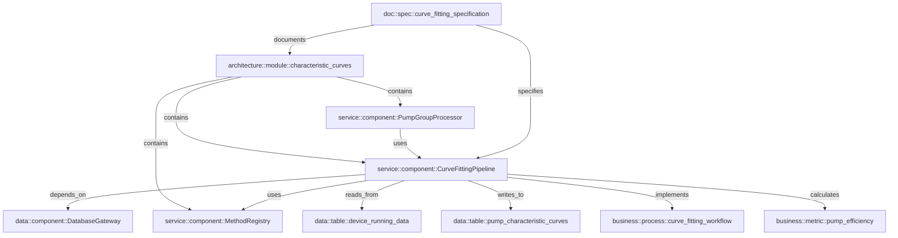

# 特性曲线模块知识图谱

> 自动生成时间: 2025-12-16
> 实体总数: 9
> 关系总数: 12

---

## 📦 实体列表

### 架构层

#### architecture::module::characteristic_curves

```
描述: 泵特性曲线分析模块
职责:
  - Q-H曲线拟合（流量-扬程）
  - Q-P曲线拟合（流量-功率）
  - Q-η曲线拟合（流量-效率）
  - 泵组性能评估
  - 异常检测与预警
关键特性:
  - 支持10+种拟合方法
  - 自动方法选择（基于数据特征）
  - R²>0.95 的高精度拟合
  - 支持单泵和泵组分析
位置: app/services/characteristic_curves/
依赖项:
  - NumPy, SciPy
  - scikit-learn
  - PostgreSQL
设计决策: 采用策略模式实现方法可扩展性
性能: 1000数据点拟合 <100ms
```

### 服务层

#### service::component::CurveFittingPipeline

```
描述: 曲线拟合主流程管理器
职责:
  - 数据预处理和清洗
  - 拟合方法选择
  - 拟合执行和验证
  - 结果质量评估
位置: app/services/characteristic_curves/pipeline/curve_fitting_pipeline.py
关键方法:
  - process(device_id, time_window) - 主处理流程
  - validate_data(raw_data) - 数据验证
  - select_method(data_characteristics) - 方法选择
  - execute_fitting(method, data) - 执行拟合
性能: 单次拟合 <100ms
设计模式: 管道模式 + 策略模式
```

#### service::component::PumpGroupProcessor

```
描述: 泵组处理器
职责:
  - 泵组数据提取
  - 并联/串联工况分析
  - 泵组特性曲线合成
  - 系统曲线修正
位置: app/services/characteristic_curves/pump_group/pump_group_processor.py
关键方法:
  - process_group(group_id, time_window) - 泵组处理
  - synthesize_parallel_curves(curves) - 并联曲线合成
  - synthesize_serial_curves(curves) - 串联曲线合成
特性: 支持复杂泵组配置（最多8台泵）
```

#### service::component::MethodRegistry

```
描述: 拟合方法注册中心
职责:
  - 管理所有拟合方法
  - 方法注册和查找
  - 方法优先级管理
位置: app/services/characteristic_curves/methods/method_registry.py
支持的方法类别:
  - mathematical: 数学方法（多项式、样条、核方法等）
  - physical: 物理方法（泵特性方程等）
  - machine_learning: 机器学习方法（随机森林、梯度提升等）
  - hybrid: 混合方法（物理+多项式等）
```

### 业务层

#### business::metric::pump_efficiency

```
描述: 泵运行效率指标
计算公式: η = (ρ * g * Q * H) / (1000 * P)
单位: 百分比
正常范围: 60% - 85%
关键影响因素:
  - 流量偏离额定值
  - 扬程变化
  - 设备老化
  - 管道阻力
应用场景:
  - 泵性能评估
  - 运行优化建议
  - 异常检测
```

#### business::process::curve_fitting_workflow

```
描述: 曲线拟合业务流程
步骤:
  1. 数据采集: 从时序数据库提取运行数据
  2. 数据清洗: 去除异常点、插值缺失值
  3. 特征提取: 计算数据特征（分布、趋势等）
  4. 方法选择: 基于数据特征自动选择拟合方法
  5. 拟合执行: 运行拟合算法
  6. 结果验证: R²检查、物理约束验证
  7. 结果存储: 保存到数据库
  8. 可视化: 生成曲线图表
质量要求:
  - 最小样本点: 20点
  - 拟合优度: R²>0.9
  - 物理合理性: 必须通过
```

### 数据层

#### data::table::pump_characteristic_curves

```
描述: 泵特性曲线结果存储表
主键: (device_id, curve_type, time_window_start)
索引:
  - btree(device_id, time_window_start)
  - brin(time_window_start)
分区策略: 按月分区
数据保留: 2年
关键字段:
  - device_id (INT) - 设备ID
  - curve_type (TEXT) - 曲线类型（qh/qp/qeta）
  - time_window_start (TIMESTAMP) - 时间窗口起始
  - curve_coefficients (JSONB) - 曲线系数
  - r_squared (FLOAT) - 拟合优度
  - method_used (TEXT) - 使用的拟合方法
  - quality_grade (TEXT) - 质量等级（A/B/C/D）
备份: 定期备份到 backups/pump_characteristic_curves/
```

#### data::table::device_running_data

```
描述: 设备运行数据表（时序数据）
主键: (device_id, time)
索引: brin(time)
分区策略: 按天分区
关键字段:
  - device_id (INT) - 设备ID
  - time (TIMESTAMP) - 采集时间
  - flow_rate (FLOAT) - 流量 (m³/h)
  - head (FLOAT) - 扬程 (m)
  - power (FLOAT) - 功率 (kW)
  - efficiency (FLOAT) - 效率 (%)
  - frequency (FLOAT) - 频率 (Hz)
  - inlet_pressure (FLOAT) - 进口压力 (MPa)
  - outlet_pressure (FLOAT) - 出口压力 (MPa)
数据来源: 现场传感器（秒级采集）
```

### 文档层

#### doc::spec::curve_fitting_specification

```
描述: 曲线拟合技术规范
位置: docs/特性曲线开发/
关键要求:
  - 最小样本点: 20点
  - 拟合优度: R²>0.9
  - 异常点过滤: 3σ原则
  - 物理约束: 必须满足泵特性规律
方法选择策略:
  1. 数据量<50点: 使用多项式方法
  2. 数据量50-200点: 使用样条方法
  3. 数据量>200点: 优先使用机器学习方法
质量分级:
  - A级: R²>0.98
  - B级: R²>0.95
  - C级: R²>0.90
  - D级: R²<0.90（需人工审核）
```

---

## 🔗 关系图



