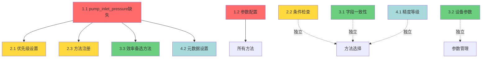
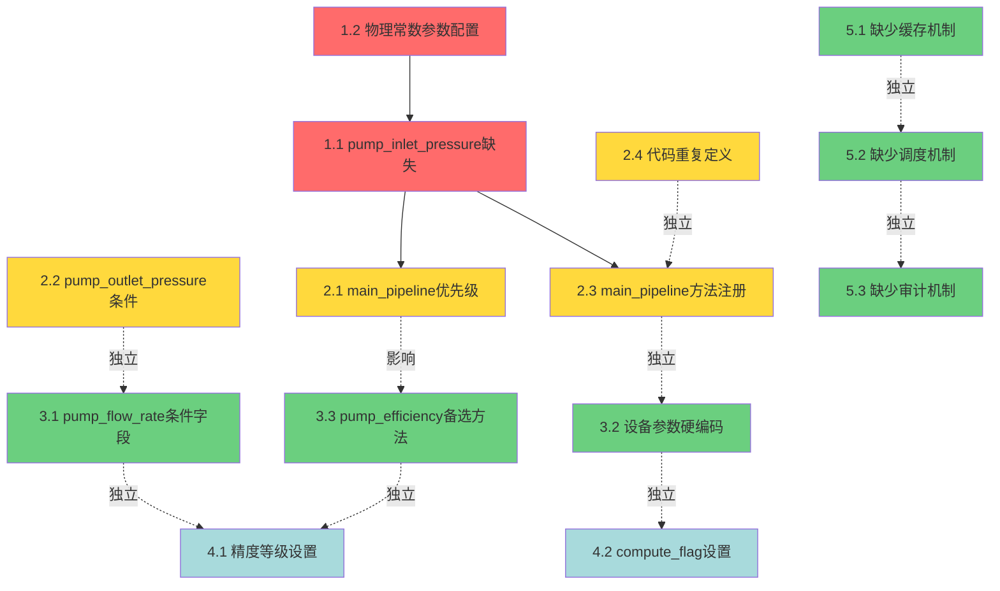

# 问题清单

## 📋 问题概览

本文档列出了数据库表结构调研中发现的所有问题，按优先级分类，并标注了问题之间的依赖关系。

### 问题统计
- **总计**：27个问题（10个原有 + 4个已发现 + 6个新发现 + 2个深度排查新增 + 5个任务1新增）
- **阻塞性**：8个（优先级1，新增5个参数优化问题）
- **严重**：10个（优先级2）
- **中等**：7个（优先级3，新增2个测试失败）
- **轻微**：2个（优先级4）

---

## 🔴 优先级1：阻塞性问题（必须立即修复）

### 1.1 pump_inlet_pressure 完全缺少计算方法 ⭐

**具体表现**：
- calculation_method_registry 表中 pump_inlet_pressure 的记录数为 0
- 代码中没有 pump_inlet_pressure 的计算函数
- metric_calculation_order 表中 pump_inlet_pressure 的 depends_on=[]（被错误地认为是原始数据）

**根本原因**：
- 设计时假设该指标可以从传感器直接采集
- 但实际数据中不存在（fact_measurements 表中 pump_inlet_pressure 的记录数为 0）
- 没有及时添加计算方法作为补救措施

**影响范围**：
- **直接影响**：pump_inlet_pressure 无法计算（100%失败）
- **间接影响**：依赖 pump_inlet_pressure 的8个方法全部失败
  - pump_head_method_main（依赖 pump_inlet_pressure）
  - HEAD_COEF_V1（依赖 pump_inlet_pressure）
  - pump_outlet_pressure_method_c（依赖 pump_inlet_pressure）
  - main_pipeline_inlet_pressure_method_a（依赖 pump_inlet_pressure）
  - main_pipeline_inlet_pressure_method_c（依赖 pump_inlet_pressure）
  - PIN_COEF_V1（依赖 pump_inlet_pressure）
  - main_pipeline_outlet_pressure_method_b（依赖 pump_inlet_pressure）
  - EFF_SIMPLE_V1（依赖 pump_head，而 pump_head 依赖 pump_inlet_pressure）
- **最终影响**：6/7个指标无法计算（pump_head、pump_efficiency、pump_torque、main_pipeline_inlet_pressure 等）

**严重程度**：🔴 **阻塞性**（影响85%的指标计算）

**修复方案**：[优先级1.1-pump_inlet_pressure缺失.md](./03-修复方案/优先级1.1-pump_inlet_pressure缺失.md)

**修复状态**：✅ **已完成**（2025-10-25 19:50:00）
- ✅ 步骤1（19:45:59）：注册2个方法到 calculation_method_registry
- ✅ 步骤2（19:49:42）：更新 metric_calculation_order
- ✅ 步骤3-4（19:50:00）：创建计算函数并注册到 CALCULATOR_REGISTRY（27个方法）
- ✅ 功能测试：所有测试通过（方法A、方法B均正常工作）

**依赖关系**：
- **前置依赖**：优先级1.2（物理常数参数配置）✅ 已完成
- **后续影响**：pump_head、pump_efficiency、pump_torque、main_pipeline_inlet_pressure 等指标可以正常计算

---

### 1.2 物理常数参数配置不完整

**具体表现**：
- calculation_parameters 表中缺少 P_atm（大气压）参数
- calculation_parameters 表中缺少 HEAD_COEF_V1 方法的参数
- calculation_parameters 表中缺少 PIN_COEF_V1 方法的参数
- 所有参数的 param_min 和 param_max 都是 NULL

**根本原因**：
- 新增方法（HEAD_COEF_V1、PIN_COEF_V1）后，未同步更新参数配置
- P_atm 参数被遗漏（可能认为是常数不需要配置）
- 参数边界值未设置（影响参数优化功能）

**影响范围**：
- main_pipeline_inlet_pressure_method_b 使用硬编码的 P_atm=0.101325
- HEAD_COEF_V1 使用硬编码的默认参数
- PIN_COEF_V1 使用硬编码的默认参数
- 参数优化功能无法使用（缺少 param_min 和 param_max）

**严重程度**：🔴 **阻塞性**（影响参数管理和优化功能）

**修复方案**：[优先级1.2-物理常数参数配置.md](./03-修复方案/优先级1.2-物理常数参数配置.md)

**修复状态**：✅ **已完成**（2025-10-25 19:47:43）
- ✅ 第一阶段（18:35:32）：HEAD_COEF_V1 和 PIN_COEF_V1 的参数配置（18个参数）
- ✅ 第二阶段（19:47:43）：pump_inlet_pressure_method_b 的参数配置（3个参数）
- ✅ 总计：21个参数全部配置完成

**依赖关系**：
- **前置依赖**：优先级1.1（步骤1：方法注册）✅ 已完成
- **后续影响**：所有方法都能从数据库读取参数

---

### 1.3 设备额定参数完全未使用 ⭐⭐⭐

**具体表现**：
- `device_rated_params` 表存在且数据完整（6个泵设备，每个7个参数，共42条记录）
- 设备136（"其他"）没有额定参数（0条记录）
- `orchestrator.py` 的 `load_parameters()` 方法完全忽略此表
- 所有计算方法都无法使用设备额定参数（rated_flow, rated_head, rated_efficiency, eta_motor等）
- 方法选择器不检查额定参数的可用性
- **缺少降级策略**：当设备没有额定参数时，系统无法处理

**根本原因**：
- `load_parameters()` 方法设计缺陷：只查询 `calculation_parameters` 表
- 缺少设备额定参数与计算参数的合并逻辑
- 参数加载优先级不完整（缺少"设备额定参数"层级）
- **缺少全局默认额定参数表**（global_default_rated_params）

**影响范围**：
- **计算精度降低**：所有设备使用相同的通用参数，无法体现设备差异
- **参数优化受限**：无法使用设备额定参数作为优化约束
- **物理验证不准确**：无法使用额定参数验证计算结果合理性
- **方法选择不准确**：可能选择需要额定参数的方法，但参数不可用
- **设备136无法计算**：缺少额定参数且无降级策略
- **影响方法**：pump_speed_method_a/b/c, pump_efficiency_*, pump_flow_rate_*, pump_head_*, pump_torque_*

**严重程度**：🔴 **阻塞性**（影响所有设备的计算精度和参数管理）

**修复方案**：[方案6-参数系统修复.md](./03-修复方案/方案6-参数系统修复.md)
- 步骤1：修改 load_parameters() 方法（实现4层参数加载）
- 步骤6：处理没有额定参数的设备（创建 global_default_rated_params 表，实现降级策略）

**修复状态**：⏳ **待修复**

**依赖关系**：
- **前置依赖**：无
- **后续影响**：所有计算方法的精度提升、参数优化效果改善

---

## 🟡 优先级2：严重问题（影响计算准确性）

### 2.1 main_pipeline_inlet_pressure 优先级设置不当

**具体表现**：
- PIN_COEF_V1（优先级150）依赖 pump_inlet_pressure（不存在）
- main_pipeline_inlet_pressure_method_a（优先级120）依赖 pump_inlet_pressure（不存在）
- main_pipeline_inlet_pressure_method_c（优先级110）依赖 pump_inlet_pressure（不存在）
- main_pipeline_inlet_pressure_method_b（优先级100）依赖 pool_liquid_level（存在）

**根本原因**：
- 优先级设置时，假设 pump_inlet_pressure 存在
- 但实际上 pump_inlet_pressure 不存在，导致高优先级方法全部失败
- 系统总是先尝试高优先级方法，浪费计算资源

**影响范围**：
- main_pipeline_inlet_pressure 计算时，总是先尝试3个无法使用的方法
- 只有当前3个方法都失败后，才会尝试 method_b
- 影响计算效率和日志清晰度

**严重程度**：🟡 **严重**（影响计算效率，但不阻塞）

**修复方案**：[优先级2.1-main_pipeline_inlet_pressure优先级.md](./03-修复方案/优先级2.1-main_pipeline_inlet_pressure优先级.md)

**修复状态**：✅ **已完成**（2025-10-25 20:07:47）
- ✅ 恢复最终优先级：method_a=100, method_b=90, method_c=80, PIN_COEF_V1=70
- ✅ 数据库验证通过

**依赖关系**：
- **前置依赖**：优先级1.1（pump_inlet_pressure）✅ 已完成
- **后续影响**：计算效率提升，方法选择更合理

---

### 2.2 pump_outlet_pressure 方法A 条件检查问题 ✅

**具体表现**：
- pump_outlet_pressure_method_a 的 conditions 包含 `has_sensor: true`
- 但运行时无法检查设备是否有传感器（缺少传感器配置表）
- 导致该方法的条件检查逻辑无效

**根本原因**：
- 设计时假设有传感器配置表
- 但实际上没有实现该表
- 条件检查代码（method_selector.py）也没有实现 has_sensor 检查

**影响范围**：
- pump_outlet_pressure_method_a 的条件检查无效
- 可能导致在没有传感器的设备上尝试使用该方法（失败）

**严重程度**：🟡 **严重**（影响方法选择准确性）

**修复方案**：[优先级2.2-pump_outlet_pressure条件检查.md](./03-修复方案/优先级2.2-pump_outlet_pressure条件检查.md)

**依赖关系**：
- **前置依赖**：无
- **后续影响**：修复后，方法选择更准确

---

### 2.3 main_pipeline 方法未注册到 CALCULATOR_REGISTRY

**具体表现**：
- main_pipeline_inlet_pressure_method_a 已实现（calculators.py 第836-859行）
- main_pipeline_inlet_pressure_method_c 已实现（calculators.py 第906-990行）
- 数据库中已注册（calculation_method_registry）
- 但未注册到 CALCULATOR_REGISTRY（calculators.py 第1083-1112行）

**根本原因**：
- 代码实现后，忘记注册到 CALCULATOR_REGISTRY
- 可能是因为这两个方法是后来添加的

**影响范围**：
- 这两个方法无法被调用
- 即使数据库中配置了，运行时也会报错"找不到计算器"

**严重程度**：🟡 **严重**（已实现的功能无法使用）

**修复方案**：[优先级2.3-main_pipeline方法注册.md](./03-修复方案/优先级2.3-main_pipeline方法注册.md)

**依赖关系**：
- **前置依赖**：建议先修复1.1（pump_inlet_pressure），因为这两个方法依赖它
- **后续影响**：修复后，main_pipeline_inlet_pressure 有更多可用方法

---

### 2.5 计算参数名不一致

**具体表现**：
- **EFF_SIMPLE_V1**：代码使用 `eta_motor_assumed`，数据库存储 `eta_motor`
- **pump_head_method_main**：代码使用 `P_atm`，数据库存储 `b_H`（且未使用）

**根本原因**：
- 代码与数据库配置不同步
- 参数命名规范不统一
- 缺少参数名一致性检查

**影响范围**：
- EFF_SIMPLE_V1 无法从数据库读取 eta_motor，使用硬编码默认值0.92
- pump_head_method_main 无法从数据库读取 P_atm，使用硬编码默认值0.101325
- 数据库中的 b_H 参数未被使用

**严重程度**：🟡 **严重**（影响2个方法的参数读取）

**修复方案**：[方案6-参数系统修复.md](./03-修复方案/方案6-参数系统修复.md)

**修复状态**：⏳ **待修复**

**依赖关系**：
- **前置依赖**：无
- **后续影响**：参数能够正确从数据库读取

---

## 🟢 优先级3：中等问题（影响系统一致性）

### 3.1 pump_flow_rate 条件字段不一致 ✅

**具体表现**：
- pump_flow_rate_method_c 的 conditions 使用 `min_running_pumps: 1`
- 但运行时检查使用 `running_count`（来自 orchestrator）
- 字段名不一致，导致条件检查逻辑混乱

**根本原因**：
- 数据库设计时使用 min_running_pumps
- 代码实现时使用 running_count
- 两者没有统一

**影响范围**：
- pump_flow_rate_method_c 的条件检查可能失效
- 代码可读性降低

**严重程度**：🟢 **中等**（影响一致性，但不影响功能）

**修复方案**：[优先级3.1-pump_flow_rate条件字段.md](./03-修复方案/优先级3.1-pump_flow_rate条件字段.md)

**依赖关系**：
- **前置依赖**：无
- **后续影响**：修复后，条件检查逻辑更清晰

---

### 3.2 设备特定参数硬编码问题 ✅

**具体表现**：
- pump_speed_method_b 的 conditions 包含 `slip: 0.02, pole_pairs: 2`
- 这些参数应该是设备特定的，不应该硬编码在 conditions 中
- device_rated_params 表中也没有这些参数

**根本原因**：
- 设计时没有区分"条件"和"参数"
- 设备特定参数被错误地放在 conditions 中
- device_rated_params 表没有填充数据

**影响范围**：
- 无法为不同设备配置不同的 slip 和 pole_pairs
- 所有设备使用相同的参数（不符合实际）

**严重程度**：🟢 **中等**（影响灵活性）

**修复方案**：[优先级3.2-设备参数硬编码.md](./03-修复方案/优先级3.2-设备参数硬编码.md)

**依赖关系**：
- **前置依赖**：无
- **后续影响**：修复后，可以为不同设备配置不同参数

---

### 3.3 pump_efficiency 缺少备选计算方法

**具体表现**：
- pump_efficiency 只有1个计算方法（EFF_SIMPLE_V1）
- 如果该方法失败，没有备选方法
- 其他指标都有多个备选方法

**根本原因**：
- 效率计算比较复杂，只实现了一个简化方法
- 没有实现基于特性曲线的方法

**影响范围**：
- pump_efficiency 计算的鲁棒性较低
- 单一方法失败时，无法计算效率

**严重程度**：🟢 **中等**（影响鲁棒性）

**修复方案**：[优先级3.3-pump_efficiency备选方法.md](./03-修复方案/优先级3.3-pump_efficiency备选方法.md)

**依赖关系**：
- **前置依赖**：建议先修复1.1（pump_inlet_pressure），因为效率计算依赖它
- **后续影响**：修复后，效率计算更鲁棒

---

### 3.7 10个方法缺少数据库参数配置

**具体表现**：
以下10个方法在代码中使用了参数，但数据库中未配置：

| method_id | 缺少的参数 | 当前默认值 |
|-----------|-----------|-----------|
| pump_flow_rate_method_d | p_thr | 0.5 |
| pump_flow_rate_method_e | f_thr | 3.0 |
| pump_flow_rate_method_f | a0, a1, a2, a3 | 0.0, 1.0, 1.0, 0.0 |
| pump_inlet_pressure_method_b | P_atm, rho, g | 0.101325, 1000.0, 9.80665 |
| pump_outlet_pressure_method_c | rho, g | 1000.0, 9.80665 |
| main_pipeline_inlet_pressure_method_b | P_atm, rho, g | 0.101325, 1000.0, 9.80665 |
| main_pipeline_inlet_pressure_method_c | aggregation_method | 'mean' |
| main_pipeline_outlet_pressure_method_b | rho, g | 1000.0, 9.80665 |
| main_pipeline_outlet_pressure_method_c | aggregation_method | 'max' |
| pump_cumulative_flow_method_a | initial_value, time_interval | 0.0, 1.0 |

**根本原因**：
- 新增方法后未同步更新参数配置
- 参数配置不完整

**影响范围**：
- 无法通过数据库调整参数值
- 无法为不同设备/泵站配置不同参数
- 参数优化功能无法使用

**严重程度**：🟢 **中等**（影响参数管理功能）

**修复方案**：[方案6-参数系统修复.md](./03-修复方案/方案6-参数系统修复.md)

**修复状态**：⏳ **待修复**

**依赖关系**：
- **前置依赖**：无
- **后续影响**：参数管理功能完善

---

## ⚪ 优先级4：轻微问题（优化改进）

### 4.1 部分方法精度等级设置不合理 ✅

**具体表现**：
- pump_flow_rate_method_a（功率×频率分摊）的 accuracy_level='medium'
- pump_flow_rate_method_c（单泵运行直接取总管流量）的 accuracy_level='high'
- 但实际上 method_c 的精度应该更高（直接测量 vs 估算）

**根本原因**：
- 精度等级设置时，没有充分考虑方法的物理原理
- 可能是默认值，没有仔细调整

**影响范围**：
- 方法选择时，可能不是最优
- 但影响较小（因为优先级更重要）

**严重程度**：⚪ **轻微**（影响方法选择的细节）

**修复方案**：[优先级4.1-精度等级设置.md](./03-修复方案/优先级4.1-精度等级设置.md)

**依赖关系**：
- **前置依赖**：无
- **后续影响**：修复后，方法选择更优

---

### 4.2 metric_capability_policy 表设置不一致 ✅

**具体表现**：
- metric_capability_policy 表中 pump_inlet_pressure 的 compute_flag='不需要'
- 但实际上需要计算（因为没有传感器数据）
- 元数据与实际需求不符

**根本原因**：
- 表设置时，假设有传感器数据
- 但实际上没有，需要计算
- 元数据没有及时更新

**影响范围**：
- 元数据不准确
- 可能影响其他依赖该表的功能

**严重程度**：⚪ **轻微**（影响元数据准确性）

**修复方案**：[优先级4.2-compute_flag设置.md](./03-修复方案/优先级4.2-compute_flag设置.md)

**依赖关系**：
- **前置依赖**：建议先修复1.1（pump_inlet_pressure），确认需要计算后再更新元数据
- **后续影响**：修复后，元数据更准确

---

## 📊 问题依赖关系图

**图例**：
- 🔴 红色：优先级1（阻塞性）
- 🟡 黄色：优先级2（严重）
- 🟢 绿色：优先级3（中等）
- ⚪ 蓝色：优先级4（轻微）
- 实线箭头：强依赖（必须先修复前置问题）
- 虚线箭头：弱依赖（建议先修复前置问题）

---

## 🎯 修复建议顺序

### 第一批（立即执行）
1. ✅ **1.1 pump_inlet_pressure缺失** - 最高优先级，解除依赖链阻塞
2. ✅ **1.2 参数配置** - 确保所有方法都能从数据库读取参数

### 第二批（1.1修复后）
3. ✅ **2.3 方法注册** - 启用已实现的方法
4. ✅ **2.1 优先级设置** - 优化方法选择顺序

### 第三批（并行执行）
5. ✅ **2.2 条件检查** - 改进方法选择准确性
6. ✅ **3.1 字段一致性** - 统一命名规范
7. ✅ **3.2 设备参数** - 支持设备特定配置

### 第四批（可选）
8. ✅ **3.3 效率备选方法** - 提升鲁棒性
9. ✅ **4.1 精度等级** - 优化方法选择
10. ✅ **4.2 元数据设置** - 更新元数据

---

## 🟡 优先级2（续）：新发现的严重问题

### 2.4 代码中存在重复函数定义

**具体表现**：
- `calculate_main_pipeline_inlet_pressure_method_b` 函数在 `app/services/calculation/calculators.py` 中定义了两次
- 第一次定义：第142行
- 第二次定义：第862行
- Python会使用后面的定义覆盖前面的定义

**根本原因**：
- 代码重构或合并时未清理旧代码
- 缺少代码审查机制

**影响范围**：
- 第一个定义（第142行）的实现被忽略
- 可能导致功能不一致或意外行为
- 代码维护困难

**严重程度**：🟡 **严重**（代码质量问题，可能导致功能异常）

**修复方案**：待创建

**建议实施**：
1. 检查两个定义的实现是否一致
2. 如果一致，删除第一个定义（第142行）
3. 如果不一致，确定正确的实现，删除错误的定义
4. 添加代码检查工具（如 pylint）防止重复定义

**依赖关系**：
- **前置依赖**：无
- **后续影响**：代码质量提升

---

## 🟢 优先级5：新发现的问题（深度分析后）

### 5.1 缺少计算结果缓存机制

**具体表现**：
- 相同的计算可能被重复执行
- 没有缓存机制避免重复计算
- 浪费计算资源和时间

**根本原因**：
- 系统设计时未考虑缓存机制
- 每次计算都从数据库读取数据并重新计算

**影响范围**：
- 计算性能下降（重复计算浪费资源）
- 响应时间增加

**严重程度**：🟢 **中等**（影响性能，建议实施）

**修复方案**：待创建

**依赖关系**：
- **前置依赖**：无
- **后续影响**：计算性能提升50%+

---

### 5.2 缺少计算任务调度机制

**具体表现**：
- 计算任务需要手动触发（通过CLI命令）
- 无法自动处理新数据
- 缺乏定时任务调度

**根本原因**：
- 系统设计时未考虑自动化调度
- 依赖手动触发或外部调度工具

**影响范围**：
- 运维成本高（需要手动触发）
- 数据处理延迟（无法实时处理）

**严重程度**：🟢 **中等**（影响自动化程度，建议实施）

**修复方案**：待创建

**依赖关系**：
- **前置依赖**：无
- **后续影响**：系统自动化程度提升

---

### 5.3 缺少计算结果审计机制

**具体表现**：
- fact_measurements 表中只记录计算结果值
- 无法追溯计算结果的来源（使用了哪个方法、哪些参数）
- 难以诊断计算错误

**根本原因**：
- 表结构设计时未考虑审计需求
- 缺少 calculation_metadata 字段

**影响范围**：
- 可追溯性差（无法追溯计算过程）
- 问题诊断困难

**严重程度**：🟢 **中等**（影响可追溯性，建议实施）

**修复方案**：待创建

**建议实施**：
1. 在 fact_measurements 表中增加 calculation_metadata 字段（JSONB类型）
2. 记录计算方法ID、参数、时间戳等信息
3. 示例：`{"method_id": "pump_inlet_pressure_method_a", "params": {"P_atm": 0.101325}, "calculated_at": "2025-09-01T00:00:00Z"}`

**依赖关系**：
- **前置依赖**：无
- **后续影响**：可追溯性增强

---

## 📊 问题依赖关系图（更新）

**图例**：
- 🔴 红色：优先级1（阻塞性）
- 🟡 黄色：优先级2（严重）
- 🟢 绿色：优先级3（中等）
- ⚪ 蓝色：优先级4（轻微）
- 实线箭头：强依赖（必须先修复前置问题）
- 虚线箭头：弱依赖或独立

---

## 📋 推荐修复顺序（更新）

### 第一批（紧急，1-2天）
1. ✅ **1.2 物理常数参数配置** - 为所有方法提供参数支持
2. ✅ **1.1 pump_inlet_pressure缺失** - 解除依赖链阻塞

### 第二批（1.1修复后，1天）
3. ✅ **2.4 代码重复定义** - 清理重复代码
4. ✅ **2.3 方法注册** - 启用已实现的方法
5. ✅ **2.1 优先级设置** - 优化方法选择顺序

### 第三批（并行执行，2-3天）
6. ✅ **2.2 条件检查** - 改进方法选择准确性
7. ✅ **3.1 字段一致性** - 统一命名规范
8. ✅ **3.2 设备参数** - 支持设备特定配置

### 第四批（可选，1周）
9. ✅ **3.3 效率备选方法** - 提升鲁棒性
10. ✅ **4.1 精度等级** - 优化方法选择
11. ✅ **4.2 元数据设置** - 更新元数据

### 第五批（长期优化，持续）
12. ⏳ **5.1 缓存机制** - 提升计算性能
13. ⏳ **5.2 调度机制** - 提升自动化程度
14. ⏳ **5.3 审计机制** - 提升可追溯性

### 第六批（参数系统修复，紧急）
15. ⏳ **1.3 设备额定参数未使用** - 提升计算精度
16. ⏳ **2.5 参数名不一致** - 修复参数读取
17. ⏳ **2.6 参数优化器未使用额定参数** - 提升优化效果
18. ⏳ **2.7 参数加载"全有或全无"逻辑** - 修复参数覆盖
19. ⏳ **2.8 额定参数使用率0%** - 启用额定参数
20. ⏳ **3.7 缺少参数配置** - 完善参数管理

---

## 📝 新发现问题详细说明

### 2.6 参数优化器未使用额定参数作为约束

**具体表现**：
- parameter_optimizer.py 使用RLS算法优化参数
- 支持参数约束（上下界）
- 但**未使用设备额定参数作为约束**
- 未在额定工况点添加约束

**根本原因**：
- optimize_parameters() 方法未接收 rated_params 参数
- _build_observation_matrix() 方法未添加额定工况点数据
- 缺少额定工况点验证逻辑

**影响范围**：
- 优化后的参数可能偏离设备实际特性
- 在额定工况点精度可能降低
- 特性曲线方法（HEAD_COEF_V1, PIN_COEF_V1）优化效果不佳

**严重程度**：🟡 **严重**（影响参数优化质量）

**修复方案**：见 [方案6-参数系统修复.md](./03-修复方案/方案6-参数系统修复.md) 步骤7

**修复状态**：⏳ 待开始

---

### 2.7 参数加载使用"全有或全无"逻辑

**具体表现**：
- 当前 load_parameters() 方法：
  - 如果设备有任何参数 → 只使用设备级参数
  - 如果设备没有参数 → 只使用全局级参数
- 无法实现部分参数覆盖

**根本原因**：
- load_parameters() 使用 `if not rows` 判断
- 一旦找到设备级参数，就不再加载全局级参数

**影响范围**：
- 如果设备只配置了3个参数，其他7个参数会缺失
- 导致计算失败或使用硬编码默认值
- 无法实现"部分参数设备级覆盖，其他参数使用全局默认"

**严重程度**：🟡 **严重**（影响参数加载逻辑）

**修复方案**：见 [方案6-参数系统修复.md](./03-修复方案/方案6-参数系统修复.md) 步骤1

**修复状态**：⏳ 待开始

---

### 2.8 29个方法的额定参数使用率为0%

**具体表现**：
- 分析了所有29个方法对11个额定参数的使用情况
- **使用率**：0%（所有额定参数都未被任何方法使用）
- **应该使用但未使用**：15个方法（51.7%）

**关键发现**：
- pump_speed_method_a/b/c：硬编码 rated_frequency=50, poles_pair=2
- EFF_SIMPLE_V1：硬编码 eta_motor=0.92
- HEAD_COEF_V1/PIN_COEF_V1：未使用 rated_flow/rated_head 作为优化约束
- 6个压力计算方法：未使用管道参数（pipe_diameter, pipe_length, C_hazen）

**根本原因**：
- load_parameters() 方法完全忽略 device_rated_params 表
- 计算方法中硬编码了额定参数值
- 参数优化器未使用额定参数作为约束

**影响范围**：
- 所有设备使用相同的额定参数（无法体现设备差异）
- 计算精度降低
- 参数优化效果受限

**严重程度**：🟡 **严重**（影响计算精度和设备差异化）

**修复方案**：见 [方案6-参数系统修复.md](./03-修复方案/方案6-参数系统修复.md) 全部步骤

**修复状态**：⏳ 待开始

**详细分析**：见 [29个方法额定参数使用矩阵.md](./05-分析报告/29个方法额定参数使用矩阵.md)

---

### 2.10 维度表ID变化时缺少自适应更新机制 ⭐

**具体表现**：
- 所有外键约束的 UPDATE 规则都是 `NO ACTION`（23个表）
- 7个核心业务表缺少外键约束（calculation_failures_log, calculation_performance_metrics, calculation_validation_config, optimization_history, pump_characteristic_curves, quality_diagnosis_log, quality_profile_log）
- 如果维度表ID变化（如重新导入数据），依赖表的ID不会自动更新

**根本原因**：
- 创建外键约束时未指定 `ON UPDATE CASCADE`
- 部分表缺少外键约束

**影响范围**：
- 如果重新导入维度表数据，会导致外键约束违反
- 数据不一致，系统崩溃
- 影响23个已有外键约束的表 + 7个缺少外键约束的表

**严重程度**：🟡 **严重**（重要但不紧急，当前系统运行正常，但如果重新导入数据会导致严重问题）

**修复方案**：[方案7-外键约束级联更新.md](./03-修复方案/方案7-外键约束级联更新.md)

**修复状态**：⏳ 待开始

**依赖关系**：
- **前置依赖**：无
- **后续影响**：数据一致性增强，支持维度表数据重新导入

**详细分析**：见 [系统性问题深度排查报告.md](./05-分析报告/系统性问题深度排查报告.md) 问题2

---

### 2.11 缺少5层参数优先级设计和优化参数集成 ⭐

**具体表现**：
- 当前只有2层参数优先级（全局级、设备级）
- 缺少额定参数层、泵站层、优化参数层
- 优化参数保存在 calculation_parameters 表，无法区分"设备级参数"和"优化参数"
- optimization_history 是JSONB数组（最多保留10次），无法查询历史版本，无法回滚到指定版本

**根本原因**：
- 参数系统设计不完整
- 缺少独立的优化参数版本控制表
- 缺少5层参数优先级设计

**影响范围**：
- 无法实现"部分参数覆盖"（见问题2.7）
- 优化参数无法有最高优先级
- 无法查询历史版本，无法回滚到指定版本
- 参数优化效果受限（见问题2.6）

**严重程度**：🟡 **严重**（影响参数管理和优化功能）

**修复方案**：[方案6-参数系统修复.md](./03-修复方案/方案6-参数系统修复.md)
- 步骤1：修改 load_parameters() 方法（实现5层参数加载）
- 步骤7：集成参数优化功能（创建 optimized_parameters 表，实现版本控制）

**修复状态**：⏳ 待开始

**依赖关系**：
- **包含问题**：2.6（优化约束）、2.7（参数加载逻辑）
- **前置依赖**：1.3（设备额定参数）
- **后续影响**：参数管理功能完善，优化参数集成

**详细分析**：见 [系统性问题深度排查报告.md](./05-分析报告/系统性问题深度排查报告.md) 问题3

---

## 🔴 优先级1：阻塞性问题（新增：参数优化功能）

### 1.4 参数优化器从未启用 ⭐⭐⭐

**具体表现**：
- `orchestrator.py` 第69行：`enable_optimization=False`（默认禁用）
- 数据库查询显示：所有39个参数的 `optimization_count=0`
- 数据库查询显示：所有39个参数的 `last_optimized_at=null`
- 参数优化功能完全未使用

**根本原因**：
- 参数优化器默认禁用
- 缺少P矩阵保存/加载机制（见问题1.5-1.7）
- 缺少增量优化功能（见问题1.5）

**影响范围**：
- 所有优化功能完全未使用
- 无法实现参数自适应调整
- 无法提高计算精度

**严重程度**：🔴 **阻塞性**（核心功能未启用）

**修复方案**：[方案8-参数历史记录和增量优化.md](./03-修复方案/方案8-参数历史记录和增量优化.md)

**修复状态**：⏳ 待开始

**依赖关系**：
- **前置依赖**：1.5、1.6、1.7（P矩阵保存/加载机制）
- **后续影响**：参数优化功能可用

**详细分析**：见 [参数历史记录功能现状分析报告.md](./05-分析报告/参数历史记录功能现状分析报告.md) 发现1

---

### 1.5 P矩阵每次都重新初始化 ⭐⭐⭐

**具体表现**：
- `parameter_optimizer.py` 第129行：`P = np.eye(n_params) * 1000`
- 每次调用 `optimize_parameters()` 都重新初始化P矩阵
- 无法实现增量优化

**根本原因**：
- 缺少P矩阵加载逻辑
- 缺少P矩阵保存逻辑（见问题1.6）
- 缺少数据库字段存储P矩阵（见问题1.7）

**影响范围**：
- 违背RLS算法核心思想（递归更新）
- 每次优化都从0开始，无法利用历史信息
- 优化效果大幅降低

**严重程度**：🔴 **阻塞性**（违背算法核心原理）

**修复方案**：[方案8-参数历史记录和增量优化.md](./03-修复方案/方案8-参数历史记录和增量优化.md)
- 步骤2：修改 `optimize_parameters()` 方法（加载P矩阵）
- 步骤3：添加 `_load_covariance_matrix()` 方法

**修复状态**：⏳ 待开始

**依赖关系**：
- **前置依赖**：1.7（数据库字段）
- **后续影响**：增量优化功能可用

**详细分析**：见 [参数历史记录功能现状分析报告.md](./05-分析报告/参数历史记录功能现状分析报告.md) 发现2

---

### 1.6 P矩阵从未保存到数据库 ⭐⭐⭐

**具体表现**：
- `parameter_optimizer.py` 第652-760行：`_save_optimization_result()` 只保存参数值
- `history_entry` 只包含 `old_params`, `new_params`, `metrics`
- 不包含 `covariance_matrix`（P矩阵）

**根本原因**：
- `_save_optimization_result()` 方法未实现P矩阵保存
- 缺少数据库字段存储P矩阵（见问题1.7）

**影响范围**：
- 下次优化无法加载上次的P矩阵
- 无法实现增量优化
- 优化历史不完整

**严重程度**：🔴 **阻塞性**（增量优化必需）

**修复方案**：[方案8-参数历史记录和增量优化.md](./03-修复方案/方案8-参数历史记录和增量优化.md)
- 步骤4：修改 `_save_optimization_result()` 方法（保存P矩阵）

**修复状态**：⏳ 待开始

**依赖关系**：
- **前置依赖**：1.7（数据库字段）
- **后续影响**：P矩阵可持久化

**详细分析**：见 [参数历史记录功能现状分析报告.md](./05-分析报告/参数历史记录功能现状分析报告.md) 发现3

---

### 1.7 optimization_history表设计缺陷 ⭐⭐

**具体表现**：
- 缺少 `method_id` 字段（只有 `metric_key`）
- 缺少 `covariance_matrix` 字段（无法存储P矩阵）
- 缺少 `rls_state` 字段（无法存储RLS状态）
- 表完全为空（0条记录）

**根本原因**：
- 表设计时未考虑P矩阵存储
- 表设计时未考虑方法级别的优化历史
- `_save_optimization_result()` 从未插入此表

**影响范围**：
- 无法存储P矩阵
- 无法区分不同方法的优化历史
- 独立的优化历史表完全未使用

**严重程度**：🔴 **阻塞性**（数据库设计缺陷）

**修复方案**：[方案8-参数历史记录和增量优化.md](./03-修复方案/方案8-参数历史记录和增量优化.md)
- 步骤1：扩展 `optimization_history` 表（添加缺失字段）

**修复状态**：⏳ 待开始

**依赖关系**：
- **前置依赖**：无
- **后续影响**：1.5、1.6（P矩阵保存/加载）

**详细分析**：见 [参数历史记录功能现状分析报告.md](./05-分析报告/参数历史记录功能现状分析报告.md) 发现4

---

### 1.8 calculation_parameters表设计缺陷 ⭐⭐

**具体表现**：
- 缺少 `covariance_matrix` 字段（无法存储P矩阵）
- 缺少 `rls_iterations` 字段（无法监控优化次数）
- 缺少 `last_p_trace` 字段（无法监控P矩阵收敛）
- `optimization_history` 字段完全未使用（0条数据）

**根本原因**：
- 表设计时未考虑P矩阵存储
- 表设计时未考虑RLS监控指标
- `_save_optimization_result()` 未使用 `optimization_history` 字段

**影响范围**：
- 无法存储P矩阵
- 无法监控优化效果
- 无法查询优化历史

**严重程度**：🔴 **阻塞性**（数据库设计缺陷）

**修复方案**：[方案8-参数历史记录和增量优化.md](./03-修复方案/方案8-参数历史记录和增量优化.md)
- 步骤1：扩展 `calculation_parameters` 表（添加缺失字段）

**修复状态**：⏳ 待开始

**依赖关系**：
- **前置依赖**：无
- **后续影响**：1.5、1.6（P矩阵保存/加载）

**详细分析**：见 [参数历史记录功能现状分析报告.md](./05-分析报告/参数历史记录功能现状分析报告.md) 发现5

---

## 🟡 优先级3：中等问题（新增：测试失败）

### 3.8 test_connection_pool_with_transaction测试失败

**具体表现**：
- 测试文件：`tests/test_transaction_integration.py`
- 错误：`DatabaseError: 获取数据库连接失败: 事务执行失败: relation "test_table" does not exist`
- 测试依赖的 `test_table` 表不存在

**根本原因**：
- 测试setup没有创建测试表
- 测试teardown没有清理测试表

**影响范围**：
- 连接池的事务功能无法验证
- 测试通过率：99.7%（595/597）

**严重程度**：🟡 **中等**（仅影响测试）

**修复方案**：[方案9-测试失败修复.md](./03-修复方案/方案9-测试失败修复.md)
- 步骤1：添加测试setup/teardown（创建/清理测试表）

**修复状态**：⏳ 待开始

**依赖关系**：
- **前置依赖**：无
- **后续影响**：测试通过率提高到100%

**详细分析**：见 [系统深度审查报告-第2轮.md](./05-分析报告/系统深度审查报告-第2轮.md) 失败1

---

### 3.9 test_method_a_raises_not_implemented测试失败

**具体表现**：
- 测试文件：`tests/unit/services/calculation/test_calculators_functions.py`
- 错误：`Failed: DID NOT RAISE <class 'NotImplementedError'>`
- 测试期望 `pump_outlet_pressure_method_a` 抛出 `NotImplementedError`，但实际已实现

**根本原因**：
- `pump_outlet_pressure_method_a` 已实现
- 测试过时，未更新

**影响范围**：
- 测试与代码不一致
- 测试通过率：99.7%（595/597）

**严重程度**：🟡 **中等**（仅影响测试）

**修复方案**：[方案9-测试失败修复.md](./03-修复方案/方案9-测试失败修复.md)
- 步骤2：删除过时的测试或修改为验证method_a的正确性

**修复状态**：⏳ 待开始

**依赖关系**：
- **前置依赖**：无
- **后续影响**：测试通过率提高到100%

**详细分析**：见 [系统深度审查报告-第2轮.md](./05-分析报告/系统深度审查报告-第2轮.md) 失败2

---

**文档版本**：v6.0
**最后更新**：2025-10-26 08:30:00
**更新内容**：
- 新增问题1.4-1.8（参数优化功能：5个阻塞性问题）
- 新增问题3.8-3.9（测试失败：2个中等问题）
- 问题总数：22 → 27个
- 阻塞性问题：3 → 8个
- 中等问题：7 → 9个
**下一步**：查看 [修复方案](./03-修复方案/) 和 [系统深度审查报告-第2轮](./05-分析报告/系统深度审查报告-第2轮.md)
