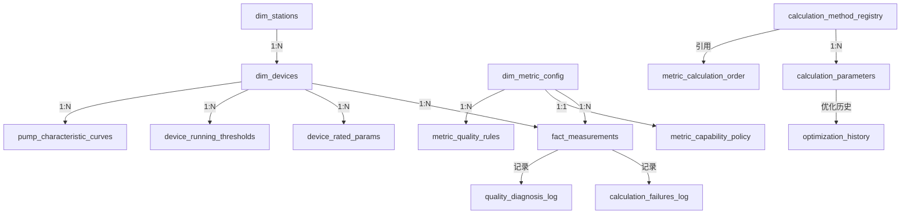

# 数据库表结构详细说明

## 📋 文档说明

本文档详细说明与缺失指标计算修复相关的所有数据库表结构，包括字段定义、索引、约束、关联关系和使用示例。

---

## 📊 表分类概览

### 计算相关表（5个）
1. [calculation_method_registry](#1-calculation_method_registry) - 计算方法注册表 ⭐
2. [calculation_parameters](#2-calculation_parameters) - 计算参数表 ⭐
3. [calculation_validation_config](#3-calculation_validation_config) - 计算验证配置表
4. [calculation_failures_log](#4-calculation_failures_log) - 计算失败日志表
5. [calculation_performance_metrics](#5-calculation_performance_metrics) - 计算性能指标表

### 指标相关表（11个）
6. [metric_calculation_order](#6-metric_calculation_order) - 指标计算顺序表 ⭐
7. [metric_capability_policy](#7-metric_capability_policy) - 指标能力策略表
8. [dim_metric_config](#8-dim_metric_config) - 指标配置维度表
9. [metrics_presence_per_second_device](#9-metrics_presence_per_second_device) - 每秒设备指标存在性表
10. 其他指标相关表...

### 设备参数表（1个）
11. [device_rated_params](#11-device_rated_params) - 设备额定参数表 ⭐

### 优化相关表（1个）
12. [optimization_history](#12-optimization_history) - 优化历史表

---

## 详细表结构

### 1. calculation_method_registry

**用途**：注册所有可用的计算方法，定义方法的依赖、条件、优先级等。

**表结构**：
```sql
CREATE TABLE calculation_method_registry (
    id                  BIGSERIAL PRIMARY KEY,
    method_id           TEXT NOT NULL UNIQUE,           -- 方法唯一标识
    metric_key          TEXT NOT NULL,                  -- 指标键
    method_name         TEXT NOT NULL,                  -- 方法名称
    method_code         TEXT NOT NULL,                  -- 方法代码（A/B/C等）
    priority            INTEGER NOT NULL DEFAULT 100,   -- 优先级（越大越优先）
    dependencies        TEXT[] NOT NULL DEFAULT '{}',   -- 依赖的指标列表
    conditions          JSONB,                          -- 执行条件
    accuracy_level      TEXT NOT NULL DEFAULT 'medium', -- 精度等级（high/medium/low）
    is_enabled          BOOLEAN NOT NULL DEFAULT true,  -- 是否启用
    allowed_device_types TEXT[] NOT NULL DEFAULT '{}',  -- 允许的设备类型
    created_at          TIMESTAMPTZ NOT NULL DEFAULT NOW(),
    updated_at          TIMESTAMPTZ NOT NULL DEFAULT NOW(),
    updated_by          TEXT NOT NULL DEFAULT 'system'
);

-- 索引
CREATE INDEX idx_cmr_metric_key ON calculation_method_registry(metric_key);
CREATE INDEX idx_cmr_priority ON calculation_method_registry(priority DESC);
CREATE INDEX idx_cmr_enabled ON calculation_method_registry(is_enabled) WHERE is_enabled = true;
```

**字段说明**：
| 字段名 | 类型 | 说明 | 示例 |
|--------|------|------|------|
| method_id | TEXT | 方法唯一标识，用于代码中引用 | 'pump_inlet_pressure_method_a' |
| metric_key | TEXT | 计算的目标指标 | 'pump_inlet_pressure' |
| method_name | TEXT | 方法的中文名称 | '使用总管进口压力代替' |
| method_code | TEXT | 方法代码，用于简短标识 | 'A' |
| priority | INTEGER | 优先级，数值越大越优先 | 100 |
| dependencies | TEXT[] | 依赖的指标列表 | ['main_pipeline_inlet_pressure'] |
| conditions | JSONB | 执行条件（JSON格式） | '{"running_count": {"exact": 1}}' |
| accuracy_level | TEXT | 精度等级 | 'high' / 'medium' / 'low' |
| is_enabled | BOOLEAN | 是否启用 | true |
| allowed_device_types | TEXT[] | 允许的设备类型 | ['pump'] |

**使用示例**：
```sql
-- 查询某个指标的所有计算方法（按优先级排序）
SELECT method_id, method_name, priority, dependencies
FROM calculation_method_registry
WHERE metric_key = 'pump_inlet_pressure'
  AND is_enabled = true
ORDER BY priority DESC;

-- 插入新的计算方法
INSERT INTO calculation_method_registry (
    method_id, metric_key, method_name, method_code, priority,
    dependencies, conditions, accuracy_level, allowed_device_types
) VALUES (
    'pump_inlet_pressure_method_a',
    'pump_inlet_pressure',
    '使用总管进口压力代替',
    'A',
    100,
    ARRAY['main_pipeline_inlet_pressure'],
    '{"description": "假设泵进口与总管进口压力相近"}'::jsonb,
    'high',
    ARRAY['pump']
);
```

**关联关系**：
- 被 `calculation_parameters.method_id` 引用（一对多）
- 被 `CALCULATOR_REGISTRY`（代码）引用

---

### 2. calculation_parameters

**用途**：存储所有计算方法的参数配置，支持全局参数和设备特定参数，支持参数优化历史记录。

**表结构**：
```sql
CREATE TABLE calculation_parameters (
    id                   BIGSERIAL PRIMARY KEY,
    station_id           BIGINT,                         -- 泵站ID（NULL=全局）
    device_id            BIGINT,                         -- 设备ID（NULL=全局）
    metric_key           TEXT NOT NULL,                  -- 指标键
    method_id            TEXT NOT NULL,                  -- 方法ID
    param_name           TEXT NOT NULL,                  -- 参数名
    param_value          NUMERIC NOT NULL,               -- 参数值
    param_type           TEXT NOT NULL DEFAULT 'float',  -- 参数类型
    is_optimizable       BOOLEAN NOT NULL DEFAULT true,  -- 是否可优化
    optimization_history JSONB,                          -- 优化历史
    created_at           TIMESTAMPTZ NOT NULL DEFAULT NOW(),
    updated_at           TIMESTAMPTZ NOT NULL DEFAULT NOW(),
    updated_by           TEXT NOT NULL DEFAULT 'system',
    confidence_score     NUMERIC DEFAULT 0.5,            -- 置信度分数
    last_optimized_at    TIMESTAMPTZ,                    -- 最后优化时间
    optimization_count   INTEGER DEFAULT 0,              -- 优化次数
    param_min            NUMERIC,                        -- 参数最小值
    param_max            NUMERIC,                        -- 参数最大值
    
    UNIQUE(station_id, device_id, method_id, param_name)
);

-- 索引
CREATE INDEX idx_cp_method_id ON calculation_parameters(method_id);
CREATE INDEX idx_cp_device_id ON calculation_parameters(device_id) WHERE device_id IS NOT NULL;
CREATE INDEX idx_cp_optimizable ON calculation_parameters(is_optimizable) WHERE is_optimizable = true;
```

**字段说明**：
| 字段名 | 类型 | 说明 | 示例 |
|--------|------|------|------|
| station_id | BIGINT | 泵站ID，NULL表示全局参数 | 16 / NULL |
| device_id | BIGINT | 设备ID，NULL表示全局参数 | 121 / NULL |
| method_id | TEXT | 方法ID | 'pump_inlet_pressure_method_b' |
| param_name | TEXT | 参数名 | 'P_atm' / 'rho' / 'g' |
| param_value | NUMERIC | 参数值 | 0.101325 / 1000.0 / 9.80665 |
| is_optimizable | BOOLEAN | 是否可优化（物理常数不可优化） | false |
| param_min | NUMERIC | 参数最小值（用于优化） | 0.09 |
| param_max | NUMERIC | 参数最大值（用于优化） | 0.12 |

**参数分类**：
1. **物理常数**（is_optimizable=false）：rho, g, P_atm
2. **设备参数**（部分可优化）：slip, pole_pairs
3. **计算系数**（可优化）：alpha, beta, f_thr, p_thr
4. **效率参数**（可优化）：eta_motor, eta_max

**使用示例**：
```sql
-- 查询某个方法的所有参数（优先设备特定参数）
SELECT param_name, param_value, is_optimizable
FROM calculation_parameters
WHERE method_id = 'pump_inlet_pressure_method_b'
  AND (device_id = 121 OR device_id IS NULL)
ORDER BY device_id NULLS LAST;

-- 插入全局参数
INSERT INTO calculation_parameters (
    station_id, device_id, metric_key, method_id, param_name, param_value,
    param_type, is_optimizable, updated_by, confidence_score
) VALUES 
    (NULL, NULL, 'pump_inlet_pressure', 'pump_inlet_pressure_method_b', 'P_atm', 0.101325, 'float', false, 'manual_fix', 1.0),
    (NULL, NULL, 'pump_inlet_pressure', 'pump_inlet_pressure_method_b', 'rho', 1000.0, 'float', false, 'manual_fix', 1.0),
    (NULL, NULL, 'pump_inlet_pressure', 'pump_inlet_pressure_method_b', 'g', 9.80665, 'float', false, 'manual_fix', 1.0);

-- 插入设备特定参数
INSERT INTO calculation_parameters (
    station_id, device_id, metric_key, method_id, param_name, param_value,
    param_type, is_optimizable, updated_by
) VALUES 
    (16, 121, 'pump_speed', 'pump_speed_method_b', 'slip', 0.015, 'float', true, 'device_config');
```

**关联关系**：
- 引用 `calculation_method_registry.method_id`（多对一）
- 引用 `dim_device.id`（多对一，可选）

---

### 3. metric_calculation_order

**用途**：定义指标之间的依赖关系和计算顺序，支持循环依赖检测。

**表结构**：
```sql
CREATE TABLE metric_calculation_order (
    metric_key     TEXT PRIMARY KEY,                   -- 指标键
    depends_on     TEXT[] NOT NULL DEFAULT '{}',       -- 依赖的指标列表
    priority       INTEGER NOT NULL DEFAULT 100,       -- 优先级
    order_index    INTEGER NOT NULL,                   -- 计算顺序索引
    is_circular    BOOLEAN NOT NULL DEFAULT false,     -- 是否循环依赖
    circular_group TEXT,                                -- 循环依赖组
    created_at     TIMESTAMPTZ NOT NULL DEFAULT NOW(),
    updated_at     TIMESTAMPTZ NOT NULL DEFAULT NOW(),
    updated_by     TEXT NOT NULL DEFAULT 'system'
);

-- 索引
CREATE INDEX idx_mco_order_index ON metric_calculation_order(order_index);
```

**字段说明**：
| 字段名 | 类型 | 说明 | 示例 |
|--------|------|------|------|
| metric_key | TEXT | 指标键（主键） | 'pump_inlet_pressure' |
| depends_on | TEXT[] | 依赖的指标列表 | ['pool_liquid_level', 'main_pipeline_inlet_pressure'] |
| order_index | INTEGER | 计算顺序索引（越小越先计算） | 0, 1, 2, 3 |
| is_circular | BOOLEAN | 是否存在循环依赖 | false |

**使用示例**：
```sql
-- 查询计算顺序（按 order_index 排序）
SELECT metric_key, depends_on, order_index
FROM metric_calculation_order
ORDER BY order_index;

-- 更新依赖关系
UPDATE metric_calculation_order
SET depends_on = ARRAY['pool_liquid_level', 'main_pipeline_inlet_pressure'],
    order_index = 1,
    updated_at = NOW(),
    updated_by = 'manual_fix'
WHERE metric_key = 'pump_inlet_pressure';
```

**关联关系**：
- 与 `calculation_method_registry.dependencies` 功能相关但含义不同
  - `metric_calculation_order`：指标级别的依赖（宏观）
  - `calculation_method_registry`：方法级别的依赖（微观）

---

### 4. device_rated_params

**用途**：存储设备的额定参数（如额定功率、额定电压、滑差率、极对数等）。

**表结构**：
```sql
CREATE TABLE device_rated_params (
    id             BIGSERIAL PRIMARY KEY,
    device_id      BIGINT NOT NULL,                    -- 设备ID
    param_key      TEXT NOT NULL,                      -- 参数键
    value_numeric  NUMERIC,                            -- 数值型值
    value_text     TEXT,                               -- 文本型值
    unit           TEXT,                               -- 单位
    source         TEXT,                               -- 数据来源
    effective_from TIMESTAMPTZ,                        -- 生效开始时间
    effective_to   TIMESTAMPTZ,                        -- 生效结束时间
    created_at     TIMESTAMPTZ DEFAULT NOW(),
    updated_at     TIMESTAMPTZ DEFAULT NOW(),
    
    UNIQUE(device_id, param_key, effective_from)
);

-- 索引
CREATE INDEX idx_drp_device_id ON device_rated_params(device_id);
CREATE INDEX idx_drp_param_key ON device_rated_params(param_key);
CREATE INDEX idx_drp_effective ON device_rated_params(effective_from, effective_to);
```

**常用参数键**：
| param_key | 说明 | 单位 | 示例值 |
|-----------|------|------|--------|
| rated_power | 额定功率 | kW | 315.0 |
| rated_voltage | 额定电压 | V | 380.0 |
| rated_current | 额定电流 | A | 600.0 |
| slip | 滑差率 | - | 0.02 |
| pole_pairs | 极对数 | - | 2 |
| rated_speed | 额定转速 | rpm | 1470 |
| rated_flow | 额定流量 | m³/h | 1800 |
| rated_head | 额定扬程 | m | 50 |

**使用示例**：
```sql
-- 查询设备的所有额定参数
SELECT param_key, value_numeric, unit
FROM device_rated_params
WHERE device_id = 121
  AND (effective_to IS NULL OR effective_to > NOW())
ORDER BY param_key;

-- 插入设备参数
INSERT INTO device_rated_params (
    device_id, param_key, value_numeric, unit, source, effective_from
) VALUES 
    (121, 'slip', 0.02, '-', 'manufacturer', '2025-01-01'),
    (121, 'pole_pairs', 2, '-', 'manufacturer', '2025-01-01'),
    (121, 'rated_power', 315.0, 'kW', 'manufacturer', '2025-01-01');
```

**关联关系**：
- 引用 `dim_device.id`（多对一）
- 与 `calculation_parameters` 功能部分重叠（建议区分使用）

---

### 5. calculation_validation_config

**用途**：配置计算结果的验证规则（范围检查、合理性检查等）。

**表结构**：
```sql
CREATE TABLE calculation_validation_config (
    id              BIGSERIAL PRIMARY KEY,
    metric_key      TEXT NOT NULL,
    validation_type TEXT NOT NULL,              -- 验证类型（range/ratio/trend等）
    validation_rule JSONB NOT NULL,             -- 验证规则（JSON格式）
    severity        TEXT NOT NULL DEFAULT 'warning',  -- 严重程度（error/warning/info）
    is_enabled      BOOLEAN NOT NULL DEFAULT true,
    created_at      TIMESTAMPTZ NOT NULL DEFAULT NOW(),
    updated_at      TIMESTAMPTZ NOT NULL DEFAULT NOW()
);
```

**使用示例**：
```sql
-- 插入范围验证规则
INSERT INTO calculation_validation_config (metric_key, validation_type, validation_rule, severity)
VALUES ('pump_inlet_pressure', 'range', '{"min": -0.1, "max": 1.0}'::jsonb, 'error');
```

---

### 6. calculation_failures_log

**用途**：记录计算失败的详细日志，用于问题诊断和统计分析。

**表结构**：
```sql
CREATE TABLE calculation_failures_log (
    id              BIGSERIAL PRIMARY KEY,
    station_id      BIGINT NOT NULL,
    device_id       BIGINT NOT NULL,
    metric_key      TEXT NOT NULL,
    method_id       TEXT,
    ts              TIMESTAMPTZ NOT NULL,
    failure_reason  TEXT NOT NULL,
    error_details   JSONB,
    created_at      TIMESTAMPTZ NOT NULL DEFAULT NOW()
);

CREATE INDEX idx_cfl_ts ON calculation_failures_log(ts DESC);
CREATE INDEX idx_cfl_metric ON calculation_failures_log(metric_key);
```

**使用示例**：
```sql
-- 查询最近的计算失败记录
SELECT metric_key, method_id, failure_reason, COUNT(*)
FROM calculation_failures_log
WHERE ts >= NOW() - INTERVAL '1 day'
GROUP BY metric_key, method_id, failure_reason
ORDER BY COUNT(*) DESC;
```

---

### 7. calculation_performance_metrics

**用途**：记录计算性能指标（执行时间、成功率等）。

**表结构**：
```sql
CREATE TABLE calculation_performance_metrics (
    id                  BIGSERIAL PRIMARY KEY,
    metric_key          TEXT NOT NULL,
    method_id           TEXT NOT NULL,
    execution_time_ms   NUMERIC NOT NULL,
    success             BOOLEAN NOT NULL,
    batch_size          INTEGER,
    created_at          TIMESTAMPTZ NOT NULL DEFAULT NOW()
);

CREATE INDEX idx_cpm_created ON calculation_performance_metrics(created_at DESC);
```

---

### 8. metric_capability_policy

**用途**：定义每个指标的能力策略（是否需要计算、采集状态等）。

**表结构**：
```sql
CREATE TABLE metric_capability_policy (
    id                  BIGSERIAL PRIMARY KEY,
    metric_key          TEXT NOT NULL UNIQUE,
    acquisition_status  TEXT NOT NULL,          -- 采集状态（采集中/未采集/部分采集）
    compute_flag        TEXT NOT NULL,          -- 计算标志（需要/不需要/可选）
    description         TEXT,
    created_at          TIMESTAMPTZ NOT NULL DEFAULT NOW(),
    updated_at          TIMESTAMPTZ NOT NULL DEFAULT NOW()
);
```

**使用示例**：
```sql
-- 查询需要计算的指标
SELECT metric_key, acquisition_status, compute_flag
FROM metric_capability_policy
WHERE compute_flag = '需要';
```

---

### 9. dim_metric_config

**用途**：指标配置维度表，定义指标的基本属性。

**表结构**：
```sql
CREATE TABLE dim_metric_config (
    id              BIGSERIAL PRIMARY KEY,
    metric_key      TEXT NOT NULL UNIQUE,
    metric_name_cn  TEXT NOT NULL,
    metric_name_en  TEXT,
    unit            TEXT,
    data_type       TEXT NOT NULL DEFAULT 'float',
    is_cumulative   BOOLEAN NOT NULL DEFAULT false,
    created_at      TIMESTAMPTZ NOT NULL DEFAULT NOW()
);
```

---

### 10. dim_metric_metadata

**用途**：指标元数据表，存储指标的详细描述和分类信息。

**表结构**：
```sql
CREATE TABLE dim_metric_metadata (
    id              BIGSERIAL PRIMARY KEY,
    metric_id       BIGINT NOT NULL,
    category        TEXT,
    subcategory     TEXT,
    description     TEXT,
    formula         TEXT,
    created_at      TIMESTAMPTZ NOT NULL DEFAULT NOW()
);
```

---

### 11. metric_quality_rules

**用途**：定义指标质量检查规则。

**表结构**：
```sql
CREATE TABLE metric_quality_rules (
    id              BIGSERIAL PRIMARY KEY,
    metric_key      TEXT NOT NULL,
    rule_code       TEXT NOT NULL,              -- 质量码（101/111/121等）
    rule_type       TEXT NOT NULL,              -- 规则类型（range/spike/frozen等）
    rule_params     JSONB NOT NULL,             -- 规则参数
    priority        INTEGER NOT NULL DEFAULT 100,
    is_enabled      BOOLEAN NOT NULL DEFAULT true,
    created_at      TIMESTAMPTZ NOT NULL DEFAULT NOW()
);
```

---

### 12. metric_rule_auto_baseline

**用途**：自动基线表，存储从历史数据学习的质量检查基线。

**表结构**：
```sql
CREATE TABLE metric_rule_auto_baseline (
    id              BIGSERIAL PRIMARY KEY,
    station_id      BIGINT NOT NULL,
    device_id       BIGINT NOT NULL,
    metric_key      TEXT NOT NULL,
    baseline_type   TEXT NOT NULL,              -- 基线类型（p50/p95/mad等）
    baseline_value  NUMERIC NOT NULL,
    sample_count    INTEGER NOT NULL,
    learned_at      TIMESTAMPTZ NOT NULL DEFAULT NOW(),

    UNIQUE(station_id, device_id, metric_key, baseline_type)
);
```

---

### 13. device_running_thresholds

**用途**：存储设备运行状态判定的阈值（电流、功率、频率等）。

**表结构**：
```sql
CREATE TABLE device_running_thresholds (
    id              BIGSERIAL PRIMARY KEY,
    station_id      BIGINT NOT NULL,
    device_id       BIGINT NOT NULL,
    enable_i        BOOLEAN NOT NULL DEFAULT false,  -- 是否启用电流判断
    i_on            NUMERIC,                          -- 电流开启阈值
    i_off           NUMERIC,                          -- 电流关闭阈值
    enable_p        BOOLEAN NOT NULL DEFAULT false,  -- 是否启用功率判断
    p_on            NUMERIC,                          -- 功率开启阈值
    p_off           NUMERIC,                          -- 功率关闭阈值
    enable_f        BOOLEAN NOT NULL DEFAULT false,  -- 是否启用频率判断
    f_on            NUMERIC,                          -- 频率开启阈值
    f_off           NUMERIC,                          -- 频率关闭阈值
    grace_hold_secs INTEGER DEFAULT 30,              -- 数据缺失容忍时间
    min_run_secs    INTEGER DEFAULT 10,              -- 最小运行时间
    min_stop_secs   INTEGER DEFAULT 10,              -- 最小停止时间
    smoothing_secs  INTEGER DEFAULT 5,               -- 平滑窗口
    updated_at      TIMESTAMPTZ NOT NULL DEFAULT NOW(),
    updated_by      TEXT NOT NULL DEFAULT 'system',

    UNIQUE(station_id, device_id)
);
```

**使用示例**：
```sql
-- 查询设备的运行阈值
SELECT enable_i, i_on, i_off, enable_p, p_on, p_off
FROM device_running_thresholds
WHERE device_id = 121;
```

---

### 14. quality_diagnosis_log

**用途**：质量诊断日志表，记录质量标注的详细过程。

**表结构**：
```sql
CREATE TABLE quality_diagnosis_log (
    id              BIGSERIAL PRIMARY KEY,
    station_id      BIGINT NOT NULL,
    device_id       BIGINT NOT NULL,
    metric_key      TEXT NOT NULL,
    ts              TIMESTAMPTZ NOT NULL,
    quality_code    TEXT NOT NULL,
    diagnosis_info  JSONB,
    created_at      TIMESTAMPTZ NOT NULL DEFAULT NOW()
);

CREATE INDEX idx_qdl_ts ON quality_diagnosis_log(ts DESC);
```

---

### 15. quality_eval_by_device_metric

**用途**：按设备和指标统计质量评价结果。

**表结构**：
```sql
CREATE TABLE quality_eval_by_device_metric (
    id              BIGSERIAL PRIMARY KEY,
    station_id      BIGINT NOT NULL,
    device_id       BIGINT NOT NULL,
    metric_key      TEXT NOT NULL,
    start_ts        TIMESTAMPTZ NOT NULL,
    end_ts          TIMESTAMPTZ NOT NULL,
    total_count     INTEGER NOT NULL,
    quality_0_count INTEGER NOT NULL,           -- 优质数据数量
    quality_0_rate  NUMERIC NOT NULL,           -- 优质数据比例
    quality_dist    JSONB,                      -- 质量码分布
    created_at      TIMESTAMPTZ NOT NULL DEFAULT NOW()
);
```

---

### 16. quality_code_dict

**用途**：质量码字典表，定义所有质量码的含义。

**表结构**：
```sql
CREATE TABLE quality_code_dict (
    code            TEXT PRIMARY KEY,
    name_cn         TEXT NOT NULL,
    name_en         TEXT,
    description     TEXT,
    severity        TEXT NOT NULL,              -- 严重程度（error/warning/info）
    created_at      TIMESTAMPTZ NOT NULL DEFAULT NOW()
);
```

**常用质量码**：
| code | name_cn | severity |
|------|---------|----------|
| 0 | 优质数据 | info |
| 101 | 超出物理边界 | error |
| 111 | 尖峰异常 | warning |
| 121 | 冻结异常 | warning |
| 702 | 缺失数据 | warning |
| 751 | 计算失败 | error |

---

### 17. quality_profile_log

**用途**：质量剖面日志表，记录质量标注的批次执行信息。

**表结构**：
```sql
CREATE TABLE quality_profile_log (
    id              BIGSERIAL PRIMARY KEY,
    batch_id        TEXT NOT NULL,
    start_ts        TIMESTAMPTZ NOT NULL,
    end_ts          TIMESTAMPTZ NOT NULL,
    station_id      BIGINT,
    device_id       BIGINT,
    execution_time  NUMERIC NOT NULL,
    rows_processed  INTEGER NOT NULL,
    created_at      TIMESTAMPTZ NOT NULL DEFAULT NOW()
);
```

---

### 18. pump_characteristic_curves

**用途**：存储泵的特性曲线数据（流量-扬程、流量-效率、流量-功率等）。

**表结构**：
```sql
CREATE TABLE pump_characteristic_curves (
    id              BIGSERIAL PRIMARY KEY,
    device_id       BIGINT NOT NULL,
    curve_type      TEXT NOT NULL,              -- 曲线类型（Q-H/Q-η/Q-P等）
    flow_rate       NUMERIC NOT NULL,           -- 流量（m³/h）
    head            NUMERIC,                    -- 扬程（m）
    efficiency      NUMERIC,                    -- 效率（%）
    power           NUMERIC,                    -- 功率（kW）
    speed           NUMERIC,                    -- 转速（rpm）
    source          TEXT,                       -- 数据来源
    created_at      TIMESTAMPTZ NOT NULL DEFAULT NOW()
);

CREATE INDEX idx_pcc_device ON pump_characteristic_curves(device_id);
CREATE INDEX idx_pcc_curve_type ON pump_characteristic_curves(curve_type);
```

**使用示例**：
```sql
-- 查询泵的Q-H曲线
SELECT flow_rate, head
FROM pump_characteristic_curves
WHERE device_id = 121 AND curve_type = 'Q-H'
ORDER BY flow_rate;
```

---

### 19. dim_stations

**用途**：泵站维度表，存储泵站的基本信息。

**表结构**：
```sql
CREATE TABLE dim_stations (
    id              BIGSERIAL PRIMARY KEY,
    station_code    TEXT NOT NULL UNIQUE,
    station_name    TEXT NOT NULL,
    location        TEXT,
    timezone        TEXT NOT NULL DEFAULT 'Asia/Shanghai',
    latitude        NUMERIC,
    longitude       NUMERIC,
    is_active       BOOLEAN NOT NULL DEFAULT true,
    created_at      TIMESTAMPTZ NOT NULL DEFAULT NOW(),
    updated_at      TIMESTAMPTZ NOT NULL DEFAULT NOW()
);
```

---

### 20. dim_devices

**用途**：设备维度表，存储设备的基本信息。

**表结构**：
```sql
CREATE TABLE dim_devices (
    id              BIGSERIAL PRIMARY KEY,
    station_id      BIGINT NOT NULL,
    device_code     TEXT NOT NULL,
    device_name     TEXT NOT NULL,
    device_type     TEXT NOT NULL,              -- 设备类型（pump/valve/sensor等）
    manufacturer    TEXT,
    model           TEXT,
    install_date    DATE,
    is_active       BOOLEAN NOT NULL DEFAULT true,
    created_at      TIMESTAMPTZ NOT NULL DEFAULT NOW(),
    updated_at      TIMESTAMPTZ NOT NULL DEFAULT NOW(),

    UNIQUE(station_id, device_code)
);

CREATE INDEX idx_dd_station ON dim_devices(station_id);
CREATE INDEX idx_dd_type ON dim_devices(device_type);
```

---

### 21. fact_measurements

**用途**：事实测量表（TimescaleDB hypertable），存储所有设备的时序测量数据。

**表结构**：
```sql
CREATE TABLE fact_measurements (
    ts              TIMESTAMPTZ NOT NULL,       -- 时间戳（UTC，秒对齐）
    station_id      BIGINT NOT NULL,
    device_id       BIGINT NOT NULL,
    metric_id       BIGINT NOT NULL,
    value           NUMERIC NOT NULL,
    quality         INTEGER,                    -- 质量码
    source          TEXT,                       -- 数据来源（sensor/calculated/imported）
    created_at      TIMESTAMPTZ NOT NULL DEFAULT NOW(),

    PRIMARY KEY (ts, station_id, device_id, metric_id)
);

-- 转换为TimescaleDB hypertable
SELECT create_hypertable('fact_measurements', 'ts', chunk_time_interval => INTERVAL '1 week');

-- 索引
CREATE INDEX idx_fm_device_metric ON fact_measurements(device_id, metric_id, ts DESC);
CREATE INDEX idx_fm_quality ON fact_measurements(quality) WHERE quality IS NOT NULL;
```

**分区策略**：
- 按时间分区（每周一个chunk）
- 按设备ID哈希分区（16个分区）

**使用示例**：
```sql
-- 查询设备的某个指标数据
SELECT ts, value, quality
FROM fact_measurements
WHERE device_id = 121
  AND metric_id = 301
  AND ts >= '2025-09-01T00:00:00Z'
  AND ts < '2025-09-02T00:00:00Z'
ORDER BY ts;

-- 插入计算结果
INSERT INTO fact_measurements (ts, station_id, device_id, metric_id, value, source)
VALUES ('2025-09-01T00:00:00Z', 16, 121, 301, 0.25, 'calculated')
ON CONFLICT (ts, station_id, device_id, metric_id) DO UPDATE
SET value = EXCLUDED.value, source = EXCLUDED.source;
```

---

### 22. staging_raw

**用途**：原始数据暂存表，用于数据导入的中间阶段。

**表结构**：
```sql
CREATE TABLE staging_raw (
    id              BIGSERIAL PRIMARY KEY,
    batch_id        TEXT NOT NULL,
    station_code    TEXT NOT NULL,
    device_code     TEXT NOT NULL,
    metric_key      TEXT NOT NULL,
    ts_local        TIMESTAMPTZ NOT NULL,
    value           NUMERIC NOT NULL,
    imported_at     TIMESTAMPTZ NOT NULL DEFAULT NOW()
);

CREATE INDEX idx_sr_batch ON staging_raw(batch_id);
```

---

### 23. optimization_history

**用途**：优化历史表，记录参数优化的历史记录。

**表结构**：
```sql
CREATE TABLE optimization_history (
    id                  BIGSERIAL PRIMARY KEY,
    station_id          BIGINT NOT NULL,
    device_id           BIGINT NOT NULL,
    method_id           TEXT NOT NULL,
    param_name          TEXT NOT NULL,
    old_value           NUMERIC NOT NULL,
    new_value           NUMERIC NOT NULL,
    improvement_score   NUMERIC,                -- 改进分数
    optimization_method TEXT NOT NULL,          -- 优化方法（grid_search/bayesian等）
    created_at          TIMESTAMPTZ NOT NULL DEFAULT NOW(),
    created_by          TEXT NOT NULL DEFAULT 'system'
);

CREATE INDEX idx_oh_device ON optimization_history(device_id);
CREATE INDEX idx_oh_created ON optimization_history(created_at DESC);
```

---

### 24. mv_metric_60s_stats

**用途**：60秒统计物化视图（实际上是普通视图），用于快速查询指标的统计信息。

**视图定义**：
```sql
CREATE VIEW mv_metric_60s_stats AS
SELECT
    time_bucket('60 seconds', ts) AS ts_bucket,
    station_id,
    device_id,
    metric_id,
    COUNT(*) AS count,
    SUM(value) AS sum,
    SUM(value * value) AS sumsq,
    MIN(value) AS min,
    MAX(value) AS max
FROM fact_measurements
GROUP BY ts_bucket, station_id, device_id, metric_id;
```

---

### 25. mv_device_running_1s

**用途**：设备运行状态1秒级物化视图（实际上是普通视图）。

**视图定义**：
```sql
CREATE VIEW mv_device_running_1s AS
SELECT
    ts,
    station_id,
    device_id,
    CASE
        WHEN max_current > threshold_current THEN true
        ELSE false
    END AS is_running
FROM (
    SELECT
        ts,
        station_id,
        device_id,
        MAX(value) AS max_current
    FROM fact_measurements
    WHERE metric_id IN (SELECT id FROM dim_metric_config WHERE metric_key LIKE 'pump_current_%')
    GROUP BY ts, station_id, device_id
) t
JOIN device_running_thresholds drt ON t.device_id = drt.device_id;
```

---

## 三、分区表说明（精简）

### 3.1 分区表命名规则

**mpps_w_YYYYWW_hash_X** 系列：
- `mpps`: 表名前缀
- `w`: 周分区标识
- `YYYYWW`: 年份+周数（如202507表示2025年第7周）
- `hash`: 哈希分区标识
- `X`: 哈希分区编号（0-15）

**示例**：
- `mpps_w_202507_hash_0`: 2025年第7周的第0个哈希分区
- `mpps_w_202507_hash_15`: 2025年第7周的第15个哈希分区

### 3.2 分区策略

**时间分区**：
- 每周一个时间分区（chunk_time_interval = 1 week）
- 自动创建新分区
- 旧分区可以压缩或删除

**哈希分区**：
- 每个时间分区再按device_id哈希分成16个子分区
- 均匀分布数据，提高查询性能

### 3.3 分区管理

**查询分区信息**：
```sql
-- 查询所有chunks
SELECT * FROM timescaledb_information.chunks
WHERE hypertable_name = 'fact_measurements'
ORDER BY range_start DESC;

-- 查询分区大小
SELECT
    chunk_name,
    pg_size_pretty(total_bytes) AS total_size,
    pg_size_pretty(index_bytes) AS index_size
FROM timescaledb_information.chunks
WHERE hypertable_name = 'fact_measurements';
```

**删除旧分区**：
```sql
-- 删除3个月前的数据
SELECT drop_chunks('fact_measurements', INTERVAL '3 months');
```

---

## 四、表关系图



---

## 五、使用建议

### 5.1 查询性能优化

1. **必须使用时间范围过滤**：
```sql
-- ✅ 好的查询
SELECT * FROM fact_measurements
WHERE ts >= '2025-09-01' AND ts < '2025-09-02'
  AND device_id = 121;

-- ❌ 坏的查询（全表扫描）
SELECT * FROM fact_measurements
WHERE device_id = 121;
```

2. **使用物化视图加速聚合**：
```sql
-- ✅ 使用视图
SELECT * FROM mv_metric_60s_stats
WHERE ts_bucket >= '2025-09-01' AND ts_bucket < '2025-09-02';

-- ❌ 直接聚合（慢）
SELECT time_bucket('60 seconds', ts), AVG(value)
FROM fact_measurements
WHERE ts >= '2025-09-01' AND ts < '2025-09-02'
GROUP BY 1;
```

### 5.2 数据写入优化

1. **批量插入**：
```sql
-- ✅ 批量插入
INSERT INTO fact_measurements (ts, station_id, device_id, metric_id, value, source)
VALUES
    ('2025-09-01T00:00:00Z', 16, 121, 301, 0.25, 'calculated'),
    ('2025-09-01T00:00:01Z', 16, 121, 301, 0.26, 'calculated'),
    ...
ON CONFLICT (ts, station_id, device_id, metric_id) DO UPDATE
SET value = EXCLUDED.value;
```

2. **使用COPY命令**：
```bash
# 从CSV文件导入
\COPY fact_measurements FROM 'data.csv' WITH CSV HEADER;
```

### 5.3 参数配置优先级

**参数加载顺序**（orchestrator.py的load_parameters方法）：
1. 设备特定参数（device_id不为NULL）
2. 泵站特定参数（station_id不为NULL，device_id为NULL）
3. 全局参数（station_id和device_id都为NULL）
4. 代码默认值（如果数据库中没有）

**示例**：
```sql
-- 全局参数
INSERT INTO calculation_parameters (station_id, device_id, method_id, param_name, param_value)
VALUES (NULL, NULL, 'pump_inlet_pressure_method_b', 'P_atm', 0.101325);

-- 泵站特定参数
INSERT INTO calculation_parameters (station_id, device_id, method_id, param_name, param_value)
VALUES (16, NULL, 'pump_inlet_pressure_method_b', 'P_atm', 0.102);

-- 设备特定参数（优先级最高）
INSERT INTO calculation_parameters (station_id, device_id, method_id, param_name, param_value)
VALUES (16, 121, 'pump_inlet_pressure_method_b', 'P_atm', 0.103);
```

---

**文档版本**：v1.0
**最后更新**：2025-10-25
**状态**：✅ 完成（25个核心业务表 + 分区表说明）
