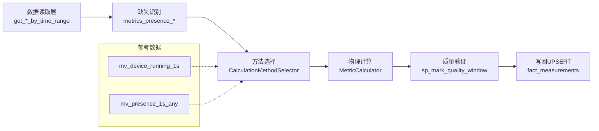

# 阶段1：架构设计方案

- 版本：v0.1
- 日期：2025-09-28
- 负责人：Augment Agent

## 一、目标与约束
- 目标：基于现有指标数据，通过物理模型推导缺失指标，形成“计算-验证-优化”闭环
- 约束：不修改 fact_measurements 结构；按 ts_bucket 秒级逐点；复用 get_*_by_time_range、mv_device_running_1s、sp_mark_quality_window；窗口统一 [start,end)

- 口径对齐：时间/DST/窗口对齐、RunContext 最小字段与两层验证（L1a 质量窗口 + L1b 物理/机理）的统一口径以《阶段2_核心计算引擎设计.md》§6/§9/§13 为准。

## 二、整体架构（逻辑）
1) 数据获取层：
   - 设备级/泵站级读取复用 get_device_metrics_by_time_range / get_station_devices_metrics_by_time_range
   - 缺失判定基于 metrics_presence_per_second_device / mv_presence_1s_any
   - 数据获取细则：
     - 输入参数：device_ids/station_id、目标/输入指标集合、时间窗[start,end)、时区
     - 对齐规则：按 ts_bucket 秒级；窗口半开区间 [start,end)
     - 存量识别：metrics_presence_per_second(_device) 判定 available/need_compute，结合 mv_device_running_1s 过滤 running=1
     - 读取策略：优先 get_*_by_time_range 批量拉取；必要时直读 fact_measurements + 索引过滤
     - 运行态物化刷新：对目标 [start,end) 先刷新/校验 mv_device_running_1s 覆盖至 end；刷新状态与范围写入 run_context（calculation_result_validation: validation_type='run_context'）

2) 计算编排层（Python 应用侧）：
   - CalculationMethodSelector：依据现有输入选择最优方法
   - MetricCalculator：实现流量/扬程/功率/效率等物理推导
   - 批处理器：按设备×时间切片并发执行（>10万点采用分片）
   - 编排细则：
     - 输入：设备集合/目标指标集合/时间窗[start,end)/时区；按 ts_bucket 秒级对齐
     - 运行态筛选：优先以 mv_device_running_1s 过滤 running=1 的秒点；停机秒点不计算
     - 缺失定位：利用 metrics_presence_per_second(_device) 得到 need_compute_metrics 秒级掩码；与运行态掩码相交
     - 读取数据：按设备×时间切片批量调用 get_*_by_time_range 拉取 required_inputs；空缺填 NaN
     - 单位统一：按 dim_metric_config.unit 及项目约定映射为 SI 单位；记录转换因子以便审计
     - 第一层（质量窗口）：对 required_inputs 与目标输出在 [start,end) 调用 sp_mark_quality_window；失败则记录 calculation_result_validation 并跳过写回
     - 第二层（特性曲线）：若存在激活曲线，计算残差 r 与相对误差；阈值按曲线/指标配置；写入 calculation_result_validation

     - 任务切分：对每个设备在窗口内形成若干“可计算分段”（连续有效秒点），交给方法选择与计算
3) 质量验证层：
   - 计算前后调用 sp_mark_quality_window（优先 vfast/diag），保障输入/输出质量
   - PhysicalConstraintValidator / ICharacteristicCurveValidator（后者预留接口）
   - 两层验证细则：
     - 第一层（质量窗口）：对 required_inputs 与目标输出在 [start,end) 调用 sp_mark_quality_window；失败则记录 calculation_result_validation 并跳过写回
     - 第二层（特性曲线）：若存在激活曲线，计算残差 r 与相对误差；阈值按曲线/指标配置；写入 calculation_result_validation
4) 结果写回层：
   - 通过 (station_id, device_id, metric_id, ts_bucket) 冲突 UPSERT 写回 fact_measurements
   - 入库语义：批量多行 UPSERT（单批<=数千行），按 (s,d,m,t) 冲突更新 value/source/updated_at；入库前后分别执行 sp_mark_quality_window 保障质量
   - 失败处理：对冲突/锁等待/网络抖动采用指数退避重试；记录 calculation_id 与计数统计，用于追踪

5) 配置与留痕：
   - metric_calculation_config / calculation_method_selector / rls_parameter_calibration / calculation_result_validation
   - rls_parameter_set（设备级参数成套：支持每设备多套、唯一激活）
   - characteristic_curve_library（特性曲线库：H-Q/η-Q/P-Q，用于第二层验证/优化，基础计算不依赖）
   - 优化闭环（不参与基础计算）：RLS 参数集与特性曲线仅用于评估与后续优化，当前批次计算不引用刚产生的优化结果；激活切换需经审批流程


## 三、模块划分与接口
- 缺失识别：identify_missing_metrics()（阶段2实现），输入时间窗/对象，输出缺失指标清单与时间段
- 方法选择：CalculationMethodSelector.select_optimal_method(inputs) → method_id
- 物理计算：MetricCalculator：封装泵工况常用公式（详见 docs/计算原理和公式.md）
  - 新设备/新指标自适应操作清单：

    **新增指标操作清单**：
    1) 在 dim_metric_config 注册 metric_id/metric_key/unit/si_conversion
    2) 在 calculation_method_selector 注册可用方法（applicable_metrics 含新指标，required_inputs/accuracy_level/priority）
    3) 在相关配置 remark(JSON) 写入阈值策略与物理边界；Validators 增补该指标的物理约束

    **新增设备操作清单**：
    1) 在 rls_parameter_set 为 device_id 新建 set_id（可空先占位），必要时在 rls_parameter_calibration 补参数项
    2) 在 metric_calculation_config 为 device_id×目标指标建立行，calculation_enabled=true，设置 priority_level 与阈值 remark(JSON)
    3) 若有设备专属特性曲线，写入 characteristic_curve_library 并 is_active；否则依赖回退链（机型/系列/厂家通用）

    **回退与跳过策略**：
    - 无方法：一次性降阈值到0.8复评，仍无则跳过该段并写 run_context
    - 无/低质曲线：仅执行第一层（物理/机理）验证，跳过第二层

- 质量验证：sp_mark_quality_window 调用封装；PhysicalConstraintValidator.validate(...)
- 写回接口：UPSERT into fact_measurements（半开区间与秒级对齐由编排器保障）
- 接口细则：
  - identify_missing_metrics(device_ids|station_id, target_metrics, start, end, tz, coverage_threshold=0.95):
    - 输出：[(device_id, metric_id, segment_start, segment_end)]，段内按 ts_bucket 连续有效
    - 步骤：presence 判定 need_compute ∧ running=1 → 连续段聚合（最小段长可配置）
  - CalculationMethodSelector.select_optimal_method(target_metric, available_inputs, device_id):
    - 候选：从 calculation_method_selector 选出 applicable_metrics 含 target_metric 的方法
    - 过滤：required_inputs 在段内存在率≥阈值；结合 metric_calculation_config.calculation_enabled=true
    - 阈值策略：设备/指标粒度阈值（coverage_threshold、required_inputs 存在率阈值等）存于 metric_calculation_config.remark 或 calculation_method_selector.remark（JSON）；选择器优先读取设备定制阈值，其次全局默认；若无候选则一次性降阈值至0.8再评估

    - 排序：设备级优先→accuracy_level 降序→priority_level 升序→method_name 字典序；取 Top1
    - 兜底：若无满足者，可降阈值至0.8再评估；仍无则跳过该段并记录原因
    - 物理常数与工况：ρ、g、黏度/温度/海拔等取值来源（固定/环境/传感器）需在 run_context 标注；VFD 场景按相似定律（affinity laws）进行曲线缩放；若无环境数据则记录采用的常数与假设
    - 缺失/异常边界：不做时间插值与跨断点连接；所有 NaN 保持为 NaN 并交由验证器判定；run_context 记录本批 NaN 比例与原因摘要

  - MetricCalculator.compute(method_id, frame_by_ts_bucket)->series:
    - 单位归一：按 dim_metric_config.unit→SI；处理零/负/缺失为 NaN
    - 公式族：见 docs/计算原理和公式.md（如 H=ΔP/(ρg)、η=ρgQH/P_in 等），向量化逐点
    - 保护：运行态=0、输入缺失→跳过；超边界→标注为 NaN 并交由验证器判定
  - Validators：
    - PhysicalConstraintValidator.validate(series, constraints)->(pass, stats)
    - CurveValidator.validate(series, active_curve)->(pass, residual_stats, thresholds)
    - 幂等策略：calculation_id 由 设备ID+指标ID+时间窗+方法签名 派生；写回前若已存在对应 run_context 则跳过或进入 compare-only 模式；run_context 记录幂等命中/跳过原因
    - 批量与重试记录：run_context 记录单批行数、重试次数与原因（冲突/死锁/锁等待/网络抖动），用于诊断与调优

    - 曲线回退链：先查找 device_id 精确激活曲线；若无，则按机型/系列/厂家通用规则回退；仍无可用曲线或 performance_score 低于阈值（min_curve_score），则仅运行第一层验证（物理/机理），跳过第二层
    - 选择留痕：将选择到的曲线 curve_id 与 min_curve_score 写入 run_context（calculation_result_validation: validation_type='run_context'）

    - 结果：写入 calculation_result_validation（calculation_id, validation_type, result, reason）
  - RunContext：在 calculation_result_validation 中追加一条 validation_type='run_context' 的留痕，记录 method_id、输入/目标指标、set_id、curve_id、min_curve_score、阈值（coverage_threshold 等）、单位换算因子摘要、物理常数与工况口径、批量/重试统计、并发/切片参数、mv 刷新覆盖范围、版本/标签（version_tag）、来源（source）等，保证复现性与审计
  - WriteBack.upsert_results(rows, source_tag, calculation_id):
    - rows=[(s,d,m,t,value)] 批插；ON CONFLICT (s,d,m,t) DO UPDATE SET value/source/updated_at
    - 入库前后调用 sp_mark_quality_window，失败则回滚该批并留痕
  - Optimizer（不参与基础计算，仅用于优化与评估）：
    - RLSOptimizer.fit(device_id, data, loss)->rls_parameter_set.set_id 更新/新建 + rls_parameter_calibration 记录
    - 运行时机：优化在“写回成功且验证完成”后异步触发；优化过程中不回填影响当前批次结果
    - 防串扰：优化仅更新 rls_parameter_set.is_active 或 characteristic_curve_library.is_active，不改写 fact_measurements 已写入值
    - CurveEvaluator.fit_or_select(device_id, samples)->characteristic_curve_library 激活项评估/切换（自动激活并记录）
    - 优化触发流程（示意）：

      ```mermaid
      flowchart LR
        C[计算] --> V[质量验证(两层)]
        V --> W[写回 UPSERT]
        W -- 异步触发 --> O[RLS优化/曲线评估]
        O -- 生成/更新 --> P[参数集/曲线候选]
        P -- 自动激活并记录 --> A[激活 is_active]
        A --> N[影响后续批次计算]
        A -. 不影响 .-> B[本批次结果不变]
      ```

    - 相关描述：
      - 触发条件：写回成功且两层验证完成的分段数据
      - 执行位置：异步队列，与计算分离；限定并发与资源配额
      - 生效时机：自动更新 is_active 并记录，仅影响后续批次；不回填本批次
      - 每设备隔离：参数集/曲线按 device_id 粒度管理，支持多套且唯一激活
      - 记录内容建议：触发时间、设备ID、旧/新 set_id 或 curve_id、目标/输入指标集、使用数据时间窗、优化评估指标（如 loss/残差/相对误差/R²/score）、触发作业ID或操作者、变更原因说明、版本/标签（version_tag）、来源（source）、性能评分（performance_score）
      - 安全阈值与自动回滚：仅当新参数集/曲线的 performance_score 相对当前激活有显著提升（>Δ阈值）时自动激活；Δ阈值与评估期设置写入 remark/version_tag；若后续窗口出现连续N次劣化则自动回滚上一激活版本；激活/回滚在 calculation_result_validation 追加 validation_type='optimizer_activation' 留痕

      - 推荐落库位置：
        - 参数更新：rls_parameter_calibration.remark 写入结构化JSON；rls_parameter_set.activation_ts/is_active 体现激活时间与状态
        - 曲线变更：characteristic_curve_library.version_tag/source/performance_score 字段；必要时在 calculation_result_validation 追加一条 validation_type='optimizer_activation' 的留痕


## 四、关键设计决策（摘要）
- 复杂逻辑在应用层，数据库侧存配置与审计痕迹；利于维护与可测试性
- 统一 metric_id 外键，避免 metric_key 歧义；方法与输入以 metric_key 表达通用性，由应用层映射到 id
- 大窗口采用分片+并发；充分利用现有索引与 Timescale 特性

## 五、性能与扩展
- 并发/批量默认与上限：设备并发默认4~8、同站≤2；单批写回≤2000~5000行；必要时可按设备×5~15分钟切片
- 自适应扩展（新增设备/指标）：
  - 新增设备流程：
    - 参数成套：在 rls_parameter_set 为该 device_id 新建一套 set_id（可空参数先占位），按需在 rls_parameter_calibration 追加参数项；若暂不标定则沿用通用参数/默认物理常数
    - 计算开关：在 metric_calculation_config 为该 device_id × 目标指标建立行，calculation_enabled=true，设置 priority_level；阈值策略写入 remark(JSON)
    - 特性曲线：若有设备专属曲线，向 characteristic_curve_library 写入并 is_active；若无则依赖回退链（机型/系列/厂家通用）
  - 新增指标流程：
    - 指标注册：在 dim_metric_config 增加 metric_id/metric_key/unit/si_conversion 等；更新单位归一映射
    - 方法注册：在 calculation_method_selector 增加 applicable_metrics 含新指标的方法条目（required_inputs/accuracy_level/priority），remark(JSON) 写默认阈值与边界
    - 验证口径：在现有 Validators 的物理边界配置中加入新指标的范围/约束（记录到 remark 或配置源），缺失则仅执行可用验证
  - 兼容与回退：
    - 若找不到方法或阈值不足以选出候选，则按一次性降阈值到0.8；仍无则跳过该段并记录原因（run_context）
    - 若无可用曲线或 performance_score < min_curve_score，仅运行第一层（物理/机理）验证
  - 元数据与自动发现：
    - metric_key→metric_id 映射由应用层集中维护；新增后无需改计算器代码，仅补齐 dim_metric_config 与方法/阈值配置
    - 计算方法以 method_id 为主键、通过 applicable_metrics 进行“声明式”绑定，便于后续新增指标时复用现有方法

- 限流与降级：检测到冲突/死锁/锁等待时采用指数退避（100ms→800ms）；连续3次失败则自动降低并发与批量；降级事件写入 run_context
- 观测与调优：run_context 记录实际并发、批量、重试次数、失败原因分布；用于离线调参与SLA治理

- 优化解耦：优化作业异步队列化（与计算分离），限定并发与资源配额；优化结果仅影响后续批次的参数集/曲线激活，不回写本批次结果

- 计算性能：方法选择与计算在内存中批量向量化（尽量减少往返）；I/O 以窗口批量读取
- 内存使用：按切片流式处理，限制单批数据规模
- 并发处理：按设备并行，带速率限制；优先本地多进程/线程

- 资源限额：优化与计算分开限额；默认优化并发≤设备计算并发的一半；可按站点设置最大并发，避免热点站点放大锁竞争

### Timescale 运维建议（文档建议）
- chunk_interval：结合数据密度建议 1–3 天；长期保留启用压缩（按列/策略）
- 刷新：对 mv_device_running_1s 配置定时刷新与手动补刷；计算前校验水位并写入 run_context
- 例行维护：VACUUM/ANALYZE 周期化；监控锁等待与膨胀，必要时重建索引


## 六、风险与缓解
- 输入质量波动 → 引入前置 sp_mark_quality_window；失败时跳过写回并记录 validation 失败
- 方法选择失误 → calculation_method_selector 维护方法适用性与精度等级
- 参数漂移 → rls_parameter_calibration 记录历史并支持回滚
- 运行态不同步 → 计算前刷新/校验 mv_device_running_1s 覆盖至 end；将刷新覆盖范围写入 run_context，作为前置条件校验
- UPSERT 竞争/死锁 → 单批≤2000~5000行、设备并发4~8、同站≤2；指数退避与自动降级；失败批次记录重试原因与次数
- 环境参数假设偏差 → 在 run_context 明确 ρ/g/温度/海拔等来源与取值；必要时在后续批次统一修正并留痕
- 曲线质量漂移 → characteristic_curve_library.performance_score 作为护栏；仅当新版本相对提升>Δ阈值才自动激活；若连续窗口劣化自动回滚到上一版本并记录 optimizer_activation 原因


## 七、实施计划
- 阶段2：实现 identify_missing_metrics / 选择器 / 计算器 与日志
- 阶段3：实现验证器与验证留痕、测试用例
- 维表/映射来源（占位）：device→model/series/vendor 的映射来自维表或配置中心；具体来源名在阶段2 §9 引用；缺失映射时 L2 跳过并留痕
- 单位治理口径：单位归一/映射失败的处理与 unit_map_version/单位因子摘要以阶段2 §6/§8/§13 为准；缺映射时拒绝计算并留痕

- 阶段4：实现 RLS 标定与特性曲线优化器、基准评测

## 八、对象清单（复用）
- get_device_metrics_by_time_range / get_station_devices_metrics_by_time_range
- mv_device_running_1s / sp_refresh_mv_running_phase
- metrics_presence_per_second(_device) / mv_presence_1s_any
- sp_mark_quality_window（vfast/diag）


## 九、架构权衡（Sequential thinking）
- 计算落点：
  - 数据库过程优势：靠近数据、避免往返、适合集合/聚合与窗口扫描，便于直接复用 mv_device_running_1s / presence / 质量打标过程
  - 应用层（Python）优势：复杂物理/迭代算法更易表达与测试；可向量化/并行；可独立扩缩容与可观测
- 维度对比：
  - 性能：轻量集合操作→DB；复杂物理推导/多形方法选择→Python；混合模式通过批量IO降低往返
  - 内存：DB 受 work_mem/shared_buffers 约束；Python 受进程内存与批大小约束，可流式切片
  - 维护：Python 具备更强的可测试性/版本化；DB 过程更难CI与多人协作
  - 并发：DB 过程占用共享资源，易与线上读写竞争；Python 服务可水平扩展并限流
- 结论：在不改动现有DB对象前提下，采用“DB提供原子数据口径（presence/运行态/质量打标），Python承担方法选择与物理计算”的混合架构。

## 十、批处理与并发策略（>10万点）
- 时间切片：
  - 默认切片5~15分钟（按设备×时间），目标单批≤3万点；动态按覆盖度/存在性调整
- 并发模型：
  - 以设备为粒度并行，单机并发建议4~8；按站限制同站并发≤2，避免锁/IO惊群
- 读写策略：
  - 读取：复用 get_*_by_time_range；必要时直读 fact_measurements + 索引过滤
  - 写回：按 (station_id, device_id, metric_id, ts_bucket) UPSERT；失败重试带指数退避
- 质量保障：
  - 计算前后分别调用 sp_mark_quality_window（优先 vfast/diag），失败则记录 validation 并跳过写回
- 审计与追踪：
  - calculation_id 全局ID贯穿一次计算，calculation_result_validation 留痕验证通过/失败与原因

## 十一、性能对比与评估方法
- 对比维度：
  - 端到端耗时、CPU与内存占用、DB I/O与锁等待、网络往返次数
- 评估方法学：
  - 构造代表性窗口（短：5分钟；中：1小时；长：6小时）× 设备数（1、5、20）
  - 分别以“DB过程直算（若可）”与“Python批处理+DB口径”的方式跑基准；记录指标
  - 在报告中输出曲线与95/99分位延迟；结合资源与并发策略给出产能估算
- 预期：
  - 简单聚合/筛选→DB更优；复杂物理计算→Python更优；综合以“DB口径+Python计算”的混合方式达到最优折中

## 十二、架构图（概要）

