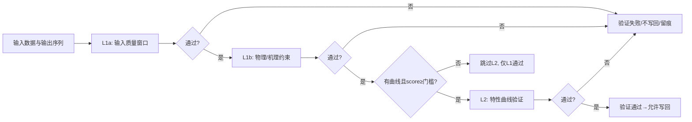

# 阶段3：验证体系设计（两层验证：质量窗口/物理机理 + 特性曲线）

- 版本：v0.1
- 日期：2025-09-28
- 负责人：Augment Agent


本文件定义指标计算结果的验证体系，确保端到端质量：输入可靠、输出可解释、异常可回溯。与阶段2/4口径完全一致：UTC对齐、[start,end)、单位归一、幂等、RunContext留痕。

---

## 1. 目标与范围
- 目标：对阶段2计算链路的“输入→计算→输出”进行两层验证与留痕；在无/低质曲线时仅执行第一层。
- 范围：
  - 第一层（L1）：输入质量窗口 + 物理/机理约束（统称“质量窗口/物理机理”）；
  - 第二层（L2）：特性曲线验证（回退链、门槛、稳定性）。
- 不做：改变 fact_measurements 结构；当前批次不因优化结果而回填改变（见阶段4）。

## 2. 原则与约束
- 一致性：与阶段2共享时间/单位/阈值/幂等/RunContext 口径。
- 安全性：验证失败不写回；仅记录 calculation_result_validation 并留痕。
- 透明性：所有阈值来自 remark(JSON) 与元数据；RunContext 固化生效值与来源。

## 3. 验证对象与数据模型
- 输入：frame_by_ts_bucket（按 ts_bucket 秒对齐；包含 required_inputs 列、运行态与 presence 掩码）。
- 输出：series（按 ts_bucket 对齐，允许 NaN）。
- 片段：Segment = {device_id, metric_id, segment_start, segment_end}（连续、running=1）。
- 记录：calculation_result_validation（validation_type、result、reason/json、ts、calculation_id）。
- RunContext：见阶段2 §13；本章新增字段见 §9。

## 4. 验证流程（Mermaid）


## 5. L1a：输入质量窗口（sp_mark_quality_window）
- 目的：确保计算所需输入在窗口内“可用、稳定、无严重异常”。
- 时机：
  - 写回前：必做；对 required_inputs 执行窗口质量校验（vfast/diag优先）。
  - 写回后：对输出仅做抽样/变化量校验（降低I/O）；异常打 validation 记录。
  - 默认抽样/变化量参数：抽样比例 p≈5%，变化量阈值 θ≈3σ；异常则报警+人工复核标签（可配）


- 关键规则：
  - 窗口：[start,end)；UTC对齐；与阶段2相同。
  - 掩码：presence ∧ running（来自 metrics_presence_per_second 与 mv_device_running_1s）。
  - 指标：required_inputs 清单与 coverage_threshold、required_inputs_presence_min 从 remark(JSON) 读取；无则落回全局。
- 结果：
  - pass/fail + stats（缺失率、变化率、跳变/平台/非单调/噪声等）；fail 则不写回。
  - calculation_result_validation：validation_type='quality_window_input'/'quality_window_output'。

## 6. L1b：物理/机理约束（PhysicalConstraintValidator）
- 目的：保障输出值在物理/机理上合理（范围、单调性、符号、能量守恒等）。
- 规则（示例）：
- 默认物理边界建议值（文档级）：Q≥0；H≥0；η∈[0,1]；P_in>0；如无设备/型号覆盖则采用默认；越界点置 NaN 并统计

  - 流量Q ≥ 0；扬程H ≥ 0；效率η ∈ [0,1]；输出在运行态内连续；越界点标记为 NaN 并统计。
  - 单调/形态约束（在适用工况）：λ段内不可逆跳、异常高频抖动限制等。
- 配置：
  - 阈值/范围由 remark(JSON) 指定（设备/指标优先→全局默认）。
  - VFD 相似定律缩放：记录速度/频率口径与缩放因子。
- 结果：
  - pass/fail + stats；fail 不写回。
  - calculation_result_validation：validation_type='physical_constraints'。

## 7. L2：特性曲线验证（CurveValidator）
- 前提：存在可用曲线且综合 score ≥ min_curve_score；样本量 ≥ N_min。
- 回退链：device > model > series > vendor；映射口径来源于维表/配置，否则跳过 L2。
- 评分：
- 评分权重建议（可配）：residual=0.5、stability=0.3、coverage=0.2；可由 remark(JSON) 中 curve_score_weights 覆盖

  - 拟合残差：RMSE/MAE/MAPE；
  - 结构约束：单调/凸性/物理边界；
  - 稳定性：分窗评分稳定度；
  - 覆盖度：工作区间覆盖比例；
  - 综合 score ∈ [0,1]（策略写 remark(JSON)）。
- 结果：
  - pass/fail + residual_stats + curve_meta（curve_id、fallback_level、N_used、score、阈值）；
  - calculation_result_validation：validation_type='curve_validation'；
  - 不足门槛：仅执行 L1，通过则允许写回。

## 8. 失败与跳过语义（增强版）

### 8.1 L1验证失败处理
- **质量窗口失败**：不写回；记录 calculation_result_validation 详情；必要时触发报警
- **物理约束失败**：不写回；记录违反的具体约束和统计信息
- **无方法回退策略**：
  - 一次性降阈值到0.8复评：当无候选方法时，将 coverage_threshold 降至0.8重新评估
  - 仍无则跳过该段：降阈值后仍无可用方法，跳过该时间段并写入 run_context
  - 详细记录：在 run_context 中记录无方法的具体原因（输入不足、阈值过严等）

### 8.2 L2验证跳过处理
- **跳过条件**：因"无曲线/低质/无映射/样本不足"导致的L2跳过
- **处理策略**：仅 L1 通过即允许写回；RunContext 记录跳过原因
- **无/低质曲线回退**：
  - 仅执行第一层验证：当无可用曲线或 performance_score < min_curve_score 时
  - 跳过第二层验证：不执行特性曲线验证，仅依赖物理/机理验证
  - 记录跳过原因：在 run_context 中记录 L2 跳过的具体原因和曲线状态

### 8.3 数据质量处理
- **局部 NaN**：仅写回非 NaN 点，NaN 比例/分布摘要写 RunContext
- **缺失单位映射**：拒绝计算并记录到 run_context
- **数据质量不足**：跳过并记录质量问题详情

### 8.4 原有处理策略（保留）
- L1 失败：不写回；记录 validation 详情；必要时触发报警。
- L2 跳过：因“无曲线/低质/无映射/样本不足”→仅 L1 通过即允许写回；RunContext 记录跳过原因。
- 局部 NaN：仅写回非 NaN 点，NaN 比例/分布摘要写 RunContext。

## 9. RunContext 字段（验证相关增量）

### 9.1 验证核心字段
- **quality_window**：inputs_pass(bool)、outputs_sample_pass(bool)、stats_digest
- **physical_constraints**：pass(bool)、violations_digest、vfd_scaling_info
- **curve_validation**：pass(bool)、curve_id、fallback_level、score、N_used、residual_stats

### 9.2 必填配置字段（与用户操作清单对应）
- **method_id**：选择的计算方法标识符
- **set_id**：使用的参数集标识符（来自 rls_parameter_set）
- **curve_id**：使用的特性曲线标识符（如适用）
- **min_curve_score**：特性曲线的最小评分要求
- **thresholds**：coverage_threshold、required_inputs_presence_min、min_curve_score、N_min、thresholds_hash

### 9.3 单位与常数字段
- **unit_map_version**：单位映射版本标识
- **unit_factors_digest**：单位换算因子摘要
- **physical_constants**：ρ（密度）、g（重力加速度）、温度、海拔、VFD口径等
- **assumptions**：当环境数据缺失时采用的常数与假设说明

### 9.4 运维统计字段
- **batch_concurrency_stats**：批量/并发/重试统计
- **mv_refresh_coverage**：mv刷新覆盖范围
- **version_source**：version_tag/source标识

### 9.5 时间与窗口字段
- **window/mask**：tz、window_original、window_aligned_utc、presence_running_digest

## 10. 错误分类与处理
- 参数/口径错误（ValueError）：立即失败并留痕；
- 数据访问错误（DataAccessError）：有限重试；
- 资源/锁（Conflict/Deadlock/LockWait）：指数退避与降级；
- 验证失败（ValidationFail）：不写回，记录 validation 详情。

## 11. 性能与并发
- L1 基于窗口级函数（sp_mark_quality_window），尽量批量调用；
- L2 曲线评分按设备×分段并行，限制同站并发≤2；
- 抽样/变化量校验替代二次全量校验，降低I/O。

## 12. 监控与报警
- 指标：L1/L2 通过率、L2 跳过率、NaN 比例、窗口质量失败原因分布、曲线score分布、告警次数；
- 报警：通过率<阈值、L2 跳过率过高、NaN 比例异常、score 崩塌、连续物理越界等。

## 13. 验收标准与测试
- 单元测试：
  - L1：输入质量窗口阈值读取/缺省回退、失败原因分类；
  - 物理约束：范围/单调/越界统计；
  - L2：回退链选择、score&N_min 门槛、缺映射跳过；
  - RunContext：字段齐备、一致性校验（thresholds_hash、窗口对齐）。
- 小型集成测试：
- 幂等与compare-only策略复用：与阶段2 §10一致，命中幂等时进入只比对模式；差异超阈值δ（默认1%）仅报警与留痕，不直接覆盖

  - 数据：两台设备、两指标，含停机/缺失；一台无曲线、一台低质曲线；
  - 流程：计算→L1a→L1b→（跳过或执行）L2→写回/留痕；
  - 断言：无曲线或低质曲线时仅 L1 通过即可写回；失败不写回；RunContext/validation 可溯源。


## 附录A：极简 RunContext 示例（节选）
```json
{"tz":"Asia/Shanghai","window_aligned_utc":"2025-09-28T00:00:00Z/01:00:00Z","thresholds_hash":"b06e…","min_curve_score":0.75,"N_min":300}
```

## 14. 与阶段2/4的接口对齐
- 与阶段2：validate_quality() 可封装 L1a 与 L1b；validate_curve() 对应 L2；
- 与阶段4：L2 的评分/元信息为优化引擎的输入；优化变更不影响当前批次，仅影响后续批次。

## 15. 非范围说明
- 不改 fact_measurements 结构；不以验证器直接修改已写回的历史数据；
- 不引入黑箱模型作为强依赖；可作旁路对比参考。

