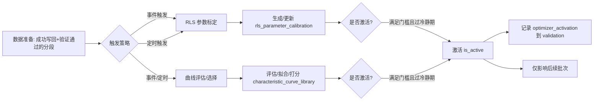

# 阶段4：优化引擎设计（RLS 参数标定 + 特性曲线评估/选择）

- 版本：v0.1
- 日期：2025-09-28
- 负责人：Augment Agent


本设计文件定义“优化引擎”的目标、原则、流程、算法、接口、监控与验收标准。优化引擎仅用于提升后续批次计算的输入参数与曲线治理，不参与当前批次基础计算的产出，避免掩耳盗铃；其变更以 is_active 激活/回滚的方式影响后续批次。

---

## 1. 目标与范围
- 目标：
  - 利用历史数据与最新计算结果，持续优化设备级参数（RLS）与特性曲线（评估/选择/版本管理），提升后续批次的计算精度与稳定性。
- 范围：
  - 参数优化：RLSParameterCalibrator 针对设备级参数集（rls_parameter_set + rls_parameter_calibration）
  - 曲线优化：CharacteristicCurveEvaluator 对 characteristic_curve_library 的候选进行评估/选择/激活
  - 变更治理：激活/回滚、冷静期与最短保持期、自动/人工触发并存
  - 留痕与审计：calculation_result_validation + run_context 承载优化留痕

## 2. 原则与约束
- 不修改 fact_measurements 结构；优化引擎不回写当前批次结果，仅影响后续批次。
- 激活/回滚只改变参数集/曲线库的 is_active 与元数据，不触碰事实数据。
- 严格使用 (station_id, device_id, metric_id, ts_bucket) 冲突策略的写回口径；优化不绕开已定的两层验证与计算流程。
- 窗口口径、时间对齐与单位/阈值/幂等的口径与阶段2保持一致（UTC 对齐，[start,end)，单位归一，阈值 JSON，calculation_id 规则等）。

## 3. 架构与流程（Mermaid）


## 4. 数据模型与表对象（复用+约束）
- rls_parameter_set（设备级参数成套）
  - 约束：同一 device_id 最多一条 is_active=true（唯一激活索引）
  - 字段要点：set_id（PK）、device_id、name、is_active、activation_ts、remark、version_tag、source
- rls_parameter_calibration（参数优化历史）
  - 字段要点：device_id、set_id（FK）、parameter_name、parameter_value、calibration_ts、performance_score、remark
- characteristic_curve_library（特性曲线库）
  - 字段要点：curve_id（PK）、device_id、applicability（device/model/series/vendor）、curve_type（H-Q/η-Q/P-Q）、knots/coeffs、is_active、version_tag、source、performance_score、remark
- calculation_result_validation（验证与留痕）
  - 优化留痕：validation_type='optimizer_activation' | 'optimizer_evaluation' | 'run_context'
  - 记录：calculation_id、target（parameter_set/curve_id）、result（pass/fail/neutral）、reason/json、ts

## 5. 触发策略与数据准备
- 事件触发：当某设备×指标在某窗口写回成功且两层验证通过（或仅第一层，L2 跳过有记录）时，压入优化队列（去重，幂等）。
- 定时触发：按设备/站点定时扫描最近 N 天（可配）有效片段，批量生成优化任务（限流）。
- 数据筛选：
  - 排除停机/无效/质量窗口失败片段；L2 跳过的数据可用于 RLS（若物理合理），但曲线评估需达到 N_min。
  - 单位归一、UTC 对齐、presence/running 与阶段2一致；RunContext 引用窗口、阈值与版本信息。

## 6. 参数优化：RLSParameterCalibrator
### 6.1 问题定义
- 目标：在线/离线地估计设备参数 θ，使物理计算器 f(x;θ) 对观测 y 的残差最小（最小二乘或鲁棒损失）。
- 数据：来自阶段2写回成功的输出与其输入向量（按 ts_bucket 对齐后的 frame_by_ts_bucket）。

### 6.2 算法（递推最小二乘 RLS）
- 形式：θ_k = θ_{k-1} + K_k (y_k - x_k^T θ_{k-1})
- 增益：K_k = P_{k-1} x_k / (λ + x_k^T P_{k-1} x_k)
- 协方差：P_k = (1/λ)(P_{k-1} - K_k x_k^T P_{k-1})
- 遗忘因子 λ ∈ (0,1]（建议 0.95–0.995），数值稳定加噪（ridge）与矩阵对称性修正，异常点抑制（Huber/Tukey 可选）。
- 约束：参数边界/物理可行域；超界则截断或回退上一次稳定版本。

### 6.3 训练/评估
- 采样：按设备分片，优先运行态段，过滤 NaN；样本量不足不更新。
- 指标：RMSE/MAE/MAPE、R²、稳定性（滚动窗口 Δθ）、鲁棒性（异常点比例）、覆盖度。
- 筛选：仅当 performance_score 相比当前激活版本提升 > Δ_threshold（如 3–5%）且满足 N_min（如 ≥300 点）时，才进入“候选待激活”。

- 数据分割与泄漏防护：采用时间分割（滚动窗口训练，固定未来窗口评估）或k-fold时间切片交叉验证；严格避免train/test时间泄漏
- 影子评估期：在正式激活前可配置一段影子评估期（只评估不激活），达标后进入激活候选

## 7. 曲线优化：CharacteristicCurveEvaluator
### 7.1 问题定义
- 目标：评估/选择 H-Q / η-Q / P-Q 等曲线候选，或对曲线进行拟合升级，作为第二层验证与后续优化的依据。
- 曲线形式：
  - 插值型（样条/分段线性）或多项式型（如 H(Q) = a - bQ^2），单位与量纲需 SI 归一，必要时按相似定律缩放（VFD）。

### 7.2 数据与评分
- 数据：阶段2输出与对应输入的对齐集合，过滤 NaN、停机与质量失败点。
- 评分：
  - 拟合残差：RMSE/MAE/相对误差（MAPE）
  - 结构约束：单调/凹性/物理边界（负流量/负扬程否定）
  - 稳定性：时间分窗评分稳定性（方差/漂移）
  - 覆盖度：样本在工作区间覆盖比例
  - 综合 score ∈ [0,1]，策略可写入 remark(JSON)
- 门槛：min_curve_score（如 ≥0.75）且 N_min（如 ≥300），否则不作为 L2。

### 7.3 选择与回退
- 回退链：device > model > series > vendor；查找优先级与映射口径在维表/配置中给出。
- 无可用曲线或得分不足：维持“仅第一层验证”策略（阶段1/2已定）。

## 8. 激活与回滚（防抖动）
- 激活条件：
  - RLS：新 performance_score 相对当前激活提升 > Δ_threshold（如 3–5%）；样本≥N_min；通过 L1；无明显物理越界；冷静期/保持期满足。
  - 曲线：score ≥ min_curve_score 且相对现有激活有显著提升；样本≥N_min；冷静期/保持期满足。
- 冷静期与最短保持期：默认冷静期≥24h；最短保持期≥3批/7天（可配置）。
- Champion/Challenger（可选）：高风险设备先小流量启用（若架构允许）；或影子评估一段时间，持续优于基线且达门槛再激活

- 回滚条件：
  - 连续 M 次（如 3 次）窗口劣化超过阈值；或触发安全监控阈值（大幅偏离/不合理残差）。
- 决策记录：在 calculation_result_validation 写 validation_type='optimizer_activation'，记录旧/新版本、指标、score、Δ、阈值、原因、触发者/作业ID、版本/标签。

## 9. 并发、批量与资源配额
- 优化作业默认并发 ≤ 计算作业并发的一半；支持设备/站点级限流与队列优先级。
- 数据批量：按设备×时间窗口分片（5–15 分钟）聚合，批量评估，避免跨 chunk 争用。
- 重试/退避：重试上限（单批≤3，设备段≤5），指数退避 100→200→400→800ms（上限1s±50ms）。

## 10. 安全与一致性
- 与阶段2一致的时区/单位/阈值/幂等口径；所有输入输出均写入 run_context。
- 优化运行若失败，不影响基础计算；遇异常进入降级或跳过，记录原因并报警。

## 11. 接口与契约（应用层）
- Optimizer.run(device_id, metrics, start, end, options) → OptimizeReport
  - options：trigger=event|cron、target=rls|curve|both、cooldown/hold_period、Δ_threshold、N_min、min_curve_score
- RLSParameterCalibrator.fit(device_id, set_id?, samples) → CalibResult
  - 输出：θ_new、performance_score、n_samples、diagnostics、proposed_activation(bool)
- CharacteristicCurveEvaluator.evaluate_or_fit(device_id, curve_scope, samples) → CurveEvalResult
  - 输出：curve_id候选/拟合系数、score、n_samples、diagnostics、proposed_activation(bool)
- Activation.apply(entity=rls_set|curve, id, reason, context) → ActivationResult
  - 规则：先检查冷静期与保持期；再检查相对提升阈值；通过则原子切换 is_active 并留痕。

## 12. RunContext 与留痕
- run_context（validation_type='run_context'）
  - time：tz、window_original、window_aligned_utc
  - version：method_version、thresholds_hash、unit_map_version
  - failure_analysis：原因类别（数据变质/工况变化/模型不稳）、关联系列与参数、建议动作（回滚/延长冷静期/抬升阈值）

  - mv：last_refreshed_ts、covered
  - optimizer：trigger、target、Δ_threshold、N_min、min_curve_score、cooldown、hold_period
  - rls：old_set_id/new_set_id、θ_digest、performance_score_old/new、Δ
  - curve：old_curve_id/new_curve_id、score_old/new、N_used、fallback_level
  - 监控：batch_size、concurrency、retries、降级事件；告警统计
- calculation_result_validation（优化）
  - optimizer_evaluation：记录评分/残差/约束结果
  - optimizer_activation：记录激活/回滚决策与原因

## 13. 监控与报警
- 指标：
  - 成功率、吞吐、P50/P95 延迟、重试/死锁比
  - 评分分布（performance_score/curve_score）、激活率、回滚率
  - 高风险事件：越界检测、异常残差飙升、N_min 不足导致频繁跳过
- 报警建议（默认）：
  - 成功率<99%、P95>2s、死锁>0.5%、回滚率>5%、激活抖动>2/日

## 14. 性能预期与资源评估
- RLS：单设备每批 O(n·p^2)，p 为参数维度（一般较小）；向量化+批量化后 CPU 可控。
- 曲线：拟合/评分 O(n·k)，k 为模型复杂度；样条/多项式的 k 较小，主要受样本量与并发影响。
- 通过“设备×时间分片 + 并发限流 + 批量评估 + 临时表”可控住 DB 锁争用与 I/O 峰值。

## 15. 验收标准与测试计划
- 单元测试：
  - RLS：数值稳定性（对称性、正定性修正）、遗忘因子、鲁棒性（异常点）
  - 曲线：评分一致性、门槛/样本量约束、生效与跳过逻辑
  - 激活：Δ 提升阈值、冷静期/保持期、回滚条件
- 集成测试：
  - 构造“有曲线/无曲线/低质曲线、足样本/欠样本”的设备样本
  - 跑通：事件触发→评估/标定→候选→（满足门槛）激活→留痕
  - 断言：不影响当前批次；仅影响后续；run_context/validation 记录齐备；报警触发合理

## 16. 风险与缓解
- 过拟合/漂移：引入时间稳定性指标与保持期；样本量门槛 N_min；Δ 提升阈值
- 抖动：冷静期+最短保持期，回滚也遵循同策略
- 异常点：鲁棒损失/过滤；越界保护
- 锁竞争：批量/限流/退避；临时表写入
- 口径不一致：与阶段2共享同一单位/时间/阈值/幂等口径，并在 run_context 固化

## 附录A：极简 RunContext 示例（节选）
```json
{"tz":"Asia/Shanghai","window_aligned_utc":"2025-09-28T00:00:00Z/01:00:00Z","Δ_threshold":0.03,"N_min":300,"min_curve_score":0.75}
```


## 17. 非范围说明
- 不直接修改 fact_measurements 已写入值；不参与当前批次基础计算产出
- 不新增事实表结构；仅依赖 public.* 配置/元数据表
- 不引入黑箱模型（深度学习等）作为强依赖，可作为“旁路对比”

