# 特性曲线拟合系统 - 系统架构总览

**版本**: v1.1
**创建日期**: 2025-12-03
**最后更新**: 2025-12-04
**来源**: 原02_核心模块详细设计.md 第1章
**状态**: 从原文档拆分

---

## 📋 目录

- [1. 文档目的](#1-文档目的)
- [2. 数据库访问模式](#2-数据库访问模式)
- [3. 拟合执行策略](#3-拟合执行策略)
- [4. 模块分层架构](#4-模块分层架构)
- [5. 模块统计](#5-模块统计)
- [6. 类型安全规范](#6-类型安全规范)
- [7. 依赖关系总览](#7-依赖关系总览)

---

## 1. 文档目的

本文档详细描述特性曲线拟合系统的核心模块设计，包括：
- **P0 主管道层**：CurveFittingPipeline（总入口）
- **P0 方法层基础**：BaseMethod、MethodRegistry
- **P0 共用层核心**：ResultStorage、CacheManager
- **P1 共用层扩展**：BatchProcessor、ParameterOptimizer、HistoricalDataEvaluator、TimeWindowValidator、ResultOutput
- **约束层**：MonotonicityConstraint、BoundaryConstraint、PhysicsValidator
- **预处理层**：DataCleaner、Normalizer、FeatureEngineer

**相关文档**：
- [数据流定义](02_数据流定义.md) - 13阶段流程权威定义
- [术语和规范](03_术语和规范.md) - 术语表、日志规范

---

## 2. 数据库访问模式（重要）

> **⚠️ 强制规则**：本系统**必须使用项目现有的数据库连接池**，不允许重复造轮子。

**现有连接池位置**：`app/adapters/db/pool.py`

**使用方式**：
```python
from app.adapters.db.pool import get_connection

# 使用上下文管理器获取连接（推荐方式）
with get_connection() as conn:
    with conn.cursor() as cursor:
        # 执行SQL操作
        cursor.execute("SELECT ...")
        conn.commit()

# 在组件中使用
class ResultStorage:
    """使用 get_connection() 上下文管理器获取连接"""

    def save(self, ...):
        with get_connection() as conn:
            with conn.cursor() as cursor:
                # 执行SQL操作
                cursor.execute(...)
                conn.commit()
```

**禁止事项**：
- ❌ 禁止创建新的连接池实现
- ❌ 禁止使用SQLAlchemy ORM（项目使用psycopg2原生连接）
- ❌ 禁止在组件内部创建数据库连接

**并发控制**：
- 并发控制依赖连接池自身的`maxconn`限制
- `BatchProcessor`的`max_workers`应设置为不超过连接池`maxconn`值

---

## 3. 拟合执行策略（重要）

> **⚠️ 强制规则**：本系统采用**顺序拟合策略**，不使用并发拟合。

**执行顺序**：
1. 按设备ID顺序处理（device_id: 1 → 2 → 3 → ...）
2. 每个设备按曲线类型顺序处理（qh → qp → qeta）
3. 每种曲线类型按方法优先级顺序尝试

**原因**：
- 避免数据库连接竞争
- 简化错误处理和日志追踪
- 便于断点续传和进度恢复

**禁止事项**：
- ❌ 禁止同时拟合多个设备
- ❌ 禁止同时拟合同一设备的多种曲线类型

---

## 4. 模块分层架构

```
┌─────────────────────────────────────────────────────────────┐
│                      CLI 命令层                              │
│  (app/cli/main.py)                                          │
└─────────────────────────────────────────────────────────────┘
                            ↓
┌─────────────────────────────────────────────────────────────┐
│                    主管道层 (Pipeline)                       │
│  CurveFittingPipeline                                       │
└─────────────────────────────────────────────────────────────┘
                            ↓
        ┌───────────────────┼───────────────────┐
        ↓                   ↓                   ↓
┌──────────────┐   ┌──────────────┐   ┌──────────────┐
│  QH 曲线模块  │   │  QP 曲线模块  │   │ QEta 曲线模块 │
└──────────────┘   └──────────────┘   └──────────────┘
        ↓                   ↓                   ↓
┌─────────────────────────────────────────────────────────────┐
│  共用层 + 方法层 + 约束层 + 预处理层                          │
└─────────────────────────────────────────────────────────────┘
        ↓
┌─────────────────────────────────────────────────────────────┐
│                  核心数据结构 (Data Structures)               │
└─────────────────────────────────────────────────────────────┘
```

---

## 5. 模块统计

| 层次 | 模块数 | 文件数 | 优先级 | 说明 |
|-----|-------|-------|-------|------|
| **核心数据结构** | 4 | 1 | P0 | FitResult, ValidationResult, EvaluationReport, MethodResult |
| **主管道层** | 1 | 1 | P0 | CurveFittingPipeline |
| **方法层基础** | 2 | 2 | P0 | BaseMethod, MethodRegistry |
| **共用层核心** | 2 | 2 | P0 | ResultStorage, CacheManager |
| **共用层扩展** | 5 | 5 | P1 | BatchProcessor等 |
| **约束层** | 3 | 3 | P0 | 物理约束验证 |
| **预处理层** | 3 | 3 | P1 | 数据预处理 |
| **总计** | 20 | 17 | - | 本文档覆盖的模块 |

---

## 6. 类型安全规范（重要）

> **⚠️ 强制规则**：本系统使用Python类型注解和TypedDict/Literal确保类型安全。

### 6.1 曲线类型定义

```python
from typing import Literal, TypedDict

# 曲线类型（使用Literal确保类型安全）
CurveType = Literal['qh', 'qp', 'qeta', 'heta', 'peta', 'qnpsh']

# 状态类型
FitStatus = Literal['active', 'archived', 'deprecated']

# 验证结果类型
ValidationStatus = Literal['passed', 'failed', 'warning']
```

### 6.2 配置参数TypedDict

```python
class ValidationConfig(TypedDict, total=False):
    """验证配置参数"""
    min_r_squared: float
    max_rmse: float
    max_mape: float
    monotonicity_tolerance: float
    boundary_tolerance: float


class PerformanceConfig(TypedDict, total=False):
    """性能配置参数"""
    fitting_timeout: int
    batch_size: int
    max_retries: int
    retry_delay_seconds: float


class MethodConfig(TypedDict):
    """方法配置"""
    method_id: str
    method_name: str
    priority: int
    validation: ValidationConfig
    performance: PerformanceConfig
```

### 6.3 数据结构TypedDict

```python
class DeviceParams(TypedDict):
    """设备额定参数"""
    rated_flow: float
    rated_head: float
    rated_power: float
    rated_efficiency: float  # 可选，可计算


class FitResultDict(TypedDict):
    """拟合结果字典

    ⚠️ v2.3修复P78：与06_数据结构.md中FitResult保持一致
    完整定义参见 06_数据结构.md
    """
    device_id: int
    curve_type: CurveType
    version: str
    method_id: str
    coefficients: dict  # v2.3修复P78：使用coefficients而非params（术语统一）
    r_squared: float
    rmse: float
    mae: float
    mape: float
    status: FitStatus
```

### 6.4 类型检查工具

**推荐使用**：
- `mypy`：静态类型检查
- `pyright`：VS Code集成类型检查

**配置示例**（pyproject.toml）：
```toml
[tool.mypy]
python_version = "3.10"
strict = true
warn_return_any = true
warn_unused_ignores = true

[[tool.mypy.overrides]]
module = "app.services.characteristic_curves.*"
disallow_untyped_defs = true
```

---

## 7. 依赖关系总览

### 7.1 文本依赖树

```
CurveFittingPipeline (主管道)
├── ResultStorage (共用) ─────────────────┐
├── CacheManager (共用) ──────────────────┤
├── BatchProcessor (共用) ────────────────┤
├── ParameterOptimizer (共用) ────────────┼── 依赖注入
├── HistoricalDataEvaluator (共用) ───────┤
├── TimeWindowValidator (共用) ───────────┤
├── ResultOutput (共用) ──────────────────┘
├── ConstraintLearner (约束学习) ─────────┐
├── ConstraintParameterManager (约束管理) ┼── 约束优化
├── ConstraintCache (约束缓存) ───────────┘
├── QHCurve (曲线特定)
│   ├── QHDataExtractor
│   ├── QHPreprocessor ──── DataCleaner, Normalizer, FeatureEngineer
│   ├── QHConstraints ───── MonotonicityConstraint, BoundaryConstraint
│   ├── QHNormalizer
│   ├── QHValidator ─────── PhysicsValidator
│   └── QHCurveFitter
│       └── MethodRegistry
│           ├── BaseMethod
│           ├── Polynomial2Method
│           ├── Polynomial3Method
│           └── ...
├── QPCurve (曲线特定)
└── QEtaCurve (曲线特定)
```

### 7.2 模块依赖关系图（Mermaid）

```mermaid
graph TB
    %% 主管道
    Pipeline[CurveFittingPipeline<br/>主管道]

    %% 共用层
    ResultStorage[ResultStorage<br/>结果存储]
    CacheManager[CacheManager<br/>缓存管理]
    BatchProcessor[BatchProcessor<br/>批处理]
    ParamOptimizer[ParameterOptimizer<br/>参数优化]
    HistEvaluator[HistoricalDataEvaluator<br/>历史评估]
    TimeValidator[TimeWindowValidator<br/>时间窗口验证]
    ResultOutput[ResultOutput<br/>结果输出]

    %% 约束层
    ConstraintLearner[ConstraintLearner<br/>约束学习器]
    ConstraintParamMgr[ConstraintParameterManager<br/>约束参数管理器]
    ConstraintCache[ConstraintCache<br/>约束缓存]

    %% 曲线层
    QHCurve[QHCurve<br/>Q-H曲线]
    QPCurve[QPCurve<br/>Q-P曲线]
    QEtaCurve[QEtaCurve<br/>Q-η曲线]

    %% 方法层
    MethodRegistry[MethodRegistry<br/>方法注册器]
    BaseMethod[BaseMethod<br/>方法基类]

    %% 预处理层
    DataCleaner[DataCleaner<br/>数据清洗]
    Normalizer[Normalizer<br/>归一化]
    FeatureEngineer[FeatureEngineer<br/>特征工程]

    %% 约束验证层
    MonotonicityConstraint[MonotonicityConstraint<br/>单调性约束]
    BoundaryConstraint[BoundaryConstraint<br/>边界约束]
    PhysicsValidator[PhysicsValidator<br/>物理验证]

    %% 主管道依赖共用层
    Pipeline --> ResultStorage
    Pipeline --> CacheManager
    Pipeline --> BatchProcessor
    Pipeline --> ParamOptimizer
    Pipeline --> HistEvaluator
    Pipeline --> TimeValidator
    Pipeline --> ResultOutput

    %% 主管道依赖约束层
    Pipeline --> ConstraintParamMgr

    %% 约束层内部依赖
    ConstraintParamMgr --> ConstraintLearner
    ConstraintParamMgr --> ConstraintCache
    ConstraintLearner --> ResultStorage

    %% 主管道依赖曲线层
    Pipeline --> QHCurve
    Pipeline --> QPCurve
    Pipeline --> QEtaCurve

    %% 曲线层依赖方法层
    QHCurve --> MethodRegistry
    QPCurve --> MethodRegistry
    QEtaCurve --> MethodRegistry

    %% 方法层依赖
    MethodRegistry --> BaseMethod

    %% 曲线层依赖预处理层
    QHCurve --> DataCleaner
    QHCurve --> Normalizer
    QHCurve --> FeatureEngineer

    %% 曲线层依赖约束层
    QHCurve --> MonotonicityConstraint
    QHCurve --> BoundaryConstraint
    QHCurve --> PhysicsValidator

    %% 样式定义
    classDef pipelineClass fill:#ff6b6b,stroke:#c92a2a,stroke-width:3px,color:#fff
    classDef sharedClass fill:#4dabf7,stroke:#1971c2,stroke-width:2px,color:#fff
    classDef constraintClass fill:#51cf66,stroke:#2f9e44,stroke-width:2px,color:#fff
    classDef curveClass fill:#ffd43b,stroke:#f59f00,stroke-width:2px,color:#000
    classDef methodClass fill:#ff8787,stroke:#fa5252,stroke-width:2px,color:#fff
    classDef preprocessClass fill:#a78bfa,stroke:#7c3aed,stroke-width:2px,color:#fff

    class Pipeline pipelineClass
    class ResultStorage,CacheManager,BatchProcessor,ParamOptimizer,HistEvaluator,TimeValidator,ResultOutput sharedClass
    class ConstraintLearner,ConstraintParamMgr,ConstraintCache,MonotonicityConstraint,BoundaryConstraint,PhysicsValidator constraintClass
    class QHCurve,QPCurve,QEtaCurve curveClass
    class MethodRegistry,BaseMethod methodClass
    class DataCleaner,Normalizer,FeatureEngineer preprocessClass
```



**图例说明**：
- 🔴 **红色**：主管道（CurveFittingPipeline）
- 🔵 **蓝色**：共用层模块（7个）
- 🟢 **绿色**：约束层模块（6个）
- 🟡 **黄色**：曲线层模块（3条曲线）
- 🟠 **橙色**：方法层模块（注册器、基类）
- 🟣 **紫色**：预处理层模块（3个）

**依赖关系说明**：
1. **主管道 → 共用层**：主管道依赖所有共用层模块
2. **主管道 → 约束层**：主管道依赖约束参数管理器
3. **约束层内部**：ConstraintParameterManager 依赖 ConstraintLearner 和 ConstraintCache
4. **主管道 → 曲线层**：主管道依赖3条曲线类
5. **曲线层 → 方法层**：所有曲线依赖方法注册器
6. **曲线层 → 预处理层**：所有曲线依赖预处理模块
7. **曲线层 → 约束层**：所有曲线依赖约束验证模块

---

**文档结束**

