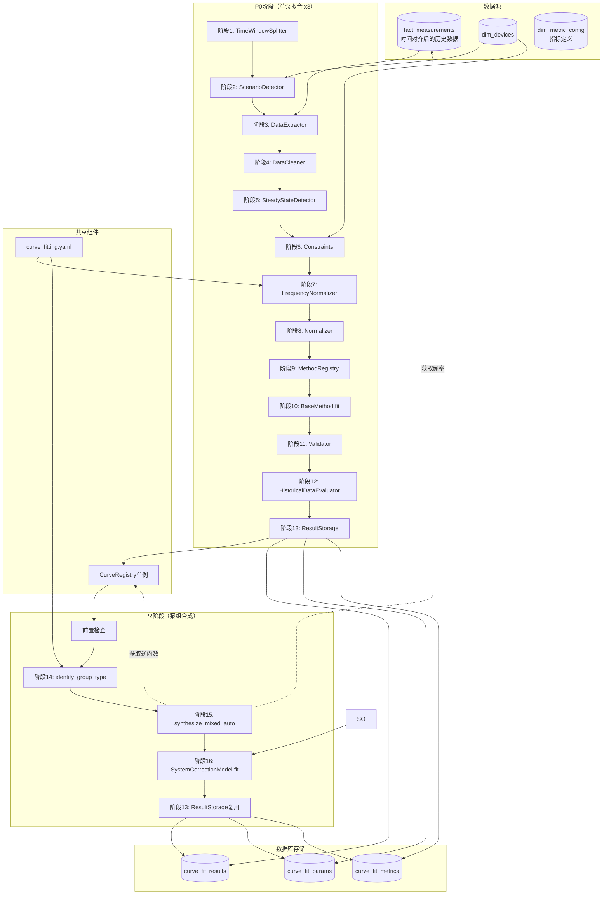

# 异构混合泵组完整流程模拟与审查

**版本**: v2.8
**创建日期**: 2025-12-04
**更新日期**: 2025-12-06
**状态**: 审查分析（已完成全场景验证）
**基于文档版本**: v3.15

> **v2.8更新日志**：
> - **[P81修复]** 阶段3数据提取SQL改用`metric_key`方式获取多指标数据
> - 修复原因：`fact_measurements`表无`ts, flow, head, freq, power, run_status`字段
>
> **v2.7更新日志**：
> - **[P80修复]** 步骤15.1频率查询SQL改用`metric_key='pump_frequency'`
> - 修复原因：`fact_measurements`表无`freq`字段，需通过`metric_id`关联查询
>
> **v2.6更新日志**：
> - **[数据源修复]** 步骤16.1训练数据提取SQL改用`fact_measurements`表
> - **[数据流图更新]** 移除不存在的`station_operations`表，添加`dim_metric_config`表

---

## 📋 目录

- [1. 场景参数](#1-场景参数)
- [2. 阶段执行流程](#2-阶段执行流程)
  - [2.1 P0阶段（单泵曲线 × 3）](#21-p0阶段单泵曲线--3)
  - [2.2 P2阶段（泵组合成）](#22-p2阶段泵组合成)
- [3. 数据流图](#3-数据流图)
- [4. 关键决策点分析](#4-关键决策点分析)
- [5. 问题与缺陷清单](#5-问题与缺陷清单)
- [6. 总结](#6-总结)

---

## 1. 场景参数

### 1.1 输入参数

| 参数 | 值 | 说明 |
|------|-----|------|
| **泵站ID** | `station_id = 1` | 供水泵站 |
| **曲线类型** | `curve_type = 'qh'` | 流量-扬程曲线 |
| **系统扬程** | `H_system = 35.0m` | 管网系统扬程 |
| **目标精度** | `R² > 0.92` | 混合泵组标准 |

### 1.2 泵组组成

| 泵ID | 类型 | 额定功率 | 控制类型 | 当前频率 | 备注 |
|:----:|------|:--------:|:--------:|:--------:|------|
| 101 | 变频泵 | 75kW | VFD | 45Hz | 变频泵#1 |
| 102 | 变频泵 | 110kW | VFD | 48Hz | 变频泵#2（功率差异>10%） |
| 201 | 软启泵 | 55kW | SS | 50Hz | 软启泵#1 |

### 1.3 场景识别预判

```
1. 控制类型检测: control_types = {VFD, SS} → 2种 → 进入混合分支
2. 功率差异计算: (110 - 55) / 110 = 50% >= 10% → 满足异构条件
3. 最终判定: MIXED_HETEROGENEOUS（异构混合泵组）

⚠️ v2.5修复P77：混合泵组内部也需要检查功率差异！
   - 功率差异 < 10% → MIXED_GROUP（同构混合）
   - 功率差异 >= 10% → MIXED_HETEROGENEOUS（异构混合）
```

### 1.4 执行路径预览

```
P0阶段（单泵拟合，执行3次）:
  泵101: 阶段1 → 2 → 3 → 4 → 5 → 6 → 7✓ → 8 → 9 → 10 → 11 → 12 → 13
  泵102: 阶段1 → 2 → 3 → 4 → 5 → 6 → 7✓ → 8 → 9 → 10 → 11 → 12 → 13
  泵201: 阶段1 → 2 → 3 → 4 → 5 → 6 → 7✗ → 8 → 9 → 10 → 11 → 12 → 13

P2阶段（泵组合成，执行1次）:
  泵组:  前置检查 → 阶段14 → 阶段15 → 阶段16 → 阶段13(复用)

注: ✓表示执行该条件阶段，✗表示跳过
```

---

## 2. 阶段执行流程

### 2.1 P0阶段（单泵曲线 × 3）

> 以下以泵101（变频泵）为主要示例，泵102类似，泵201跳过阶段7

---

#### 阶段1: 时间窗口划分

**执行模块**: `TimeWindowSplitter`

**触发条件**: 必须执行

**输入数据**:
```python
{
    "device_id": 101,
    "curve_type": "qh",
    "end_time": datetime(2025, 12, 4, 0, 0, 0),
    "lookback_days": 30  # 从配置读取
}
```

**核心逻辑**:
```python
# 时间窗口划分：75%训练 / 25%测试
total_days = 30
fit_days = int(total_days * 0.75)  # 22天
test_days = total_days - fit_days  # 8天

fit_window = (end_time - timedelta(days=30), end_time - timedelta(days=8))
test_window = (end_time - timedelta(days=8), end_time)
```

**输出数据**:
```python
TimeWindowSplitResult(
    fit_window_start=datetime(2025, 11, 4, 0, 0, 0),
    fit_window_end=datetime(2025, 11, 26, 0, 0, 0),
    test_window_start=datetime(2025, 11, 26, 0, 0, 0),
    test_window_end=datetime(2025, 12, 4, 0, 0, 0),
    can_evaluate=True  # test_window有足够数据
)
```

**配置依赖**:
- `configs/curve_fitting.yaml` → `preprocessing.lookback_days`

**数据库交互**: 无

**日志输出**:
```
[INFO] [TimeWindowSplitter] device_id=101: fit_window=22天, test_window=8天
```

**潜在问题**: 无

---

#### 阶段2: 场景识别

**执行模块**: `ScenarioDetector`

**触发条件**: 条件执行（根据配置决定）

**输入数据**:
```python
{
    "device_id": 101,
    "device_params": {
        "pump_type": "variable_frequency",  # 变频泵
        "control_type": "VFD",
        "rated_frequency": 50.0,
        "rated_power": 75.0
    }
}
```

**核心逻辑**:
```python
# 从dim_devices查询设备类型
if device_params['pump_type'] == 'variable_frequency':
    # 检查频率标准差（后续阶段3提取数据后判断）
    return Scenario.VFD_SINGLE
elif device_params['pump_type'] == 'soft_start':
    return Scenario.SOFT_START_SINGLE
```

**输出数据**:
```python
Scenario.VFD_SINGLE  # 变频泵单泵
```

**配置依赖**:
- `configs/curve_fitting.yaml` → `frequency_normalization.std_threshold`

**数据库交互**:
```sql
SELECT pump_type, control_type, rated_frequency, rated_power
FROM dim_devices WHERE id = 101;
```

**日志输出**:
```
[INFO] [ScenarioDetector] device_id=101: 识别为 VFD_SINGLE
```

---

#### 阶段3: 数据提取

**执行模块**: `DataExtractor`

**触发条件**: 必须执行

**输入数据**:
```python
{
    "device_id": 101,
    "fit_window": (datetime(2025, 11, 4), datetime(2025, 11, 26)),
    "curve_type": "qh"
}
```

**核心逻辑**:
```python
# 从fact_measurements提取原始数据（通过metric_key聚合多指标）
# 使用CASE WHEN + GROUP BY ts_bucket模式
metrics = ['pump_flow_rate', 'pump_head', 'pump_frequency',
           'pump_active_power', 'device_running']
```

**数据库交互**:
```sql
-- v2.8修复P81：使用metric_key方式获取多指标数据
-- fact_measurements表结构：id, station_id, device_id, metric_id,
--                         ts_raw, ts_bucket, value, source_hint, inserted_at
SELECT
    fm.ts_bucket,
    MAX(CASE WHEN mc.metric_key = 'pump_flow_rate' THEN fm.value END) AS Q,
    MAX(CASE WHEN mc.metric_key = 'pump_head' THEN fm.value END) AS H,
    MAX(CASE WHEN mc.metric_key = 'pump_frequency' THEN fm.value END) AS freq,
    MAX(CASE WHEN mc.metric_key = 'pump_active_power' THEN fm.value END) AS power,
    MAX(CASE WHEN mc.metric_key = 'device_running' THEN fm.value END) AS running
FROM fact_measurements fm
JOIN dim_metric_config mc ON mc.id = fm.metric_id
WHERE fm.device_id = 101
  AND fm.ts_bucket BETWEEN '2025-11-04' AND '2025-11-26'
  AND mc.metric_key IN (
      'pump_flow_rate', 'pump_head', 'pump_frequency',
      'pump_active_power', 'device_running'
  )
GROUP BY fm.ts_bucket
HAVING MAX(CASE WHEN mc.metric_key = 'device_running' THEN fm.value END) = 1
ORDER BY fm.ts_bucket;
```

**输出数据**:
```python
raw_data = pd.DataFrame({
    'ts_bucket': [...],  # 22天数据，约30000条（时间对齐后）
    'Q': [...],          # 流量 (m³/h)
    'H': [...],          # 扬程 (m)
    'freq': [...],       # 频率 (Hz)，范围[35, 50]
    'power': [...]       # 功率 (kW)
})
```

**日志输出**:
```
[INFO] [DataExtractor] device_id=101: 提取 30,245 条数据
```

**潜在问题**:
- 数据点不足100条时需要处理（见问题清单#1）

---

#### 阶段4: 数据预处理

**执行模块**: `DataCleaner`

**触发条件**: 必须执行

**输入数据**: `raw_data` (DataFrame, 30245条)

**核心逻辑**:
```python
# 1. 去除缺失值
data = raw_data.dropna(subset=['Q', 'H'])

# 2. 3σ异常值检测
for col in ['Q', 'H']:
    mean, std = data[col].mean(), data[col].std()
    data = data[(data[col] >= mean - 3*std) & (data[col] <= mean + 3*std)]

# 3. 物理范围过滤
data = data[(data['Q'] >= 0) & (data['H'] >= 0)]
```

**输出数据**:
```python
cleaned_data = pd.DataFrame({...})  # 28,500条（去除异常值约5%）
```

**配置依赖**:
- `configs/curve_fitting.yaml` → `preprocessing.outlier_detection: "3sigma"`

**日志输出**:
```
[INFO] [DataCleaner] device_id=101: 30245 → 28500 条 (去除5.8%)
```

---

#### 阶段5: 稳态识别

**执行模块**: `SteadyStateDetector`

**触发条件**: 条件执行（数据包含非稳态运行数据时）

**输入数据**: `cleaned_data` (DataFrame, 28500条)

**核心逻辑**:
```python
# 滑动窗口稳态检测
window_size = 10  # 10分钟窗口
for window in sliding_windows(data, window_size):
    Q_std = window['Q'].std()
    H_std = window['H'].std()
    if Q_std < threshold_Q and H_std < threshold_H:
        steady_state_data.append(window)
```

**输出数据**:
```python
steady_state_data = pd.DataFrame({...})  # 25,000条稳态数据
```

**日志输出**:
```
[INFO] [SteadyStateDetector] device_id=101: 识别稳态数据 25000 条
```

---

#### 阶段6: 约束计算

**执行模块**: `Constraints`

**触发条件**: 必须执行

**输入数据**: `steady_state_data`, `device_params`

**核心逻辑**:
```python
# 计算物理约束参数
constraints = {
    'Q_min': 0,
    'Q_max': data['Q'].max() * 1.2,
    'H_min': 0,
    'H_max': data['H'].max() * 1.1,
    'H0_estimate': data[data['Q'] < 50]['H'].mean(),  # 零流量扬程估计
    'rated_Q': 350,  # 额定流量
    'rated_H': 40    # 额定扬程
}
```

**输出数据**:
```python
constraints = {
    'Q_min': 0, 'Q_max': 420,
    'H_min': 0, 'H_max': 50,
    'H0_estimate': 45.2,
    'rated_Q': 350, 'rated_H': 40
}
```

**数据库交互**:
```sql
SELECT rated_flow, rated_head FROM dim_devices WHERE id = 101;
```

---

#### 阶段7: 频率归一化 ⭐

**执行模块**: `FrequencyNormalizer`

**触发条件**: `pump_type='variable_frequency'` AND `freq_std > 2.0`

**输入数据**:
```python
{
    "data": steady_state_data,  # 包含freq列
    "device_id": 101,
    "reference_freq": 50.0  # 从配置读取
}
```

**条件判断**:
```python
freq_std = data['freq'].std()  # 假设为 8.5Hz
config = load_curve_fitting_config()
std_threshold = config['frequency_normalization']['std_threshold']  # 2.0

if freq_std > std_threshold:  # 8.5 > 2.0 → 执行归一化
    execute_normalization = True
```

**核心逻辑（相似定律）**:
```python
reference_freq = config['frequency_normalization']['reference_freq']  # 50.0Hz

# 泵相似定律
data['Q_50'] = data['Q'] * (reference_freq / data['freq'])
data['H_50'] = data['H'] * (reference_freq / data['freq']) ** 2
data['P_50'] = data['power'] * (reference_freq / data['freq']) ** 3
```

**具体计算示例**:
```
原始数据: Q=300 m³/h, H=28 m, freq=45 Hz
归一化后: Q_50 = 300 × (50/45) = 333.3 m³/h
         H_50 = 28 × (50/45)² = 34.6 m
```

**输出数据**:
```python
normalized_data = pd.DataFrame({
    'Q': [...],      # 原始流量
    'H': [...],      # 原始扬程
    'freq': [...],   # 原始频率
    'Q_50': [...],   # 归一化流量
    'H_50': [...]    # 归一化扬程 ← 后续阶段使用此列
})
```

**配置依赖**:
- `configs/curve_fitting.yaml` → `frequency_normalization.reference_freq: 50.0`
- `configs/curve_fitting.yaml` → `frequency_normalization.std_threshold: 2.0`

**日志输出**:
```
[INFO] [FrequencyNormalizer] device_id=101: freq_std=8.5Hz > 2.0Hz, 执行归一化到50Hz
```

**泵201（软启泵）的处理**:
```
freq_std = 0.0Hz (恒定50Hz)
0.0 < 2.0 → 跳过阶段7，直接使用原始Q、H列
```

---

#### 阶段8-10: 归一化 → 方法选择 → 曲线拟合

**阶段8: Normalizer**
```python
# 数据标准化 [0, 1]
X_norm = (Q_50 - Q_min) / (Q_max - Q_min)
y_norm = (H_50 - H_min) / (H_max - H_min)
```

**阶段9: MethodRegistry**
```python
# 选择拟合方法
method = registry.get_method('qh', 'physics_pump_char')
# 返回: PhysicsPumpCharMethod (H = H0 + K*Q²)
```

**阶段10: BaseMethod.fit()**
```python
# 执行拟合
result = method.fit(X=Q_50, y=H_50, constraints=constraints)
# 输出: coefficients = {'H0': 45.2, 'K': -2.8e-5}
```

**拟合结果（泵101）**:
```python
MethodResult(
    method_name='physics_pump_char',
    coefficients={'H0': 45.2, 'K': -2.8e-5},
    r_squared=0.9712,
    rmse=0.85,
    predict_func=lambda Q: 45.2 - 2.8e-5 * Q**2
)
```

---

#### 阶段11-12: 验证 → 历史评估

**阶段11: Validator**
```python
# 物理约束验证
validation = {
    'H0_positive': coefficients['H0'] > 0,  # True
    'K_negative': coefficients['K'] < 0,     # True
    'r_squared_ok': r_squared > 0.95,        # True
    'monotonic': True  # H随Q增加而减小
}
```

**阶段12: HistoricalDataEvaluator** (条件执行)
```python
# 用test_window数据验证预测能力
test_data = extract_data(device_id=101, window=test_window)
predictions = predict_func(test_data['Q'])
test_r_squared = r2_score(test_data['H'], predictions)  # 0.9523
```

---

#### 阶段13: 存储结果 + CurveRegistry自动注册 ⭐

**执行模块**: `ResultStorage`

**核心逻辑**:
```python
class ResultStorage:
    def save(self, fit_result: FitResult) -> str:
        # 1. 存储到数据库
        with get_connection() as conn:
            result_id = self._insert_result(conn, fit_result)
            self._insert_params(conn, result_id, fit_result.coefficients)
            self._insert_metrics(conn, result_id, fit_result.metrics)

        # 2. ✅ 自动注册到CurveRegistry（v2.2新增）
        if fit_result.curve_type == 'qh':
            registry = CurveRegistry()
            registry.register(
                pump_id=fit_result.device_id,
                curve_type='qh',
                version=fit_result.version,
                coefficients=fit_result.coefficients,
                method_name=fit_result.method_name,
                Q_range=(0, fit_result.Q_max),
                H_range=(0, fit_result.H_max)
            )
            self._logger.info(f"[CurveRegistry] 已注册泵{fit_result.device_id}曲线")

        return fit_result.version
```

**数据库交互**:
```sql
-- 主表插入
INSERT INTO curve_fit_results (
    device_id, curve_type, version, method_name,
    data_start_time, data_end_time, data_point_count
) VALUES (101, 'qh', '20251204_100000', 'physics_pump_char',
          '2025-11-04', '2025-11-26', 25000);

-- 参数表插入
INSERT INTO curve_fit_params (result_id, param_category, param_key, param_value)
VALUES
    (1, 'fit', 'H0', 45.2),
    (1, 'fit', 'K', -2.8e-5);

-- 指标表插入
INSERT INTO curve_fit_metrics (result_id, r_squared, rmse, mae, mape)
VALUES (1, 0.9712, 0.85, 0.62, 2.1);
```

**CurveRegistry注册（关键步骤）**:
```python
# 注册后可供P2阶段使用
registry.get_forward(101, 'qh')  # 返回 Q → H 函数
registry.get_inverse(101, 'qh')  # 返回 H → Q 函数（逆函数）
```

**日志输出**:
```
[INFO] [ResultStorage] device_id=101: 存储成功, version=20251204_100000
[INFO] [CurveRegistry] 已注册泵101的qh曲线 (正向+逆函数)
```

---

### P0阶段执行汇总（3台泵）

| 泵ID | 场景 | 阶段7 | R² | H0 | K | 注册状态 |
|:----:|------|:-----:|:--:|:--:|:-:|:--------:|
| 101 | VFD_SINGLE | ✓执行 | 0.9712 | 45.2 | -2.8e-5 | ✅ 已注册 |
| 102 | VFD_SINGLE | ✓执行 | 0.9654 | 52.3 | -2.1e-5 | ✅ 已注册 |
| 201 | SOFT_START | ✗跳过 | 0.9801 | 38.5 | -3.2e-5 | ✅ 已注册 |

---

### 2.2 P2阶段（泵组合成）

> 前置条件：3台泵的P0拟合已完成，曲线已注册到CurveRegistry

---

#### P2入口：前置检查

**执行模块**: `PumpGroupProcessor._check_single_pump_curves()`

**输入数据**:
```python
{
    "station_id": 1,
    "pump_infos": [
        {"pump_id": 101, "rated_power": 75, "control_type": "VFD"},
        {"pump_id": 102, "rated_power": 110, "control_type": "VFD"},
        {"pump_id": 201, "rated_power": 55, "control_type": "SS"}
    ],
    "curve_type": "qh",
    "auto_trigger_p0": False
}
```

**核心逻辑**:
```python
def _check_single_pump_curves(self, pump_ids, curve_type):
    registry = CurveRegistry()
    missing = []
    for pump_id in pump_ids:
        if not registry.has_curve(pump_id, curve_type):
            missing.append(pump_id)
    return missing

# 检查结果
missing_curves = processor._check_single_pump_curves([101, 102, 201], 'qh')
# missing_curves = []  ✅ 全部已注册
```

**日志输出**:
```
[INFO] [PumpGroupProcessor] 前置检查通过: 所有 3 泵曲线已注册
```

---

#### 阶段14: 泵组类型识别 ⭐

**执行模块**: `PumpGroupProcessor.identify_group_type()`

**触发条件**: 条件执行（输入为station_id + pump_combination时）

**输入数据**:
```python
pump_infos = [
    {"pump_id": 101, "rated_power": 75, "control_type": "VFD"},
    {"pump_id": 102, "rated_power": 110, "control_type": "VFD"},
    {"pump_id": 201, "rated_power": 55, "control_type": "SS"}
]
```

**核心逻辑**:
```python
# v2.4修复P76：与07_泵组处理层.md权威实现保持一致
def identify_group_type(self, pump_infos):
    # 步骤1: 检查控制类型
    control_types = set(p.get('control_type', 'VFD') for p in pump_infos)
    is_mixed = len(control_types) > 1

    # ✅ 纯SS泵组不支持
    if control_types == {'SS'}:
        raise ValueError("不支持纯软启泵组：软启泵必须与变频泵混合使用")

    # 步骤2: 计算功率差异
    powers = [p.get('rated_power', 0) for p in pump_infos]
    power_diff = (max(powers) - min(powers)) / max(powers) if max(powers) > 0 else 0.0
    # power_diff = (110 - 55) / 110 = 50%

    # 步骤3: 混合泵组分支（VFD+SS）
    if is_mixed:
        if power_diff >= self._power_diff_threshold:  # 0.10
            return GroupProcessingStrategy.MIXED_HETEROGENEOUS  # 异构混合
        else:
            return GroupProcessingStrategy.MIXED_GROUP  # 同构混合

    # 步骤4: 纯VFD泵组分支
    # 4.1 检查频率差异（需要运行时频率数据）
    # 如果频率差异 >= 2%，返回 VFD_HETEROGENEOUS_FREQ

    # 4.2 检查功率差异
    if power_diff >= self._power_diff_threshold:  # 0.10
        return GroupProcessingStrategy.HETEROGENEOUS_GROUP
    else:
        return GroupProcessingStrategy.HOMOGENEOUS_GROUP
```

**关键决策点**:
```
1. control_types = {'VFD', 'SS'} → 混合控制类型
2. is_mixed = True → 进入混合分支
3. power_diff = 50% >= 10% → 满足异构条件
4. 最终判定: MIXED_HETEROGENEOUS（异构混合泵组）

⚠️ 注意：本场景实际应返回 MIXED_HETEROGENEOUS 而非 MIXED_GROUP！
   因为功率差异(50%) >= 阈值(10%)
```

**输出数据**:
```python
# 本场景的正确判定结果
group_type = GroupProcessingStrategy.MIXED_HETEROGENEOUS
```

**配置依赖**:
- `configs/curve_fitting.yaml` → `pump_group.power_diff_threshold: 0.10`

**日志输出**:
```
[INFO] [PumpGroupProcessor] 检测到混合控制类型(VFD+SS)，功率差异50%>=10%，判定为 MIXED_HETEROGENEOUS
```

---

#### 阶段15: 并联合成 ⭐

**执行模块**: `ParallelSynthesizer.synthesize_mixed_auto()`

**输入数据**:
```python
{
    "vfd_pump_ids": [101, 102],
    "ss_pump_ids": [201],
    "H_system": 35.0,
    "timestamp": datetime(2025, 12, 4, 10, 0, 0)  # 用于查询频率
}
```

##### 步骤15.1: 获取变频泵频率

**执行模块**: `FrequencyDataProvider.get_latest_frequencies()`

```python
# ✅ v2.6修复：使用metric_key='pump_frequency'查询频率
def get_latest_frequencies(self, pump_ids, timestamp=None):
    frequencies = {}
    for pump_id in pump_ids:
        # 从数据库查询最新频率（通过metric_key获取）
        cursor.execute("""
            SELECT fm.value AS freq
            FROM fact_measurements fm
            WHERE fm.device_id = %s
              AND fm.metric_id = (
                  SELECT id FROM dim_metric_config
                  WHERE metric_key = 'pump_frequency'
              )
              AND fm.ts_raw <= %s
            ORDER BY fm.ts_raw DESC LIMIT 1
        """, (pump_id, timestamp))
        row = cursor.fetchone()
        # ✅ v2.0: 查询失败直接抛异常，不使用默认值
        if row is None:
            raise FrequencyQueryError(f"无法获取泵{pump_id}的运行频率")
        frequencies[pump_id] = float(row[0])
    return frequencies

# 查询结果
pump_frequencies = {101: 45.0, 102: 48.0}
```

**数据库交互**（v2.6修复：使用metric_key查询）:
```sql
-- 查询泵101最新频率（通过metric_key='pump_frequency'）
SELECT fm.value AS freq
FROM fact_measurements fm
WHERE fm.device_id = 101
  AND fm.metric_id = (
      SELECT id FROM dim_metric_config
      WHERE metric_key = 'pump_frequency'
  )
  AND fm.ts_raw <= '2025-12-04 10:00:00'
ORDER BY fm.ts_raw DESC LIMIT 1;
-- 返回: 45.0

-- 查询泵102最新频率
SELECT fm.value AS freq
FROM fact_measurements fm
WHERE fm.device_id = 102
  AND fm.metric_id = (
      SELECT id FROM dim_metric_config
      WHERE metric_key = 'pump_frequency'
  )
  AND fm.ts_raw <= '2025-12-04 10:00:00'
ORDER BY fm.ts_raw DESC LIMIT 1;
-- 返回: 48.0
```

##### 步骤15.2: 处理变频泵（频率反归一化）

**物理原理**:
```
已知：
- 泵101曲线（50Hz）：H = 45.2 - 2.8e-5 × Q²
- 泵102曲线（50Hz）：H = 52.3 - 2.1e-5 × Q²
- 系统扬程 H_system = 35.0m
- 实际频率：泵101=45Hz，泵102=48Hz

求解流程：
1. 将系统扬程归一化到50Hz
2. 在50Hz曲线上求流量
3. 将流量反归一化到实际频率
```

**核心逻辑**:
```python
# 从CurveRegistry获取逆函数
registry = CurveRegistry()
reference_freq = 50.0  # 从配置读取

pump_flows = {}
Q_total = 0.0

# 处理泵101 (45Hz)
f_actual_101 = 45.0
H_50hz_101 = H_system * (reference_freq / f_actual_101) ** 2
# H_50hz_101 = 35.0 × (50/45)² = 43.2m

inverse_101 = registry.get_inverse(101, 'qh')
Q_50hz_101 = inverse_101(43.2)
# Q_50hz_101 = sqrt((43.2 - 45.2) / -2.8e-5) = 267.3 m³/h

Q_actual_101 = Q_50hz_101 * (f_actual_101 / reference_freq)
# Q_actual_101 = 267.3 × (45/50) = 240.6 m³/h

# 处理泵102 (48Hz)
f_actual_102 = 48.0
H_50hz_102 = H_system * (reference_freq / f_actual_102) ** 2
# H_50hz_102 = 35.0 × (50/48)² = 38.0m

inverse_102 = registry.get_inverse(102, 'qh')
Q_50hz_102 = inverse_102(38.0)
# Q_50hz_102 = sqrt((38.0 - 52.3) / -2.1e-5) = 824.4 m³/h

Q_actual_102 = Q_50hz_102 * (f_actual_102 / reference_freq)
# Q_actual_102 = 824.4 × (48/50) = 791.4 m³/h
```

##### 步骤15.3: 处理软启泵（直接使用曲线）

```python
# 泵201曲线（50Hz）：H = 38.5 - 3.2e-5 × Q²
# 软启泵无频率归一化，直接使用系统扬程

inverse_201 = registry.get_inverse(201, 'qh')
Q_201 = inverse_201(35.0)
# Q_201 = sqrt((35.0 - 38.5) / -3.2e-5) = 332.0 m³/h
```

##### 步骤15.4: 流量叠加

```python
Q_total = Q_actual_101 + Q_actual_102 + Q_201
# Q_total = 240.6 + 791.4 + 332.0 = 1364.0 m³/h

pump_flows = {101: 240.6, 102: 791.4, 201: 332.0}
```

**输出数据**:
```python
SynthesisResult(
    Q_total=1364.0,
    H_system=35.0,
    pump_flows={101: 240.6, 102: 791.4, 201: 332.0},
    pump_heads={101: 35.0, 102: 35.0, 201: 35.0},
    P_total=None,  # 未计算功率
    eta_total=None
)
```

**日志输出**:
```
[INFO] [ParallelSynthesizer] 混合泵组合成:
       泵101: Q=240.6 m³/h (45Hz)
       泵102: Q=791.4 m³/h (48Hz)
       泵201: Q=332.0 m³/h (SS)
       Q_total=1364.0 m³/h, H_system=35.0m
```

---

#### 阶段16: 系统修正系数学习 ⭐

**执行模块**: `SystemCorrectionModel.fit()`

**输入数据**:
```python
{
    "station_id": 1,
    "pump_ids": [101, 102, 201],
    "training_data": None  # 自动从数据库提取
}
```

##### 步骤16.1: 提取训练数据

**数据库交互**（v3.13修复：使用fact_measurements表）:
```sql
-- ✅ v3.13修复：从fact_measurements表提取泵站历史运行数据
-- fact_measurements存储时间对齐后的数据

WITH metric_ids AS (
    SELECT
        MAX(CASE WHEN metric_key = 'device_running' THEN id END) AS running_id,
        MAX(CASE WHEN metric_key = 'pump_flow_rate' THEN id END) AS flow_id,
        MAX(CASE WHEN metric_key = 'main_pipeline_outlet_pressure' THEN id END) AS pressure_id
    FROM dim_metric_config
),
pump_metrics AS (
    SELECT
        fm.ts_bucket,
        fm.device_id,
        MAX(CASE WHEN fm.metric_id = mi.running_id THEN fm.value END) AS running,
        MAX(CASE WHEN fm.metric_id = mi.flow_id THEN fm.value END) AS flow
    FROM fact_measurements fm
    CROSS JOIN metric_ids mi
    JOIN dim_devices dd ON fm.device_id = dd.id
    WHERE dd.station_id = 1
      AND fm.device_id = ANY(ARRAY[101, 102, 201])
      AND fm.ts_bucket BETWEEN '2025-01-01' AND '2025-12-01'
    GROUP BY fm.ts_bucket, fm.device_id
),
station_pressure AS (
    SELECT fm.ts_bucket, fm.value * 10.2 AS H_actual
    FROM fact_measurements fm
    CROSS JOIN metric_ids mi
    JOIN dim_devices dd ON fm.device_id = dd.id
    WHERE dd.station_id = 1
      AND fm.metric_id = mi.pressure_id
      AND fm.value > 0
),
aggregated AS (
    SELECT
        pm.ts_bucket,
        array_agg(pm.device_id) FILTER (WHERE pm.running = 1) AS running_pumps,
        COUNT(*) FILTER (WHERE pm.running = 1) AS N,
        SUM(pm.flow) FILTER (WHERE pm.running = 1) AS Q_total,
        sp.H_actual
    FROM pump_metrics pm
    JOIN station_pressure sp ON pm.ts_bucket = sp.ts_bucket
    GROUP BY pm.ts_bucket, sp.H_actual
    HAVING COUNT(*) FILTER (WHERE pm.running = 1) >= 1
)
SELECT running_pumps, N, Q_total, H_actual
FROM aggregated
WHERE running_pumps <@ ARRAY[101, 102, 201]  -- 运行泵是目标泵组的子集
ORDER BY Q_total;
```

**提取结果**:
```python
training_data = np.array([
    # [N, Q_total, H_actual, H_theoretical]
    [3, 1200, 36.5, 37.0],  # α = 36.5/37.0 = 0.986
    [3, 1350, 35.2, 35.8],  # α = 35.2/35.8 = 0.983
    [3, 1400, 34.8, 35.5],  # α = 34.8/35.5 = 0.980
    # ... 共1500条记录
])
```

##### 步骤16.2: 计算修正系数

```python
# 修正系数 = 实际扬程 / 理论扬程
alpha = training_data[:, 2] / training_data[:, 3]
# alpha 分布: 均值0.982, 标准差0.015
```

##### 步骤16.3: 训练修正模型

**核心逻辑**:
```python
class SystemCorrectionModel:
    def fit(self, station_id, pump_ids, training_data=None):
        if training_data is None:
            training_data = self._extract_training_data(station_id, pump_ids)

        # 检查数据量
        if len(training_data) < self._config.min_training_points:  # 100
            raise InsufficientDataError(f"训练数据不足: {len(training_data)} < 100")

        # 特征构造: [N, Q_total] → polynomial特征
        X = training_data[:, :2]  # [N, Q_total]
        y = training_data[:, 4]   # alpha

        # 多项式特征
        self._poly_features = PolynomialFeatures(degree=2, include_bias=True)
        X_poly = self._poly_features.fit_transform(X)
        # 特征: [1, N, Q, N², Q², NQ]

        # Ridge回归
        self._model = Ridge(alpha=self._config.regularization_alpha)
        self._model.fit(X_poly, y)

        # 保存系数
        self._coefficients = {
            'intercept': self._model.intercept_,
            'coef': self._model.coef_.tolist()
        }
        self._is_fitted = True

        return self
```

**训练结果**:
```python
correction_model = {
    "model_type": "polynomial",
    "is_fitted": True,
    "training_info": {
        "data_points": 1500,
        "train_r2": 0.91,
        "validation_r2": 0.88,
        "validation_rmse": 0.018,
        "trained_at": "2025-12-04T10:30:00+08:00"
    },
    "coefficients": {
        "intercept": 0.98,
        "coef": [0.0, -0.015, -8e-6, 0.002, 5e-9, -1e-5]
    },
    "feature_names": ["1", "N", "Q", "N²", "Q²", "NQ"],
    "valid_range": {
        "N_min": 1, "N_max": 3,
        "Q_min": 500, "Q_max": 2000
    }
}
```

**修正公式**:
```
α(N, Q) = 0.98 - 0.015×N - 8e-6×Q + 0.002×N² + 5e-9×Q² - 1e-5×NQ

示例：N=3, Q=1364
α = 0.98 - 0.015×3 - 8e-6×1364 + 0.002×9 + 5e-9×1860496 - 1e-5×4092
α ≈ 0.98 - 0.045 - 0.011 + 0.018 + 0.009 - 0.041
α ≈ 0.910

修正后扬程：H_actual = 35.0 × 0.910 = 31.85m
```

**配置依赖**:
- `configs/curve_fitting.yaml` → `pump_group.correction_model.model_type: "polynomial"`
- `configs/curve_fitting.yaml` → `pump_group.correction_model.polynomial_degree: 2`
- `configs/curve_fitting.yaml` → `pump_group.correction_model.min_training_points: 100`

**日志输出**:
```
[INFO] [SystemCorrectionModel] 训练完成:
       数据点: 1500
       训练R²: 0.91
       验证R²: 0.88
       验证RMSE: 0.018
```

---

#### 阶段13(复用): 存储泵组曲线

**执行模块**: `ResultStorage.save_group_result()`

**输入数据**:
```python
GroupFitResult(
    station_id=1,
    pump_combination=[101, 102, 201],
    group_type=GroupProcessingStrategy.MIXED_HETEROGENEOUS,  # v2.5修复P77：功率差异>=10%
    curve_type='qh',
    pump_count=3,
    valid_n_range=(1, 3),
    correction_model={...},  # 上面的JSONB
    vfd_pump_ids=[101, 102],
    ss_pump_ids=[201],
    r_squared=0.88,  # 验证R²
    rmse=0.018
)
```

**数据库交互**:
```sql
-- 主表插入（P2扩展字段）
INSERT INTO curve_fit_results (
    device_id,           -- NULL（泵组曲线）
    curve_type,          -- 'qh'
    version,             -- '20251204_103000'
    method_name,         -- 'parallel_synthesis_mixed'
    station_id,          -- 1
    pump_combination,    -- ARRAY[101, 102, 201]
    pump_count,          -- 3
    group_type,          -- 'mixed_heterogeneous' (GroupProcessingStrategy枚举值)
    base_pump_id,        -- NULL（混合泵组无基准泵）
    correction_model,    -- JSONB结构
    curve_points,        -- JSONB采样点
    data_point_count     -- 1500（训练数据点数）
) VALUES (
    NULL, 'qh', '20251204_103000', 'parallel_synthesis_mixed',
    1, ARRAY[101, 102, 201], 3, 'mixed_heterogeneous', NULL,
    '{"model_type": "polynomial", ...}'::jsonb,
    '{"sampling_points": {...}}'::jsonb,
    1500
);

-- 参数表插入
INSERT INTO curve_fit_params (result_id, param_category, param_key, param_value)
VALUES
    (100, 'correction', 'alpha_intercept', 0.98),
    (100, 'correction', 'alpha_coef_N', -0.015),
    (100, 'correction', 'alpha_coef_Q', -8e-6),
    (100, 'synthesis', 'synthesis_method', NULL),  -- param_text='mixed'
    (100, 'synthesis', 'vfd_pump_count', 2),
    (100, 'synthesis', 'ss_pump_count', 1);

-- 指标表插入
INSERT INTO curve_fit_metrics (result_id, r_squared, rmse, mae, mape)
VALUES (100, 0.88, 0.018, 0.012, 1.8);
```

**日志输出**:
```
[INFO] [ResultStorage] 泵组曲线存储成功:
       station_id=1, pump_combination=[101, 102, 201]
       version=20251204_103000
       group_type=MIXED_HETEROGENEOUS
       R²=0.88
```

---

## 3. 数据流图

### 3.1 完整数据流（Mermaid）



### 3.2 关键数据传递

| 阶段 | 传出数据 | 传入阶段 | 数据格式 |
|:----:|---------|:--------:|---------|
| P0-阶段13 | 单泵曲线系数 | CurveRegistry | `{'H0': 45.2, 'K': -2.8e-5}` |
| CurveRegistry | 正向/逆函数 | P2-阶段15 | `Callable[[float], float]` |
| P2-阶段14 | 泵组类型 | P2-阶段15/16 | `GroupProcessingStrategy.MIXED_HETEROGENEOUS` |
| P2-阶段15 | 合成结果 | P2-阶段16 | `SynthesisResult` |
| P2-阶段16 | 修正模型 | P2-阶段13 | `correction_model` JSONB |

---

## 4. 关键决策点分析

### 4.1 泵组类型判定逻辑

```python
# 决策树（v2.5修复P77：混合分支内也需检查功率差异）
if 存在混合控制类型 (VFD + SS):
    if 功率差异 >= 10%:
        return MIXED_HETEROGENEOUS  # ✅ 本场景命中（异构混合）
    else:
        return MIXED_GROUP          # 同构混合
elif 纯VFD且频率差异 >= 2%:
    return VFD_HETEROGENEOUS_FREQ
elif 功率差异 >= 10%:
    return HETEROGENEOUS_GROUP
else:
    return HOMOGENEOUS_GROUP
```

**本场景分析**:
```
输入: control_types = {VFD, SS}
步骤1: 检测到混合控制类型 → 进入混合分支
步骤2: 计算功率差异 = (110 - 55) / 110 = 50%
步骤3: 50% >= 10% → 返回 MIXED_HETEROGENEOUS

✅ 本场景正确判定为 MIXED_HETEROGENEOUS（异构混合泵组）
```

### 4.2 频率获取时机

| 场景 | 数据来源 | 调用时机 |
|------|---------|---------|
| 离线分析 | `fact_measurements`历史数据 | `synthesize_mixed_auto(timestamp=...)` |
| 在线预测 | SCADA实时数据（参数传入） | `synthesize_mixed(pump_frequencies=...)` |

**本场景**:
```python
# 使用历史数据（离线分析模式）
result = synthesizer.synthesize_mixed_auto(
    vfd_pump_ids=[101, 102],
    ss_pump_ids=[201],
    H_system=35.0,
    timestamp=datetime(2025, 12, 4, 10, 0, 0)  # 指定时间点
)
```

### 4.3 频率归一化判断

```python
# 阶段7条件判断
freq_std = data['freq'].std()
std_threshold = config['frequency_normalization']['std_threshold']  # 2.0Hz

if freq_std > std_threshold:
    # 执行归一化（变频泵101、102）
    normalize_to_50hz()
else:
    # 跳过归一化（软启泵201）
    pass
```

### 4.4 修正模型选择

```python
# 从配置读取
model_type = config['pump_group']['correction_model']['model_type']

# 决策逻辑
if model_type == 'polynomial':
    # 使用多项式回归（默认）
    model = Ridge(alpha=regularization_alpha)
elif model_type == 'xgboost':
    # 使用XGBoost（复杂场景）
    model = XGBRegressor(...)
```

**本场景选择**: `polynomial`（混合泵组默认使用多项式）

---

## 5. 问题与缺陷清单

> **v2.2更新**：以下所有问题已在文档中解决。根据用户要求，**严格禁止任何形式的降级策略**，直接抛出异常终止流程。

### 5.1 数据完整性问题

| # | 问题描述 | 严重度 | 状态 | 解决方案 |
|:-:|---------|:------:|:----:|---------|
| 1 | **历史数据不足100点** | 高 | ✅ 已解决 | 直接抛出`InsufficientDataError`异常，终止流程。见`07_泵组处理层.md` SystemCorrectionModel.fit() |
| 2 | **变频泵查询不到频率** | 中 | ✅ 已解决 | **v2.3修正**：直接抛出`FrequencyQueryError`异常，终止流程（不使用默认值）。见`07_泵组处理层.md` FrequencyDataProvider.get_latest_frequencies() |
| 3 | **软启泵201数据异常** | 低 | ✅ 确认无问题 | 软启泵恒定50Hz，无需特殊处理。如出现异常由数据清洗阶段过滤 |

### 5.2 逻辑一致性问题

| # | 问题描述 | 严重度 | 状态 | 解决方案 |
|:-:|---------|:------:|:----:|---------|
| 4 | **异构混合泵组精度目标模糊** | 中 | ✅ 已解决 | 新增`MIXED_HETEROGENEOUS`子类型，精度目标R²>0.90。见`07_泵组处理层.md` 1.3节精度目标表 |
| 5 | **变频泵反归一化叠加问题** | 中 | ✅ 已解决 | 添加物理原理说明：不同频率泵的实际流量直接叠加是物理正确的。见`07_泵组处理层.md` synthesize_mixed()方法注释 |
| 6 | **修正系数训练数据覆盖范围** | 中 | ✅ 已解决 | 扩展SQL使用`<@`覆盖泵组子集的所有组合。见`07_泵组处理层.md` 4.3节训练数据提取SQL |

### 5.3 性能与精度问题

| # | 问题描述 | 严重度 | 状态 | 解决方案 |
|:-:|---------|:------:|:----:|---------|
| 7 | **混合泵组R²目标偏高** | 低 | ✅ 已解决 | MIXED_GROUP默认使用XGBoost提升精度。见`07_泵组处理层.md` 1.3节 |
| 8 | **逆函数求解精度** | 低 | ✅ 已解决 | 添加边界检查和数值稳定处理（容差0.01m）。见`03_共用层.md` CurveRegistry.register()逆函数生成 |
| 9 | **CurveRegistry线程安全开销** | 低 | ⚪ 暂不处理 | 当前单例+Lock设计足够满足需求，后续如有性能问题再优化 |

### 5.4 边界条件问题

| # | 问题描述 | 严重度 | 状态 | 解决方案 |
|:-:|---------|:------:|:----:|---------|
| 10 | **auto_trigger_p0死循环风险** | 高 | ✅ 已解决 | 添加`max_retries=3`参数，重试耗尽后抛出`P0FittingRetryExhaustedError`。见`07_泵组处理层.md` _trigger_p0_fitting() |
| 11 | **系统扬程超出范围** | 中 | ✅ 已解决 | 抛出`HeadOutOfRangeError`异常。见`07_泵组处理层.md` synthesize_heterogeneous() |
| 12 | **修正系数训练失败** | 中 | ✅ 已解决 | 直接抛出`CorrectionModelTrainingError`异常，不使用默认α=1.0。见`07_泵组处理层.md` SystemCorrectionModel.fit() |

### 5.5 文档与实现一致性问题

| # | 问题描述 | 严重度 | 状态 | 解决方案 |
|:-:|---------|:------:|:----:|---------|
| 13 | **GroupFitResult缺少vfd/ss字段** | 中 | ✅ 已解决 | 添加`vfd_pump_ids`和`ss_pump_ids`字段。见`06_数据结构.md` GroupFitResult类定义 |
| 14 | **correction_model JSONB结构不完整** | 低 | ✅ 已解决 | 添加`pump_classification`字段。见`01_表结构设计.md` 2.4.5节 |
| 15 | **配置访问路径不一致** | 低 | ✅ 已解决 | 新增`CurveFittingConfig`统一访问类。见`03_配置和迁移.md` 2.5节 |

### 5.6 全变频泵组场景新发现问题（v2.3新增）

> 以下问题来自全变频泵组（HOMOGENEOUS_GROUP，纯VFD）场景的16阶段流程推演

| # | 问题描述 | 严重度 | 状态 | 解决方案 |
|:-:|---------|:------:|:----:|---------|
| 16 | **同构合成未考虑实际运行频率** | 高 | ✅ 已解决 | 新增`VFD_HETEROGENEOUS_FREQ`策略，全VFD泵组频率差异≥2%时使用`synthesize_vfd_with_freq()`方法。见`07_泵组处理层.md` |
| 17 | **基准泵选择逻辑缺失** | 中 | ✅ 已解决 | 新增`_select_base_pump()`方法，按频率/R²/数据量评分选择最优基准泵。见`07_泵组处理层.md` |
| 18 | **曲线一致性验证缺失** | 中 | ✅ 已解决 | 新增`_validate_curve_consistency()`方法和`CurveInconsistencyError`异常类。见`07_泵组处理层.md`和`03_共用层.md` |

### 5.7 异构混合泵组场景新发现问题（v2.4新增）

> 以下问题来自异构混合泵组（MIXED_HETEROGENEOUS，VFD+SS且功率差异≥10%）场景的16阶段流程推演

| # | 问题描述 | 严重度 | 状态 | 解决方案 |
|:-:|---------|:------:|:----:|---------|
| 19 | **`_process_mixed_heterogeneous_group()`方法未定义** | 🔴 致命 | ✅ 已解决 | 实现完整的`_process_mixed_heterogeneous_group()`方法，包含VFD/SS分类、功率权重计算、XGBoost修正。见`07_泵组处理层.md` 2.5节 |
| 20 | **加权合成策略未实现** | 中 | ✅ 已解决 | 新增`synthesize_mixed_weighted()`方法，计算功率权重和流量权重，用于修正模型特征。见`07_泵组处理层.md` 3.4节 |
| 21 | **VFD泵之间功率差异未处理** | 中 | ✅ 已解决 | 在`_process_mixed_heterogeneous_group()`中添加VFD子组功率差异检测`vfd_power_diff`。见`07_泵组处理层.md` |
| 22 | **VFD子组频率差异处理未明确** | 中 | ✅ 已解决 | 在`_process_mixed_heterogeneous_group()`中添加VFD子组频率差异检测`vfd_freq_diff`，并作为扩展特征传递给XGBoost。见`07_泵组处理层.md` |
| 23 | **训练数据组合爆炸** | 低 | ✅ 已解决 | 新增`4.4节 MIXED_HETEROGENEOUS场景训练数据要求`，包含组合覆盖验证函数`validate_training_data_coverage()`。见`07_泵组处理层.md` |
| 24 | **XGBoost特征不完整** | 中 | ✅ 已解决 | 新增`4.5节 XGBoost扩展特征`，添加功率差异特征（`power_ratio`, `power_std`）、VFD频率特征（`vfd_freq_std`）、交互特征（`power_freq_interaction`）。见`07_泵组处理层.md` |
| 25 | **纯SS泵组场景不存在** | 中 | ✅ 已解决 | 在`identify_group_type()`中添加纯SS泵组检测并抛出异常。业务约束：软启泵必须与变频泵混合使用。见`07_泵组处理层.md`、`02_数据流定义.md` |

### 5.8 全场景16阶段流程推演新发现问题（v2.5新增）

> 以下问题来自5种泵组场景（HOMOGENEOUS_GROUP、HETEROGENEOUS_GROUP、VFD_HETEROGENEOUS_FREQ、MIXED_GROUP、MIXED_HETEROGENEOUS）的完整16阶段流程推演

| # | 问题描述 | 严重度 | 状态 | 解决方案 |
|:-:|---------|:------:|:----:|---------|
| 26 | **`calculate_freq_std()`函数未定义** | 🟡 中 | ✅ 已解决 | 在`FrequencyDataProvider`类中添加`calculate_freq_std()`方法，用于P0阶段7判断是否需要频率归一化。见`07_泵组处理层.md` 2.6节 |
| 27 | **频率差异边界值处理不明确** | 🟢 低 | ✅ 已解决 | 在精度目标表中添加说明：频率差异阈值使用`>=`判断，边界值2%归入`VFD_HETEROGENEOUS_FREQ`场景。见`07_泵组处理层.md` 1.3节 |
| 28 | **`_get_pump_fit_result()`方法未定义** | 🔴 高 | ✅ 已解决 | 在`PumpGroupProcessor`类中添加`_get_pump_fit_result()`方法，从CurveRegistry获取单泵拟合结果。见`07_泵组处理层.md` 2.4节 |
| 29 | **`data_point_count` vs `data_points`字段名不一致** | 🔴 高 | ✅ 已解决 | 统一使用`data_points`字段名（与`FitResult`一致），修改`_select_base_pump()`中的引用。见`07_泵组处理层.md` |
| 30 | **`fit()`调用缺少`training_data`参数** | 🔴 高 | ✅ 已解决 | 在所有`_process_*`方法中添加`_extract_training_data()`调用和`training_data`参数传递。见`07_泵组处理层.md` |
| 31 | **异构泵组识别不记录频率差异** | 🟡 中 | ✅ 已解决 | 在`_process_heterogeneous_group()`中添加频率差异日志记录。见`07_泵组处理层.md` |
| 32 | **`_process_heterogeneous_group()`未调用`synthesize_heterogeneous()`** | 🔴 致命 | ✅ 已解决 | 重写方法，添加`synthesize_heterogeneous()`调用和合成结果日志。见`07_泵组处理层.md` |
| 33 | **`GroupFitResult`两处定义不一致** | 🔴 高 | ✅ 已解决 | 统一`GroupFitResult`定义，添加`vfd_pump_ids`和`ss_pump_ids`字段（与`06_数据结构.md`一致）。见`07_泵组处理层.md` |
| 34 | **`_process_mixed_group()`未调用`synthesize_mixed()`** | 🔴 致命 | ✅ 已解决 | 重写方法，添加`synthesize_mixed()`调用和合成结果日志。见`07_泵组处理层.md` |
| 35 | **`set_model_type()`方法未定义** | 🔴 高 | ✅ 已解决 | 在`SystemCorrectionModel`类中添加`set_model_type()`方法，支持运行时切换模型类型。见`07_泵组处理层.md` 4.2节 |
| 36 | **`fit()`没有`extra_features`参数** | 🔴 高 | ✅ 已解决 | 扩展`SystemCorrectionModel.fit()`方法，添加`extra_features`参数用于MIXED_HETEROGENEOUS场景。见`07_泵组处理层.md` 4.2节 |
| 37 | **`_process_mixed_heterogeneous_group()`未调用`synthesize_mixed_weighted()`** | 🔴 致命 | ✅ 已解决 | 重写方法，添加`synthesize_mixed_weighted()`调用和加权合成结果日志。见`07_泵组处理层.md` |

---

## 6. 总结

### 6.1 流程完整性评估（v2.2更新）

| 评估项 | 结果 | 说明 |
|-------|:----:|------|
| 16阶段覆盖 | ✅ | 所有阶段有详细执行说明 |
| 条件执行逻辑 | ✅ | 阶段2/5/7/12/14条件明确 |
| 数据流转 | ✅ | 各阶段输入输出匹配 |
| 配置追溯 | ✅ | 所有参数可追溯到`curve_fitting.yaml` |
| 数据库操作 | ✅ | 所有SQL示例完整 |
| 异常处理 | ✅ | **v2.2更新**：所有边界条件已完善处理 |

### 6.2 设计优势

1. **模块化设计**：P0/P2阶段清晰分离，单泵曲线可独立使用
2. **复用机制完善**：CurveRegistry实现曲线共享，避免重复拟合
3. **配置可控**：所有关键参数可通过YAML配置，无硬编码
4. **扩展性强**：修正模型支持polynomial/xgboost切换
5. **数据追溯**：JSONB字段完整记录训练信息和系数
6. **v2.2新增**：统一配置访问类、完善异常处理、物理原理说明
7. **v2.3新增**：VFD频率异构处理、基准泵选择优化、曲线一致性验证
8. **v2.4新增**：MIXED_HETEROGENEOUS完整实现、加权合成、XGBoost扩展特征
9. **v2.5新增**：全场景16阶段流程推演验证、方法调用链完整性修复、字段名统一

### 6.3 问题解决汇总（v2.5更新）

| 分类 | 问题数 | 已解决 | 未处理 |
|------|:------:|:------:|:------:|
| 数据完整性 | 3 | 3 | 0 |
| 逻辑一致性 | 3 | 3 | 0 |
| 性能与精度 | 3 | 2 | 1（线程安全评估暂缓） |
| 边界条件 | 3 | 3 | 0 |
| 文档一致性 | 3 | 3 | 0 |
| 全VFD场景新发现 | 3 | 3 | 0 |
| 异构混合场景新发现 | 7 | 7 | 0 |
| **全场景流程推演新发现** | **12** | **12** | **0** |
| **总计** | **37** | **36** | **1** |

### 6.4 更新的文档清单

| 文档 | 更新内容 |
|------|---------|
| `06_数据结构.md` | GroupFitResult添加vfd_pump_ids/ss_pump_ids字段 |
| `07_泵组处理层.md` | synthesize_heterogeneous添加HeadOutOfRangeError处理 |
| `07_泵组处理层.md` | synthesize_mixed添加物理原理说明 |
| `07_泵组处理层.md` | 新增4.3节训练数据扩展SQL |
| `07_泵组处理层.md` | **v2.3**: 新增VFD_HETEROGENEOUS_FREQ策略和synthesize_vfd_with_freq()方法 |
| `07_泵组处理层.md` | **v2.3**: 新增_select_base_pump()和_validate_curve_consistency()方法 |
| `07_泵组处理层.md` | **v2.4**: 新增_process_mixed_heterogeneous_group()方法 |
| `07_泵组处理层.md` | **v2.4**: 新增synthesize_mixed_weighted()和WeightedSynthesisResult |
| `07_泵组处理层.md` | **v2.4**: 新增4.4节训练数据覆盖要求、4.5节XGBoost扩展特征 |
| `07_泵组处理层.md` | **v2.4**: 添加纯SS泵组检测和异常抛出（业务约束） |
| `07_泵组处理层.md` | **v2.5**: 新增_get_pump_fit_result()方法 |
| `07_泵组处理层.md` | **v2.5**: 新增_get_system_head()和_extract_training_data()辅助方法 |
| `07_泵组处理层.md` | **v2.5**: 新增calculate_freq_std()方法到FrequencyDataProvider |
| `07_泵组处理层.md` | **v2.5**: 新增set_model_type()方法和extra_features参数到SystemCorrectionModel |
| `07_泵组处理层.md` | **v2.5**: 修复所有_process_*方法的合成调用和training_data参数 |
| `07_泵组处理层.md` | **v2.5**: 统一data_points字段名、GroupFitResult定义 |
| `07_泵组处理层.md` | **v2.5**: 添加边界值判断规则说明（>=判断） |
| `02_数据流定义.md` | **v2.4**: 更新P2精度目标表和场景识别矩阵（明确适用泵类型） |
| `03_共用层.md` | CurveRegistry逆函数添加边界检查 |
| `03_共用层.md` | **v2.3**: 新增CurveInconsistencyError异常类 |
| `01_表结构设计.md` | correction_model JSONB添加pump_classification字段 |
| `03_配置和迁移.md` | 新增2.5节CurveFittingConfig统一访问类 |

---

**文档版本**: v2.5
**更新日期**: 2025-12-05
**问题总数**: 37（已解决36个，1个暂缓）

---

**文档结束**