# 特性曲线拟合系统 - 核心模块详细设计

**版本**: v2.5
**创建日期**: 2025-01-27
**最后更新**: 2025-12-02
**关联文档**: [01_完整开发计划和跟踪.md](./01_完整开发计划和跟踪.md)

> **重要变更 v2.5**（2025-12-02）：
> - 🆕 新增 5.1.3 `CurvePointGenerator`（曲线特征点生成器）- 自动生成采样点和关键点
> - 🆕 ResultStorage.save() 集成 curve_points 生成逻辑
> - 配合 06 文档 v2.5 DDL修复（device_id允许NULL、泵组唯一约束）
>
> **重要变更 v2.4**（2025-12-02）：
> - 🆕 新增 8.8 `PumpGroupProcessor`（泵组处理器）- P2阶段，解决D3问题
> - 🆕 新增 8.9 `SystemCorrectionModel`（系统修正系数模型）- P2阶段高精度支持
> - 🆕 新增 8.10 `ParallelSynthesizer`（并联合成器）- P2阶段，解决D4问题
> - P2阶段支持场景：同构泵组、异构泵组、混合泵组、泵组综合曲线
> - 采用C+D综合策略：单泵曲线合成 + 系统修正系数，预期精度R² > 0.92
>
> **重要变更 v2.3**（2025-12-02）：
> - 新增 8.4 `SteadyStateDetector`（稳态识别器）- 解决D1问题
> - 新增 8.5 `FrequencyNormalizer`（频率归一化器）- 解决D2问题
> - 新增 8.6 `DeviceTypeDetector`（设备类型检测器）- 解决D6问题
> - 支持场景：软启泵单泵、变频泵单泵、类工频变频泵单泵
>
> **重要变更 v2.2**：
> - 删除 `ConstraintLearner` 和 `ConstraintParameterManager` 中的人工审核和通知功能
> - 添加自动验证机制（5个验证规则）
> - 约束参数学习改为自动验证和应用流程
>
> **重要变更 v2.1**：将 `ConstraintOptimizer` 重命名为 `ConstraintParameterManager`，解决与03文档中数学优化器的命名冲突。
>
> **重要变更 v1.1**：移除 `get_default_method` 硬编码默认值，改为 `get_recommended_method` 从数据库读取配置。

---

## 📋 目录

- [1. 概述](#1-概述)
- [2. 日志系统通用规范](#2-日志系统通用规范)
- [3. P0 主管道层](#3-p0-主管道层)
- [4. P0 方法层基础](#4-p0-方法层基础)
- [5. P0 共用层核心](#5-p0-共用层核心)
- [6. P1 共用层扩展](#6-p1-共用层扩展)
- [7. 约束层](#7-约束层)
- [8. 预处理层](#8-预处理层)
- [9. 核心数据结构](#9-核心数据结构)

---

## 1. 概述

### 1.1 文档目的

本文档详细描述特性曲线拟合系统的核心模块设计，包括：
- **P0 主管道层**：CurveFittingPipeline（总入口）
- **P0 方法层基础**：BaseMethod、MethodRegistry
- **P0 共用层核心**：ResultStorage、CacheManager
- **P1 共用层扩展**：BatchProcessor、ParameterOptimizer、HistoricalDataEvaluator、TimeWindowValidator、ResultOutput
- **约束层**：MonotonicityConstraint、BoundaryConstraint、PhysicsValidator
- **预处理层**：DataCleaner、Normalizer、FeatureEngineer

### 1.2 数据库访问模式（重要）

> **⚠️ 强制规则**：本系统**必须使用项目现有的数据库连接池**，不允许重复造轮子。

**现有连接池位置**：`app/adapters/db/pool.py`

**使用方式**：
```python
from app.adapters.db.pool import get_connection

# 使用上下文管理器获取连接（推荐方式）
with get_connection() as conn:
    with conn.cursor() as cursor:
        # 执行SQL操作
        cursor.execute("SELECT ...")
        conn.commit()

# 在组件中使用
class ResultStorage:
    """使用 get_connection() 上下文管理器获取连接"""

    def save(self, ...):
        with get_connection() as conn:
            with conn.cursor() as cursor:
                # 执行SQL操作
                cursor.execute(...)
                conn.commit()
```

**禁止事项**：
- ❌ 禁止创建新的连接池实现
- ❌ 禁止使用SQLAlchemy ORM（项目使用psycopg2原生连接）
- ❌ 禁止在组件内部创建数据库连接

**并发控制**：
- 并发控制依赖连接池自身的`maxconn`限制
- `BatchProcessor`的`max_workers`应设置为不超过连接池`maxconn`值

### 1.3 拟合执行策略（重要）

> **⚠️ 强制规则**：本系统采用**顺序拟合策略**，不使用并发拟合。

**执行顺序**：
1. 按设备ID顺序处理（device_id: 1 → 2 → 3 → ...）
2. 每个设备按曲线类型顺序处理（qh → qp → qeta）
3. 每种曲线类型按方法优先级顺序尝试

**原因**：
- 避免数据库连接竞争
- 简化错误处理和日志追踪
- 便于断点续传和进度恢复

**禁止事项**：
- ❌ 禁止同时拟合多个设备
- ❌ 禁止同时拟合同一设备的多种曲线类型

### 1.4 模块分层架构

```
┌─────────────────────────────────────────────────────────────┐
│                      CLI 命令层                              │
│  (app/cli/main.py)                                          │
└─────────────────────────────────────────────────────────────┘
                            ↓
┌─────────────────────────────────────────────────────────────┐
│                    主管道层 (Pipeline)                       │
│  CurveFittingPipeline                                       │
└─────────────────────────────────────────────────────────────┘
                            ↓
        ┌───────────────────┼───────────────────┐
        ↓                   ↓                   ↓
┌──────────────┐   ┌──────────────┐   ┌──────────────┐
│  QH 曲线模块  │   │  QP 曲线模块  │   │ QEta 曲线模块 │
└──────────────┘   └──────────────┘   └──────────────┘
        ↓                   ↓                   ↓
┌─────────────────────────────────────────────────────────────┐
│  共用层 + 方法层 + 约束层 + 预处理层                          │
└─────────────────────────────────────────────────────────────┘
        ↓
┌─────────────────────────────────────────────────────────────┐
│                  核心数据结构 (Data Structures)               │
└─────────────────────────────────────────────────────────────┘
```

### 1.5 模块统计

| 层次 | 模块数 | 文件数 | 优先级 | 说明 |
|-----|-------|-------|-------|------|
| **核心数据结构** | 4 | 1 | P0 | FitResult, ValidationResult, EvaluationReport, MethodResult |
| **主管道层** | 1 | 1 | P0 | CurveFittingPipeline |
| **方法层基础** | 2 | 2 | P0 | BaseMethod, MethodRegistry |
| **共用层核心** | 2 | 2 | P0 | ResultStorage, CacheManager |
| **共用层扩展** | 5 | 5 | P1 | BatchProcessor等 |
| **约束层** | 3 | 3 | P0 | 物理约束验证 |
| **预处理层** | 3 | 3 | P1 | 数据预处理 |
| **总计** | 20 | 17 | - | 本文档覆盖的模块 |

### 1.6 类型安全规范（重要）

> **⚠️ 强制规则**：本系统使用Python类型注解和TypedDict/Literal确保类型安全。

#### 1.6.1 曲线类型定义

```python
from typing import Literal, TypedDict

# 曲线类型（使用Literal确保类型安全）
CurveType = Literal['qh', 'qp', 'qeta', 'heta', 'peta', 'qnpsh']

# 状态类型
FitStatus = Literal['active', 'archived', 'deprecated']

# 验证结果类型
ValidationStatus = Literal['passed', 'failed', 'warning']
```

#### 1.6.2 配置参数TypedDict

```python
class ValidationConfig(TypedDict, total=False):
    """验证配置参数"""
    min_r_squared: float
    max_rmse: float
    max_mape: float
    monotonicity_tolerance: float
    boundary_tolerance: float


class PerformanceConfig(TypedDict, total=False):
    """性能配置参数"""
    fitting_timeout: int
    batch_size: int
    max_retries: int
    retry_delay_seconds: float


class MethodConfig(TypedDict):
    """方法配置"""
    method_id: str
    method_name: str
    priority: int
    validation: ValidationConfig
    performance: PerformanceConfig
```

#### 1.6.3 数据结构TypedDict

```python
class DeviceParams(TypedDict):
    """设备额定参数"""
    rated_flow: float
    rated_head: float
    rated_power: float
    rated_efficiency: float  # 可选，可计算


class FitResultDict(TypedDict):
    """拟合结果字典"""
    device_id: int
    curve_type: CurveType
    version: str
    method_id: str
    params: dict
    r_squared: float
    rmse: float
    mae: float
    mape: float
    status: FitStatus
```

#### 1.6.4 类型检查工具

**推荐使用**：
- `mypy`：静态类型检查
- `pyright`：VS Code集成类型检查

**配置示例**（pyproject.toml）：
```toml
[tool.mypy]
python_version = "3.10"
strict = true
warn_return_any = true
warn_unused_ignores = true

[[tool.mypy.overrides]]
module = "app.services.characteristic_curves.*"
disallow_untyped_defs = true
```

### 1.7 依赖关系总览

#### 1.4.1 文本依赖树

```
CurveFittingPipeline (主管道)
├── ResultStorage (共用) ─────────────────┐
├── CacheManager (共用) ──────────────────┤
├── BatchProcessor (共用) ────────────────┤
├── ParameterOptimizer (共用) ────────────┼── 依赖注入
├── HistoricalDataEvaluator (共用) ───────┤
├── TimeWindowValidator (共用) ───────────┤
├── ResultOutput (共用) ──────────────────┘
├── ConstraintLearner (约束学习) ─────────┐
├── ConstraintParameterManager (约束管理) ┼── 约束优化
├── ConstraintCache (约束缓存) ───────────┘
├── QHCurve (曲线特定)
│   ├── QHDataExtractor
│   ├── QHPreprocessor ──── DataCleaner, Normalizer, FeatureEngineer
│   ├── QHConstraints ───── MonotonicityConstraint, BoundaryConstraint
│   ├── QHNormalizer
│   ├── QHValidator ─────── PhysicsValidator
│   └── QHCurveFitter
│       └── MethodRegistry
│           ├── BaseMethod
│           ├── Polynomial2Method
│           ├── Polynomial3Method
│           └── ...
├── QPCurve (曲线特定)
└── QEtaCurve (曲线特定)
```

#### 1.4.2 模块依赖关系图（Mermaid）

```mermaid
graph TB
    %% 主管道
    Pipeline[CurveFittingPipeline<br/>主管道]

    %% 共用层
    ResultStorage[ResultStorage<br/>结果存储]
    CacheManager[CacheManager<br/>缓存管理]
    BatchProcessor[BatchProcessor<br/>批处理]
    ParamOptimizer[ParameterOptimizer<br/>参数优化]
    HistEvaluator[HistoricalDataEvaluator<br/>历史评估]
    TimeValidator[TimeWindowValidator<br/>时间窗口验证]
    ResultOutput[ResultOutput<br/>结果输出]

    %% 约束层
    ConstraintLearner[ConstraintLearner<br/>约束学习器]
    ConstraintParamMgr[ConstraintParameterManager<br/>约束参数管理器]
    ConstraintCache[ConstraintCache<br/>约束缓存]

    %% 曲线层
    QHCurve[QHCurve<br/>Q-H曲线]
    QPCurve[QPCurve<br/>Q-P曲线]
    QEtaCurve[QEtaCurve<br/>Q-η曲线]

    %% 方法层
    MethodRegistry[MethodRegistry<br/>方法注册器]
    BaseMethod[BaseMethod<br/>方法基类]

    %% 预处理层
    DataCleaner[DataCleaner<br/>数据清洗]
    Normalizer[Normalizer<br/>归一化]
    FeatureEngineer[FeatureEngineer<br/>特征工程]

    %% 约束验证层
    MonotonicityConstraint[MonotonicityConstraint<br/>单调性约束]
    BoundaryConstraint[BoundaryConstraint<br/>边界约束]
    PhysicsValidator[PhysicsValidator<br/>物理验证]

    %% 主管道依赖共用层
    Pipeline --> ResultStorage
    Pipeline --> CacheManager
    Pipeline --> BatchProcessor
    Pipeline --> ParamOptimizer
    Pipeline --> HistEvaluator
    Pipeline --> TimeValidator
    Pipeline --> ResultOutput

    %% 主管道依赖约束层
    Pipeline --> ConstraintParamMgr

    %% 约束层内部依赖
    ConstraintParamMgr --> ConstraintLearner
    ConstraintParamMgr --> ConstraintCache
    ConstraintLearner --> ResultStorage

    %% 主管道依赖曲线层
    Pipeline --> QHCurve
    Pipeline --> QPCurve
    Pipeline --> QEtaCurve

    %% 曲线层依赖方法层
    QHCurve --> MethodRegistry
    QPCurve --> MethodRegistry
    QEtaCurve --> MethodRegistry

    %% 方法层依赖
    MethodRegistry --> BaseMethod

    %% 曲线层依赖预处理层
    QHCurve --> DataCleaner
    QHCurve --> Normalizer
    QHCurve --> FeatureEngineer

    %% 曲线层依赖约束层
    QHCurve --> MonotonicityConstraint
    QHCurve --> BoundaryConstraint
    QHCurve --> PhysicsValidator

    %% 样式定义
    classDef pipelineClass fill:#ff6b6b,stroke:#c92a2a,stroke-width:3px,color:#fff
    classDef sharedClass fill:#4dabf7,stroke:#1971c2,stroke-width:2px,color:#fff
    classDef constraintClass fill:#51cf66,stroke:#2f9e44,stroke-width:2px,color:#fff
    classDef curveClass fill:#ffd43b,stroke:#f59f00,stroke-width:2px,color:#000
    classDef methodClass fill:#ff8787,stroke:#fa5252,stroke-width:2px,color:#fff
    classDef preprocessClass fill:#a78bfa,stroke:#7c3aed,stroke-width:2px,color:#fff

    class Pipeline pipelineClass
    class ResultStorage,CacheManager,BatchProcessor,ParamOptimizer,HistEvaluator,TimeValidator,ResultOutput sharedClass
    class ConstraintLearner,ConstraintParamMgr,ConstraintCache,MonotonicityConstraint,BoundaryConstraint,PhysicsValidator constraintClass
    class QHCurve,QPCurve,QEtaCurve curveClass
    class MethodRegistry,BaseMethod methodClass
    class DataCleaner,Normalizer,FeatureEngineer preprocessClass
```



**图例说明**：
- 🔴 **红色**：主管道（CurveFittingPipeline）
- 🔵 **蓝色**：共用层模块（7个）
- 🟢 **绿色**：约束层模块（6个）
- 🟡 **黄色**：曲线层模块（3条曲线）
- 🟠 **橙色**：方法层模块（注册器、基类）
- 🟣 **紫色**：预处理层模块（3个）

**依赖关系说明**：
1. **主管道 → 共用层**：主管道依赖所有共用层模块
2. **主管道 → 约束层**：主管道依赖约束参数管理器
3. **约束层内部**：ConstraintParameterManager 依赖 ConstraintLearner 和 ConstraintCache
4. **主管道 → 曲线层**：主管道依赖3条曲线类
5. **曲线层 → 方法层**：所有曲线依赖方法注册器
6. **曲线层 → 预处理层**：所有曲线依赖预处理模块
7. **曲线层 → 约束层**：所有曲线依赖约束验证模块

---

## 2. 日志系统通用规范

### 2.1 日志记录器初始化

所有模块必须按照以下方式初始化日志记录器：

```python
import logging
from app.core.logging.setup import log_activity, log_biz, log_sql, log_cache, set_context, clear_context

class ModuleName:
    """模块示例"""
    
    def __init__(self):
        # 标准日志记录器初始化
        self._logger = logging.getLogger(f"{__name__}.{self.__class__.__name__}")
```

### 2.2 日志级别使用规范

| 级别 | 使用场景 | 示例 |
|------|---------|------|
| **DEBUG** | 详细调试信息、中间变量、循环迭代 | 参数验证详情、缓存键哈希、单个约束检查 |
| **INFO** | 关键业务流程节点、阶段开始/完成 | 拟合开始/完成、方法选择结果、保存成功 |
| **WARNING** | 非致命异常、降级处理、配置覆盖 | 验证失败但继续、缓存过期、方法覆盖 |
| **ERROR** | 可恢复错误、业务异常 | 参数验证失败、方法不存在、数据库连接失败 |
| **CRITICAL** | 不可恢复错误、系统级故障 | 核心组件初始化失败、关键配置缺失 |

### 2.3 日志API选择指南

| API | 用途 | 参数示例 |
|-----|------|---------|
| `self._logger.info/debug/error()` | 标准模块日志 | `extra={"extra_data": {...}}` |
| `log_activity(name, params)` | 活动追踪（上下文管理器） | `with log_activity("拟合", params={...}):` |
| `log_biz(action, status, detail)` | 业务操作审计 | `log_biz("曲线拟合", "成功", {...})` |
| `log_sql(sql, params, duration_ms, rows)` | 数据库操作 | `log_sql("SELECT...", (1,), 50, 10)` |
| `log_cache(op, key, hit, duration_ms)` | 缓存操作 | `log_cache("get", "abc123", True, 0.5)` |
| `set_context(trace_id, device_id)` | 设置追踪上下文 | `set_context(trace_id="xxx", device_id=1)` |
| `clear_context()` | 清除追踪上下文 | 在finally块中调用 |

### 2.4 日志内容强制要求

| 字段 | 要求级别 | 说明 |
|------|---------|------|
| **设备ID** | 强制 | 所有涉及设备的日志必须包含 |
| **曲线类型** | 强制 | qh/qp/qeta |
| **拟合方法ID** | 强制 | 方法唯一标识 |
| **拟合方法名称** | 强制 | 方法显示名称（中文） |
| **追踪ID** | 强制（流程入口） | 用于关联整个流程的日志 |
| **耗时ms** | 建议 | 性能监控 |
| **数据量** | 建议 | 数据行数、条目数 |
| **错误详情** | 强制（错误日志） | 错误类型、错误信息、堆栈位置 |

### 2.5 日志级别一致性检查清单（🟢-02修复）

**代码审查时必须检查以下日志级别使用是否正确：**

| 场景 | 正确级别 | 常见错误 |
|------|---------|---------|
| 拟合开始/完成 | INFO | ❌ 使用DEBUG（关键节点应可见） |
| 参数验证失败 | ERROR | ❌ 使用WARNING（应阻止流程） |
| 缓存未命中 | DEBUG | ❌ 使用WARNING（正常情况） |
| 方法回退 | WARNING | ❌ 使用INFO（降级需关注） |
| 数据库连接失败 | ERROR | ❌ 使用WARNING（需立即处理） |
| 约束验证通过 | DEBUG | ❌ 使用INFO（过于频繁） |
| 批处理进度 | INFO | ✅ 每10%或每设备一条 |
| 单个数据点处理 | DEBUG | ❌ 使用INFO（过于频繁） |

**日志级别选择决策树：**

```
是否影响业务流程？
├── 是 → 是否可恢复？
│       ├── 是 → ERROR
│       └── 否 → CRITICAL
└── 否 → 是否需要运维关注？
        ├── 是 → WARNING
        └── 否 → 是否是关键业务节点？
                ├── 是 → INFO
                └── 否 → DEBUG
```

### 2.6 extra_data格式规范

所有日志的 `extra_data` 必须遵循以下结构：

```python
extra={"extra_data": {
    # 强制字段（业务相关日志）
    "设备ID": device_id,
    "曲线类型": curve_type,
    "拟合方法ID": method_id,
    "拟合方法名称": method_name,

    # 追踪字段（流程入口）
    "追踪ID": trace_id,

    # 业务字段（根据场景）
    "输入数据": {
        "总行数": len(data),
        "列名": list(data.columns),
        "时间范围": {...}
    },

    # 结果字段
    "执行结果": "成功/失败",
    "耗时ms": duration_ms,

    # 错误字段（仅错误日志）
    "错误类型": type(e).__name__,
    "错误信息": str(e),
    "错误位置": traceback.format_exc().split('\n')[-3]
}}
```

---

## 3. P0 主管道层

### 3.1 CurveFittingPipeline（主管道/总入口）

#### 3.1.1 功能概述

| 属性 | 说明 |
|------|------|
| **文件路径** | `app/services/characteristic_curves/pipeline.py` |
| **职责** | 整个拟合功能的总入口，协调所有模块的执行 |
| **设计模式** | 单例模式 + 依赖注入 |
| **依赖** | 所有共用层模块、所有曲线模块 |

**核心职责**：
1. 作为整个拟合功能的统一入口
2. 管理依赖注入（将共用组件注入到曲线实例）
3. 协调所有模块的执行顺序
4. 处理异常和日志记录
5. 提供统一的错误处理机制

#### 3.1.2 核心接口

```python
class CurveFittingPipeline:
    """曲线拟合主管道"""

    def __init__(
        self,
        result_storage: ResultStorage,
        cache_manager: CacheManager,
        batch_processor: BatchProcessor,
        parameter_optimizer: ParameterOptimizer,
        historical_evaluator: HistoricalDataEvaluator,
        time_window_validator: TimeWindowValidator,
        result_output: ResultOutput
    ) -> None:
        """
        初始化主管道

        Args:
            result_storage: 结果存储器实例
            cache_manager: 缓存管理器实例
            batch_processor: 批处理器实例
            parameter_optimizer: 参数优化器实例
            historical_evaluator: 历史数据评估器实例
            time_window_validator: 时间窗口验证器实例
            result_output: 结果输出器实例
        """
        pass

    def fit(
        self,
        device_id: int,
        curve_type: str,
        start_time: datetime,
        end_time: datetime,
        methods: Optional[Union[str, List[str]]] = 'all',
        normalize: bool = True,
        optimize: bool = False,
        force_fit: bool = False
    ) -> FitResult:
        """
        执行曲线拟合

        Args:
            device_id: 设备ID
            curve_type: 曲线类型 ('qh', 'qp', 'qeta')
            start_time: 数据开始时间
            end_time: 数据结束时间
            methods: 拟合方法
                - 'all': 尝试所有已注册方法，选择最佳
                - None: 使用默认推荐方法
                - List[str]: 指定方法列表
            normalize: 是否归一化数据
            optimize: 是否优化参数
            force_fit: 是否强制拟合（忽略物理约束警告）

        Returns:
            FitResult: 拟合结果对象

        Raises:
            ValueError: 参数无效
            DataNotFoundError: 数据不存在
            FittingError: 拟合失败
        """
        pass

    def validate(
        self,
        device_id: int,
        curve_type: str,
        version: str,
        test_start_time: datetime,
        test_end_time: datetime
    ) -> ValidationResult:
        """
        验证拟合结果

        Args:
            device_id: 设备ID
            curve_type: 曲线类型
            version: 版本号
            test_start_time: 测试数据开始时间
            test_end_time: 测试数据结束时间

        Returns:
            ValidationResult: 验证结果对象
        """
        pass

    def compare_versions(
        self,
        device_id: int,
        curve_type: str,
        version1: str,
        version2: str
    ) -> Dict[str, Any]:
        """
        对比两个版本的拟合结果

        Args:
            device_id: 设备ID
            curve_type: 曲线类型
            version1: 版本1
            version2: 版本2

        Returns:
            Dict: 对比结果，包含两个版本的指标差异
        """
        pass
```

#### 3.1.3 完整拟合流程（10个阶段）

> **注意**：本流程与04文档1.3节和09文档保持一致。

```
┌─────────────────────────────────────────────────────────────────────────────┐
│                              完整数据流（10阶段）                             │
│                     数据来源: fact_measurements 表                           │
└─────────────────────────────────────────────────────────────────────────────┘

  ┌─────────┐    ┌─────────┐    ┌─────────┐    ┌─────────┐    ┌─────────┐
  │ 阶段0   │ →  │ 阶段1   │ →  │ 阶段2   │ →  │ 阶段3   │ →  │ 阶段4   │
  │时间划分 │    │数据提取 │    │数据清洗 │    │约束计算 │    │ 归一化  │
  │Splitter │    │Extractor│    │Cleaner │    │Constraints│   │Normalizer│
  └─────────┘    └─────────┘    └─────────┘    └─────────┘    └─────────┘
       │              │              │              │              │
       ▼              ▼              ▼              ▼              ▼
  [fit_window]  [拟合数据]    [清洗后数据]    [约束参数]     [归一化数据]
  [test_window]

  ┌─────────┐    ┌─────────┐    ┌─────────┐    ┌─────────┐    ┌─────────┐
  │ 阶段5   │ →  │ 阶段6   │ →  │ 阶段7   │ →  │ 阶段8   │ →  │ 阶段9   │
  │方法选择 │    │  拟合   │    │ 验证    │    │历史评估 │    │ 存储    │
  │Selector │    │ Fitter  │    │Validator│    │Evaluator│    │ Storage │
  └─────────┘    └─────────┘    └─────────┘    └─────────┘    └─────────┘
       │              │              │              │              │
       ▼              ▼              ▼              ▼              ▼
  [方法列表]    [拟合结果]    [验证结果]    [预测评估]     [持久化]
                [predict_func]              [test_window数据]
```

**详细流程说明**：

```
用户调用 pipeline.fit(device_id, curve_type)
    ↓
[阶段0] 时间窗口划分（TimeWindowSplitter）
    │   - 查询 fact_measurements 表获取数据时间范围
    │   - 按 75%/25% 比例划分拟合窗口和测试窗口
    │   - 返回 fit_window + test_window
    ↓
[阶段1] 数据提取（DataExtractor）
    │   - 从 fact_measurements 表提取 fit_window 内的拟合数据
    │   - 应用批处理（如果数据量>25,000点）
    ↓
[阶段2] 数据清洗（Preprocessor）
    │   - 删除无效值、重复值
    │   - 异常值检测和处理
    ↓
[阶段3] 约束计算（Constraints）
    │   - 从 device_rated_params 表读取额定参数
    │   - 计算物理约束参数（H₀、K、Q_max等）
    │   - 验证单调性和凸性约束
    ↓
[阶段4] 归一化（Normalizer）
    │   - 使用额定参数进行归一化（Q/Q_rated, H/H_rated等）
    │   - 记录归一化参数用于反归一化
    ↓
[阶段5] 方法选择（MethodSelector）
    │   - 如果methods='all'：遍历所有方法
    │   - 如果methods=None：使用曲线默认推荐方法
    │   - 如果methods=List：使用指定方法列表
    │   - 检查方法依赖是否满足
    ↓
[阶段6] 执行拟合（CurveFitter）
    │   - 调用曲线模块的CurveFitter
    │   - 应用物理约束
    │   - 参数优化（如果optimize=True）
    │   - 计算评估指标（R², RMSE, MAE, MAPE）
    │   - 选择最佳结果，返回 predict_func
    ↓
[阶段7] 结果验证（Validator）
    │   - 单调性验证（PhysicsValidator）
    │   - 边界条件验证
    │   - 物理一致性验证
    │   - 如果验证失败且force_fit=False，抛出异常
    ↓
[阶段8] 历史评估（HistoricalDataEvaluator）【可选】
    │   - 从 fact_measurements 加载 test_window 内的测试数据
    │   - 用 predict_func 预测
    │   - 计算偏差统计和通过率
    │   - 判断是否通过: within_5_percent ≥ 90%
    ↓
[阶段9] 结果保存（ResultStorage）
    │   - 生成版本号（时间戳格式）
    │   - 保存到数据库（三表分离：curve_fit_results + curve_fit_params + curve_fit_metrics）
    │   - 更新缓存（CacheManager）
    │   - 返回FitResult
    ↓
返回结果
```

**阶段说明**：

| 阶段 | 名称 | 模块 | 输入 | 输出 | 可选性 |
|------|------|------|------|------|--------|
| **阶段0** | 时间窗口划分 | TimeWindowSplitter | device_id, curve_type | fit_window, test_window | 必需 |
| **阶段1** | 数据提取 | DataExtractor | device_id, fit_window | 原始数据 | 必需 |
| **阶段2** | 数据清洗 | Preprocessor | 原始数据 | 清洗后数据 | 必需 |
| **阶段3** | 约束计算 | Constraints | 清洗后数据, 额定参数 | 约束参数 | 必需 |
| **阶段4** | 归一化 | Normalizer | 清洗后数据, 额定参数 | 归一化数据 | 必需 |
| **阶段5** | 方法选择 | MethodSelector | 数据质量, 历史评估 | 方法列表 | 必需 |
| **阶段6** | 拟合 | CurveFitter | 归一化数据, 约束参数 | 拟合结果, predict_func | 必需 |
| **阶段7** | 验证 | Validator | 拟合结果, 约束参数 | 验证结果 | 必需 |
| **阶段8** | 历史评估 | HistoricalDataEvaluator | predict_func, test_window | 评估报告 | 可选 |
| **阶段9** | 存储 | ResultStorage | 拟合结果, 评估报告 | 持久化 | 必需 |

#### 3.1.4 依赖关系图

```
CurveFittingPipeline
│
├── 共用层依赖（通过构造函数注入）
│   ├── ResultStorage ──────── 结果持久化
│   ├── CacheManager ───────── 缓存管理
│   ├── BatchProcessor ─────── 大数据量批处理
│   ├── ParameterOptimizer ─── 参数优化
│   ├── HistoricalDataEvaluator ── 历史评估
│   ├── TimeWindowValidator ─── 时间窗口验证
│   └── ResultOutput ──────── 结果格式化
│
├── 曲线模块依赖（内部创建，注入共用层）
│   ├── QHCurve ───── Q-H曲线拟合
│   ├── QPCurve ───── Q-P曲线拟合
│   └── QEtaCurve ─── Q-η曲线拟合
│
└── 方法层依赖（通过MethodRegistry）
    └── MethodRegistry ── 所有拟合方法
```

#### 3.1.5 使用场景代码示例

```python
from datetime import datetime, timedelta
from app.services.characteristic_curves import CurveFittingPipeline
from app.services.characteristic_curves.shared import (
    ResultStorage, CacheManager, BatchProcessor,
    ParameterOptimizer, HistoricalDataEvaluator,
    TimeWindowValidator, ResultOutput
)
# 数据库连接使用项目统一的 get_connection() 上下文管理器
# from app.adapters.db.pool import get_connection

# ==================== 场景1: 基础拟合 ====================
# 初始化共用组件（不再需要传入db_pool，组件内部使用get_connection()）
storage = ResultStorage()
cache = CacheManager(max_size=1000, ttl_seconds=3600)
batch_processor = BatchProcessor(max_workers=4, batch_size=5000)
optimizer = ParameterOptimizer(n_folds=5)
evaluator = HistoricalDataEvaluator()
time_validator = TimeWindowValidator()
output = ResultOutput()

# 创建主管道
pipeline = CurveFittingPipeline(
    result_storage=storage,
    cache_manager=cache,
    batch_processor=batch_processor,
    parameter_optimizer=optimizer,
    historical_evaluator=evaluator,
    time_window_validator=time_validator,
    result_output=output
)

# 执行Q-H曲线拟合（使用所有方法，选择最佳）
result = pipeline.fit(
    device_id=1,
    curve_type='qh',
    start_time=datetime(2025, 1, 1),
    end_time=datetime(2025, 1, 31),
    methods='all',      # 尝试所有方法
    normalize=True,     # 启用归一化
    optimize=False,     # 不优化参数
    force_fit=False     # 不强制拟合
)

print(f"拟合完成: R²={result.r_squared:.4f}, 方法={result.method_name}")

# ==================== 场景2: 指定方法拟合 ====================
result = pipeline.fit(
    device_id=1,
    curve_type='qh',
    start_time=datetime(2025, 1, 1),
    end_time=datetime(2025, 1, 31),
    # 🔴 S2修复：统一使用 05 文档规范的方法ID命名
    methods=['math_poly_2', 'math_poly_3', 'physics_pump_char'],
    normalize=True,
    optimize=True,      # 启用参数优化
    force_fit=False
)

# ==================== 场景3: 使用默认推荐方法 ====================
result = pipeline.fit(
    device_id=1,
    curve_type='qeta',  # Q-η曲线
    start_time=datetime(2025, 1, 1),
    end_time=datetime(2025, 1, 31),
    methods=None,       # 使用曲线默认推荐方法（math_stat_gaussian）
    normalize=True,
    optimize=False,
    force_fit=False
)

# ==================== 场景4: 强制拟合（忽略约束警告） ====================
result = pipeline.fit(
    device_id=1,
    curve_type='qh',
    start_time=datetime(2025, 1, 1),
    end_time=datetime(2025, 1, 31),
    methods=['math_poly_2'],
    normalize=True,
    optimize=False,
    force_fit=True      # 即使约束验证失败也继续保存
)

# ==================== 场景5: 验证拟合结果 ====================
validation = pipeline.validate(
    device_id=1,
    curve_type='qh',
    version='20250127_143052',
    test_start_time=datetime(2025, 2, 1),
    test_end_time=datetime(2025, 2, 7)
)

print(f"验证结果: 通过={validation.overall_passed}")
print(f"单调性: {validation.monotonicity_passed}")
print(f"边界条件: {validation.boundary_passed}")

# ==================== 场景6: 版本对比 ====================
comparison = pipeline.compare_versions(
    device_id=1,
    curve_type='qh',
    version1='20250101_100000',
    version2='20250127_143052'
)

print(f"R²变化: {comparison['r_squared_diff']:.4f}")
print(f"RMSE变化: {comparison['rmse_diff']:.4f}")
```

#### 3.1.6 关键设计决策

| 决策项 | 选择 | 理由 |
|-------|------|------|
| **依赖注入 vs 硬编码** | 依赖注入 | 便于单元测试（Mock注入）、解耦、可替换实现 |
| **单例模式** | 是 | 避免重复创建共用组件，节省资源 |
| **methods参数设计** | 'all'/None/List | 灵活性：自动选择/默认推荐/精确控制 |
| **force_fit参数** | 支持 | 允许在约束不满足时继续保存（带警告） |
| **缓存策略** | 先查缓存 | 提高重复请求响应速度 |

#### 3.1.7 日志规范示例

```python
import logging
import time
from app.core.logging.setup import log_activity, log_biz, set_context, clear_context

class CurveFittingPipeline:
    """曲线拟合主管道 - 完整日志示例"""

    def __init__(self, result_storage, cache_manager, batch_processor,
                 parameter_optimizer, historical_evaluator, time_window_validator, result_output):
        self._logger = logging.getLogger(f"{__name__}.{self.__class__.__name__}")
        self._storage = result_storage
        self._cache = cache_manager
        self._batch_processor = batch_processor
        self._optimizer = parameter_optimizer
        self._evaluator = historical_evaluator
        self._time_validator = time_window_validator
        self._output = result_output

        self._logger.info(
            "[管道] 初始化",
            extra={"extra_data": {
                "组件": "CurveFittingPipeline",
                "子组件": {
                    "结果存储": type(result_storage).__name__,
                    "缓存管理": type(cache_manager).__name__,
                    "批处理器": type(batch_processor).__name__,
                    "参数优化器": type(parameter_optimizer).__name__,
                    "历史评估器": type(historical_evaluator).__name__,
                    "时间窗口验证器": type(time_window_validator).__name__,
                    "结果输出器": type(result_output).__name__
                }
            }}
        )

    def fit(self, device_id: int, curve_type: str, start_time, end_time,
            methods='all', normalize=True, optimize=False, force_fit=False):
        """执行拟合流程"""

        pipeline_start = time.time()
        trace_id = f"pipeline-{device_id}-{curve_type}-{int(time.time()*1000)}"
        set_context(trace_id=trace_id, device_id=device_id, curve_type=curve_type)

        with log_activity("拟合流程", params={
            "device_id": device_id, "curve_type": curve_type, "methods": str(methods)
        }):
            # ==================== 流程开始日志 ====================
            self._logger.info(
                "[管道] 流程开始",
                extra={"extra_data": {
                    "设备ID": device_id,
                    "曲线类型": curve_type,
                    "追踪ID": trace_id,
                    "时间范围": {
                        "开始": start_time.isoformat(),
                        "结束": end_time.isoformat(),
                        "时长小时": (end_time - start_time).total_seconds() / 3600
                    },
                    "配置": {
                        "拟合方法": str(methods),
                        "归一化": normalize,
                        "参数优化": optimize,
                        "强制拟合": force_fit
                    }
                }}
            )

            try:
                # ==================== 阶段1: 缓存检查 ====================
                if not force_fit:
                    cache_key = f"{device_id}:{curve_type}:{methods or 'auto'}"
                    cached_result = self._cache.get(cache_key)

                    if cached_result:
                        self._logger.info(
                            "[管道] 缓存命中，返回缓存结果",
                            extra={"extra_data": {
                                "设备ID": device_id,
                                "曲线类型": curve_type,
                                "拟合方法ID": cached_result.method_id if hasattr(cached_result, 'method_id') else 'unknown',
                                "拟合方法名称": cached_result.method_name if hasattr(cached_result, 'method_name') else 'unknown',
                                "缓存键": cache_key,
                                "缓存结果": {
                                    "R²": cached_result.r_squared,
                                    "创建时间": cached_result.created_at.isoformat()
                                }
                            }}
                        )
                        return cached_result

                # ==================== 阶段2: 数据加载 ====================
                load_start = time.time()
                self._logger.info(
                    "[管道] 阶段2-数据加载开始",
                    extra={"extra_data": {
                        "设备ID": device_id,
                        "曲线类型": curve_type,
                        "拟合方法ID": "pending",
                        "拟合方法名称": "pending",
                        "时间范围": {
                            "开始": start_time.isoformat(),
                            "结束": end_time.isoformat()
                        }
                    }}
                )

                curve = self._get_curve_instance(curve_type)
                raw_data = curve.data_extractor.extract(device_id, start_time, end_time)
                load_duration = (time.time() - load_start) * 1000

                self._logger.info(
                    "[管道] 阶段2-数据加载完成",
                    extra={"extra_data": {
                        "设备ID": device_id,
                        "曲线类型": curve_type,
                        "拟合方法ID": "pending",
                        "拟合方法名称": "pending",
                        "加载耗时ms": load_duration,
                        "加载结果": {
                            "行数": len(raw_data),
                            "列数": len(raw_data.columns),
                            "列名": list(raw_data.columns),
                            "内存占用MB": raw_data.memory_usage(deep=True).sum() / 1024 / 1024
                        }
                    }}
                )

                # ==================== 阶段3-7: 后续阶段 ====================
                # （类似的日志模式，详见完整实现）

                # ==================== 流程完成汇总 ====================
                total_duration = (time.time() - pipeline_start) * 1000

                self._logger.info(
                    "[管道] 流程完成",
                    extra={"extra_data": {
                        "设备ID": device_id,
                        "曲线类型": curve_type,
                        "拟合方法ID": result.method_id,
                        "拟合方法名称": result.method_name,
                        "追踪ID": trace_id,
                        "执行结果": "成功",
                        "总耗时ms": total_duration,
                        "各阶段耗时ms": {
                            "数据加载": load_duration,
                            "数据预处理": preprocess_duration,
                            "方法选择": select_duration,
                            "拟合执行": fit_duration,
                            "结果验证": validate_duration,
                            "结果保存": save_duration
                        },
                        "最终结果": {
                            "R²": result.r_squared,
                            "RMSE": result.rmse,
                            "数据点数": len(processed_data),
                            "版本": result.version
                        }
                    }}
                )

                # 业务日志
                log_biz(
                    action="拟合流程",
                    status="成功",
                    detail={
                        "设备ID": device_id,
                        "曲线类型": curve_type,
                        "方法": result.method_name,
                        "R²": result.r_squared,
                        "耗时ms": total_duration
                    }
                )

                return result

            except Exception as e:
                total_duration = (time.time() - pipeline_start) * 1000
                self._logger.error(
                    "[管道] 流程失败",
                    extra={"extra_data": {
                        "设备ID": device_id,
                        "曲线类型": curve_type,
                        "拟合方法ID": "unknown",
                        "拟合方法名称": "unknown",
                        "追踪ID": trace_id,
                        "执行结果": "失败",
                        "总耗时ms": total_duration,
                        "错误类型": type(e).__name__,
                        "错误信息": str(e)
                    }},
                    exc_info=True
                )
                raise
            finally:
                clear_context()

    def _get_curve_instance(self, curve_type: str) -> 'BaseCurve':
        """
        获取曲线实例

        🔴 B6修复：补充未定义的私有方法

        Args:
            curve_type: 曲线类型 ('qh', 'qp', 'qeta' 等)

        Returns:
            BaseCurve: 对应的曲线实例

        Raises:
            ValueError: 未知的曲线类型
        """
        from app.services.characteristic_curves.curves import (
            QHCurve, QPCurve, QEtaCurve
        )

        curve_map = {
            'qh': QHCurve,
            'qp': QPCurve,
            'qeta': QEtaCurve,
        }

        if curve_type not in curve_map:
            raise ValueError(f"未知的曲线类型: {curve_type}")

        return curve_map[curve_type]()
```

---

## 4. P0 方法层基础

### 4.1 BaseMethod（方法基类）

#### 4.1.1 功能概述

| 属性 | 说明 |
|------|------|
| **文件路径** | `app/services/characteristic_curves/methods/base_method.py` |
| **职责** | 所有拟合方法的抽象基类，定义统一接口 |
| **设计模式** | 模板方法模式 |
| **依赖** | numpy, scipy |

**核心职责**：
1. 定义所有拟合方法必须实现的接口
2. 提供通用方法（如指标计算）
3. 标准化日志输出模式
4. 实现通用的数据验证逻辑

#### 4.1.2 核心接口

```python
from abc import ABC, abstractmethod
from dataclasses import dataclass
from typing import Dict, Any, Optional, Tuple
import numpy as np
import pandas as pd

@dataclass
class MethodResult:
    """单个拟合方法的结果

    🔴 术语统一：使用 coefficients 而非 fit_params/params
    """
    coefficients: Dict[str, float]   # 🔴 拟合系数（术语统一）
    r_squared: float                 # R²
    rmse: float                      # 均方根误差
    mae: float                       # 平均绝对误差
    mape: float                      # 平均绝对百分比误差
    metadata: Dict[str, Any]         # 其他元数据


class BaseMethod(ABC):
    """拟合方法基类"""

    def __init__(self, method_name: str, method_id: str):
        """
        初始化方法基类

        Args:
            method_name: 方法显示名称（中文）
            method_id: 方法唯一标识
        """
        self._logger = logging.getLogger(f"{__name__}.{self.__class__.__name__}")
        self.method_name = method_name
        self.method_id = method_id
        self.default_params: Dict[str, Any] = {}

    @abstractmethod
    def fit(
        self,
        X: np.ndarray,
        y: np.ndarray,
        constraints: Optional[Dict[str, Any]] = None,
        **kwargs
    ) -> MethodResult:
        """
        执行拟合（抽象方法，子类必须实现）

        Args:
            X: 自变量数组（流量Q）
            y: 因变量数组（扬程H/功率P/效率η）
            constraints: 物理约束参数
            **kwargs: 其他参数

        Returns:
            MethodResult: 拟合结果
        """
        pass

    @abstractmethod
    def predict(
        self,
        X: np.ndarray,
        params: Dict[str, float]
    ) -> np.ndarray:
        """
        使用拟合参数进行预测（抽象方法，子类必须实现）

        Args:
            X: 自变量数组
            params: 拟合参数

        Returns:
            np.ndarray: 预测值数组
        """
        pass

    def _calculate_metrics(
        self,
        y_true: np.ndarray,
        y_pred: np.ndarray
    ) -> Dict[str, float]:
        """
        计算评估指标

        Args:
            y_true: 真实值
            y_pred: 预测值

        Returns:
            Dict: 包含R², RMSE, MAE, MAPE的字典
        """
        # R²
        ss_res = np.sum((y_true - y_pred) ** 2)
        ss_tot = np.sum((y_true - np.mean(y_true)) ** 2)
        r_squared = 1 - (ss_res / ss_tot) if ss_tot > 0 else 0.0

        # RMSE
        rmse = np.sqrt(np.mean((y_true - y_pred) ** 2))

        # MAE
        mae = np.mean(np.abs(y_true - y_pred))

        # MAPE
        non_zero_mask = y_true != 0
        if np.any(non_zero_mask):
            mape = np.mean(np.abs((y_true[non_zero_mask] - y_pred[non_zero_mask]) / y_true[non_zero_mask]))
        else:
            mape = 0.0

        return {
            'r_squared': float(r_squared),
            'rmse': float(rmse),
            'mae': float(mae),
            'mape': float(mape)
        }

    def _validate_input(
        self,
        data: pd.DataFrame,
        params: Optional[Dict[str, Any]] = None
    ) -> 'ValidationResult':
        """
        验证输入数据

        Args:
            data: 输入数据
            params: 输入参数

        Returns:
            ValidationResult: 验证结果
        """
        errors = []
        checks = []

        # 检查数据非空
        if data is None or len(data) == 0:
            errors.append("输入数据为空")
            checks.append({"name": "数据非空", "passed": False})
        else:
            checks.append({"name": "数据非空", "passed": True})

        # 检查数据量
        if len(data) < 10:
            errors.append(f"数据量不足：需要至少10个点，当前{len(data)}个")
            checks.append({"name": "数据量充足", "passed": False})
        else:
            checks.append({"name": "数据量充足", "passed": True})

        return ValidationResult(
            is_valid=len(errors) == 0,
            errors=errors,
            checks=checks,
            passed_checks=[c["name"] for c in checks if c["passed"]],
            failed_checks=[c["name"] for c in checks if not c["passed"]]
        )
```

#### 4.1.3 依赖关系图

```
BaseMethod (抽象基类)
│
├── 数学方法
│   ├── Polynomial2Method
│   ├── Polynomial3Method
│   ├── GaussianMethod
│   ├── PiecewiseLinearMethod
│   └── ...
│
├── 物理模型
│   ├── PumpCharacteristicModel
│   ├── PowerEquationModel
│   ├── AffinityLawsMethod
│   └── ...
│
├── 机器学习方法
│   ├── XGBoostMethod
│   ├── RandomForestMethod
│   ├── SVRMethod
│   └── ...
│
└── 混合方法
    ├── PhysicalPolynomialMethod
    ├── PhysicalXGBoostMethod
    └── EnsembleMethod
```

#### 4.1.4 使用场景代码示例

```python
import numpy as np
from app.services.characteristic_curves.methods.base_method import BaseMethod, MethodResult

# ==================== 实现具体方法 ====================
class Polynomial2Method(BaseMethod):
    """2阶多项式拟合方法"""

    def __init__(self):
        super().__init__(
            method_name="2阶多项式",
            # 🔴 S2修复：统一使用 05 文档规范的方法ID
            method_id="math_poly_2"
        )
        self.default_params = {"degree": 2}

    def fit(self, X: np.ndarray, y: np.ndarray, constraints=None, **kwargs) -> MethodResult:
        """执行2阶多项式拟合"""

        # 使用numpy.polyfit进行拟合
        coefficients = np.polyfit(X, y, 2)

        # 计算预测值
        y_pred = self.predict(X, {"coefficients": coefficients.tolist()})

        # 计算评估指标
        metrics = self._calculate_metrics(y, y_pred)

        return MethodResult(
            fit_params={"coefficients": coefficients.tolist()},
            r_squared=metrics['r_squared'],
            rmse=metrics['rmse'],
            mae=metrics['mae'],
            mape=metrics['mape'],
            metadata={
                "degree": 2,
                "expression": f"H = {coefficients[0]:.4f}Q² + {coefficients[1]:.4f}Q + {coefficients[2]:.4f}"
            }
        )

    def predict(self, X: np.ndarray, params: dict) -> np.ndarray:
        """使用多项式系数进行预测"""
        coefficients = np.array(params["coefficients"])
        return np.polyval(coefficients, X)


# ==================== 使用方法 ====================
# 准备数据
Q = np.array([0, 100, 200, 300, 400, 500])  # 流量
H = np.array([50, 48, 44, 38, 30, 20])      # 扬程

# 创建方法实例
method = Polynomial2Method()

# 执行拟合
result = method.fit(Q, H)

print(f"方法: {method.method_name}")
print(f"R²: {result.r_squared:.4f}")
print(f"RMSE: {result.rmse:.4f}")
print(f"表达式: {result.metadata['expression']}")

# 预测新数据
Q_new = np.array([150, 250, 350])
H_pred = method.predict(Q_new, result.fit_params)
print(f"预测值: {H_pred}")
```

#### 4.1.5 日志规范示例

```python
import logging
import time
import traceback
from app.core.logging.setup import log_activity, log_biz, set_context

class BaseMethod:
    """拟合方法基类 - 完整日志示例"""

    def __init__(self, method_name: str, method_id: str):
        self._logger = logging.getLogger(f"{__name__}.{self.__class__.__name__}")
        self.method_name = method_name
        self.method_id = method_id

    def fit(self, device_id: int, curve_type: str, data, params: dict = None):
        """执行拟合 - 完整日志流程"""

        # 设置日志上下文（用于追踪）
        trace_id = f"fit-{device_id}-{curve_type}-{int(time.time()*1000)}"
        set_context(trace_id=trace_id, device_id=device_id)

        with log_activity("曲线拟合", params={
            "device_id": device_id,
            "curve_type": curve_type,
            "method_id": self.method_id,
            "method_name": self.method_name,
            "data_rows": len(data)
        }):
            start_time = time.time()

            # ==================== 1. 拟合开始日志 ====================
            self._logger.info(
                "[拟合] 开始执行",
                extra={"extra_data": {
                    "设备ID": device_id,
                    "曲线类型": curve_type,
                    "拟合方法ID": self.method_id,
                    "拟合方法名称": self.method_name,
                    "追踪ID": trace_id,
                    "输入数据": {
                        "总行数": len(data),
                        "列名": list(data.columns),
                        "时间范围": {
                            "开始": data['timestamp'].min().isoformat() if 'timestamp' in data else None,
                            "结束": data['timestamp'].max().isoformat() if 'timestamp' in data else None
                        },
                        "数据统计": {
                            col: {
                                "最小值": float(data[col].min()),
                                "最大值": float(data[col].max()),
                                "平均值": float(data[col].mean()),
                                "标准差": float(data[col].std()),
                                "空值数": int(data[col].isna().sum())
                            } for col in data.select_dtypes(include=['number']).columns
                        }
                    },
                    "方法参数": params or {}
                }}
            )

            # ==================== 2. 参数验证日志 ====================
            self._logger.debug(
                "[拟合] 参数验证开始",
                extra={"extra_data": {
                    "设备ID": device_id,
                    "曲线类型": curve_type,
                    "拟合方法ID": self.method_id,
                    "拟合方法名称": self.method_name,
                    "验证项": ["数据完整性", "数值范围", "必要列存在", "数据类型"],
                    "输入参数": params or {},
                    "默认参数": self.default_params
                }}
            )

            validation_start = time.time()
            validation_result = self._validate_input(data, params)
            validation_duration = (time.time() - validation_start) * 1000

            if not validation_result.is_valid:
                self._logger.error(
                    "[拟合] 参数验证失败",
                    extra={"extra_data": {
                        "设备ID": device_id,
                        "曲线类型": curve_type,
                        "拟合方法ID": self.method_id,
                        "拟合方法名称": self.method_name,
                        "验证耗时ms": validation_duration,
                        "验证结果": "失败",
                        "失败原因": validation_result.errors,
                        "失败项": validation_result.failed_checks,
                        "数据快照": {
                            "前5行": data.head().to_dict('records'),
                            "后5行": data.tail().to_dict('records')
                        }
                    }},
                    exc_info=True
                )
                raise ValidationError(validation_result.errors)

            self._logger.debug(
                "[拟合] 参数验证通过",
                extra={"extra_data": {
                    "设备ID": device_id,
                    "曲线类型": curve_type,
                    "拟合方法ID": self.method_id,
                    "拟合方法名称": self.method_name,
                    "验证耗时ms": validation_duration,
                    "验证结果": "通过",
                    "检查项数": len(validation_result.checks),
                    "通过项": validation_result.passed_checks
                }}
            )

            # ==================== 3. 核心拟合计算日志 ====================
            try:
                fit_start = time.time()
                self._logger.info(
                    "[拟合] 核心计算开始",
                    extra={"extra_data": {
                        "设备ID": device_id,
                        "曲线类型": curve_type,
                        "拟合方法ID": self.method_id,
                        "拟合方法名称": self.method_name,
                        "算法": self.algorithm_name if hasattr(self, 'algorithm_name') else self.method_name,
                        "输入维度": {
                            "样本数": len(data),
                            "特征数": len(self.feature_columns) if hasattr(self, 'feature_columns') else 1
                        }
                    }}
                )

                # 执行拟合（调用子类实现）
                coefficients, fit_metrics = self._do_fit(data, params)
                fit_duration = (time.time() - fit_start) * 1000

                self._logger.info(
                    "[拟合] 核心计算完成",
                    extra={"extra_data": {
                        "设备ID": device_id,
                        "曲线类型": curve_type,
                        "拟合方法ID": self.method_id,
                        "拟合方法名称": self.method_name,
                        "计算耗时ms": fit_duration,
                        "拟合系数": {
                            "系数数量": len(coefficients),
                            "系数值": coefficients.tolist() if len(coefficients) <= 10 else coefficients[:10].tolist() + ["..."],
                            "系数范围": {
                                "最小": float(min(coefficients)),
                                "最大": float(max(coefficients))
                            }
                        }
                    }}
                )

            except Exception as e:
                fit_duration = (time.time() - fit_start) * 1000
                self._logger.error(
                    "[拟合] 核心计算失败",
                    extra={"extra_data": {
                        "设备ID": device_id,
                        "曲线类型": curve_type,
                        "拟合方法ID": self.method_id,
                        "拟合方法名称": self.method_name,
                        "计算耗时ms": fit_duration,
                        "错误类型": type(e).__name__,
                        "错误信息": str(e),
                        "错误位置": traceback.format_exc().split('\n')[-3]
                    }},
                    exc_info=True
                )
                raise

            # ==================== 4. 结果评估日志 ====================
            eval_start = time.time()
            y_pred = self._predict(data, coefficients)
            y_true = data[self.target_column].values if hasattr(self, 'target_column') else data.iloc[:, -1].values

            metrics = self._calculate_metrics(y_true, y_pred)
            eval_duration = (time.time() - eval_start) * 1000

            self._logger.info(
                "[拟合] 结果评估完成",
                extra={"extra_data": {
                    "设备ID": device_id,
                    "曲线类型": curve_type,
                    "拟合方法ID": self.method_id,
                    "拟合方法名称": self.method_name,
                    "评估耗时ms": eval_duration,
                    "拟合质量指标": {
                        "R²": round(metrics['r_squared'], 6),
                        "RMSE": round(metrics['rmse'], 6),
                        "MAE": round(metrics['mae'], 6),
                        "MAPE": f"{metrics['mape'] * 100:.2f}%"
                    },
                    "残差分析": {
                        "残差最小值": float(min(y_true - y_pred)),
                        "残差最大值": float(max(y_true - y_pred)),
                        "残差平均值": float(np.mean(y_true - y_pred)),
                        "残差标准差": float(np.std(y_true - y_pred))
                    },
                    "质量等级": self._get_quality_grade(metrics['r_squared'])
                }}
            )

            # ==================== 5. 拟合完成汇总日志 ====================
            total_duration = (time.time() - start_time) * 1000

            self._logger.info(
                "[拟合] 执行完成",
                extra={"extra_data": {
                    "设备ID": device_id,
                    "曲线类型": curve_type,
                    "拟合方法ID": self.method_id,
                    "拟合方法名称": self.method_name,
                    "追踪ID": trace_id,
                    "执行结果": "成功",
                    "总耗时ms": total_duration,
                    "各阶段耗时ms": {
                        "参数验证": validation_duration,
                        "核心计算": fit_duration,
                        "结果评估": eval_duration
                    },
                    "最终结果": {
                        "R²": round(metrics['r_squared'], 6),
                        "RMSE": round(metrics['rmse'], 6),
                        "系数数量": len(coefficients),
                        "数据点数": len(data)
                    }
                }}
            )

            # 业务日志
            log_biz(
                action="曲线拟合",
                status="成功",
                detail={
                    "设备ID": device_id,
                    "曲线类型": curve_type,
                    "拟合方法": self.method_name,
                    "R²": metrics['r_squared'],
                    "耗时ms": total_duration
                }
            )

            return MethodResult(
                fit_params={"coefficients": coefficients.tolist()},
                r_squared=metrics['r_squared'],
                rmse=metrics['rmse'],
                mae=metrics['mae'],
                mape=metrics['mape'],
                metadata={}
            )

    def _get_quality_grade(self, r_squared: float) -> str:
        """根据R²返回质量等级"""
        if r_squared >= 0.99:
            return "excellent"
        elif r_squared >= 0.95:
            return "good"
        elif r_squared >= 0.90:
            return "fair"
        else:
            return "poor"
```

### 4.2 MethodRegistry（方法注册表）

#### 4.2.1 功能概述

| 属性 | 说明 |
|------|------|
| **文件路径** | `app/services/characteristic_curves/methods/method_registry.py` |
| **职责** | 管理所有拟合方法的注册、查找和选择 |
| **设计模式** | 单例模式 + 注册表模式 |
| **依赖** | BaseMethod及其所有子类 |

**核心职责**：
1. 方法注册和管理
2. 方法查找和实例化
3. 自动选择最佳方法
4. 方法元数据管理（优先级、依赖、适用条件）

#### 4.2.2 核心接口

```python
from typing import Dict, List, Optional, Type, Any
from datetime import datetime
from dataclasses import dataclass
import threading  # 🔴-04修复：添加线程锁支持

# 🟢-01修复：方法性能基准数据类
@dataclass
class MethodBenchmark:
    """方法性能基准数据"""
    avg_fit_time_ms: float      # 平均拟合耗时(毫秒)
    avg_memory_mb: float        # 平均内存占用(MB)
    typical_r_squared: float    # 典型R²值
    recommended_data_points: int  # 推荐数据点数量
    max_data_points: int        # 最大支持数据点数量

# 🟢-01修复：预定义的方法性能基准（基于实际测试数据）
# 🔴 S2修复：统一使用 05 文档规范的方法ID命名
DEFAULT_METHOD_BENCHMARKS: Dict[str, MethodBenchmark] = {
    'math_poly_2': MethodBenchmark(50, 10, 0.95, 1000, 100000),
    'math_poly_3': MethodBenchmark(80, 15, 0.97, 1000, 100000),
    'physics_pump_char': MethodBenchmark(100, 20, 0.96, 500, 50000),
    'ml_gradient_boost': MethodBenchmark(2000, 200, 0.98, 2000, 200000),
    'ml_random_forest': MethodBenchmark(1500, 150, 0.97, 2000, 200000),
}

class MethodRegistry:
    """方法注册表（线程安全的单例模式）

    🔴-04修复：添加线程锁保护，防止多线程同时初始化时创建多个实例
    🟢-01修复：添加方法性能基准数据支持
    """

    _instance = None
    _lock = threading.Lock()  # 类级别锁，保护实例创建

    def __new__(cls):
        # 双重检查锁定模式（Double-Checked Locking）
        if cls._instance is None:
            with cls._lock:
                # 再次检查，防止多线程竞争
                if cls._instance is None:
                    cls._instance = super().__new__(cls)
                    cls._instance._initialized = False
                    cls._instance._instance_lock = threading.RLock()  # 实例级别锁，保护方法注册
        return cls._instance

    def __init__(self):
        if self._initialized:
            return
        with self._lock:
            if self._initialized:
                return
            self._logger = logging.getLogger(f"{__name__}.{self.__class__.__name__}")
            self._methods: Dict[str, Dict[str, Type[BaseMethod]]] = {}
            self._method_metadata: Dict[str, Dict[str, Dict[str, Any]]] = {}
            self._method_benchmarks: Dict[str, MethodBenchmark] = DEFAULT_METHOD_BENCHMARKS.copy()  # 🟢-01修复
            self._initialized = True
            self._logger.info(
                "[方法注册表] 单例初始化完成",
                extra={"extra_data": {"线程ID": threading.current_thread().name}}
            )

    def register(
        self,
        curve_type: str,
        method_id: str,
        method_name: str,
        method_class: Type[BaseMethod],
        priority: int = 100,
        description: str = "",
        dependencies: Optional[List[str]] = None,
        applicable_conditions: Optional[Dict[str, Any]] = None
    ) -> None:
        """
        注册拟合方法（线程安全）

        Args:
            curve_type: 曲线类型 ('qh', 'qp', 'qeta')
            method_id: 方法唯一标识
            method_name: 方法显示名称（中文）
            method_class: 方法类（BaseMethod的子类）
            priority: 优先级（越高越优先，默认100）
            description: 方法描述
            dependencies: 依赖的数据列列表
            applicable_conditions: 适用条件字典

        🔴-04修复：使用实例锁保护方法注册操作
        """
        with self._instance_lock:
            if curve_type not in self._methods:
                self._methods[curve_type] = {}
                self._method_metadata[curve_type] = {}

            self._methods[curve_type][method_id] = method_class
            self._method_metadata[curve_type][method_id] = {
                'method_name': method_name,
                'priority': priority,
                'description': description,
                'dependencies': dependencies or [],
                'applicable_conditions': applicable_conditions or {}
            }

            self._logger.debug(
                "[方法注册表] 方法已注册",
                extra={"extra_data": {
                    "曲线类型": curve_type,
                    "方法ID": method_id,
                    "方法名": method_name,
                    "优先级": priority
                }}
            )

    def get_method(
        self,
        device_id: int,
        curve_type: str,
        method_id: str
    ) -> BaseMethod:
        """
        获取拟合方法实例

        Args:
            device_id: 设备ID（用于日志）
            curve_type: 曲线类型
            method_id: 方法ID

        Returns:
            BaseMethod: 方法实例

        Raises:
            ValueError: 方法不存在
        """
        pass

    def select_best_method(
        self,
        device_id: int,
        curve_type: str,
        data: pd.DataFrame,
        available_columns: List[str]
    ) -> str:
        """
        自动选择最佳拟合方法

        Args:
            device_id: 设备ID
            curve_type: 曲线类型
            data: 输入数据
            available_columns: 可用数据列

        Returns:
            str: 选中的方法ID

        Raises:
            ValueError: 无适用方法
        """
        pass

    def list_methods(
        self,
        curve_type: Optional[str] = None
    ) -> List[Dict[str, Any]]:
        """
        列出所有已注册方法

        Args:
            curve_type: 曲线类型（可选，不指定则返回所有）

        Returns:
            List[Dict]: 方法列表，每个元素包含method_id, method_name, priority等
        """
        pass

    def get_recommended_method(
        self,
        curve_type: str,
        method_recommendations: Dict[str, str]
    ) -> str:
        """
        获取曲线类型的推荐方法

        注意：推荐方法必须从数据库读取，禁止硬编码默认值

        Args:
            curve_type: 曲线类型
            method_recommendations: 方法推荐配置（必须从数据库 method_params JSONB 读取）
                格式: {'qh': 'method_id', 'qp': 'method_id', 'qeta': 'method_id'}

        Returns:
            str: 推荐方法ID

        Raises:
            ValueError: 如果数据库中未配置该曲线类型的推荐方法
        """
        if curve_type not in method_recommendations:
            self._logger.error(
                "[注册器] 缺失推荐方法配置",
                extra={"extra_data": {
                    "组件": "MethodRegistry",
                    "曲线类型": curve_type,
                    "影响": "无法获取推荐方法",
                    "解决方案": "请在数据库 method_params JSONB 字段中配置推荐方法"
                }}
            )
            raise ValueError(f"数据库中未配置曲线类型 {curve_type} 的推荐方法")

        return method_recommendations[curve_type]
```

#### 4.2.3 依赖关系图

```
MethodRegistry (单例)
│
├── 管理的方法类（按曲线类型分组）
│   │   🔴 S2修复：统一使用 05 文档规范的方法ID命名
│   │
│   ├── qh（Q-H曲线方法）
│   │   ├── math_poly_2
│   │   ├── math_poly_3
│   │   ├── physics_pump_char
│   │   └── ...
│   │
│   ├── qp（Q-P曲线方法）
│   │   ├── math_poly_2
│   │   ├── math_poly_3
│   │   ├── physics_power_eq
│   │   └── ...
│   │
│   └── qeta（Q-η曲线方法）
│       ├── math_stat_gaussian
│       ├── math_poly_3
│       └── ...
│
└── 被依赖
    ├── CurveFittingPipeline
    └── 各曲线模块的CurveFitter
```

#### 4.2.4 使用场景代码示例

```python
from app.services.characteristic_curves.methods import MethodRegistry, BaseMethod

# ==================== 场景1: 注册方法 ====================
registry = MethodRegistry()

# 🔴 S2修复：统一使用 05 文档规范的方法ID命名
# 注册多项式方法
registry.register(
    curve_type='qh',
    method_id='math_poly_2',
    method_name='2阶多项式',
    method_class=Polynomial2Method,
    priority=80,
    description='使用2阶多项式拟合Q-H曲线',
    dependencies=['flow', 'head'],
    applicable_conditions={'min_data_points': 10}
)

# 注册物理模型方法（更高优先级）
registry.register(
    curve_type='qh',
    method_id='physics_pump_char',
    method_name='泵特性方程',
    method_class=PumpCharacteristicModel,
    priority=100,
    description='使用H=H₀-KQ²物理模型拟合',
    dependencies=['flow', 'head'],
    applicable_conditions={'min_data_points': 20}
)

# ==================== 场景2: 获取方法实例 ====================
method = registry.get_method(
    device_id=1,
    curve_type='qh',
    method_id='math_poly_2'
)

print(f"方法名称: {method.method_name}")
print(f"方法ID: {method.method_id}")

# ==================== 场景3: 自动选择最佳方法 ====================
import pandas as pd

data = pd.DataFrame({
    'flow': [0, 100, 200, 300, 400, 500],
    'head': [50, 48, 44, 38, 30, 20],
    'timestamp': pd.date_range('2025-01-01', periods=6, freq='h')
})

best_method_id = registry.select_best_method(
    device_id=1,
    curve_type='qh',
    data=data,
    available_columns=list(data.columns)
)

print(f"选中方法: {best_method_id}")

# ==================== 场景4: 列出所有方法 ====================
all_methods = registry.list_methods(curve_type='qh')
for m in all_methods:
    print(f"{m['method_id']}: {m['method_name']} (优先级:{m['priority']})")

# ==================== 场景5: 获取推荐方法（从数据库读取配置）====================
# 注意：推荐方法配置必须从数据库读取，禁止硬编码
method_recommendations = db_session.query_method_recommendations()  # 从数据库读取
# 返回格式: {'qh': 'physics_pump_char', 'qp': 'physics_power_eq', 'qeta': 'math_stat_gaussian'}

recommended_method = registry.get_recommended_method('qeta', method_recommendations)
print(f"Q-η曲线推荐方法（从数据库配置）: {recommended_method}")
```

#### 4.2.5 日志规范示例

```python
import logging
from datetime import datetime
from app.core.logging.setup import log_activity

class MethodRegistry:
    """方法注册器 - 完整日志示例"""

    def __init__(self):
        self._logger = logging.getLogger(f"{__name__}.{self.__class__.__name__}")
        self._methods = {}
        self._method_metadata = {}

        # 初始化日志
        self._logger.info(
            "[注册器] 初始化",
            extra={"extra_data": {
                "组件": "MethodRegistry",
                "支持曲线类型": ["qh", "qp", "qeta"],
                "初始方法数": 0
            }}
        )

    def register(self, curve_type: str, method_id: str, method_name: str,
                 method_class, priority: int = 100, description: str = "",
                 dependencies: list = None, applicable_conditions: dict = None):
        """注册拟合方法"""

        self._logger.info(
            "[注册器] 开始注册方法",
            extra={"extra_data": {
                "曲线类型": curve_type,
                "方法ID": method_id,
                "方法名称": method_name,
                "方法类": method_class.__name__,
                "优先级": priority,
                "描述": description,
                "依赖方法": dependencies or [],
                "适用条件": applicable_conditions or {},
                "当前已注册方法数": {ct: len(m) for ct, m in self._methods.items()}
            }}
        )

        # 检查曲线类型是否有效
        valid_curve_types = ["qh", "qp", "qeta"]
        if curve_type not in valid_curve_types:
            self._logger.error(
                "[注册器] 注册失败-无效曲线类型",
                extra={"extra_data": {
                    "曲线类型": curve_type,
                    "方法ID": method_id,
                    "方法名称": method_name,
                    "有效曲线类型": valid_curve_types,
                    "错误原因": f"曲线类型 '{curve_type}' 不在有效列表中"
                }}
            )
            raise ValueError(f"Invalid curve_type: {curve_type}")

        # 检查是否覆盖已有方法
        if curve_type in self._methods and method_id in self._methods[curve_type]:
            old_class = self._methods[curve_type][method_id]
            old_metadata = self._method_metadata[curve_type][method_id]

            self._logger.warning(
                "[注册器] 方法覆盖警告",
                extra={"extra_data": {
                    "曲线类型": curve_type,
                    "方法ID": method_id,
                    "方法名称": method_name,
                    "原方法": {
                        "方法类": old_class.__name__,
                        "方法名称": old_metadata.get("method_name"),
                        "优先级": old_metadata.get("priority")
                    },
                    "新方法": {
                        "方法类": method_class.__name__,
                        "方法名称": method_name,
                        "优先级": priority
                    },
                    "警告": "已存在的方法将被覆盖"
                }}
            )

        # 执行注册
        if curve_type not in self._methods:
            self._methods[curve_type] = {}
            self._method_metadata[curve_type] = {}

        self._methods[curve_type][method_id] = method_class
        self._method_metadata[curve_type][method_id] = {
            "method_name": method_name,
            "priority": priority,
            "description": description,
            "dependencies": dependencies or [],
            "applicable_conditions": applicable_conditions or {},
            "registered_at": datetime.now().isoformat()
        }

        self._logger.info(
            "[注册器] 方法注册成功",
            extra={"extra_data": {
                "曲线类型": curve_type,
                "方法ID": method_id,
                "方法名称": method_name,
                "方法类": method_class.__name__,
                "优先级": priority,
                "注册时间": datetime.now().isoformat(),
                "该曲线类型已注册方法数": len(self._methods[curve_type]),
                "该曲线类型所有方法": list(self._methods[curve_type].keys())
            }}
        )

    def get_method(self, device_id: int, curve_type: str, method_id: str):
        """获取拟合方法实例"""

        self._logger.debug(
            "[注册器] 获取方法开始",
            extra={"extra_data": {
                "设备ID": device_id,
                "曲线类型": curve_type,
                "方法ID": method_id,
                "请求时间": datetime.now().isoformat()
            }}
        )

        # 检查方法是否存在
        if curve_type not in self._methods or method_id not in self._methods[curve_type]:
            available_methods = list(self._methods.get(curve_type, {}).keys())
            self._logger.error(
                "[注册器] 获取失败-方法不存在",
                extra={"extra_data": {
                    "设备ID": device_id,
                    "曲线类型": curve_type,
                    "方法ID": method_id,
                    "拟合方法名称": "unknown",
                    "可用方法列表": available_methods,
                    "可用方法数量": len(available_methods),
                    "错误原因": f"方法 '{method_id}' 在曲线类型 '{curve_type}' 中不存在"
                }}
            )
            raise ValueError(f"Method '{method_id}' not found")

        # 获取方法类和元数据
        method_class = self._methods[curve_type][method_id]
        metadata = self._method_metadata[curve_type][method_id]
        instance = method_class(method_name=metadata["method_name"], method_id=method_id)

        self._logger.debug(
            "[注册器] 获取方法成功",
            extra={"extra_data": {
                "设备ID": device_id,
                "曲线类型": curve_type,
                "方法ID": method_id,
                "拟合方法名称": metadata["method_name"],
                "方法类": method_class.__name__,
                "优先级": metadata["priority"],
                "实例ID": id(instance)
            }}
        )

        return instance

    def select_best_method(self, device_id: int, curve_type: str, data, available_columns: list):
        """自动选择最佳拟合方法"""

        with log_activity("方法选择", params={
            "device_id": device_id, "curve_type": curve_type, "data_rows": len(data)
        }):
            self._logger.info(
                "[注册器] 开始自动选择方法",
                extra={"extra_data": {
                    "设备ID": device_id,
                    "曲线类型": curve_type,
                    "拟合方法ID": "auto",
                    "拟合方法名称": "自动选择",
                    "数据行数": len(data),
                    "可用数据列": available_columns,
                    "候选方法数": len(self._methods.get(curve_type, {}))
                }}
            )

            # 获取所有方法并按优先级排序
            candidates = []
            for method_id, metadata in self._method_metadata.get(curve_type, {}).items():
                candidates.append({
                    "method_id": method_id,
                    "method_name": metadata["method_name"],
                    "priority": metadata["priority"],
                    "dependencies": metadata["dependencies"],
                    "conditions": metadata["applicable_conditions"]
                })
            candidates.sort(key=lambda x: x["priority"], reverse=True)

            # 逐个检查方法适用性
            for candidate in candidates:
                method_id = candidate["method_id"]
                dependencies = candidate["dependencies"]
                missing_deps = [dep for dep in dependencies if dep not in available_columns]

                self._logger.debug(
                    "[注册器] 检查方法适用性",
                    extra={"extra_data": {
                        "设备ID": device_id,
                        "曲线类型": curve_type,
                        "方法ID": method_id,
                        "拟合方法名称": candidate["method_name"],
                        "优先级": candidate["priority"],
                        "依赖检查": {
                            "需要列": dependencies,
                            "缺失列": missing_deps,
                            "依赖满足": len(missing_deps) == 0
                        }
                    }}
                )

                if not missing_deps:
                    self._logger.info(
                        "[注册器] 方法选择完成",
                        extra={"extra_data": {
                            "设备ID": device_id,
                            "曲线类型": curve_type,
                            "选中方法ID": method_id,
                            "选中方法名称": candidate["method_name"],
                            "选中优先级": candidate["priority"],
                            "检查方法数": candidates.index(candidate) + 1,
                            "总候选方法数": len(candidates)
                        }}
                    )
                    return method_id

            # 没有找到适用方法
            self._logger.error(
                "[注册器] 选择失败-无适用方法",
                extra={"extra_data": {
                    "设备ID": device_id,
                    "曲线类型": curve_type,
                    "拟合方法ID": "auto",
                    "拟合方法名称": "自动选择",
                    "已检查方法数": len(candidates),
                    "可用数据列": available_columns,
                    "各方法失败原因": "所有方法均不满足依赖要求"
                }}
            )
            raise ValueError(f"No applicable method found for device {device_id}")
```

---

## 5. P0 共用层核心

### 5.1 ResultStorage（结果存储）

#### 5.1.1 功能概述

| 属性 | 说明 |
|------|------|
| **文件路径** | `app/services/characteristic_curves/shared/result_storage.py` |
| **职责** | 拟合结果的持久化存储和加载 |
| **设计模式** | 仓储模式 |
| **依赖** | PostgreSQL数据库连接池 |

**核心职责**：
1. 保存拟合结果到数据库
2. 加载历史拟合结果
3. 版本管理（创建、查询、比较）
4. 结果查询和过滤

#### 5.1.2 核心接口

```python
from typing import Dict, List, Optional, Any
from datetime import datetime
import pandas as pd
from abc import ABC, abstractmethod

class ResultStorage:
    """
    结果存储管理器

    单元测试说明：
        Python鸭子类型支持直接使用MagicMock进行测试，无需显式Protocol接口：

        from unittest.mock import MagicMock
        mock_storage = MagicMock()
        mock_storage.save.return_value = "v1.0"
        pipeline = CurveFittingPipeline(result_storage=mock_storage, ...)
    """

    def __init__(self, db_pool):
        """
        初始化结果存储

        Args:
            db_pool: 数据库连接池
        """
        self._logger = logging.getLogger(f"{__name__}.{self.__class__.__name__}")
        self._db_pool = db_pool

    def save(
        self,
        device_id: int,
        curve_type: str,
        fit_result: 'FitResult',
        version: Optional[str] = None
    ) -> str:
        """
        保存拟合结果

        Args:
            device_id: 设备ID
            curve_type: 曲线类型
            fit_result: 拟合结果对象
            version: 版本号（可选，不指定则自动生成）

        Returns:
            str: 版本号
        """
        pass

    def load(
        self,
        device_id: int,
        curve_type: str,
        version: Optional[str] = None
    ) -> Optional['FitResult']:
        """
        加载拟合结果

        Args:
            device_id: 设备ID
            curve_type: 曲线类型
            version: 版本号（可选，不指定则返回最新版本）

        Returns:
            FitResult: 拟合结果，不存在则返回None
        """
        pass

    def list_versions(
        self,
        device_id: int,
        curve_type: str,
        limit: int = 10
    ) -> List[Dict[str, Any]]:
        """
        列出历史版本

        Args:
            device_id: 设备ID
            curve_type: 曲线类型
            limit: 返回数量限制

        Returns:
            List[Dict]: 版本列表，每个元素包含version, created_at, r_squared等
        """
        pass

    def delete_version(
        self,
        device_id: int,
        curve_type: str,
        version: str
    ) -> bool:
        """
        删除指定版本

        Args:
            device_id: 设备ID
            curve_type: 曲线类型
            version: 版本号

        Returns:
            bool: 是否删除成功
        """
        pass

    def get_latest_version(
        self,
        device_id: int,
        curve_type: str
    ) -> Optional[str]:
        """
        获取最新版本号

        Args:
            device_id: 设备ID
            curve_type: 曲线类型

        Returns:
            str: 最新版本号，不存在则返回None
        """
        pass
```

#### 5.1.3 CurvePointGenerator（曲线特征点生成器）【v2.5新增】

> **用途**：在保存拟合结果时，自动生成曲线特征点数据（curve_points），便于前端直接读取绘图。

```python
from typing import Dict, List, Optional, Any
from datetime import datetime
import numpy as np

class CurvePointGenerator:
    """
    曲线特征点生成器

    根据拟合系数生成曲线的采样点和关键工况点，
    存储到curve_fit_results.curve_points字段。
    """

    def __init__(self, n_sampling_points: int = 20):
        """
        初始化生成器

        Args:
            n_sampling_points: 采样点数量（默认20个）
        """
        self._n_sampling_points = n_sampling_points

    def generate(
        self,
        curve_type: str,
        coefficients: Dict[str, float],
        method_name: str,
        rated_params: Optional[Dict[str, float]] = None
    ) -> Dict[str, Any]:
        """
        生成曲线特征点

        Args:
            curve_type: 曲线类型（qh/qp/qeta）
            coefficients: 拟合系数字典
            method_name: 拟合方法名称
            rated_params: 额定参数（可选）

        Returns:
            Dict: curve_points JSONB结构
        """
        if curve_type == 'qh':
            return self._generate_qh_points(coefficients, method_name, rated_params)
        elif curve_type == 'qp':
            return self._generate_qp_points(coefficients, method_name, rated_params)
        elif curve_type == 'qeta':
            return self._generate_qeta_points(coefficients, method_name, rated_params)
        else:
            return self._generate_generic_points(coefficients, method_name)

    def _generate_qh_points(
        self,
        coefficients: Dict[str, float],
        method_name: str,
        rated_params: Optional[Dict[str, float]] = None
    ) -> Dict[str, Any]:
        """生成QH曲线特征点"""

        # 提取系数（支持多种方法的系数命名）
        if 'H0' in coefficients and 'K' in coefficients:
            # physics_pump_char 方法：H = H0 - K*Q²
            H0, K = coefficients['H0'], coefficients['K']
            Q_max = np.sqrt(H0 / K) if K > 0 else 350

            def calc_H(Q):
                return H0 - K * Q**2

            formula = "H = H0 - K × Q²"
        elif 'a0' in coefficients:
            # 多项式方法：H = a0 + a1*Q + a2*Q²
            a0 = coefficients.get('a0', 0)
            a1 = coefficients.get('a1', 0)
            a2 = coefficients.get('a2', 0)

            # 求Q_max（H=0的点）
            if a2 != 0:
                discriminant = a1**2 - 4*a2*a0
                if discriminant >= 0:
                    Q_max = (-a1 + np.sqrt(discriminant)) / (2*a2)
                else:
                    Q_max = 350
            else:
                Q_max = 350

            def calc_H(Q):
                return a0 + a1*Q + a2*Q**2

            formula = "H = a0 + a1×Q + a2×Q²"
        else:
            # 默认处理
            Q_max = 350
            def calc_H(Q):
                return 40 - 0.0003*Q**2
            formula = "未知公式"

        # 生成采样点
        Q_range = np.linspace(0, Q_max * 0.95, self._n_sampling_points)
        H_range = np.array([calc_H(q) for q in Q_range])
        H_range = np.maximum(H_range, 0)  # 确保H不为负

        # 关键点
        key_points = {
            "zero_flow": {
                "name": "零流量点",
                "Q": 0,
                "H": round(float(calc_H(0)), 1),
                "description": "关阀扬程（shutoff head）"
            },
            "max_flow": {
                "name": "最大流量点",
                "Q": round(float(Q_max), 1),
                "H": 0,
                "description": "扬程为零时的最大流量"
            }
        }

        # 添加额定点（如果有额定参数）
        if rated_params and 'Q_rated' in rated_params:
            Q_rated = rated_params['Q_rated']
            key_points["rated"] = {
                "name": "额定工况点",
                "Q": Q_rated,
                "H": round(float(calc_H(Q_rated)), 1),
                "description": "铭牌额定参数"
            }

        # 工作范围
        operating_range = {
            "Q_min": round(float(Q_max * 0.15), 1),
            "Q_max": round(float(Q_max * 0.90), 1),
            "H_min": round(float(calc_H(Q_max * 0.90)), 1),
            "H_max": round(float(calc_H(Q_max * 0.15)), 1),
            "description": "推荐工作范围（避免气蚀和过载）"
        }

        return {
            "generated_at": datetime.now().isoformat(),
            "point_count": self._n_sampling_points + len(key_points),
            "formula": formula,
            "sampling_points": {
                "description": "工作范围内均匀采样点",
                "count": self._n_sampling_points,
                "Q": [round(float(q), 1) for q in Q_range],
                "H": [round(float(h), 1) for h in H_range]
            },
            "key_points": key_points,
            "operating_range": operating_range
        }

    def _generate_qp_points(self, coefficients, method_name, rated_params):
        """生成QP曲线特征点（功率曲线）"""
        # 类似QH的实现，略
        pass

    def _generate_qeta_points(self, coefficients, method_name, rated_params):
        """生成Q-η曲线特征点（效率曲线）"""
        # 类似QH的实现，略
        pass

    def _generate_generic_points(self, coefficients, method_name):
        """生成通用曲线特征点"""
        # 通用处理，略
        pass
```

**在ResultStorage.save()中集成**：

```python
class ResultStorage:
    def __init__(self):
        self._point_generator = CurvePointGenerator(n_sampling_points=20)

    def save(self, device_id: int, curve_type: str, fit_result, version: str = None):
        """保存拟合结果（包含curve_points生成）"""

        version = version or datetime.now().strftime('%Y%m%d_%H%M%S')

        # 🆕 v2.5：生成曲线特征点
        curve_points = self._point_generator.generate(
            curve_type=curve_type,
            coefficients=fit_result.coefficients,
            method_name=fit_result.method_name,
            rated_params=fit_result.rated_params  # 如果有
        )

        with get_connection() as conn:
            with conn.cursor() as cursor:
                # 插入主表（包含curve_points）
                cursor.execute("""
                    INSERT INTO curve_fit_results (
                        device_id, curve_type, version, method_name,
                        physics_validation, historical_evaluation,
                        normalization_params, curve_points,  -- 🆕 新增
                        created_at, status
                    ) VALUES (%s, %s, %s, %s, %s, %s, %s, %s, NOW(), 'active')
                    RETURNING id
                """, (
                    device_id, curve_type, version, fit_result.method_name,
                    json.dumps(fit_result.physics_validation),
                    json.dumps(fit_result.historical_evaluation),
                    json.dumps(fit_result.normalization_params),
                    json.dumps(curve_points)  # 🆕 新增
                ))
                result_id = cursor.fetchone()[0]

                # ... 后续插入params表和metrics表
                conn.commit()

        return version
```

#### 5.1.4 依赖关系图

```
ResultStorage
│
├── 依赖
│   ├── PostgreSQL连接池 (get_connection)
│   └── CurvePointGenerator (曲线点生成器) 【v2.5新增】
│
├── 操作的数据库表
│   ├── curve_fit_results ──── 拟合结果主表（含curve_points字段）
│   ├── curve_fit_params ───── 拟合参数表
│   └── curve_fit_metrics ──── 拟合指标表
│
└── 被依赖
    ├── CurveFittingPipeline
    ├── QHCurve
    ├── QPCurve
    └── QEtaCurve
```

#### 5.1.4 使用场景代码示例

```python
from app.services.characteristic_curves.shared import ResultStorage
from app.services.characteristic_curves.models import FitResult
# 数据库连接使用项目统一的 get_connection() 上下文管理器
# ResultStorage 内部使用 from app.adapters.db.pool import get_connection
from datetime import datetime

# ==================== 初始化 ====================
# 不再需要传入db_pool，组件内部使用get_connection()上下文管理器
storage = ResultStorage()

# ==================== 场景1: 保存拟合结果 ====================
# 🔴 S2修复：统一使用 05 文档规范的方法ID
fit_result = FitResult(
    method_id='math_poly_2',
    method_name='2阶多项式',
    coefficients={'a0': 50.0, 'a1': 0.01, 'a2': -0.0002},  # S1修复：使用 coefficients
    r_squared=0.9876,
    rmse=0.5432,
    mae=0.4321,
    mape=0.0123,
    data_points=1000,
    time_range={'start': '2025-01-01', 'end': '2025-01-31'},
    created_at=datetime.now()
)

version = storage.save(
    device_id=1,
    curve_type='qh',
    fit_result=fit_result,
    version=None  # 自动生成版本号
)
print(f"保存成功，版本号: {version}")

# ==================== 场景2: 加载最新结果 ====================
latest_result = storage.load(device_id=1, curve_type='qh')
if latest_result:
    print(f"最新版本: {latest_result.version}")
    print(f"R²: {latest_result.r_squared}")
    print(f"方法: {latest_result.method_name}")

# ==================== 场景3: 加载指定版本 ====================
specific_result = storage.load(
    device_id=1,
    curve_type='qh',
    version='20250127_143052'
)

# ==================== 场景4: 列出历史版本 ====================
versions = storage.list_versions(device_id=1, curve_type='qh', limit=5)
for v in versions:
    print(f"版本: {v['version']}, R²: {v['r_squared']:.4f}, 创建时间: {v['created_at']}")

# ==================== 场景5: 删除旧版本 ====================
deleted = storage.delete_version(
    device_id=1,
    curve_type='qh',
    version='20250101_100000'
)
print(f"删除结果: {'成功' if deleted else '失败'}")
```

#### 5.1.5 日志规范示例

```python
import logging
import time
import json
from datetime import datetime
from app.core.logging.setup import log_activity, log_biz
from app.adapters.db.pool import get_connection  # 使用项目统一的连接池

class ResultStorage:
    """结果存储管理器 - 完整日志示例

    使用 get_connection() 上下文管理器获取数据库连接，
    而非直接操作连接池对象。
    """

    def __init__(self):
        """初始化存储管理器（不需要传入db_pool）"""
        self._logger = logging.getLogger(f"{__name__}.{self.__class__.__name__}")

        self._logger.info(
            "[存储] 初始化",
            extra={"extra_data": {
                "组件": "ResultStorage",
                "连接方式": "get_connection()上下文管理器"
            }}
        )

    def save(self, device_id: int, curve_type: str, fit_result, version: str = None):
        """保存拟合结果"""

        start_time = time.time()
        version = version or datetime.now().strftime('%Y%m%d_%H%M%S')

        with log_activity("保存拟合结果", params={
            "device_id": device_id, "curve_type": curve_type, "version": version
        }):
            self._logger.info(
                "[存储] 开始保存",
                extra={"extra_data": {
                    "设备ID": device_id,
                    "曲线类型": curve_type,
                    "拟合方法ID": fit_result.method_id,
                    "拟合方法名称": fit_result.method_name,
                    "版本号": version,
                    "待保存数据": {
                        "R²": fit_result.r_squared,
                        "RMSE": fit_result.rmse,
                        "MAE": fit_result.mae,
                        "MAPE": fit_result.mape,
                        "数据点数": fit_result.data_points,
                        "参数数量": len(fit_result.fit_params)
                    }
                }}
            )

            # ⚠️ 重要：使用事务保护三表写入，确保原子性（🔴-01修复）
            # 使用 get_connection() 上下文管理器获取连接，自动管理连接的归还
            try:
                with get_connection() as conn:
                    with conn.cursor() as cursor:
                        # ========== 开始事务 ==========
                        # 注意：psycopg3默认autocommit=False，每个连接自动开始事务
                        # 三表写入必须在同一事务中完成，失败时全部回滚

                # ========== 步骤1: 插入主表 curve_fit_results ==========
                insert_result_sql = """
                    INSERT INTO curve_fit_results
                    (device_id, curve_type, version, method_id, method_name,
                     status, physics_validation, historical_evaluation,
                     time_range, created_at)
                    VALUES (%s, %s, %s, %s, %s, %s, %s, %s, %s, %s)
                    RETURNING id
                """
                cursor.execute(insert_result_sql, (
                    device_id, curve_type, version,
                    fit_result.method_id, fit_result.method_name,
                    'active',
                    json.dumps(fit_result.physics_validation) if hasattr(fit_result, 'physics_validation') else None,
                    json.dumps(fit_result.historical_evaluation) if hasattr(fit_result, 'historical_evaluation') else None,
                    json.dumps(fit_result.time_range),
                    datetime.now()
                ))
                result_id = cursor.fetchone()[0]

                # ========== 步骤2: 插入参数表 curve_fit_params ==========
                # 按类别插入拟合参数
                insert_params_sql = """
                    INSERT INTO curve_fit_params
                    (result_id, param_category, param_key, param_value, param_order)
                    VALUES (%s, %s, %s, %s, %s)
                """
                param_order = 0
                for param_key, param_value in fit_result.fit_params.items():
                    cursor.execute(insert_params_sql, (
                        result_id, 'fit', param_key, float(param_value), param_order
                    ))
                    param_order += 1

                # 插入归一化参数（如果存在）
                if hasattr(fit_result, 'normalization_params') and fit_result.normalization_params:
                    for param_key, param_value in fit_result.normalization_params.items():
                        cursor.execute(insert_params_sql, (
                            result_id, 'normalization', param_key, float(param_value), param_order
                        ))
                        param_order += 1

                # 插入约束参数（如果存在）
                if hasattr(fit_result, 'constraint_params') and fit_result.constraint_params:
                    for param_key, param_value in fit_result.constraint_params.items():
                        cursor.execute(insert_params_sql, (
                            result_id, 'constraint', param_key, float(param_value), param_order
                        ))
                        param_order += 1

                # ========== 步骤3: 插入指标表 curve_fit_metrics ==========
                insert_metrics_sql = """
                    INSERT INTO curve_fit_metrics
                    (result_id, r_squared, rmse, mae, mape, max_error,
                     data_points, data_coverage_rate)
                    VALUES (%s, %s, %s, %s, %s, %s, %s, %s)
                """
                cursor.execute(insert_metrics_sql, (
                    result_id,
                    fit_result.r_squared,
                    fit_result.rmse,
                    fit_result.mae,
                    fit_result.mape,
                    fit_result.max_error if hasattr(fit_result, 'max_error') else None,
                    fit_result.data_points,
                    fit_result.data_coverage_rate if hasattr(fit_result, 'data_coverage_rate') else None
                ))

                # ========== 提交事务 ==========
                conn.commit()

                duration = (time.time() - start_time) * 1000

                self._logger.info(
                    "[存储] 三表写入成功",
                    extra={"extra_data": {
                        "设备ID": device_id,
                        "曲线类型": curve_type,
                        "方法ID": fit_result.method_id,
                        "方法名": fit_result.method_name,
                        "版本号": version,
                        "主表ID": result_id,
                        "参数数量": len(fit_result.fit_params),
                        "耗时ms": duration,
                        "写入表": ["curve_fit_results", "curve_fit_params", "curve_fit_metrics"],
                        "保存结果": {
                            "R²": fit_result.r_squared,
                            "数据点数": fit_result.data_points
                        }
                    }}
                )

                log_biz(
                    action="保存拟合结果",
                    status="成功",
                    detail={
                        "设备ID": device_id,
                        "曲线类型": curve_type,
                        "版本号": version,
                        "主表ID": result_id,
                        "R²": fit_result.r_squared
                    }
                )

                return version

            except Exception as e:
                # ========== 事务回滚 ==========
                if conn:
                    conn.rollback()
                    self._logger.warning(
                        "[存储] 事务已回滚",
                        extra={"extra_data": {"设备ID": device_id, "曲线类型": curve_type}}
                    )

                duration = (time.time() - start_time) * 1000
                self._logger.error(
                    "[存储] 三表写入失败",
                    extra={"extra_data": {
                        "设备ID": device_id,
                        "曲线类型": curve_type,
                        "方法ID": fit_result.method_id if fit_result else "unknown",
                        "方法名": fit_result.method_name if fit_result else "unknown",
                        "版本号": version,
                        "耗时ms": duration,
                        "错误类型": type(e).__name__,
                        "错误信息": str(e),
                        "影响表": ["curve_fit_results", "curve_fit_params", "curve_fit_metrics"],
                        "事务状态": "已回滚"
                    }},
                    exc_info=True
                )
                        raise
            except Exception:
                # 上下文管理器会自动释放连接，无需手动putconn
                raise

    def load(self, device_id: int, curve_type: str, version: str = None):
        """加载拟合结果"""

        start_time = time.time()
        version_desc = version or "latest"

        self._logger.info(
            "[存储] 开始加载",
            extra={"extra_data": {
                "设备ID": device_id,
                "曲线类型": curve_type,
                "拟合方法ID": "pending",
                "拟合方法名称": "pending",
                "请求版本": version_desc
            }}
        )

        # 使用 get_connection() 上下文管理器
        with get_connection() as conn:
            with conn.cursor() as cursor:

            if version:
                query = """
                    SELECT * FROM curve_fit_results
                    WHERE device_id = %s AND curve_type = %s AND version = %s
                """
                cursor.execute(query, (device_id, curve_type, version))
            else:
                query = """
                    SELECT * FROM curve_fit_results
                    WHERE device_id = %s AND curve_type = %s
                    ORDER BY created_at DESC LIMIT 1
                """
                cursor.execute(query, (device_id, curve_type))

            row = cursor.fetchone()
            duration = (time.time() - start_time) * 1000

            if row:
                result = self._row_to_fit_result(row)
                self._logger.info(
                    "[存储] 加载成功",
                    extra={"extra_data": {
                        "设备ID": device_id,
                        "曲线类型": curve_type,
                        "拟合方法ID": result.method_id,
                        "拟合方法名称": result.method_name,
                        "加载版本": result.version,
                        "耗时ms": duration,
                        "加载结果": {
                            "R²": result.r_squared,
                            "RMSE": result.rmse,
                            "数据点数": result.data_points,
                            "创建时间": result.created_at.isoformat()
                        }
                    }}
                )
                return result
            else:
                self._logger.warning(
                    "[存储] 加载结果为空",
                    extra={"extra_data": {
                        "设备ID": device_id,
                        "曲线类型": curve_type,
                        "拟合方法ID": "none",
                        "拟合方法名称": "none",
                        "请求版本": version_desc,
                        "耗时ms": duration,
                        "原因": "未找到匹配的拟合结果"
                    }}
                )
                return None

    def deprecate(
        self,
        device_id: int,
        curve_type: str,
        version: str,
        reason: str = "手动废弃"
    ) -> bool:
        """
        🟡-10修复：软删除拟合结果（标记为deprecated）

        不物理删除数据，而是将status改为'deprecated'，
        保留历史记录以便回滚。

        Args:
            device_id: 设备ID
            curve_type: 曲线类型
            version: 版本号
            reason: 废弃原因

        Returns:
            bool: 是否成功
        """
        start_time = time.time()

        # 使用 get_connection() 上下文管理器
        with get_connection() as conn:
            with conn.cursor() as cursor:

            # 更新状态为deprecated
            update_sql = """
                UPDATE curve_fit_results
                SET status = 'deprecated',
                    deprecated_at = NOW(),
                    deprecated_reason = %s
                WHERE device_id = %s AND curve_type = %s AND version = %s
                RETURNING id
            """
            cursor.execute(update_sql, (reason, device_id, curve_type, version))
            result = cursor.fetchone()

            if result:
                conn.commit()
                duration = (time.time() - start_time) * 1000
                self._logger.info(
                    "[存储] 版本已废弃",
                    extra={"extra_data": {
                        "设备ID": device_id,
                        "曲线类型": curve_type,
                        "版本号": version,
                        "废弃原因": reason,
                        "耗时ms": duration
                    }}
                )
                return True
            else:
                self._logger.warning(
                    "[存储] 废弃失败：版本不存在",
                    extra={"extra_data": {
                        "设备ID": device_id,
                        "曲线类型": curve_type,
                        "版本号": version
                    }}
                )
                return False

    def rollback_to_version(
        self,
        device_id: int,
        curve_type: str,
        target_version: str
    ) -> bool:
        """
        🟡-10修复：回滚到指定版本

        将目标版本之后的所有版本标记为deprecated，
        使目标版本成为最新有效版本。

        Args:
            device_id: 设备ID
            curve_type: 曲线类型
            target_version: 目标版本号

        Returns:
            bool: 是否成功
        """
        start_time = time.time()

        # 使用 get_connection() 上下文管理器
        with get_connection() as conn:
            with conn.cursor() as cursor:

            # 获取目标版本的创建时间
            cursor.execute("""
                SELECT created_at FROM curve_fit_results
                WHERE device_id = %s AND curve_type = %s AND version = %s
            """, (device_id, curve_type, target_version))

            target_row = cursor.fetchone()
            if not target_row:
                self._logger.warning(
                    "[存储] 回滚失败：目标版本不存在",
                    extra={"extra_data": {
                        "设备ID": device_id,
                        "曲线类型": curve_type,
                        "目标版本": target_version
                    }}
                )
                return False

            target_created_at = target_row[0]

            # 将目标版本之后的所有版本标记为deprecated
            update_sql = """
                UPDATE curve_fit_results
                SET status = 'deprecated',
                    deprecated_at = NOW(),
                    deprecated_reason = %s
                WHERE device_id = %s AND curve_type = %s
                  AND created_at > %s
                  AND status = 'active'
                RETURNING version
            """
            cursor.execute(update_sql, (
                f"回滚到版本 {target_version}",
                device_id, curve_type, target_created_at
            ))
            deprecated_versions = [row[0] for row in cursor.fetchall()]

            conn.commit()
            duration = (time.time() - start_time) * 1000

            self._logger.info(
                "[存储] 版本回滚成功",
                extra={"extra_data": {
                    "设备ID": device_id,
                    "曲线类型": curve_type,
                    "目标版本": target_version,
                    "废弃版本数": len(deprecated_versions),
                    "废弃版本列表": deprecated_versions,
                    "耗时ms": duration
                }}
            )
            return True

    def _row_to_fit_result(self, row: tuple) -> 'FitResult':
        """
        将数据库行转换为 FitResult 对象

        🔴 B6修复：补充未定义的私有方法

        Args:
            row: 数据库查询返回的行（tuple）

        Returns:
            FitResult: 拟合结果对象
        """
        # 假设 row 的列顺序与 curve_fit_results 表结构一致
        # (id, device_id, curve_type, method_id, method_name, version,
        #  coefficients, r_squared, rmse, mae, mape, data_points,
        #  time_range, normalization_params, created_at, status, ...)

        return FitResult(
            method_id=row[3],
            method_name=row[4],
            version=row[5],
            coefficients=row[6] if isinstance(row[6], dict) else {},
            r_squared=row[7] or 0.0,
            rmse=row[8] or 0.0,
            mae=row[9] or 0.0,
            mape=row[10] or 0.0,
            data_points=row[11] or 0,
            time_range=row[12] if isinstance(row[12], dict) else {},
            normalization_params=row[13] if isinstance(row[13], dict) else {},
            created_at=row[14] if row[14] else datetime.now(),
            metadata={}
        )
```

### 5.2 CacheManager（缓存管理器）

#### 5.2.1 功能概述

| 属性 | 说明 |
|------|------|
| **文件路径** | `app/services/characteristic_curves/shared/cache_manager.py` |
| **职责** | 内存缓存管理，提高重复请求响应速度 |
| **设计模式** | 单例模式 + LRU缓存 |
| **依赖** | 无外部依赖 |

**核心职责**：
1. 缓存拟合结果
2. 缓存中间计算结果
3. 自动过期和清理
4. 缓存统计和监控

#### 5.2.2 核心接口

```python
from typing import Any, Optional, Dict
from datetime import datetime, timedelta
import threading

class CacheManager:
    """
    缓存管理器（单例模式）

    线程安全说明：
    - 使用 threading.Lock() 保护单例创建过程
    - 使用 threading.RLock() 保护缓存读写操作
    - 所有公共方法都是线程安全的
    - 适用于多线程环境（如 FastAPI 的多线程请求处理）

    注意事项：
    - 不适用于多进程环境（每个进程有独立的缓存实例）
    - 如需多进程共享缓存，请使用 Redis 等分布式缓存
    """

    _instance = None
    _lock = threading.Lock()  # 用于单例创建

    def __new__(cls, max_size: int = 1000, ttl_seconds: int = 3600):
        with cls._lock:
            if cls._instance is None:
                cls._instance = super().__new__(cls)
                cls._instance._initialized = False
            return cls._instance

    def __init__(self, max_size: int = 1000, ttl_seconds: int = 3600):
        """
        初始化缓存管理器

        Args:
            max_size: 最大缓存条目数
            ttl_seconds: 缓存过期时间（秒）

        线程安全：
            - 初始化过程受 _initialized 标志保护
            - 后续操作使用 _cache_lock 保护
        """
        if self._initialized:
            return
        self._logger = logging.getLogger(f"{__name__}.{self.__class__.__name__}")
        self._cache: Dict[str, Dict[str, Any]] = {}
        self._max_size = max_size
        self._ttl_seconds = ttl_seconds
        self._stats = {'hits': 0, 'misses': 0, 'evictions': 0}
        self._cache_lock = threading.RLock()  # 用于缓存操作的可重入锁
        self._initialized = True

    def get(
        self,
        key: str
    ) -> Optional[Any]:
        """
        获取缓存值

        Args:
            key: 缓存键

        Returns:
            Any: 缓存值，不存在或已过期则返回None
        """
        pass

    def set(
        self,
        key: str,
        value: Any,
        ttl_seconds: Optional[int] = None
    ) -> None:
        """
        设置缓存值

        Args:
            key: 缓存键
            value: 缓存值
            ttl_seconds: 过期时间（可选，不指定则使用默认值）
        """
        pass

    def delete(
        self,
        key: str
    ) -> bool:
        """
        删除缓存

        Args:
            key: 缓存键

        Returns:
            bool: 是否删除成功
        """
        pass

    def clear(
        self,
        pattern: Optional[str] = None
    ) -> int:
        """
        清空缓存

        Args:
            pattern: 键模式（可选，支持通配符*）

        Returns:
            int: 清除的条目数
        """
        pass

    def get_stats(self) -> Dict[str, Any]:
        """
        获取缓存统计信息

        Returns:
            Dict: 包含hits, misses, hit_rate, size等统计信息
        """
        pass

    def build_key(
        self,
        device_id: int,
        curve_type: str,
        method_id: Optional[str] = None,
        **kwargs
    ) -> str:
        """
        构建缓存键

        Args:
            device_id: 设备ID
            curve_type: 曲线类型
            method_id: 方法ID（可选）
            **kwargs: 其他键组成部分

        Returns:
            str: 缓存键
        """
        parts = [str(device_id), curve_type]
        if method_id:
            parts.append(method_id)
        for k, v in sorted(kwargs.items()):
            parts.append(f"{k}={v}")
        return ":".join(parts)
```

#### 5.2.3 依赖关系图

```
CacheManager (单例)
│
├── 内部组件
│   ├── _cache (Dict) ──── 缓存存储
│   ├── _stats (Dict) ──── 统计信息
│   └── _lock (Lock) ───── 线程锁
│
└── 被依赖
    ├── CurveFittingPipeline
    ├── ResultStorage
    └── 各曲线模块
```

#### 5.2.4 缓存策略限制说明

> **⚠️ 当前缓存策略的限制**：

| 限制项 | 说明 | 影响 | 未来改进方向 |
|-------|------|------|-------------|
| **仅内存缓存** | 不支持分布式缓存 | 多进程/多节点部署时缓存不共享 | 可扩展为Redis缓存 |
| **无持久化** | 重启后缓存丢失 | 冷启动时需要重新计算 | 可添加本地文件缓存 |
| **简单LRU** | 不支持优先级缓存 | 高频访问的曲线可能被淘汰 | 可实现LFU或分层缓存 |
| **单机限制** | 缓存大小受单机内存限制 | 大规模部署时可能不足 | 可扩展为分布式缓存 |

**当前适用场景**：
- ✅ 单机部署
- ✅ 设备数量 < 100
- ✅ 曲线类型 < 10
- ✅ 并发请求 < 100/秒

**TODO**：如需支持大规模部署，需要：
1. 引入Redis作为分布式缓存
2. 实现缓存预热机制
3. 添加缓存监控和告警

#### 5.2.5 使用场景代码示例

```python
from app.services.characteristic_curves.shared import CacheManager

# ==================== 初始化 ====================
cache = CacheManager(max_size=1000, ttl_seconds=3600)

# ==================== 场景1: 基础缓存操作 ====================
# 设置缓存
cache.set("device:1:qh:result", fit_result, ttl_seconds=1800)

# 获取缓存
cached = cache.get("device:1:qh:result")
if cached:
    print("缓存命中")
else:
    print("缓存未命中")

# ==================== 场景2: 使用键构建器 ====================
# 🔴 S2修复：统一使用 05 文档规范的方法ID
key = cache.build_key(
    device_id=1,
    curve_type='qh',
    method_id='math_poly_2',
    start_time='2025-01-01',
    end_time='2025-01-31'
)
# 生成: "1:qh:math_poly_2:end_time=2025-01-31:start_time=2025-01-01"

cache.set(key, fit_result)
result = cache.get(key)

# ==================== 场景3: 批量清除 ====================
# 清除设备1的所有Q-H曲线缓存
cleared = cache.clear(pattern="1:qh:*")
print(f"清除了 {cleared} 条缓存")

# 清除所有缓存
cache.clear()

# ==================== 场景4: 获取统计信息 ====================
stats = cache.get_stats()
print(f"命中次数: {stats['hits']}")
print(f"未命中次数: {stats['misses']}")
print(f"命中率: {stats['hit_rate']:.2%}")
print(f"当前缓存大小: {stats['size']}")
print(f"最大缓存大小: {stats['max_size']}")
```

#### 5.2.5 日志规范示例

```python
import logging
import time
from datetime import datetime, timedelta
from app.core.logging.setup import log_activity

class CacheManager:
    """缓存管理器 - 完整日志示例"""

    def __init__(self, max_size: int = 1000, ttl_seconds: int = 3600):
        self._logger = logging.getLogger(f"{__name__}.{self.__class__.__name__}")
        self._cache = {}
        self._max_size = max_size
        self._ttl_seconds = ttl_seconds
        self._stats = {'hits': 0, 'misses': 0, 'evictions': 0}

        self._logger.info(
            "[缓存] 初始化",
            extra={"extra_data": {
                "组件": "CacheManager",
                "配置": {
                    "最大缓存条目": max_size,
                    "默认过期时间秒": ttl_seconds
                }
            }}
        )

    def get(self, key: str):
        """获取缓存值"""

        self._logger.debug(
            "[缓存] 查询开始",
            extra={"extra_data": {
                "缓存键": key,
                "当前缓存大小": len(self._cache)
            }}
        )

        if key not in self._cache:
            self._stats['misses'] += 1
            self._logger.debug(
                "[缓存] 未命中",
                extra={"extra_data": {
                    "缓存键": key,
                    "原因": "键不存在",
                    "统计": {
                        "命中次数": self._stats['hits'],
                        "未命中次数": self._stats['misses'],
                        "命中率": self._calculate_hit_rate()
                    }
                }}
            )
            return None

        entry = self._cache[key]
        if datetime.now() > entry['expires_at']:
            # 已过期
            del self._cache[key]
            self._stats['misses'] += 1
            self._logger.debug(
                "[缓存] 未命中-已过期",
                extra={"extra_data": {
                    "缓存键": key,
                    "原因": "缓存已过期",
                    "过期时间": entry['expires_at'].isoformat(),
                    "当前时间": datetime.now().isoformat()
                }}
            )
            return None

        # 命中
        self._stats['hits'] += 1
        entry['last_access'] = datetime.now()

        self._logger.debug(
            "[缓存] 命中",
            extra={"extra_data": {
                "缓存键": key,
                "缓存创建时间": entry['created_at'].isoformat(),
                "缓存过期时间": entry['expires_at'].isoformat(),
                "访问次数": entry.get('access_count', 1),
                "统计": {
                    "命中次数": self._stats['hits'],
                    "未命中次数": self._stats['misses'],
                    "命中率": self._calculate_hit_rate()
                }
            }}
        )

        return entry['value']

    def set(self, key: str, value, ttl_seconds: int = None):
        """设置缓存值"""

        ttl = ttl_seconds or self._ttl_seconds
        expires_at = datetime.now() + timedelta(seconds=ttl)

        self._logger.debug(
            "[缓存] 设置开始",
            extra={"extra_data": {
                "缓存键": key,
                "过期时间秒": ttl,
                "过期时间点": expires_at.isoformat(),
                "值类型": type(value).__name__,
                "当前缓存大小": len(self._cache),
                "最大缓存大小": self._max_size
            }}
        )

        # 检查是否需要淘汰
        if len(self._cache) >= self._max_size and key not in self._cache:
            evicted_key = self._evict_one()
            self._stats['evictions'] += 1
            self._logger.info(
                "[缓存] 淘汰旧条目",
                extra={"extra_data": {
                    "淘汰键": evicted_key,
                    "淘汰原因": "缓存已满",
                    "当前缓存大小": len(self._cache),
                    "累计淘汰次数": self._stats['evictions']
                }}
            )

        # 设置缓存
        self._cache[key] = {
            'value': value,
            'created_at': datetime.now(),
            'expires_at': expires_at,
            'last_access': datetime.now(),
            'access_count': 0
        }

        self._logger.debug(
            "[缓存] 设置成功",
            extra={"extra_data": {
                "缓存键": key,
                "过期时间": expires_at.isoformat(),
                "当前缓存大小": len(self._cache)
            }}
        )

    def clear(self, pattern: str = None):
        """清空缓存"""

        before_size = len(self._cache)

        self._logger.info(
            "[缓存] 清空开始",
            extra={"extra_data": {
                "清空模式": pattern or "全部",
                "清空前大小": before_size
            }}
        )

        if pattern is None:
            self._cache.clear()
            cleared = before_size
        else:
            # 支持通配符匹配
            import fnmatch
            keys_to_delete = [k for k in self._cache.keys() if fnmatch.fnmatch(k, pattern)]
            for k in keys_to_delete:
                del self._cache[k]
            cleared = len(keys_to_delete)

        self._logger.info(
            "[缓存] 清空完成",
            extra={"extra_data": {
                "清空模式": pattern or "全部",
                "清空条目数": cleared,
                "清空后大小": len(self._cache)
            }}
        )

        return cleared

    def get_stats(self):
        """获取缓存统计信息"""

        stats = {
            'hits': self._stats['hits'],
            'misses': self._stats['misses'],
            'evictions': self._stats['evictions'],
            'hit_rate': self._calculate_hit_rate(),
            'size': len(self._cache),
            'max_size': self._max_size
        }

        self._logger.debug(
            "[缓存] 获取统计",
            extra={"extra_data": stats}
        )

        return stats

    def _calculate_hit_rate(self):
        """计算命中率"""
        total = self._stats['hits'] + self._stats['misses']
        return self._stats['hits'] / total if total > 0 else 0.0

    def _evict_one(self):
        """淘汰一个缓存条目（LRU策略）"""
        oldest_key = min(self._cache.keys(), key=lambda k: self._cache[k]['last_access'])
        del self._cache[oldest_key]
        return oldest_key

    # ==================== 🟡-01修复：缓存失效同步机制 ====================
    def invalidate_on_save(
        self,
        device_id: int,
        curve_type: str,
        method_id: Optional[str] = None
    ) -> int:
        """
        保存操作后的缓存失效同步

        在ResultStorage.save()成功后调用此方法，确保缓存与数据库一致。

        Args:
            device_id: 设备ID
            curve_type: 曲线类型
            method_id: 方法ID（可选，不指定则清除该设备该曲线类型的所有缓存）

        Returns:
            int: 失效的缓存条目数

        使用示例:
            # 在ResultStorage.save()成功后调用
            cache = CacheManager()
            cache.invalidate_on_save(device_id=1, curve_type='qh')
        """
        if method_id:
            pattern = f"{device_id}:{curve_type}:{method_id}:*"
        else:
            pattern = f"{device_id}:{curve_type}:*"

        invalidated = self.clear(pattern=pattern)

        self._logger.info(
            "[缓存] 保存后失效同步",
            extra={"extra_data": {
                "设备ID": device_id,
                "曲线类型": curve_type,
                "方法ID": method_id or "全部",
                "失效模式": pattern,
                "失效条目数": invalidated,
                "触发原因": "数据库更新后同步失效"
            }}
        )

        return invalidated

    def invalidate_on_constraint_update(
        self,
        device_id: int,
        curve_type: str
    ) -> int:
        """
        约束参数更新后的缓存失效

        当ConstraintLearner更新约束参数后调用，因为约束参数变化可能影响拟合结果。

        Args:
            device_id: 设备ID
            curve_type: 曲线类型

        Returns:
            int: 失效的缓存条目数
        """
        # 约束更新影响该设备该曲线类型的所有缓存
        pattern = f"{device_id}:{curve_type}:*"

        # 同时清除约束缓存
        constraint_pattern = f"constraint:{device_id}:{curve_type}:*"

        invalidated = self.clear(pattern=pattern)
        invalidated += self.clear(pattern=constraint_pattern)

        self._logger.info(
            "[缓存] 约束更新后失效同步",
            extra={"extra_data": {
                "设备ID": device_id,
                "曲线类型": curve_type,
                "失效条目数": invalidated,
                "触发原因": "约束参数更新"
            }}
        )

        return invalidated
```

#### 5.2.6 缓存失效策略（🟡-01修复）

**⚠️ 重要规则**：数据库写入操作后，**必须**同步调用缓存失效方法。

**失效触发场景**：

| 触发操作 | 调用方法 | 失效范围 |
|---------|---------|---------|
| `ResultStorage.save()` | `cache.invalidate_on_save()` | 该设备该曲线类型的所有拟合缓存 |
| `ConstraintLearner.update_constraints()` | `cache.invalidate_on_constraint_update()` | 该设备该曲线类型的拟合和约束缓存 |
| 额定参数更新 | `cache.clear(pattern="rated:*")` | 所有额定参数缓存 |

**代码示例**（在ResultStorage.save()成功后）：

```python
# 在save()方法的commit成功后添加
conn.commit()

# 🟡-01修复：同步失效缓存
cache = CacheManager()
cache.invalidate_on_save(
    device_id=device_id,
    curve_type=curve_type,
    method_id=fit_result.method_id
)
```

---

## 6. P1 共用层扩展

### 6.1 BatchProcessor（批处理器）

#### 6.1.1 功能概述

| 属性 | 说明 |
|------|------|
| **文件路径** | `app/services/characteristic_curves/shared/batch_processor.py` |
| **职责** | 大数据量的分批处理，避免内存溢出 |
| **设计模式** | 迭代器模式 + 并行处理 |
| **依赖** | concurrent.futures |

**核心职责**：
1. 数据分批加载和处理
2. 并行执行拟合任务
3. 进度跟踪和报告
4. 错误处理和重试

#### 6.1.2 核心接口

```python
from typing import Callable, Iterator, List, Any, Optional
import pandas as pd

class BatchProcessor:
    """批处理器

    🔴 设计决策修订（2025-12）：
    特性曲线拟合系统统一采用**顺序执行**模式，禁止使用线程并发。
    原因：
    1. 拟合计算本身是CPU密集型，GIL限制下多线程无法提升性能
    2. 顺序执行更易于调试和日志跟踪
    3. 避免数据库连接池的并发复杂性
    """

    def __init__(
        self,
        batch_size: int = 5000
    ):
        """
        初始化批处理器

        Args:
            batch_size: 每批数据量
        """
        self._logger = logging.getLogger(f"{__name__}.{self.__class__.__name__}")
        self._batch_size = batch_size

        self._logger.info(
            "[批处理器] 初始化",
            extra={"extra_data": {
                "批大小": batch_size,
                "执行模式": "顺序执行"
            }}
        )

    def process_batches(
        self,
        data: pd.DataFrame,
        process_func: Callable[[pd.DataFrame], Any],
        batch_size: Optional[int] = None
    ) -> List[Any]:
        """
        分批处理数据（顺序执行）

        Args:
            data: 输入数据
            process_func: 处理函数
            batch_size: 批大小（可选，不指定则使用默认值）

        Returns:
            List[Any]: 各批次处理结果列表
        """
        pass

    def process_sequential(
        self,
        tasks: List[dict],
        process_func: Callable[[dict], Any]
    ) -> List[Any]:
        """
        顺序处理多个任务

        🔴 设计决策：统一使用顺序执行，不再支持并行处理

        Args:
            tasks: 任务列表，每个任务是一个字典
            process_func: 处理函数

        Returns:
            List[Any]: 各任务处理结果列表
        """
        self._logger.info(
            "[批处理器] 开始顺序处理",
            extra={"extra_data": {
                "任务数": len(tasks),
                "执行模式": "顺序执行"
            }}
        )

        results = []
        failed_tasks = []

        for i, task in enumerate(tasks):
            try:
                result = process_func(task)
                results.append(result)
                self._logger.debug(
                    f"[批处理器] 任务 {i+1}/{len(tasks)} 完成"
                )
            except Exception as e:
                failed_tasks.append({'task': task, 'error': str(e)})
                self._logger.error(
                    "[批处理器] 任务执行失败",
                    extra={"extra_data": {
                        "任务序号": i+1,
                        "任务": task,
                        "错误": str(e)
                    }}
                )

        self._logger.info(
            "[批处理器] 顺序处理完成",
            extra={"extra_data": {
                "成功任务数": len(results),
                "失败任务数": len(failed_tasks),
                "失败任务": failed_tasks if failed_tasks else None
            }}
        )

        return results

    def iterate_batches(
        self,
        data: pd.DataFrame,
        batch_size: Optional[int] = None
    ) -> Iterator[pd.DataFrame]:
        """
        迭代数据批次

        Args:
            data: 输入数据
            batch_size: 批大小（可选）

        Yields:
            pd.DataFrame: 数据批次
        """
        pass
```

#### 6.1.3 使用场景代码示例

```python
from app.services.characteristic_curves.shared import BatchProcessor

# ==================== 初始化 ====================
processor = BatchProcessor(max_workers=4, batch_size=5000)

# ==================== 场景1: 分批处理大数据 ====================
def process_batch(batch_data):
    """处理单个批次"""
    return batch_data.describe()

results = processor.process_batches(
    data=large_dataframe,  # 100万行数据
    process_func=process_batch,
    batch_size=10000
)
print(f"处理了 {len(results)} 个批次")

# ==================== 场景2: 并行拟合多个设备 ====================
tasks = [
    {'device_id': 1, 'curve_type': 'qh'},
    {'device_id': 2, 'curve_type': 'qh'},
    {'device_id': 3, 'curve_type': 'qh'},
]

def fit_device(task):
    """拟合单个设备"""
    return pipeline.fit(
        device_id=task['device_id'],
        curve_type=task['curve_type'],
        start_time=start_time,
        end_time=end_time
    )

results = processor.process_parallel(
    tasks=tasks,
    process_func=fit_device
)

# ==================== 场景3: 迭代批次（内存友好） ====================
for batch in processor.iterate_batches(large_dataframe, batch_size=5000):
    # 逐批处理，避免内存溢出
    process_batch(batch)
```

#### 6.1.4 日志规范示例

```python
import logging
import time
from app.core.logging.setup import log_activity

class BatchProcessor:
    """批处理器 - 完整日志示例（顺序执行版本）

    🔴 设计决策：统一使用顺序执行，禁止线程并发
    """

    def __init__(self, batch_size: int = 5000):
        self._logger = logging.getLogger(f"{__name__}.{self.__class__.__name__}")
        self._batch_size = batch_size

        self._logger.info(
            "[批处理] 初始化",
            extra={"extra_data": {
                "组件": "BatchProcessor",
                "配置": {
                    "默认批大小": batch_size,
                    "执行模式": "顺序执行"
                }
            }}
        )

    def process_batches(self, data, process_func, batch_size=None):
        """分批处理数据（顺序执行）"""

        batch_size = batch_size or self._batch_size
        total_rows = len(data)
        num_batches = (total_rows + batch_size - 1) // batch_size

        with log_activity("批处理", params={
            "total_rows": total_rows, "batch_size": batch_size, "num_batches": num_batches
        }):
            self._logger.info(
                "[批处理] 开始分批处理",
                extra={"extra_data": {
                    "总行数": total_rows,
                    "批大小": batch_size,
                    "批次数": num_batches,
                    "处理函数": process_func.__name__,
                    "执行模式": "顺序执行"
                }}
            )

            results = []
            start_time = time.time()

            for i, batch in enumerate(self.iterate_batches(data, batch_size)):
                batch_start = time.time()

                self._logger.debug(
                    "[批处理] 处理批次开始",
                    extra={"extra_data": {
                        "批次序号": i + 1,
                        "总批次数": num_batches,
                        "批次行数": len(batch),
                        "进度": f"{(i + 1) / num_batches * 100:.1f}%"
                    }}
                )

                try:
                    result = process_func(batch)
                    results.append(result)
                    batch_duration = (time.time() - batch_start) * 1000

                    self._logger.debug(
                        "[批处理] 处理批次完成",
                        extra={"extra_data": {
                            "批次序号": i + 1,
                            "批次耗时ms": batch_duration,
                            "累计完成批次": len(results)
                        }}
                    )

                except Exception as e:
                    self._logger.error(
                        "[批处理] 批次处理失败",
                        extra={"extra_data": {
                            "批次序号": i + 1,
                            "错误类型": type(e).__name__,
                            "错误信息": str(e)
                        }},
                        exc_info=True
                    )
                    raise

            total_duration = (time.time() - start_time) * 1000

            self._logger.info(
                "[批处理] 分批处理完成",
                extra={"extra_data": {
                    "总行数": total_rows,
                    "批次数": num_batches,
                    "成功批次": len(results),
                    "总耗时ms": total_duration,
                    "平均每批耗时ms": total_duration / num_batches if num_batches > 0 else 0
                }}
            )

            return results

    def process_sequential(self, tasks, process_func):
        """顺序处理多个任务（替代原 process_parallel）"""

        num_tasks = len(tasks)

        with log_activity("顺序处理", params={"num_tasks": num_tasks}):
            self._logger.info(
                "[批处理] 开始顺序处理",
                extra={"extra_data": {
                    "任务数": num_tasks,
                    "处理函数": process_func.__name__,
                    "执行模式": "顺序执行"
                }}
            )

            results = []
            start_time = time.time()

            for i, task in enumerate(tasks):
                try:
                    result = process_func(task)
                    results.append(result)

                    self._logger.debug(
                        "[批处理] 任务完成",
                        extra={"extra_data": {
                            "任务序号": i + 1,
                            "已完成": len(results),
                            "总任务数": num_tasks,
                            "进度": f"{len(results) / num_tasks * 100:.1f}%"
                        }}
                    )

                except Exception as e:
                    self._logger.error(
                        "[批处理] 任务失败",
                        extra={"extra_data": {
                            "任务序号": i + 1,
                            "任务参数": task,
                            "错误类型": type(e).__name__,
                            "错误信息": str(e)
                        }},
                        exc_info=True
                    )
                    raise

            total_duration = (time.time() - start_time) * 1000

            self._logger.info(
                "[批处理] 顺序处理完成",
                extra={"extra_data": {
                    "任务数": num_tasks,
                    "成功任务": len(results),
                    "总耗时ms": total_duration,
                    "平均每任务耗时ms": total_duration / num_tasks if num_tasks > 0 else 0
                }}
            )

            return results
```

### 6.2 ParameterOptimizer（参数优化器）

#### 6.2.1 功能概述

| 属性 | 说明 |
|------|------|
| **文件路径** | `app/services/characteristic_curves/shared/parameter_optimizer.py` |
| **职责** | 拟合参数的优化和调优 |
| **设计模式** | 策略模式 |
| **依赖** | scipy.optimize, sklearn |

**核心职责**：
1. 交叉验证参数选择
2. 网格搜索最优参数
3. 贝叶斯优化
4. 参数敏感性分析

#### 6.2.2 核心接口

```python
from typing import Dict, List, Any, Optional, Callable
import numpy as np
import pandas as pd

class ParameterOptimizer:
    """参数优化器"""

    def __init__(self, n_folds: int = 5, random_state: int = 42):
        """
        初始化参数优化器

        Args:
            n_folds: 交叉验证折数
            random_state: 随机种子
        """
        self._logger = logging.getLogger(f"{__name__}.{self.__class__.__name__}")
        self._n_folds = n_folds
        self._random_state = random_state

    def cross_validate(
        self,
        X: np.ndarray,
        y: np.ndarray,
        fit_func: Callable,
        params: Dict[str, Any],
        n_folds: Optional[int] = None
    ) -> Dict[str, Any]:
        """
        交叉验证评估参数

        Args:
            X: 自变量数组
            y: 因变量数组
            fit_func: 拟合函数
            params: 待评估参数
            n_folds: 折数（可选）

        Returns:
            Dict: 包含mean_r2, std_r2, fold_scores等
        """
        pass

    def grid_search(
        self,
        X: np.ndarray,
        y: np.ndarray,
        fit_func: Callable,
        param_grid: Dict[str, List[Any]]
    ) -> Dict[str, Any]:
        """
        网格搜索最优参数

        Args:
            X: 自变量数组
            y: 因变量数组
            fit_func: 拟合函数
            param_grid: 参数网格

        Returns:
            Dict: 包含best_params, best_score, all_results等
        """
        pass

    def optimize_constraints(
        self,
        device_id: int,
        curve_type: str,
        historical_data: pd.DataFrame
    ) -> Dict[str, float]:
        """
        基于历史数据优化约束参数

        Args:
            device_id: 设备ID
            curve_type: 曲线类型
            historical_data: 历史数据

        Returns:
            Dict: 优化后的约束参数
        """
        pass
```

#### 6.2.3 使用场景代码示例

```python
from app.services.characteristic_curves.shared import ParameterOptimizer
import numpy as np

# ==================== 初始化 ====================
optimizer = ParameterOptimizer(n_folds=5, random_state=42)

# ==================== 场景1: 交叉验证 ====================
X = np.array([0, 100, 200, 300, 400, 500])
y = np.array([50, 48, 44, 38, 30, 20])

def polynomial_fit(X, y, degree):
    coeffs = np.polyfit(X, y, degree)
    y_pred = np.polyval(coeffs, X)
    ss_res = np.sum((y - y_pred) ** 2)
    ss_tot = np.sum((y - np.mean(y)) ** 2)
    return 1 - ss_res / ss_tot

cv_result = optimizer.cross_validate(
    X=X, y=y,
    fit_func=polynomial_fit,
    params={'degree': 2},
    n_folds=3
)
print(f"平均R²: {cv_result['mean_r2']:.4f} ± {cv_result['std_r2']:.4f}")

# ==================== 场景2: 网格搜索 ====================
param_grid = {
    'degree': [2, 3, 4, 5],
    'regularization': [0.0, 0.01, 0.1]
}

search_result = optimizer.grid_search(
    X=X, y=y,
    fit_func=polynomial_fit,
    param_grid=param_grid
)
print(f"最优参数: {search_result['best_params']}")
print(f"最优得分: {search_result['best_score']:.4f}")

# ==================== 场景3: 优化约束参数 ====================
optimized_constraints = optimizer.optimize_constraints(
    device_id=1,
    curve_type='qh',
    historical_data=historical_df
)
print(f"优化后的约束: {optimized_constraints}")
```

#### 6.2.4 日志规范示例

```python
import logging
import time
from sklearn.model_selection import KFold
from itertools import product
from app.core.logging.setup import log_activity

class ParameterOptimizer:
    """参数优化器 - 完整日志示例"""

    def __init__(self, n_folds: int = 5, random_state: int = 42):
        self._logger = logging.getLogger(f"{__name__}.{self.__class__.__name__}")
        self._n_folds = n_folds
        self._random_state = random_state

        self._logger.info(
            "[优化器] 初始化",
            extra={"extra_data": {
                "组件": "ParameterOptimizer",
                "配置": {
                    "交叉验证折数": n_folds,
                    "随机种子": random_state
                }
            }}
        )

    def cross_validate(self, X, y, fit_func, params, n_folds=None):
        """交叉验证评估参数"""

        n_folds = n_folds or self._n_folds

        with log_activity("交叉验证", params={
            "n_folds": n_folds, "data_size": len(X)
        }):
            self._logger.info(
                "[优化器] 开始交叉验证",
                extra={"extra_data": {
                    "数据量": len(X),
                    "折数": n_folds,
                    "待评估参数": params,
                    "拟合函数": fit_func.__name__
                }}
            )

            start_time = time.time()
            kf = KFold(n_splits=n_folds, shuffle=True, random_state=self._random_state)
            fold_scores = []

            for fold_idx, (train_idx, val_idx) in enumerate(kf.split(X)):
                fold_start = time.time()

                X_train, X_val = X[train_idx], X[val_idx]
                y_train, y_val = y[train_idx], y[val_idx]

                score = fit_func(X_train, y_train, **params)
                fold_scores.append(score)
                fold_duration = (time.time() - fold_start) * 1000

                self._logger.debug(
                    "[优化器] 折验证完成",
                    extra={"extra_data": {
                        "折序号": fold_idx + 1,
                        "训练集大小": len(train_idx),
                        "验证集大小": len(val_idx),
                        "折得分": score,
                        "折耗时ms": fold_duration
                    }}
                )

            mean_score = np.mean(fold_scores)
            std_score = np.std(fold_scores)
            total_duration = (time.time() - start_time) * 1000

            self._logger.info(
                "[优化器] 交叉验证完成",
                extra={"extra_data": {
                    "折数": n_folds,
                    "平均得分": mean_score,
                    "得分标准差": std_score,
                    "各折得分": fold_scores,
                    "总耗时ms": total_duration
                }}
            )

            return {
                'mean_r2': mean_score,
                'std_r2': std_score,
                'fold_scores': fold_scores
            }

    def grid_search(self, X, y, fit_func, param_grid):
        """网格搜索最优参数"""

        # 计算参数组合数
        param_names = list(param_grid.keys())
        param_values = list(param_grid.values())
        combinations = list(product(*param_values))
        num_combinations = len(combinations)

        with log_activity("网格搜索", params={
            "num_combinations": num_combinations, "data_size": len(X)
        }):
            self._logger.info(
                "[优化器] 开始网格搜索",
                extra={"extra_data": {
                    "数据量": len(X),
                    "参数网格": param_grid,
                    "参数组合数": num_combinations,
                    "拟合函数": fit_func.__name__
                }}
            )

            start_time = time.time()
            all_results = []
            best_score = -np.inf
            best_params = None

            for i, values in enumerate(combinations):
                params = dict(zip(param_names, values))

                self._logger.debug(
                    "[优化器] 评估参数组合",
                    extra={"extra_data": {
                        "组合序号": i + 1,
                        "总组合数": num_combinations,
                        "当前参数": params,
                        "进度": f"{(i + 1) / num_combinations * 100:.1f}%"
                    }}
                )

                cv_result = self.cross_validate(X, y, fit_func, params)
                score = cv_result['mean_r2']

                all_results.append({
                    'params': params,
                    'score': score,
                    'std': cv_result['std_r2']
                })

                if score > best_score:
                    best_score = score
                    best_params = params

                    self._logger.info(
                        "[优化器] 发现更优参数",
                        extra={"extra_data": {
                            "组合序号": i + 1,
                            "新最优参数": best_params,
                            "新最优得分": best_score
                        }}
                    )

            total_duration = (time.time() - start_time) * 1000

            self._logger.info(
                "[优化器] 网格搜索完成",
                extra={"extra_data": {
                    "参数组合数": num_combinations,
                    "最优参数": best_params,
                    "最优得分": best_score,
                    "总耗时ms": total_duration,
                    "平均每组合耗时ms": total_duration / num_combinations
                }}
            )

            return {
                'best_params': best_params,
                'best_score': best_score,
                'all_results': all_results
            }
```

### 6.3 HistoricalDataEvaluator（历史数据评估器）

#### 6.3.1 功能概述

| 属性 | 说明 |
|------|------|
| **文件路径** | `app/services/characteristic_curves/shared/historical_data_evaluator.py` |
| **职责** | 评估曲线对独立测试数据的预测能力和拟合结果稳定性 |
| **设计模式** | 策略模式 |
| **依赖** | pandas, numpy |
| **数据来源** | `fact_measurements` 表（对齐后的测量数据） |

**核心职责**：
1. **曲线预测评估**（核心）：用独立测试数据验证曲线预测能力
2. 数据质量评估（完整性、一致性、异常值）
3. 拟合结果稳定性分析
4. 历史版本对比

**评估原理**：
- 曲线拟合使用 **fit_window（拟合窗口）** 内的数据进行训练
- 预测评估使用 **test_window（测试窗口）** 内的独立数据进行验证
- 两个窗口**不重叠**，测试窗口在拟合窗口之后
- 合格标准：`within_5_percent ≥ 90%`（90%的测试点偏差小于5%）

#### 6.3.2 TimeWindowSplitter（时间窗口划分器）

**功能说明**：
- 自动查询 `fact_measurements` 表中指定设备的数据时间范围
- 按 75%/25% 比例划分为拟合窗口和测试窗口
- 跳过无数据的时段，只使用有效数据点

**配置参数**：

| 参数 | 默认值 | 说明 |
|------|-------|------|
| `fit_ratio` | 0.75 | 拟合数据占比 |
| `test_ratio` | 0.25 | 测试数据占比 |
| `min_fit_days` | 30 | 最小拟合天数 |
| `min_test_days` | 7 | 最小测试天数 |
| `min_test_points` | 100 | 最小测试点数 |

**核心接口**：

```python
from typing import Dict, Any, Optional
from datetime import datetime, timedelta
from dataclasses import dataclass

@dataclass
class TimeWindow:
    """时间窗口"""
    start: datetime
    end: datetime
    point_count: int = 0

@dataclass
class TimeWindowSplitResult:
    """时间窗口划分结果"""
    fit_window: TimeWindow
    test_window: TimeWindow
    total_days: int
    fit_days: int
    test_days: int
    can_evaluate: bool
    warnings: List[str]

class TimeWindowSplitter:
    """时间窗口自动划分器

    数据来源：fact_measurements 表
    划分策略：75% 拟合 + 25% 测试，测试窗口在拟合窗口之后
    """

    def __init__(
        self,
        fit_ratio: float = 0.75,
        min_fit_days: int = 30,
        min_test_days: int = 7,
        min_test_points: int = 100
    ):
        self.fit_ratio = fit_ratio
        self.min_fit_days = min_fit_days
        self.min_test_days = min_test_days
        self.min_test_points = min_test_points
        self._logger = logging.getLogger(f"{__name__}.{self.__class__.__name__}")

    def split(
        self,
        device_id: int,
        curve_type: str
    ) -> TimeWindowSplitResult:
        """
        自动划分拟合和测试时间窗口

        Args:
            device_id: 设备ID
            curve_type: 曲线类型（用于确定需要的指标）

        Returns:
            TimeWindowSplitResult: 包含 fit_window, test_window, can_evaluate 等

        处理流程:
            1. 查询 fact_measurements 表获取数据时间范围
            2. 计算总天数，按 75%/25% 比例划分
            3. 验证测试数据量是否足够
            4. 返回划分结果
        """
        pass

    def _query_data_range(
        self,
        device_id: int,
        curve_type: str
    ) -> Dict[str, datetime]:
        """
        从 fact_measurements 表查询数据时间范围

        SQL:
            SELECT MIN(ts_bucket), MAX(ts_bucket)
            FROM fact_measurements fm
            JOIN dim_metric_config mc ON mc.id = fm.metric_id
            WHERE fm.device_id = ?
              AND mc.metric_key IN (...)  -- 根据 curve_type 确定
        """
        pass
```

#### 6.3.3 HistoricalDataEvaluator 核心接口

```python
from typing import Dict, List, Any, Optional, Callable
import pandas as pd
from datetime import datetime

class HistoricalDataEvaluator:
    """历史数据评估器

    数据来源：通过 DataExtractor 加载（已包含 mv_device_running_1s 运行状态过滤）
    """

    def __init__(self, data_extractor: 'DataExtractor'):
        """
        初始化历史数据评估器

        Args:
            data_extractor: 数据提取器（已包含运行状态过滤，复用现有组件）
        """
        self._logger = logging.getLogger(f"{__name__}.{self.__class__.__name__}")
        self._extractor = data_extractor  # 复用 DataExtractor，不重复造轮子

    def evaluate_prediction_accuracy(
        self,
        device_id: int,
        curve_type: str,
        predict_func: Callable[[float], float],
        test_window: TimeWindow
    ) -> Dict[str, Any]:
        """
        评估曲线对独立测试数据的预测能力（核心方法）

        Args:
            device_id: 设备ID
            curve_type: 曲线类型（'qh', 'qp', 'qeta'）
            predict_func: 预测函数，如 H_predicted = predict_func(Q)
            test_window: 测试时间窗口

        Returns:
            Dict: {
                'test_period': {'start': datetime, 'end': datetime},
                'test_point_count': int,
                'deviation_stats': {...},
                'pass_rate': {...},
                'segment_evaluation': {...},
                'overall_passed': bool
            }

        处理流程:
            1. 通过 DataExtractor 加载测试数据（已过滤运行状态）
            2. 跳过无数据时段
            3. 用 predict_func 预测 Y_predicted
            4. 计算偏差 deviation = |Y_predicted - Y_actual| / Y_actual * 100%
            5. 统计偏差分布和通过率
            6. 分段评估（低/中/高流量）
        """
        # 复用 DataExtractor 加载数据（已包含运行状态过滤）
        test_data = self._extractor.extract(
            device_id=device_id,
            curve_type=curve_type,
            start_time=test_window.start,
            end_time=test_window.end
        )

        # ... 后续评估逻辑
        pass

    def evaluate_data_quality(
        self,
        data: pd.DataFrame,
        required_columns: List[str]
    ) -> Dict[str, Any]:
        """
        评估数据质量

        Args:
            data: 输入数据
            required_columns: 必需列列表

        Returns:
            Dict: 包含completeness, consistency, outlier_ratio等
        """
        pass

    def evaluate_stability(
        self,
        device_id: int,
        curve_type: str,
        versions: List[str]
    ) -> Dict[str, Any]:
        """
        评估拟合结果稳定性

        Args:
            device_id: 设备ID
            curve_type: 曲线类型
            versions: 版本列表

        Returns:
            Dict: 包含r2_variance, param_variance, stability_score等
        """
        pass

    def compare_versions(
        self,
        device_id: int,
        curve_type: str,
        version1: str,
        version2: str
    ) -> Dict[str, Any]:
        """
        对比两个版本的拟合结果

        Args:
            device_id: 设备ID
            curve_type: 曲线类型
            version1: 版本1
            version2: 版本2

        Returns:
            Dict: 包含r2_diff, rmse_diff, param_changes等
        """
        pass
```

#### 6.3.3 使用场景代码示例

```python
from app.services.characteristic_curves.shared import HistoricalDataEvaluator

# ==================== 初始化 ====================
evaluator = HistoricalDataEvaluator()

# ==================== 场景1: 评估数据质量 ====================
quality = evaluator.evaluate_data_quality(
    data=raw_data,
    required_columns=['flow', 'head', 'timestamp']
)
print(f"数据完整性: {quality['completeness']:.2%}")
print(f"数据一致性: {quality['consistency']:.2%}")
print(f"异常值比例: {quality['outlier_ratio']:.2%}")
print(f"总体质量得分: {quality['overall_score']:.2f}")

# ==================== 场景2: 评估稳定性 ====================
stability = evaluator.evaluate_stability(
    device_id=1,
    curve_type='qh',
    versions=['20250101_100000', '20250115_100000', '20250127_100000']
)
print(f"R²方差: {stability['r2_variance']:.6f}")
print(f"稳定性得分: {stability['stability_score']:.2f}")

# ==================== 场景3: 版本对比 ====================
comparison = evaluator.compare_versions(
    device_id=1,
    curve_type='qh',
    version1='20250101_100000',
    version2='20250127_143052'
)
print(f"R²变化: {comparison['r2_diff']:+.4f}")
print(f"RMSE变化: {comparison['rmse_diff']:+.4f}")

# ==================== 场景4: 评估曲线预测能力（核心场景） ====================
from app.services.characteristic_curves.shared import TimeWindowSplitter

# 4.1 自动划分时间窗口
splitter = TimeWindowSplitter(fit_ratio=0.75)
split_result = splitter.split(device_id=1, curve_type='qh')

print(f"拟合窗口: {split_result.fit_window.start} ~ {split_result.fit_window.end}")
print(f"测试窗口: {split_result.test_window.start} ~ {split_result.test_window.end}")
print(f"可以进行历史评估: {split_result.can_evaluate}")

# 4.2 假设已完成曲线拟合，得到预测函数
def predict_head(flow: float) -> float:
    """QH曲线预测函数：H = a0 + a1*Q + a2*Q^2"""
    a0, a1, a2 = 45.0, -0.001, -0.00005
    return a0 + a1 * flow + a2 * flow ** 2

# 4.3 评估曲线对测试数据的预测能力
prediction_eval = evaluator.evaluate_prediction_accuracy(
    device_id=1,
    curve_type='qh',
    predict_func=predict_head,
    test_window=split_result.test_window
)

print(f"测试点数: {prediction_eval['test_point_count']}")
print(f"平均相对偏差: {prediction_eval['deviation_stats']['mean_relative_deviation']:.2f}%")
print(f"5%内通过率: {prediction_eval['pass_rate']['within_5_percent']:.2%}")
print(f"总体是否通过: {'✅ 通过' if prediction_eval['overall_passed'] else '❌ 未通过'}")

# 4.4 分段评估结果
for segment, data in prediction_eval['segment_evaluation'].items():
    print(f"  {segment}: 平均偏差 {data['mean_deviation']:.2f}%, 点数 {data['point_count']}")
```

#### 6.3.4 影响方法选择的方式

**方案**：间接影响（通过历史数据）

**设计原则**：
- HistoricalDataEvaluator 在阶段8（拟合完成后）执行
- 评估结果存储到数据库
- 方法选择器（阶段5）读取历史评估结果，间接影响方法选择
- 保持流程清晰，职责单一

**完整流程**：

```
阶段5: 方法选择 [MethodSelector]
   ├─ 读取历史评估结果（从数据库）
   │   └─ SELECT historical_evaluation FROM curve_fit_results
   │       WHERE device_id = ? AND curve_type = ?
   │       ORDER BY created_at DESC LIMIT 10
   ├─ 分析历史稳定性
   │   ├─ 计算每个方法的平均稳定性得分
   │   ├─ 计算每个方法的成功率
   │   └─ 识别不稳定的方法
   ├─ 调整方法优先级
   │   ├─ IF 方法历史稳定性差 (stability_score < 0.7) → 降低优先级
   │   ├─ IF 方法历史成功率低 (success_rate < 0.5) → 排除
   │   └─ IF 方法历史表现优秀 (stability_score > 0.9) → 提高优先级
   └─ 返回方法列表
   ↓
... (阶段6-7: 拟合和验证)
   ↓
阶段8: 历史评估 [HistoricalDataEvaluator]
   ├─ evaluate_prediction_accuracy()  ← 核心方法
   │   ├─ 从 fact_measurements 加载 test_window 内的测试数据
   │   ├─ 跳过无数据时段
   │   ├─ 用拟合曲线预测 Y_predicted = predict_func(X)
   │   ├─ 计算偏差 deviation = |Y_predicted - Y_actual| / Y_actual * 100%
   │   ├─ 统计偏差分布 (mean, max, p50, p90, p95, p99)
   │   ├─ 计算通过率 (within_5%, within_10%)
   │   ├─ 分段评估 (低/中/高流量)
   │   └─ 判断是否通过: within_5_percent >= 0.90
   ├─ evaluate_stability()
   │   ├─ 查询最近N个版本的拟合结果
   │   ├─ 计算R²方差、参数方差
   │   └─ 计算稳定性得分 (0-1)
   ├─ compare_versions()
   │   ├─ 对比当前版本与上一版本
   │   ├─ 计算指标变化（R²、RMSE、参数）
   │   └─ 识别显著变化
   └─ 存储评估结果
       └─ UPDATE curve_fit_results
           SET historical_evaluation = ?
           WHERE id = ?
```

**评估结果存储**：

**存储位置**：`curve_fit_results.historical_evaluation` (JSONB)

**存储内容**：

```json
{
  "data_source": "fact_measurements",
  "time_split": {
    "fit_window": {
      "start": "2024-10-01T00:00:00+08:00",
      "end": "2024-12-28T23:59:59+08:00"
    },
    "test_window": {
      "start": "2024-12-29T00:00:00+08:00",
      "end": "2025-01-27T23:59:59+08:00"
    },
    "fit_ratio": 0.75,
    "total_days": 119
  },
  "prediction_evaluation": {
    "test_period": {
      "start": "2024-12-29T00:00:00+08:00",
      "end": "2025-01-27T23:59:59+08:00"
    },
    "test_point_count": 5000,
    "deviation_stats": {
      "mean_relative_deviation": 2.5,
      "max_relative_deviation": 8.3,
      "p50_deviation": 2.1,
      "p90_deviation": 4.5,
      "p95_deviation": 5.8,
      "p99_deviation": 7.2
    },
    "pass_rate": {
      "within_5_percent": 0.92,
      "within_10_percent": 0.98
    },
    "segment_evaluation": {
      "low_flow": {"range": [0, 0.4], "mean_deviation": 3.2, "point_count": 1200},
      "medium_flow": {"range": [0.4, 0.8], "mean_deviation": 1.8, "point_count": 2500},
      "high_flow": {"range": [0.8, 1.2], "mean_deviation": 2.9, "point_count": 1300}
    },
    "overall_passed": true
  },
  "stability": {
    "r2_variance": 0.0012,
    "param_variance": {"a0": 0.0034, "a1": 0.0001, "a2": 0.000002},
    "stability_score": 0.92,
    "evaluated_versions": 10
  },
  "version_comparison": {
    "previous_version": "20250115_100000",
    "r2_diff": 0.0023,
    "rmse_diff": -0.15,
    "param_changes": {"a0": -0.5, "a1": 0.002},
    "significant_change": false
  },
  "evaluated_at": "2025-01-27T14:30:52Z"
}
```

**方法选择器读取示例**：

```python
class MethodSelector:
    def select_methods(
        self,
        device_id: int,
        curve_type: str,
        data_quality: Dict[str, Any]
    ) -> List[str]:
        """选择拟合方法"""

        # 读取历史评估结果
        history = self._get_historical_evaluations(device_id, curve_type, limit=10)

        # 分析每个方法的历史表现
        method_stats = self._analyze_method_performance(history)

        # 初始方法列表
        candidate_methods = self._get_candidate_methods(curve_type, data_quality)

        # 根据历史表现调整优先级
        for method in candidate_methods:
            if method in method_stats:
                stats = method_stats[method]

                # 稳定性差 → 降低优先级
                if stats['stability_score'] < 0.7:
                    candidate_methods.remove(method)
                    candidate_methods.append(method)  # 移到末尾
                    self._logger.info(
                        f"方法{method}历史稳定性差({stats['stability_score']:.2f})，降低优先级"
                    )

                # 成功率低 → 排除
                if stats['success_rate'] < 0.5:
                    candidate_methods.remove(method)
                    self._logger.warning(
                        f"方法{method}历史成功率低({stats['success_rate']:.2%})，已排除"
                    )

                # 表现优秀 → 提高优先级
                if stats['stability_score'] > 0.9 and stats['success_rate'] > 0.8:
                    candidate_methods.remove(method)
                    candidate_methods.insert(0, method)  # 移到开头
                    self._logger.info(
                        f"方法{method}历史表现优秀，提高优先级"
                    )

        return candidate_methods

    def _analyze_method_performance(
        self,
        history: List[Dict[str, Any]]
    ) -> Dict[str, Dict[str, float]]:
        """分析方法的历史表现"""

        method_stats = {}

        for record in history:
            method = record['method_name']

            if method not in method_stats:
                method_stats[method] = {
                    'stability_scores': [],
                    'success_count': 0,
                    'total_count': 0
                }

            # 收集稳定性得分
            if 'historical_evaluation' in record and record['historical_evaluation']:
                stability = record['historical_evaluation'].get('stability', {})
                if 'stability_score' in stability:
                    method_stats[method]['stability_scores'].append(
                        stability['stability_score']
                    )

            # 统计成功率
            method_stats[method]['total_count'] += 1
            if record.get('is_valid', False):
                method_stats[method]['success_count'] += 1

        # 计算平均值
        for method, stats in method_stats.items():
            stats['stability_score'] = (
                np.mean(stats['stability_scores'])
                if stats['stability_scores'] else 0.5
            )
            stats['success_rate'] = (
                stats['success_count'] / stats['total_count']
                if stats['total_count'] > 0 else 0.0
            )

        return method_stats

    def _get_historical_evaluations(
        self,
        device_id: int,
        curve_type: str,
        limit: int = 10
    ) -> List[Dict[str, Any]]:
        """
        获取历史评估结果

        🔴 B6修复：补充未定义的私有方法

        Args:
            device_id: 设备ID
            curve_type: 曲线类型
            limit: 返回记录数限制

        Returns:
            List[Dict]: 历史评估记录列表
        """
        from app.adapters.db.pool import get_connection

        with get_connection() as conn:
            with conn.cursor() as cursor:
                query = """
                    SELECT method_id, method_name, r_squared, rmse,
                           historical_evaluation, created_at
                    FROM curve_fit_results
                    WHERE device_id = %s AND curve_type = %s
                      AND status = 'active'
                      AND historical_evaluation IS NOT NULL
                    ORDER BY created_at DESC
                    LIMIT %s
                """
                cursor.execute(query, (device_id, curve_type, limit))
                rows = cursor.fetchall()

                return [
                    {
                        'method_id': row[0],
                        'method_name': row[1],
                        'r_squared': row[2],
                        'rmse': row[3],
                        'historical_evaluation': row[4],
                        'created_at': row[5],
                        'is_valid': row[4].get('prediction_evaluation', {}).get('overall_passed', False)
                            if row[4] else False
                    }
                    for row in rows
                ]

    def _get_candidate_methods(
        self,
        curve_type: str,
        data_quality: Dict[str, Any]
    ) -> List[str]:
        """
        获取候选方法列表

        🔴 B6修复：补充未定义的私有方法

        Args:
            curve_type: 曲线类型
            data_quality: 数据质量信息

        Returns:
            List[str]: 候选方法ID列表
        """
        # 基础方法列表（按曲线类型）
        base_methods = {
            'qh': ['math_poly_2', 'math_poly_3', 'physics_pump_char'],
            'qp': ['math_poly_2', 'math_poly_3', 'physics_power_eq'],
            'qeta': ['math_poly_2', 'math_poly_3', 'physics_efficiency'],
        }

        methods = base_methods.get(curve_type, ['math_poly_2', 'math_poly_3'])

        # 根据数据质量调整
        data_points = data_quality.get('data_points', 0)

        # 数据量大时添加ML方法
        if data_points > 5000:
            methods.extend(['ml_gradient_boost', 'ml_random_forest'])

        return methods
```

**优势**：
- ✅ 流程清晰：评估在拟合后，不阻塞主流程
- ✅ 职责单一：HistoricalDataEvaluator 专注于评估，不直接影响方法选择
- ✅ 灵活性高：方法选择器可以自由决定如何使用历史数据
- ✅ 可扩展性：可以添加更多评估维度，不影响现有流程

### 6.4 TimeWindowValidator（时间窗口验证器）

#### 6.4.1 功能概述

| 属性 | 说明 |
|------|------|
| **文件路径** | `app/services/characteristic_curves/shared/time_window_validator.py` |
| **职责** | 验证时间窗口的有效性和数据覆盖率 |
| **设计模式** | 验证器模式 |
| **依赖** | pandas, datetime |

**核心职责**：
1. 验证时间范围有效性
2. 检查数据覆盖率
3. 检测数据间隙
4. 推荐最佳时间窗口

#### 6.4.2 核心接口

```python
from typing import Dict, List, Any, Optional, Tuple
from datetime import datetime, timedelta
import pandas as pd

class TimeWindowValidator:
    """时间窗口验证器"""

    def __init__(self, min_coverage: float = 0.8, max_gap_hours: int = 24):
        """
        初始化时间窗口验证器

        Args:
            min_coverage: 最小数据覆盖率
            max_gap_hours: 最大允许数据间隙（小时）
        """
        self._logger = logging.getLogger(f"{__name__}.{self.__class__.__name__}")
        self._min_coverage = min_coverage
        self._max_gap_hours = max_gap_hours

    def validate(
        self,
        data: pd.DataFrame,
        start_time: datetime,
        end_time: datetime,
        timestamp_column: str = 'timestamp'
    ) -> Dict[str, Any]:
        """
        验证时间窗口

        Args:
            data: 输入数据
            start_time: 开始时间
            end_time: 结束时间
            timestamp_column: 时间戳列名

        Returns:
            Dict: 包含is_valid, coverage, gaps, warnings等
        """
        pass

    def find_gaps(
        self,
        data: pd.DataFrame,
        timestamp_column: str = 'timestamp',
        max_gap_hours: Optional[int] = None
    ) -> List[Dict[str, Any]]:
        """
        查找数据间隙

        Args:
            data: 输入数据
            timestamp_column: 时间戳列名
            max_gap_hours: 最大间隙阈值

        Returns:
            List[Dict]: 间隙列表，每个元素包含start, end, duration_hours
        """
        pass

    def recommend_window(
        self,
        device_id: int,
        curve_type: str,
        target_duration_days: int = 30
    ) -> Tuple[datetime, datetime]:
        """
        推荐最佳时间窗口

        Args:
            device_id: 设备ID
            curve_type: 曲线类型
            target_duration_days: 目标时长（天）

        Returns:
            Tuple[datetime, datetime]: 推荐的开始和结束时间
        """
        pass
```

#### 6.4.3 使用场景代码示例

```python
from app.services.characteristic_curves.shared import TimeWindowValidator
from datetime import datetime

# ==================== 初始化 ====================
validator = TimeWindowValidator(min_coverage=0.8, max_gap_hours=24)

# ==================== 场景1: 验证时间窗口 ====================
result = validator.validate(
    data=raw_data,
    start_time=datetime(2025, 1, 1),
    end_time=datetime(2025, 1, 31),
    timestamp_column='timestamp'
)

if result['is_valid']:
    print(f"时间窗口有效，覆盖率: {result['coverage']:.2%}")
else:
    print(f"时间窗口无效: {result['warnings']}")

# ==================== 场景2: 查找数据间隙 ====================
gaps = validator.find_gaps(raw_data, max_gap_hours=12)
for gap in gaps:
    print(f"间隙: {gap['start']} - {gap['end']} ({gap['duration_hours']:.1f}小时)")

# ==================== 场景3: 推荐时间窗口 ====================
start, end = validator.recommend_window(
    device_id=1,
    curve_type='qh',
    target_duration_days=30
)
print(f"推荐时间窗口: {start} - {end}")
```

#### 6.4.4 在拟合流程中的位置

**位置**：阶段0（预检查阶段）

**执行时机**：在数据提取（阶段1）之前

**流程说明**：

```
用户调用 curve.fit(device_id, start_time, end_time)
   ↓
阶段0: TimeWindowValidator.validate()
   ├─ 快速查询时间戳数据（只查询timestamp列）
   ├─ 计算覆盖率和间隙
   └─ 返回验证结果
   ↓
IF 验证失败:
   ├─ 严格模式 → 抛出 TimeWindowValidationError
   ├─ 宽松模式 → 记录警告，继续执行
   └─ 智能模式 → 调用 recommend_window() 自动推荐
   ↓
IF 验证通过:
   └─ 进入阶段1（数据提取）
```

**可选性**：
- 可通过参数 `skip_validation=True` 跳过时间窗口验证
- 默认启用验证（`skip_validation=False`）

**性能优化**：
- 只查询时间戳列，不加载完整数据
- 使用数据库聚合函数快速计算覆盖率
- 避免在验证阶段加载大量数据

#### 6.4.5 与其他模块的交互

**输入来源**：
- `device_id, start_time, end_time`：来自用户调用
- 时间戳数据：快速查询数据库（只查询timestamp列）

**输出目标**：
- 验证结果：返回给调用者（BaseCurve.fit()）
- 日志输出：记录验证结果和警告信息

**失败处理策略**：

| 模式 | 行为 | 适用场景 |
|------|------|---------|
| **严格模式** | 抛出 `TimeWindowValidationError` | 生产环境，确保数据质量 |
| **宽松模式** | 记录警告，继续执行 | 开发环境，允许低质量数据 |
| **智能模式** | 调用 `recommend_window()` 自动推荐 | 交互式使用，自动优化 |

**与BaseCurve的集成**：

```python
class BaseCurve:
    def fit(
        self,
        device_id: int,
        start_time: datetime,
        end_time: datetime,
        skip_validation: bool = False,
        validation_mode: str = 'strict'
    ):
        """拟合特性曲线"""

        # 阶段0: 时间窗口验证
        if not skip_validation:
            validation_result = self._time_window_validator.validate(
                data=None,  # 快速查询，不加载完整数据
                start_time=start_time,
                end_time=end_time
            )

            if not validation_result['is_valid']:
                if validation_mode == 'strict':
                    raise TimeWindowValidationError(
                        f"时间窗口验证失败: {validation_result['warnings']}"
                    )
                elif validation_mode == 'loose':
                    self._logger.warning(
                        f"时间窗口质量较低，继续执行: {validation_result['warnings']}"
                    )
                elif validation_mode == 'smart':
                    # 自动推荐最优时间窗口
                    start_time, end_time = self._time_window_validator.recommend_window(
                        device_id=device_id,
                        curve_type=self.curve_type
                    )
                    self._logger.info(f"自动推荐时间窗口: {start_time} - {end_time}")

        # 阶段1: 数据提取
        data = self._data_extractor.extract(device_id, start_time, end_time)
        # ... 后续阶段
```

#### 6.4.6 运行状态过滤（强制）

**重要说明**：在数据提取阶段，必须使用`mv_device_running_1s`表过滤非运行状态的数据。这是判断水泵是否运行的**唯一依据**。

**表结构**：

```sql
-- 物化视图：设备运行状态（1秒精度）
mv_device_running_1s (
    station_id    bigint NOT NULL,      -- 站点ID
    device_id     bigint NOT NULL,      -- 设备ID
    ts_bucket     timestamptz NOT NULL, -- 时间戳
    running       smallint NOT NULL,    -- 运行状态：0=停止, 1=运行
    phase         smallint NOT NULL,    -- 运行阶段：0=停止, 1=运行, 2=启动中, 3=停止中
    phase_type    text,                 -- 阶段类型描述
    PRIMARY KEY (station_id, device_id, ts_bucket)
)
```

**过滤条件**：
- `running = 1`：只取运行状态的数据
- 非运行状态的数据点必须排除，不能参与曲线拟合

**SQL查询示例**：

```sql
-- DataExtractor 中使用的查询模板
SELECT
    fm.ts_bucket,
    mc.metric_key,
    fm.value
FROM fact_measurements fm
INNER JOIN mv_device_running_1s dr
    ON fm.station_id = dr.station_id
    AND fm.device_id = dr.device_id
    AND fm.ts_bucket = dr.ts_bucket
INNER JOIN dim_metric_config mc ON mc.id = fm.metric_id
WHERE fm.device_id = :device_id
  AND fm.ts_bucket BETWEEN :start_time AND :end_time
  AND dr.running = 1  -- 仅运行状态数据
  AND mc.metric_key IN (:metric_keys)
ORDER BY fm.ts_bucket
```

**代码实现**：

```python
class DataExtractor:
    """数据提取器 - 包含运行状态过滤"""

    def extract(
        self,
        device_id: int,
        start_time: datetime,
        end_time: datetime,
        metric_keys: List[str]
    ) -> pd.DataFrame:
        """
        提取设备数据（自动过滤非运行状态）

        Args:
            device_id: 设备ID
            start_time: 开始时间
            end_time: 结束时间
            metric_keys: 指标键列表（如 ['pump_flow_rate', 'pump_head']）

        Returns:
            pd.DataFrame: 过滤后的数据，只包含运行状态的数据点
        """
        # 1. 查询原始数据数量（用于日志）
        total_count = self._count_total_points(device_id, start_time, end_time, metric_keys)

        # 2. 执行带运行状态过滤的查询
        data = self._query_with_running_filter(device_id, start_time, end_time, metric_keys)
        running_count = len(data)

        # 3. 记录过滤日志（强制）
        filtered_count = total_count - running_count
        self._logger.info(
            "[数据提取] 运行状态过滤完成",
            extra={"extra_data": {
                "设备ID": device_id,
                "时间范围": f"{start_time} - {end_time}",
                "原始数据点数": total_count,
                "运行状态数据点数": running_count,
                "过滤掉的数据点数": filtered_count,
                "过滤比例": f"{filtered_count/total_count*100:.1f}%" if total_count > 0 else "N/A",
                "过滤依据": "mv_device_running_1s.running = 1"
            }}
        )

        # 4. 警告：如果过滤掉过多数据
        if total_count > 0 and filtered_count / total_count > 0.5:
            self._logger.warning(
                "[数据提取] 非运行状态数据占比过高",
                extra={"extra_data": {
                    "设备ID": device_id,
                    "非运行比例": f"{filtered_count/total_count*100:.1f}%",
                    "可能原因": "设备运行时间较短或运行状态判断阈值需要调整"
                }}
            )

        return data
```

**日志规范**：

| 日志级别 | 场景 | 必须包含的字段 |
|---------|------|---------------|
| INFO | 正常过滤 | 设备ID、时间范围、原始数据点数、运行状态数据点数、过滤比例 |
| WARNING | 过滤比例>50% | 设备ID、非运行比例、可能原因 |
| ERROR | 无运行数据 | 设备ID、时间范围、建议检查内容 |

#### 6.4.7 配置参数

**参数存储位置**：`method_params.validation` (JSONB)

**参数列表**：

| 参数 | 类型 | 默认值 | 说明 | 存储键 |
|------|------|--------|------|--------|
| `min_coverage` | float | 0.8 | 最小数据覆盖率（80%） | `validation.min_coverage` |
| `max_gap_hours` | int | 24 | 最大允许间隙（小时） | `validation.max_gap_hours` |
| `strict_mode` | bool | True | 严格模式（验证失败抛异常） | `validation.strict_mode` |
| `enable_auto_recommend` | bool | False | 启用自动推荐 | `validation.enable_auto_recommend` |
| `expected_interval_seconds` | int | 60 | 预期采样间隔（秒） | `validation.expected_interval_seconds` |

**配置示例**：

```json
{
  "validation": {
    "min_coverage": 0.8,
    "max_gap_hours": 24,
    "strict_mode": true,
    "enable_auto_recommend": false,
    "expected_interval_seconds": 60
  }
}
```

**读取配置**：

```python
# 从数据库读取配置
config = get_method_params(device_id, curve_type)
validation_config = config.get('validation', {})

# 初始化验证器
validator = TimeWindowValidator(
    min_coverage=validation_config.get('min_coverage', 0.8),
    max_gap_hours=validation_config.get('max_gap_hours', 24)
)
```

### 6.5 EnhancedResultOutput（增强型结果输出器）

> **重要更新**：v2.0版本对结果输出器进行了全面升级，新增8K图片生成、12模块Markdown报告、结构化JSON导出等功能。详细规范请参见 `特性曲线开发/设计文档/06_扩展性和输出规范.md`。

#### 6.5.1 功能概述

| 属性 | 说明 |
|------|------|
| **模块路径** | `app/services/characteristic_curves/output/` |
| **主入口类** | `EnhancedResultOutput` |
| **职责** | 统一协调所有输出任务（JSON、8K图片、Markdown报告） |
| **设计模式** | 门面模式（Facade）+ 策略模式 |
| **依赖** | matplotlib, numpy, scipy, jinja2, json |

**核心职责**：
1. JSON拟合结果导出（含原始数据、统计指标、置信区间）
2. 8K高清图片生成（主曲线图、残差图、置信区间图、敏感性图、对比图）
3. 12模块Markdown报告生成（全中文）
4. 输出路径管理和文件命名
5. 元数据生成

#### 6.5.2 模块架构

```
app/services/characteristic_curves/output/
├── __init__.py                    # 模块导出
├── result_output.py               # 主输出协调器 (EnhancedResultOutput)
├── path_manager.py                # 路径管理器 (OutputPathManager)
├── json_exporter.py               # JSON导出器 (JsonResultExporter)
├── high_res_plotter.py            # 8K绘图器 (HighResPlotter)
├── report_generator.py            # 报告生成器 (MarkdownReportGenerator)
└── templates/
    ├── __init__.py
    └── report.md.j2               # 报告模板
```

#### 6.5.3 输出规范

**存储路径结构**：
```
\reports\curves\{曲线名称}\{版本号}\
```

| 组成部分 | 格式 | 示例 |
|---------|------|------|
| 曲线名称 | `{英文缩写}_{中文名称}` | `qh_流量扬程` |
| 版本号 | `YYYYMMDD_HHMMSS` | `20250128_143052` |

**曲线名称映射**：

| 曲线类型 | 目录名称 |
|---------|---------|
| `qh` | `qh_流量扬程` |
| `qp` | `qp_流量功率` |
| `qeta` | `qeta_流量效率` |

**输出文件清单**：

| 文件类型 | 命名格式 | 说明 |
|---------|---------|------|
| JSON结果 | `{曲线名称}_{方法}_{版本号}_result.json` | 拟合参数、统计指标、原始数据 |
| 主曲线图 | `{曲线名称}_{方法}_{版本号}_curve.png` | 8K分辨率（7680×4320） |
| 残差分析图 | `{曲线名称}_{方法}_{版本号}_residuals.png` | 4子图残差分析 |
| 置信区间图 | `{曲线名称}_{方法}_{版本号}_confidence.png` | 95%/99%置信带 |
| 敏感性分析图 | `{曲线名称}_{方法}_{版本号}_sensitivity.png` | 参数敏感性 |
| 版本对比图 | `{曲线名称}_{方法}_{版本号}_comparison.png` | 历史版本对比 |
| Markdown报告 | `{曲线名称}_{方法}_{版本号}_report.md` | 12模块完整报告 |
| 元数据 | `metadata.json` | 文件清单和校验信息 |

#### 6.5.4 核心接口

##### EnhancedResultOutput（主输出协调器）

```python
from typing import Dict, Any, Optional, List, Callable
from pathlib import Path
import numpy as np

class EnhancedResultOutput:
    """增强型结果输出器 - 统一协调所有输出任务"""

    def __init__(self, base_path: str = r"\reports\curves"):
        """
        初始化输出器

        Args:
            base_path: 输出基础路径，默认为 \reports\curves
        """
        self._logger = logging.getLogger(f"{__name__}.{self.__class__.__name__}")
        self._path_manager = OutputPathManager(base_path)
        self._json_exporter = JsonResultExporter(self._path_manager)
        self._plotter = HighResPlotter(self._path_manager)
        self._report_generator = MarkdownReportGenerator(self._path_manager)

    def output_all(
        self,
        fit_result: 'FitResult',
        validation_result: Optional['ValidationResult'] = None,
        evaluation_report: Optional['EvaluationReport'] = None,
        x_data: Optional[np.ndarray] = None,
        y_data: Optional[np.ndarray] = None,
        predict_func: Optional[Callable[[np.ndarray], np.ndarray]] = None,
        history_results: Optional[List['FitResult']] = None,
        history_predict_funcs: Optional[List[Callable]] = None
    ) -> Dict[str, Path]:
        """
        生成所有输出文件（JSON、图片、报告）

        Args:
            fit_result: 拟合结果对象
            validation_result: 验证结果（可选）
            evaluation_report: 评估报告（可选）
            x_data: 自变量数组（流量Q）
            y_data: 因变量数组（扬程H/功率P/效率η）
            predict_func: 预测函数 f(x) -> y
            history_results: 历史拟合结果列表（用于版本对比）
            history_predict_funcs: 历史预测函数列表

        Returns:
            Dict[str, Path]: 文件类型到路径的映射
            {
                'output_dir': Path(...),
                'json_result': Path(...),
                'curve_image': Path(...),
                'residuals_image': Path(...),
                'confidence_image': Path(...),
                'sensitivity_image': Path(...),
                'comparison_image': Path(...),
                'report': Path(...),
                'metadata': Path(...)
            }
        """
        pass

    def output_json(
        self,
        fit_result: 'FitResult',
        validation_result: Optional['ValidationResult'] = None,
        evaluation_report: Optional['EvaluationReport'] = None,
        x_data: Optional[np.ndarray] = None,
        y_actual: Optional[np.ndarray] = None,
        y_fitted: Optional[np.ndarray] = None
    ) -> Path:
        """仅生成JSON拟合结果文件"""
        pass

    def output_images(
        self,
        fit_result: 'FitResult',
        x_data: np.ndarray,
        y_data: np.ndarray,
        predict_func: Callable[[np.ndarray], np.ndarray],
        history_results: Optional[List['FitResult']] = None,
        history_predict_funcs: Optional[List[Callable]] = None
    ) -> Dict[str, Path]:
        """仅生成所有8K图片"""
        pass

    def output_report(
        self,
        fit_result: 'FitResult',
        validation_result: Optional['ValidationResult'] = None,
        evaluation_report: Optional['EvaluationReport'] = None,
        x_data: Optional[np.ndarray] = None,
        y_data: Optional[np.ndarray] = None,
        y_fitted: Optional[np.ndarray] = None,
        image_paths: Optional[Dict[str, Path]] = None,
        history_results: Optional[List['FitResult']] = None
    ) -> Path:
        """仅生成Markdown报告"""
        pass

    def output_metadata(
        self,
        output_dir: Path,
        file_paths: Dict[str, Path],
        fit_result: 'FitResult'
    ) -> Path:
        """生成元数据文件"""
        pass
```

##### OutputPathManager（路径管理器）

```python
from pathlib import Path
from typing import Dict

class OutputPathManager:
    """输出路径管理器"""

    # 曲线名称映射
    CURVE_NAME_MAP: Dict[str, str] = {
        'qh': 'qh_流量扬程',
        'qp': 'qp_流量功率',
        'qeta': 'qeta_流量效率'
    }

    def __init__(self, base_path: str = r"\reports\curves"):
        """初始化路径管理器"""

    def get_curve_name(self, curve_type: str) -> str:
        """获取曲线目录名称（中英混合格式）"""

    def get_output_dir(self, curve_type: str, version: str) -> Path:
        """获取输出目录路径"""

    def get_file_path(
        self,
        curve_type: str,
        method: str,
        version: str,
        file_type: str
    ) -> Path:
        """
        获取文件完整路径

        Args:
            curve_type: 曲线类型 ('qh', 'qp', 'qeta')
            method: 拟合方法名称
            version: 版本号 (YYYYMMDD_HHMMSS)
            file_type: 文件类型 ('result', 'curve', 'residuals',
                       'confidence', 'sensitivity', 'comparison', 'report')

        Returns:
            Path: 完整文件路径
        """

    def ensure_output_dir(self, curve_type: str, version: str) -> Path:
        """确保输出目录存在，不存在则创建"""
```

##### HighResPlotter（8K绘图器）

```python
from typing import Dict, Any, List, Tuple, Callable, Optional
from pathlib import Path
import numpy as np
import matplotlib.pyplot as plt

class HighResPlotter:
    """8K高分辨率绘图器"""

    # 8K分辨率配置
    RESOLUTION_8K = (7680, 4320)
    DPI = 300
    FIGURE_SIZE = (25.6, 14.4)  # 英寸，DPI=300时生成8K

    # 中文标签映射
    CHINESE_LABELS: Dict[str, Dict[str, str]] = {
        'qh': {
            'title': '流量-扬程',
            'xlabel': '流量 Q (m³/h)',
            'ylabel': '扬程 H (m)'
        },
        'qp': {
            'title': '流量-功率',
            'xlabel': '流量 Q (m³/h)',
            'ylabel': '功率 P (kW)'
        },
        'qeta': {
            'title': '流量-效率',
            'xlabel': '流量 Q (m³/h)',
            'ylabel': '效率 η (%)'
        }
    }

    # 🟢-06修复：字体回退列表
    FONT_FALLBACK_LIST = ['SimHei', 'WenQuanYi Micro Hei', 'Arial Unicode MS', 'DejaVu Sans']

    def __init__(
        self,
        path_manager: 'OutputPathManager',
        font_family: str = 'SimHei'
    ):
        """初始化8K绘图器"""
        self._logger = logging.getLogger(f"{__name__}.{self.__class__.__name__}")
        self._path_manager = path_manager
        self._font_family = self._find_available_font(font_family)

    def _find_available_font(self, preferred: str) -> str:
        """
        🟢-06修复：查找可用字体（带回退）
        """
        import matplotlib.font_manager as fm
        available_fonts = [f.name for f in fm.fontManager.ttflist]

        # 优先使用指定字体
        if preferred in available_fonts:
            return preferred

        # 回退到其他可用字体
        for font in self.FONT_FALLBACK_LIST:
            if font in available_fonts:
                self._logger.warning(
                    f"[绘图] 字体回退: {preferred} → {font}",
                    extra={"extra_data": {"原字体": preferred, "替代字体": font}}
                )
                return font

        self._logger.warning("[绘图] 未找到中文字体，使用系统默认")
        return 'sans-serif'

    def setup_chinese_font(self) -> None:
        """配置中文字体"""

    def plot_curve(
        self,
        x_data: np.ndarray,
        y_data: np.ndarray,
        fit_result: 'FitResult',
        predict_func: Callable[[np.ndarray], np.ndarray],
        output_path: Path
    ) -> Path:
        """
        绘制主拟合曲线图（8K分辨率，带内存管理）

        包含：原始数据散点、拟合曲线、95%置信带、统计信息标注框

        🟡-09修复：使用finally确保figure关闭，防止内存泄漏
        """
        import matplotlib.pyplot as plt
        import gc

        fig = None
        try:
            fig, ax = plt.subplots(figsize=self.FIGURE_SIZE, dpi=self.DPI)
            # ... 绑图逻辑 ...
            fig.savefig(output_path, dpi=self.DPI, bbox_inches='tight')
            return output_path
        finally:
            # 🟡-09修复：确保释放内存
            if fig is not None:
                plt.close(fig)
            gc.collect()  # 强制垃圾回收

    def plot_residuals(
        self,
        x_data: np.ndarray,
        y_actual: np.ndarray,
        y_fitted: np.ndarray,
        output_path: Path
    ) -> Path:
        """
        绘制残差分析图组（8K，2×2子图）

        子图布局：
        - 左上：残差 vs 预测值
        - 右上：残差 vs 流量
        - 左下：残差直方图 + 正态曲线
        - 右下：残差Q-Q图
        """

    def plot_confidence_band(
        self,
        x_data: np.ndarray,
        y_data: np.ndarray,
        fit_result: 'FitResult',
        predict_func: Callable,
        output_path: Path,
        confidence_levels: List[float] = [0.95, 0.99]
    ) -> Path:
        """绘制置信区间图（8K）"""

    def plot_sensitivity(
        self,
        fit_result: 'FitResult',
        predict_func: Callable,
        x_range: Tuple[float, float],
        output_path: Path
    ) -> Path:
        """绘制参数敏感性分析图（8K）"""

    def plot_comparison(
        self,
        current_result: 'FitResult',
        history_results: List['FitResult'],
        predict_funcs: List[Callable],
        x_range: Tuple[float, float],
        output_path: Path
    ) -> Path:
        """绘制版本对比图（8K）"""
```

##### MarkdownReportGenerator（报告生成器）

```python
from typing import Dict, Any, List, Optional
from pathlib import Path
import numpy as np

class MarkdownReportGenerator:
    """Markdown报告生成器 - 生成12模块完整报告"""

    def __init__(
        self,
        path_manager: 'OutputPathManager',
        template_dir: Optional[Path] = None
    ):
        """初始化报告生成器"""

    def generate(
        self,
        fit_result: 'FitResult',
        validation_result: Optional['ValidationResult'] = None,
        evaluation_report: Optional['EvaluationReport'] = None,
        x_data: Optional[np.ndarray] = None,
        y_data: Optional[np.ndarray] = None,
        y_fitted: Optional[np.ndarray] = None,
        image_paths: Optional[Dict[str, Path]] = None,
        history_results: Optional[List['FitResult']] = None,
        output_path: Optional[Path] = None
    ) -> Path:
        """
        生成完整的12模块Markdown报告

        报告模块：
        1. 报告摘要 - 快速概览
        2. 拟合方法说明 - 方法原理和公式
        3. 参数估计结果 - 参数值和置信区间
        4. 统计检验指标 - R²、RMSE、MAE等
        5. 残差分析 - 正态性、异方差检验
        6. 可视化图表 - 嵌入8K图片
        7. 置信区间分析 - 参数和预测区间
        8. 参数敏感性分析 - 敏感性系数
        9. 分段性能评估 - 低/中/高流量段
        10. 历史对比分析 - 版本对比
        11. 物理约束验证 - 单调性、边界条件
        12. 运行建议 - 最佳效率点、运行范围
        """
```

#### 6.5.5 使用场景代码示例

```python
from app.services.characteristic_curves.output import EnhancedResultOutput

# ==================== 初始化 ====================
output = EnhancedResultOutput(base_path=r"\reports\curves")

# ==================== 场景1: 生成所有输出文件 ====================
output_files = output.output_all(
    fit_result=fit_result,
    validation_result=validation_result,
    evaluation_report=evaluation_report,
    x_data=Q,
    y_data=H,
    predict_func=method.predict,
    history_results=history_results,
    history_predict_funcs=history_predict_funcs
)

print(f"输出目录: {output_files['output_dir']}")
print(f"JSON结果: {output_files['json_result']}")
print(f"主曲线图: {output_files['curve_image']}")
print(f"报告文件: {output_files['report']}")

# ==================== 场景2: 仅生成JSON ====================
json_path = output.output_json(
    fit_result=fit_result,
    validation_result=validation_result,
    x_data=Q,
    y_actual=H,
    y_fitted=H_fitted
)

# ==================== 场景3: 仅生成图片 ====================
image_paths = output.output_images(
    fit_result=fit_result,
    x_data=Q,
    y_data=H,
    predict_func=method.predict
)

# ==================== 场景4: 仅生成报告 ====================
report_path = output.output_report(
    fit_result=fit_result,
    validation_result=validation_result,
    evaluation_report=evaluation_report,
    x_data=Q,
    y_data=H,
    y_fitted=H_fitted,
    image_paths=image_paths,
    history_results=history_results
)
```

#### 6.5.6 输出目录结构示例

```
\reports\curves\
└── qh_流量扬程\
    └── 20250128_143052\
        ├── qh_流量扬程_polynomial_3_20250128_143052_result.json    # 125 KB
        ├── qh_流量扬程_polynomial_3_20250128_143052_curve.png      # 8.5 MB
        ├── qh_流量扬程_polynomial_3_20250128_143052_residuals.png  # 7.2 MB
        ├── qh_流量扬程_polynomial_3_20250128_143052_confidence.png # 6.8 MB
        ├── qh_流量扬程_polynomial_3_20250128_143052_sensitivity.png# 5.5 MB
        ├── qh_流量扬程_polynomial_3_20250128_143052_comparison.png # 6.0 MB
        ├── qh_流量扬程_polynomial_3_20250128_143052_report.md      # 45 KB
        └── metadata.json                                           # 2 KB
```

#### 6.5.7 兼容性说明

为保持向后兼容，原有的 `ResultOutput` 类仍保留，但标记为 `@deprecated`：

```python
import warnings
from app.services.characteristic_curves.output import EnhancedResultOutput

class ResultOutput:
    """
    结果输出器（已废弃）

    .. deprecated:: 2.0
        请使用 EnhancedResultOutput 代替。
        该类将在 v3.0 版本中移除。
    """

    def __init__(self):
        warnings.warn(
            "ResultOutput 已废弃，请使用 EnhancedResultOutput",
            DeprecationWarning,
            stacklevel=2
        )
        self._enhanced = EnhancedResultOutput()

    def to_json(self, fit_result: 'FitResult', include_metadata: bool = True) -> str:
        """转换为JSON格式（转发到EnhancedResultOutput）"""
        pass

    def generate_report(self, fit_result: 'FitResult', format: str = 'markdown') -> str:
        """生成拟合报告（转发到EnhancedResultOutput）"""
        pass
```

### 6.6 约束层模块命名规范（第四阶段修复：可维护性维度）

> **命名规范说明**：约束层包含3个核心模块，命名遵循统一规范：
>
> | 模块 | 命名 | 职责 | 文件路径 |
> |------|------|------|---------|
> | 约束学习器 | `ConstraintLearner` | 从历史数据学习约束参数 | `constraints/constraint_learner.py` |
> | 约束参数管理器 | `ConstraintParameterManager` | 协调约束学习和优化流程 | `constraints/constraint_parameter_manager.py` |
> | 约束缓存 | `ConstraintCache` | 缓存约束参数，减少数据库查询 | `constraints/constraint_cache.py` |
>
> **命名规则**：
> - 所有约束层模块以 `Constraint` 开头
> - 使用完整的描述性名称，避免缩写
> - 与03文档中的 `ConstraintOptimizer`（数学优化器）区分

### 6.6.1 ConstraintLearner（约束参数学习器）

#### 6.6.1.1 功能概述

| 属性 | 说明 |
|------|------|
| **文件路径** | `app/services/characteristic_curves/constraints/constraint_learner.py` |
| **职责** | 从历史成功拟合中学习约束参数 |
| **设计模式** | 策略模式 |
| **依赖** | numpy, scipy, 数据库 |

**核心职责**：
1. 从历史成功拟合中提取物理参数
2. 统计分析参数分布
3. 基于统计分布设置约束边界
4. 验证新拟合结果是否在合理范围内

**核心原则**：
- ✅ 只使用高质量的成功拟合数据（R² > 0.9, 通过物理验证）
- ✅ 基于统计分布设置约束（3σ原则或分位数）
- ✅ 不为提高通过率而放宽约束
- ✅ 超出约束范围的结果标记为异常，需人工审核

**设计理念**：
- 约束参数应该反映设备的**真实物理边界**
- 而不是为了让拟合通过验证而调整
- 实事求是，不掩盖真实问题

#### 6.6.2 核心接口

```python
from typing import Dict, List, Any, Optional
import numpy as np
import logging

class ConstraintLearner:
    """约束参数学习器"""

    def __init__(self, min_samples: int = 20):
        """
        初始化约束学习器

        Args:
            min_samples: 最少样本数量（默认20）
        """
        self._logger = logging.getLogger(f"{__name__}.{self.__class__.__name__}")
        self._min_samples = min_samples

    def learn_constraints(
        self,
        device_id: int,
        curve_type: str,
        method: str = '3sigma',
        rated_params_reader: 'DeviceRatedParamsReader' = None
    ) -> Dict[str, Any]:
        """
        从历史成功拟合中学习约束参数

        Args:
            device_id: 设备ID
            curve_type: 曲线类型（'qh', 'qp', 'qeta'）
            method: 学习方法（'3sigma', 'quantile', 'rated_based'）
            rated_params_reader: 额定参数读取器（用于rated_based方法）

        Returns:
            Dict: 学习到的约束参数，包含：
                - H0_min, H0_max: 零流量扬程范围
                - Q_max: 最大流量
                - K_min, K_max: 曲线斜率范围
                - learned_from_samples: 样本数量
                - H0_distribution: 统计信息

        Raises:
            ValueError: 当method='rated_based'但rated_params_reader为None时
            ValueError: 当设备缺少必需的额定参数时
        """
        pass

    def validate_fit_result(
        self,
        fit_result: Dict[str, Any],
        learned_constraints: Dict[str, Any]
    ) -> Dict[str, Any]:
        """
        验证拟合结果是否在学习到的约束范围内

        Args:
            fit_result: 拟合结果，包含physics_validation字段
            learned_constraints: 学习到的约束参数

        Returns:
            Dict: 验证结果，包含：
                - is_valid: 是否有效
                - reason: 失败原因（如果无效）
                - deviation: 偏离程度
                - requires_manual_review: 是否需要人工审核
        """
        pass

    def get_constraint_statistics(
        self,
        device_id: int,
        curve_type: str
    ) -> Dict[str, Any]:
        """
        获取约束参数的统计信息

        Args:
            device_id: 设备ID
            curve_type: 曲线类型

        Returns:
            Dict: 统计信息，包含：
                - H0: {mean, std, min, max, p5, p95}
                - Q_max: {mean, std, min, max}
                - K: {mean, std, min, max}
                - sample_count: 样本数量
        """
        pass
```

#### 6.6.3 学习方法

**方法1：3σ原则**（推荐，默认）

```python
# 基于正态分布的3σ原则
H0_min = μ - 3σ
H0_max = μ + 3σ
# 覆盖99.7%的正常情况
```

**优点**：
- ✅ 统计学基础扎实
- ✅ 覆盖范围广（99.7%）
- ✅ 对异常值不敏感

**适用场景**：样本量充足（≥30），数据近似正态分布

---

**方法2：分位数方法**

```python
# 基于分位数
H0_min = P5（第5百分位）
H0_max = P95（第95百分位）
# 覆盖90%的正常情况
```

**优点**：
- ✅ 不依赖分布假设
- ✅ 对偏态分布友好
- ✅ 更保守的范围

**适用场景**：数据分布不规则，或需要更严格的约束

---

**方法3：基于额定值**

```python
# ⚠️ 重要：额定参数必须从device_rated_params表读取，不允许使用默认值

# 1. 读取额定参数（使用DeviceRatedParamsReader）
rated_params_reader = DeviceRatedParamsReader()
required_params = ['rated_flow', 'rated_head', 'rated_power']

try:
    rated_params = rated_params_reader.get_rated_params(
        device_id=device_id,
        required_params=required_params
    )
except ValueError as e:
    # 🔴-03修复：完善额定参数缺失时的异常日志信息
    # 查询当前设备已有的参数，帮助定位问题
    existing_params = rated_params_reader.get_existing_params(device_id)
    missing_params = [p for p in required_params if p not in existing_params]

    logger.error(
        "[约束学习] 设备额定参数缺失，无法使用rated_based方法",
        extra={"extra_data": {
            "组件": "ConstraintLearner",
            "设备ID": device_id,
            "曲线类型": curve_type,
            "必需参数": required_params,
            "缺失参数": missing_params,
            "已有参数": list(existing_params.keys()),
            "已有参数值": {k: v for k, v in existing_params.items()},
            "影响": "无法执行约束学习，拟合流程可能降级或中止",
            "解决方案": f"请在device_rated_params表中为设备{device_id}添加参数: {missing_params}",
            "原始错误": str(e),
            "建议SQL": f"""
INSERT INTO device_rated_params (device_id, param_key, value_numeric, unit, source)
VALUES
{chr(10).join([f"  ({device_id}, '{p}', <值>, '<单位>', 'manual')," for p in missing_params])}
""".strip().rstrip(',')
        }}
    )
    raise ValueError(f"设备{device_id}缺少必需的额定参数: {missing_params}，已有参数: {list(existing_params.keys())}")

# 2. 基于额定参数计算约束范围
rated_head = rated_params['rated_head']
rated_flow = rated_params['rated_flow']

H0_min = rated_head * 0.7  # 允许-30%偏差
H0_max = rated_head * 1.3  # 允许+30%偏差
Q_max = rated_flow * 1.2   # 允许+20%偏差
```

**优点**：
- ✅ 有物理意义
- ✅ 不依赖历史数据
- ✅ 适合新设备

**适用场景**：历史数据不足（< 20个样本）

**注意事项**：
- ⚠️ 必须从`device_rated_params`表读取额定参数
- ⚠️ 参数缺失时必须抛出异常，不允许使用默认值
- ⚠️ 必须记录错误日志，**包含已有参数和缺失参数对比**
- ⚠️ 日志中提供修复SQL建议，方便快速修复

#### 6.6.4 使用场景代码示例

**场景1：定期学习约束参数**

```python
from app.services.characteristic_curves.constraints import ConstraintLearner

# 初始化学习器
learner = ConstraintLearner(min_samples=20)

# 学习约束参数
constraints = learner.learn_constraints(
    device_id=1,
    curve_type='qh',
    method='3sigma'
)

# 检查样本数量
if constraints['learned_from_samples'] >= 20:
    print(f"成功学习约束参数（基于{constraints['learned_from_samples']}个样本）")
    print(f"H0范围: [{constraints['H0_min']:.2f}, {constraints['H0_max']:.2f}]")
    print(f"Q_max: {constraints['Q_max']:.2f}")

    # 自动验证约束参数
    from app.services.characteristic_curves.constraints import auto_validate_constraints
    from app.services.characteristic_curves.utils.device_rated_params_reader import DeviceRatedParamsReader

    # ⚠️ 重要：从device_rated_params表读取额定参数，不允许硬编码
    rated_params_reader = DeviceRatedParamsReader(db_connection)
    try:
        rated_params = rated_params_reader.get_rated_params(
            device_id=1,
            required_params=['rated_flow', 'rated_head', 'rated_power']
        )
    except ValueError as e:
        logger.error(f"额定参数读取失败，无法进行自动验证: {e}")
        raise

    validation_result = auto_validate_constraints(
        constraints=constraints,
        statistics=constraints.get('statistics', {}),
        learned_from_samples=constraints['learned_from_samples'],
        rated_params=rated_params  # 从数据库读取的额定参数
    )

    if validation_result['overall_passed']:
        print(f"自动验证通过（置信度：{validation_result['confidence_level']}）")

        # 存储到数据库并自动应用
        save_learned_constraints(
            device_id=1,
            curve_type='qh',
            constraints=constraints,
            auto_validation_result=validation_result,
            is_applied=True
        )
        print("约束参数已自动应用")
    else:
        print(f"自动验证失败：{validation_result['summary']}")
        print(f"失败原因：{validation_result['failed_checks']}")

        # 存储到数据库但不应用
        save_learned_constraints(
            device_id=1,
            curve_type='qh',
            constraints=constraints,
            auto_validation_result=validation_result,
            is_applied=False
        )
else:
    print(f"样本不足({constraints['learned_from_samples']}/{learner._min_samples})，使用默认约束")
```

**场景2：验证新拟合结果**

```python
# 获取已应用的学习约束
learned_constraints = get_learned_constraints(
    device_id=1,
    curve_type='qh',
    is_applied=True  # 只使用已自动验证通过并应用的约束
)

# 验证拟合结果
validation = learner.validate_fit_result(
    fit_result=fit_result,
    learned_constraints=learned_constraints
)

if not validation['is_valid']:
    logger.warning(
        f"拟合结果超出约束范围: {validation['reason']}",
        extra={
            'deviation': validation['deviation'],
            'requires_investigation': True,
            'possible_reasons': [
                '数据质量问题（异常值、缺失）',
                '拟合方法不适合当前数据',
                '设备运行工况发生变化'
            ]
        }
    )
    # 不自动放宽约束，记录异常情况供后续分析
else:
    logger.info("拟合结果在合理范围内")
```

**场景3：获取统计信息**

```python
# 获取约束参数的统计信息
stats = learner.get_constraint_statistics(
    device_id=1,
    curve_type='qh'
)

print(f"H0统计: 均值={stats['H0']['mean']:.2f}, 标准差={stats['H0']['std']:.2f}")
print(f"样本数量: {stats['sample_count']}")
```

#### 6.6.5 日志规范

**学习成功**：

```python
logger.info(
    "从历史数据学习约束参数",
    extra={
        "device_id": 1,
        "curve_type": "qh",
        "method": "3sigma",
        "samples_count": 45,
        "H0_range": [42.5, 57.3],
        "Q_max": 2100.0,
        "H0_distribution": {
            "mean": 50.0,
            "std": 2.4,
            "min": 45.2,
            "max": 55.8
        }
    }
)
```

**样本不足**：

```python
logger.warning(
    "历史成功样本不足，使用默认约束或额定值约束",
    extra={
        "device_id": 1,
        "curve_type": "qh",
        "samples_count": 12,
        "min_required": 20,
        "fallback_method": "rated_based"
    }
)
```

**验证失败**：

```python
logger.warning(
    "拟合结果超出约束范围",
    extra={
        "device_id": 1,
        "curve_type": "qh",
        "parameter": "H0",
        "value": 35.2,
        "expected_range": [42.5, 57.3],
        "deviation": -17.2,
        "deviation_percent": -17.2,
        "requires_investigation": True,
        "possible_reasons": [
            "数据质量问题（异常值、缺失）",
            "拟合方法不适合当前数据",
            "设备运行工况发生变化"
        ]
    }
)
```

### 6.7 ConstraintParameterManager（约束参数管理器）

#### 6.7.1 功能概述

| 属性 | 说明 |
|------|------|
| **文件路径** | `app/services/characteristic_curves/constraints/constraint_parameter_manager.py` |
| **职责** | 协调约束参数的学习和优化 |
| **设计模式** | 门面模式（Facade Pattern） |
| **依赖** | ConstraintLearner, ParameterOptimizer（可选） |

**核心职责**：
1. 协调约束参数学习流程
2. 触发定期或手动的约束优化
3. 管理约束参数的更新和审核
4. 提供CLI接口

**与ParameterOptimizer的关系**：
- ConstraintOptimizer 是高层协调器（门面）
- ParameterOptimizer 是可选的底层工具
- **简单策略**：直接使用 ConstraintLearner（默认）
- **高级策略**：调用 ParameterOptimizer 进行贝叶斯优化

**设计理念**：
- 不为提高通过率而自动放宽约束
- 定期学习，人工审核，谨慎更新
- 记录完整的优化历史和原因

#### 6.7.2 核心接口

```python
from typing import Dict, List, Any, Optional
import logging

class ConstraintParameterManager:
    """约束参数管理器"""

    def __init__(
        self,
        learner: 'ConstraintLearner',
        param_optimizer: Optional['ParameterOptimizer'] = None
    ):
        """
        初始化约束参数管理器

        Args:
            learner: 约束学习器实例
            param_optimizer: 参数优化器实例（可选，用于高级优化）
        """
        self._logger = logging.getLogger(f"{__name__}.{self.__class__.__name__}")
        self._learner = learner
        self._param_optimizer = param_optimizer

    def optimize_constraints(
        self,
        device_id: int,
        curve_type: str,
        strategy: str = 'simple'
    ) -> Dict[str, Any]:
        """
        优化约束参数

        Args:
            device_id: 设备ID
            curve_type: 曲线类型
            strategy: 优化策略
                - 'simple': 使用ConstraintLearner（默认）
                - 'advanced': 使用ParameterOptimizer进行贝叶斯优化

        Returns:
            Dict: 优化后的约束参数，包含：
                - constraints: 约束参数
                - strategy: 使用的策略
                - learned_from_samples: 样本数量
                - optimization_history: 优化历史
        """
        pass

    def batch_optimize(
        self,
        device_ids: Optional[List[int]] = None,
        curve_types: Optional[List[str]] = None
    ) -> Dict[str, Any]:
        """
        批量优化所有设备的约束参数

        Args:
            device_ids: 设备ID列表（可选，默认所有设备）
            curve_types: 曲线类型列表（可选，默认所有类型）

        Returns:
            Dict: 优化结果统计，包含：
                - total_count: 总数
                - success_count: 成功数
                - failed_count: 失败数
                - insufficient_samples_count: 样本不足数
                - results: 详细结果列表
        """
        pass

    def auto_validate_constraints(
        self,
        constraints: Dict[str, Any],
        statistics: Dict[str, Any],
        learned_from_samples: int,
        rated_params: Dict[str, Any]
    ) -> Dict[str, Any]:
        """
        自动验证学习到的约束参数

        Args:
            constraints: 学习到的约束参数
            statistics: 统计信息
            learned_from_samples: 样本数量
            rated_params: 设备额定参数

        Returns:
            Dict: 验证结果，包含：
                - overall_passed: 是否全部通过
                - confidence_level: 置信度（'low', 'medium', 'high'）
                - validation_results: 各项验证结果
                - summary: 摘要
                - failed_checks: 失败的检查项列表
        """
        pass

    def apply_learned_constraints(
        self,
        device_id: int,
        curve_type: str,
        constraints: Dict[str, Any],
        validation_result: Dict[str, Any],
        trigger_reason: str = 'scheduled'
    ) -> bool:
        """
        自动应用学习到的约束参数（仅在验证通过时）

        Args:
            device_id: 设备ID
            curve_type: 曲线类型
            constraints: 学习到的约束参数
            validation_result: 自动验证结果
            trigger_reason: 触发原因（'scheduled', 'manual', 'api'）

        Returns:
            bool: 是否成功应用
        """
        pass
```

#### 6.7.3 触发机制

**1. 定期触发**（推荐）

```python
from apscheduler.schedulers.background import BackgroundScheduler

# 每月1号凌晨自动学习
@scheduler.scheduled_job('cron', day=1, hour=0)
def monthly_constraint_learning():
    """每月定期学习约束参数"""

    manager = ConstraintParameterManager(learner=ConstraintLearner())

    logger.info("开始每月约束参数学习")

    result = manager.batch_optimize()

    logger.info(
        "每月约束参数学习完成",
        extra={
            "total": result['total_count'],
            "success": result['success_count'],
            "auto_applied": result['auto_applied_count'],
            "validation_failed": result['validation_failed_count'],
            "insufficient_samples": result['insufficient_samples_count']
        }
    )
```

**2. 拟合失败触发**（仅记录，不自动放宽）

```python
# 在拟合验证失败时
if not validation_passed:
    logger.warning(
        "拟合失败，记录异常情况",
        extra={
            "device_id": device_id,
            "curve_type": curve_type,
            "failure_reason": validation_result['reason'],
            "suggestion": "可使用CLI手动触发约束学习: python -m app.cli.optimize_constraints --device-id {device_id}"
        }
    )
    # 注意：不自动调用 manager.optimize_constraints()
    # 不为提高通过率而自动放宽约束
    # 实事求是原则：如果拟合失败，可能是数据问题或方法问题，而不是约束问题
```

**3. CLI手动触发**

```bash
# 学习特定设备的约束
python -m app.cli.optimize_constraints --device-id 1 --curve-type qh

# 批量学习所有设备
python -m app.cli.optimize_constraints --all

# 使用高级策略
python -m app.cli.optimize_constraints --device-id 1 --strategy advanced

# 查看约束参数变更历史
python -m app.cli.show_constraint_history --device-id 1 --curve-type qh

# 查看自动验证失败的约束参数
python -m app.cli.show_validation_failures --device-id 1
```

#### 6.7.4 使用场景代码示例

**场景1：定期批量优化**

```python
from app.services.characteristic_curves.constraints import (
    ConstraintParameterManager,
    ConstraintLearner
)

# 初始化管理器
manager = ConstraintParameterManager(learner=ConstraintLearner(min_samples=20))

# 批量优化所有设备
result = manager.batch_optimize()

print(f"优化完成: {result['success_count']}/{result['total_count']}")
print(f"自动应用: {result['auto_applied_count']}")
print(f"验证失败: {result['validation_failed_count']}")
print(f"样本不足: {result['insufficient_samples_count']}")

# 查看详细结果
for item in result['results']:
    if item['status'] == 'success' and item['auto_applied']:
        print(f"设备{item['device_id']} {item['curve_type']}: 成功并已应用（{item['samples']}个样本，置信度：{item['confidence_level']}）")
    elif item['status'] == 'success' and not item['auto_applied']:
        print(f"设备{item['device_id']} {item['curve_type']}: 学习成功但验证失败（{item['validation_summary']}）")
    elif item['status'] == 'insufficient_samples':
        print(f"设备{item['device_id']} {item['curve_type']}: 样本不足（{item['samples']}/{item['required']}）")
```

**场景2：手动优化特定设备**

```python
# 优化特定设备（简单策略）
result = manager.optimize_constraints(
    device_id=1,
    curve_type='qh',
    strategy='simple'
)

if result['status'] == 'success':
    print(f"学习到的约束参数:")
    print(f"  H0范围: [{result['constraints']['H0_min']:.2f}, {result['constraints']['H0_max']:.2f}]")
    print(f"  Q_max: {result['constraints']['Q_max']:.2f}")
    print(f"  样本数量: {result['learned_from_samples']}")

    # 自动验证结果
    validation = result['auto_validation_result']
    print(f"\n自动验证结果:")
    print(f"  验证通过: {validation['overall_passed']}")
    print(f"  置信度: {validation['confidence_level']}")
    print(f"  摘要: {validation['summary']}")

    if validation['overall_passed']:
        print(f"\n约束参数已自动应用到method_params表")
    else:
        print(f"\n验证失败，未应用:")
        for check in validation['failed_checks']:
            print(f"  - {check}")
elif result['status'] == 'insufficient_samples':
    print(f"样本不足: {result['samples']}/{result['required']}")
```

**场景3：查看约束参数变更历史**

```python
# 查询变更历史
from app.services.characteristic_curves.constraints import get_constraint_change_history

history = get_constraint_change_history(
    curve_type='qh',
    limit=10
)

print(f"找到{len(history)}条变更记录:")
for record in history:
    print(f"\n变更时间: {record['change_time']}")
    print(f"触发原因: {record['trigger_reason']}")
    print(f"变更成功: {record['is_successful']}")

    if record['is_successful']:
        print(f"置信度: {record['auto_validation_result']['confidence_level']}")
        print(f"H0范围变更: {record['old_constraints']['H0_min']:.2f}-{record['old_constraints']['H0_max']:.2f} → {record['new_constraints']['H0_min']:.2f}-{record['new_constraints']['H0_max']:.2f}")
    else:
        print(f"失败原因: {record['failure_reason']}")
```

#### 6.7.5 日志规范

**批量优化开始**：

```python
logger.info(
    "开始批量优化约束参数",
    extra={
        "device_count": 10,
        "curve_types": ["qh", "qp", "qeta"],
        "strategy": "simple"
    }
)
```

**单个设备优化成功并自动应用**：

```python
logger.info(
    "约束参数学习成功并自动应用",
    extra={
        "device_id": 1,
        "curve_type": "qh",
        "strategy": "simple",
        "samples_count": 45,
        "constraints": {
            "H0_range": [42.5, 57.3],
            "Q_max": 2100.0
        },
        "auto_validation": {
            "overall_passed": True,
            "confidence_level": "high"
        },
        "is_applied": True
    }
)
```

**自动验证失败**：

```python
logger.warning(
    "约束参数学习成功但自动验证失败，未应用",
    extra={
        "device_id": 2,
        "curve_type": "qh",
        "samples_count": 35,
        "auto_validation": {
            "overall_passed": False,
            "failed_checks": [
                "statistical_distribution: H0的变异系数过大（35% > 30%）",
                "constraint_range: H0约束范围过窄（15% < 20%）"
            ]
        },
        "is_applied": False
    }
)
```

**样本不足**：

```python
logger.warning(
    "约束参数学习失败：样本不足",
    extra={
        "device_id": 3,
        "curve_type": "qh",
        "samples_count": 12,
        "min_required": 20,
        "suggestion": "继续积累数据，建议1个月后重试"
    }
)
```

**约束参数变更记录**：

```python
logger.info(
    "约束参数变更已记录",
    extra={
        "device_id": 1,
        "curve_type": "qh",
        "change_time": "2025-01-27T14:30:52Z",
        "trigger_reason": "scheduled",
        "is_successful": True,
        "old_constraints": {"H0_min": 40.5, "H0_max": 63.0},
        "new_constraints": {"H0_min": 42.5, "H0_max": 57.3}
    }
)
```

---

## 7. 约束层

### 7.1 MonotonicityConstraint（单调性约束）

#### 7.1.1 功能概述

| 属性 | 说明 |
|------|------|
| **文件路径** | `app/services/characteristic_curves/constraints/monotonicity.py` |
| **职责** | 验证曲线的单调性约束 |
| **设计模式** | 策略模式 |
| **依赖** | numpy |

**核心职责**：
1. 验证Q-H曲线单调递减
2. 验证Q-P曲线单调递增
3. 验证Q-η曲线先增后减（单峰）
4. 计算单调性违反程度

#### 7.1.2 核心接口

```python
from typing import Dict, Any, Optional
import numpy as np

class MonotonicityConstraint:
    """单调性约束验证器"""

    def __init__(self):
        self._logger = logging.getLogger(f"{__name__}.{self.__class__.__name__}")

    def validate(
        self,
        curve_type: str,
        x_values: np.ndarray,
        y_values: np.ndarray,
        tolerance: float = 0.01
    ) -> Dict[str, Any]:
        """
        验证单调性约束

        Args:
            curve_type: 曲线类型 ('qh', 'qp', 'qeta')
            x_values: X轴值（流量）
            y_values: Y轴值（扬程/功率/效率）
            tolerance: 容差（允许的微小违反）

        Returns:
            Dict: 包含is_valid, violation_ratio, violation_points等
        """
        pass

    def _validate_decreasing(
        self,
        x_values: np.ndarray,
        y_values: np.ndarray,
        tolerance: float
    ) -> Dict[str, Any]:
        """验证单调递减（Q-H曲线）"""
        pass

    def _validate_increasing(
        self,
        x_values: np.ndarray,
        y_values: np.ndarray,
        tolerance: float
    ) -> Dict[str, Any]:
        """验证单调递增（Q-P曲线）"""
        pass

    def _validate_unimodal(
        self,
        x_values: np.ndarray,
        y_values: np.ndarray,
        tolerance: float
    ) -> Dict[str, Any]:
        """验证单峰（Q-η曲线）"""
        pass
```

#### 7.1.3 使用场景代码示例

```python
from app.services.characteristic_curves.constraints import MonotonicityConstraint
import numpy as np

# ==================== 初始化 ====================
constraint = MonotonicityConstraint()

# ==================== 场景1: 验证Q-H曲线单调递减 ====================
Q = np.array([0, 100, 200, 300, 400, 500])
H = np.array([50, 48, 44, 38, 30, 20])  # 单调递减

result = constraint.validate(
    curve_type='qh',
    x_values=Q,
    y_values=H,
    tolerance=0.01
)

if result['is_valid']:
    print("Q-H曲线满足单调递减约束")
else:
    print(f"违反比例: {result['violation_ratio']:.2%}")
    print(f"违反点: {result['violation_points']}")

# ==================== 场景2: 验证Q-η曲线单峰 ====================
Q = np.array([0, 100, 200, 300, 400, 500])
eta = np.array([0, 0.6, 0.8, 0.85, 0.7, 0.5])  # 单峰

result = constraint.validate(
    curve_type='qeta',
    x_values=Q,
    y_values=eta,
    tolerance=0.01
)

print(f"单峰验证: {'通过' if result['is_valid'] else '失败'}")
print(f"峰值位置: Q={result['peak_x']}, η={result['peak_y']}")
```

### 7.2 BoundaryConstraint（边界约束）

#### 7.2.1 功能概述

| 属性 | 说明 |
|------|------|
| **文件路径** | `app/services/characteristic_curves/constraints/boundary.py` |
| **职责** | 验证曲线的边界条件约束 |
| **设计模式** | 策略模式 |
| **依赖** | numpy |

**核心职责**：
1. 验证零流量点（Q=0时的H₀、P₀、η₀）
2. 验证最大流量点
3. 验证值域范围
4. 验证物理边界

#### 7.2.2 核心接口

```python
from typing import Dict, Any, Optional
import numpy as np

class BoundaryConstraint:
    """边界约束验证器"""

    def __init__(self):
        self._logger = logging.getLogger(f"{__name__}.{self.__class__.__name__}")

    def validate(
        self,
        curve_type: str,
        fit_params: Dict[str, Any],
        device_params: Dict[str, float],
        tolerance: float = 0.05
    ) -> Dict[str, Any]:
        """
        验证边界约束

        Args:
            curve_type: 曲线类型
            fit_params: 拟合参数
            device_params: 设备参数（额定值等）
            tolerance: 容差

        Returns:
            Dict: 包含is_valid, boundary_checks, violations等
        """
        pass

    def get_boundary_conditions(
        self,
        curve_type: str,
        device_params: Dict[str, float]
    ) -> Dict[str, Dict[str, float]]:
        """
        获取边界条件

        Args:
            curve_type: 曲线类型
            device_params: 设备参数

        Returns:
            Dict: 边界条件字典
        """
        # Q-H曲线边界条件
        if curve_type == 'qh':
            # 从device_params中获取额定参数（应该已通过DeviceRatedParamsReader读取）
            if 'rated_head' not in device_params or 'rated_flow' not in device_params:
                missing_params = [p for p in ['rated_head', 'rated_flow'] if p not in device_params]
                raise ValueError(
                    f"设备额定参数缺失，无法生成边界条件. "
                    f"缺失参数: {missing_params}. "
                    f"请确保已从device_rated_params表读取额定参数。"
                )

            rated_head = device_params['rated_head']
            rated_flow = device_params['rated_flow']

            return {
                'zero_flow': {
                    'Q': 0,
                    'H_min': rated_head * 1.0,
                    'H_max': rated_head * 1.3
                },
                'rated_point': {
                    'Q': rated_flow,
                    'H_min': rated_head * 0.9,
                    'H_max': rated_head * 1.1
                }
            }
        # 其他曲线类型...
        pass
```

#### 7.2.3 使用场景代码示例

```python
from app.services.characteristic_curves.constraints import BoundaryConstraint

# ==================== 初始化 ====================
constraint = BoundaryConstraint()

# ==================== 场景1: 验证Q-H曲线边界 ====================
# ⚠️ 重要：从device_rated_params表读取额定参数，不允许硬编码
from app.services.characteristic_curves.utils.device_rated_params_reader import DeviceRatedParamsReader

rated_params_reader = DeviceRatedParamsReader(db_connection)
try:
    device_params = rated_params_reader.get_rated_params(
        device_id=1,
        required_params=['rated_flow', 'rated_head', 'rated_power', 'rated_efficiency']
    )
except ValueError as e:
    logger.error(f"额定参数读取失败，无法进行边界验证: {e}")
    raise

fit_params = {
    'coefficients': [-0.0002, 0.01, 52.0]  # H = -0.0002Q² + 0.01Q + 52
}

result = constraint.validate(
    curve_type='qh',
    fit_params=fit_params,
    device_params=device_params,  # 从数据库读取的额定参数
    tolerance=0.05
)

print(f"边界验证: {'通过' if result['is_valid'] else '失败'}")
for check in result['boundary_checks']:
    print(f"  {check['name']}: {'✓' if check['passed'] else '✗'} ({check['actual']:.2f} vs {check['expected']:.2f})")
```

### 7.3 PhysicsValidator（物理验证器）

#### 7.3.1 功能概述

| 属性 | 说明 |
|------|------|
| **文件路径** | `app/services/characteristic_curves/constraints/physics_validator.py` |
| **职责** | 验证拟合结果的物理合理性 |
| **设计模式** | 组合模式 |
| **依赖** | MonotonicityConstraint, BoundaryConstraint |

**核心职责**：
1. 组合多种约束验证
2. 计算综合物理得分
3. 生成验证报告
4. 提供修复建议

#### 7.3.2 核心接口

```python
from typing import Dict, Any, List
import numpy as np

class PhysicsValidator:
    """物理验证器（组合多种约束）"""

    def __init__(self):
        self._logger = logging.getLogger(f"{__name__}.{self.__class__.__name__}")
        self._monotonicity = MonotonicityConstraint()
        self._boundary = BoundaryConstraint()

    def validate(
        self,
        device_id: int,
        curve_type: str,
        fit_result: 'FitResult',
        device_params: Dict[str, float]
    ) -> 'ValidationResult':
        """
        执行完整物理验证

        Args:
            device_id: 设备ID
            curve_type: 曲线类型
            fit_result: 拟合结果
            device_params: 设备参数

        Returns:
            ValidationResult: 验证结果
        """
        pass

    def calculate_physics_score(
        self,
        validation_result: 'ValidationResult'
    ) -> float:
        """
        计算物理得分（0-100）

        Args:
            validation_result: 验证结果

        Returns:
            float: 物理得分
        """
        pass

    def suggest_fixes(
        self,
        validation_result: 'ValidationResult'
    ) -> List[str]:
        """
        提供修复建议

        Args:
            validation_result: 验证结果

        Returns:
            List[str]: 修复建议列表
        """
        pass
```

#### 7.3.3 日志规范示例

```python
import logging
import time
from app.core.logging.setup import log_activity

class PhysicsValidator:
    """物理验证器 - 完整日志示例"""

    def __init__(self):
        self._logger = logging.getLogger(f"{__name__}.{self.__class__.__name__}")
        self._monotonicity = MonotonicityConstraint()
        self._boundary = BoundaryConstraint()

        self._logger.info(
            "[物理验证] 初始化",
            extra={"extra_data": {
                "组件": "PhysicsValidator",
                "子组件": ["MonotonicityConstraint", "BoundaryConstraint"]
            }}
        )

    def validate(self, device_id: int, curve_type: str, fit_result, device_params: dict):
        """执行完整物理验证"""

        start_time = time.time()

        with log_activity("物理验证", params={
            "device_id": device_id, "curve_type": curve_type
        }):
            self._logger.info(
                "[物理验证] 开始验证",
                extra={"extra_data": {
                    "设备ID": device_id,
                    "曲线类型": curve_type,
                    "拟合方法ID": fit_result.method_id,
                    "拟合方法名称": fit_result.method_name,
                    "设备参数": device_params,
                    "拟合参数": fit_result.fit_params
                }}
            )

            # 单调性验证
            mono_start = time.time()
            mono_result = self._monotonicity.validate(
                curve_type=curve_type,
                x_values=fit_result.x_values,
                y_values=fit_result.y_fitted
            )
            mono_duration = (time.time() - mono_start) * 1000

            self._logger.info(
                "[物理验证] 单调性验证完成",
                extra={"extra_data": {
                    "设备ID": device_id,
                    "曲线类型": curve_type,
                    "拟合方法ID": fit_result.method_id,
                    "拟合方法名称": fit_result.method_name,
                    "验证结果": "通过" if mono_result['is_valid'] else "失败",
                    "违反比例": mono_result.get('violation_ratio', 0),
                    "耗时ms": mono_duration
                }}
            )

            # 边界验证
            bound_start = time.time()
            bound_result = self._boundary.validate(
                curve_type=curve_type,
                fit_params=fit_result.fit_params,
                device_params=device_params
            )
            bound_duration = (time.time() - bound_start) * 1000

            self._logger.info(
                "[物理验证] 边界验证完成",
                extra={"extra_data": {
                    "设备ID": device_id,
                    "曲线类型": curve_type,
                    "拟合方法ID": fit_result.method_id,
                    "拟合方法名称": fit_result.method_name,
                    "验证结果": "通过" if bound_result['is_valid'] else "失败",
                    "检查项数": len(bound_result.get('boundary_checks', [])),
                    "耗时ms": bound_duration
                }}
            )

            # 汇总结果
            overall_valid = mono_result['is_valid'] and bound_result['is_valid']
            physics_score = self.calculate_physics_score({
                'monotonicity': mono_result,
                'boundary': bound_result
            })

            total_duration = (time.time() - start_time) * 1000

            self._logger.info(
                "[物理验证] 验证完成",
                extra={"extra_data": {
                    "设备ID": device_id,
                    "曲线类型": curve_type,
                    "拟合方法ID": fit_result.method_id,
                    "拟合方法名称": fit_result.method_name,
                    "总体结果": "通过" if overall_valid else "失败",
                    "物理得分": physics_score,
                    "各项结果": {
                        "单调性": "通过" if mono_result['is_valid'] else "失败",
                        "边界条件": "通过" if bound_result['is_valid'] else "失败"
                    },
                    "总耗时ms": total_duration
                }}
            )

            return ValidationResult(
                is_valid=overall_valid,
                monotonicity_passed=mono_result['is_valid'],
                boundary_passed=bound_result['is_valid'],
                physics_score=physics_score,
                details={
                    'monotonicity': mono_result,
                    'boundary': bound_result
                }
            )
```

---

## 8. 预处理层

### 8.1 DataCleaner（数据清洗器）

#### 8.1.1 功能概述

| 属性 | 说明 |
|------|------|
| **文件路径** | `app/services/characteristic_curves/preprocessing/data_cleaner.py` |
| **职责** | 清洗原始数据，处理缺失值和异常值 |
| **设计模式** | 管道模式 |
| **依赖** | pandas, numpy, scipy |

**核心职责**：
1. 缺失值处理（插值、填充、删除）
2. **物理异常值检测和处理**（推荐方法）
3. 重复数据处理
4. 数据类型转换

**异常值检测方法**：

| 方法 | 代码标识 | 适用场景 | 推荐度 |
|------|---------|---------|-------|
| **物理约束法** | `physics` | 水泵曲线拟合 | ⭐⭐⭐⭐⭐ **推荐** |
| IQR法 | `iqr` | 通用统计 | ⭐⭐⭐ |
| Z-score法 | `zscore` | 正态分布数据 | ⭐⭐⭐ |
| 孤立森林 | `isolation_forest` | 高维数据 | ⭐⭐ |

#### 8.1.2 核心接口

```python
from typing import Dict, Any, Optional, List
import pandas as pd
import numpy as np

class DataCleaner:
    """数据清洗器"""

    def __init__(
        self,
        outlier_method: str = 'physics',  # 默认使用物理约束法
        outlier_threshold: float = 1.5,
        rated_params: Optional[Dict[str, float]] = None,
        curve_type: Optional[str] = None
    ):
        """
        初始化数据清洗器

        Args:
            outlier_method: 异常值检测方法
                - 'physics': 物理约束法（推荐，需要rated_params和curve_type）
                - 'iqr': 四分位距法
                - 'zscore': Z-score法
                - 'isolation_forest': 孤立森林
            outlier_threshold: 异常值阈值（仅用于iqr和zscore方法）
            rated_params: 额定参数（物理约束法必需）
            curve_type: 曲线类型（物理约束法必需，'qh'/'qp'/'qeta'）
        """
        self._logger = logging.getLogger(f"{__name__}.{self.__class__.__name__}")
        self._outlier_method = outlier_method
        self._outlier_threshold = outlier_threshold
        self._rated_params = rated_params
        self._curve_type = curve_type

        # 如果使用物理约束法，初始化物理检测器
        if outlier_method == 'physics':
            if rated_params is None or curve_type is None:
                raise ValueError(
                    "使用物理约束法(physics)必须提供rated_params和curve_type参数"
                )
            self._physics_detector = PhysicsBasedOutlierDetector(
                rated_params=rated_params,
                curve_type=curve_type
            )

    def clean(
        self,
        data: pd.DataFrame,
        columns: Optional[List[str]] = None,
        handle_missing: str = 'interpolate',
        handle_outliers: str = 'clip'
    ) -> pd.DataFrame:
        """
        执行数据清洗

        Args:
            data: 输入数据
            columns: 要清洗的列（可选，不指定则清洗所有数值列）
            handle_missing: 缺失值处理方式 ('interpolate', 'fill_mean', 'fill_median', 'drop')
            handle_outliers: 异常值处理方式 ('clip', 'remove', 'replace_mean', 'keep')

        Returns:
            pd.DataFrame: 清洗后的数据
        """
        pass

    def detect_outliers(
        self,
        data: pd.DataFrame,
        column: str
    ) -> np.ndarray:
        """
        检测异常值

        Args:
            data: 输入数据
            column: 列名

        Returns:
            np.ndarray: 布尔数组，True表示异常值
        """
        pass

    def get_cleaning_report(
        self,
        original_data: pd.DataFrame,
        cleaned_data: pd.DataFrame
    ) -> Dict[str, Any]:
        """
        生成清洗报告

        Args:
            original_data: 原始数据
            cleaned_data: 清洗后数据

        Returns:
            Dict: 清洗报告
        """
        pass
```

#### 8.1.3 PhysicsBasedOutlierDetector（物理约束异常值检测器）

**功能概述**：基于水泵物理特性的多层异常值检测

| 属性 | 说明 |
|------|------|
| **文件路径** | `app/services/characteristic_curves/preprocessing/physics_outlier_detector.py` |
| **职责** | 使用物理约束检测异常数据点 |
| **设计模式** | 策略模式 |
| **依赖** | numpy, pandas |

**检测层次**：

```
Layer 1: 边界约束检测（硬约束）
    ├─ 流量边界: 0 ≤ Q ≤ 1.5 × Q_rated
    ├─ 扬程边界: 0 ≤ H ≤ 1.4 × H_rated
    ├─ 功率边界: 0.1 × P_rated ≤ P ≤ 1.2 × P_rated
    └─ 效率边界: 0 ≤ η ≤ 1.0
    ↓
Layer 2: 能量守恒检测（软约束）
    └─ η_calculated = (ρ × g × Q × H) / (P × 1000)
       |η_calculated - η_measured| ≤ tolerance (15%)
    ↓
Layer 3: 变化率检测（传感器故障检测）
    └─ |ΔValue / Δt| ≤ max_rate_of_change (30%/分钟)
```

**核心接口**：

```python
from typing import Dict, Any, List, Tuple
import numpy as np
import pandas as pd

class PhysicsBasedOutlierDetector:
    """基于物理约束的异常值检测器"""

    # 物理常数
    RHO = 1000  # 水密度 kg/m³
    G = 9.81    # 重力加速度 m/s²

    def __init__(
        self,
        rated_params: Dict[str, float],
        curve_type: str,
        tolerance: float = 0.15,
        max_rate_of_change: float = 0.30
    ):
        """
        初始化物理约束检测器

        Args:
            rated_params: 额定参数字典
                {
                    'rated_flow': float,      # 额定流量 m³/h
                    'rated_head': float,      # 额定扬程 m
                    'rated_power': float,     # 额定功率 kW
                    'rated_efficiency': float # 额定效率 (0-1)
                }
            curve_type: 曲线类型 ('qh', 'qp', 'qeta')
            tolerance: 能量守恒容差（默认15%）
            max_rate_of_change: 最大变化率（默认30%/分钟）
        """
        self._logger = logging.getLogger(f"{__name__}.{self.__class__.__name__}")
        self._rated = rated_params
        self._curve_type = curve_type
        self._tolerance = tolerance
        self._max_rate = max_rate_of_change

        # 根据额定参数计算物理约束边界
        self._constraints = self._calculate_constraints()

    def _calculate_constraints(self) -> Dict[str, Tuple[float, float]]:
        """根据额定参数计算物理约束边界"""
        rated_flow = self._rated.get('rated_flow', 0)
        rated_head = self._rated.get('rated_head', 0)
        rated_power = self._rated.get('rated_power', 0)

        return {
            'Q': (0, 1.5 * rated_flow),           # 流量边界
            'H': (0, 1.4 * rated_head),           # 扬程边界（含shutoff head）
            'P': (0.1 * rated_power, 1.2 * rated_power),  # 功率边界
            'eta': (0.0, 1.0)                     # 效率边界
        }

    def detect(
        self,
        data: pd.DataFrame,
        x_col: str = 'flow',
        y_col: str = 'head',
        power_col: Optional[str] = 'power',
        efficiency_col: Optional[str] = 'efficiency'
    ) -> pd.DataFrame:
        """
        执行多层异常值检测

        Args:
            data: 输入数据
            x_col: X轴列名（通常是流量）
            y_col: Y轴列名（扬程/功率/效率）
            power_col: 功率列名（用于能量守恒检测）
            efficiency_col: 效率列名（用于能量守恒检测）

        Returns:
            pd.DataFrame: 添加了异常标记列的数据
                - 'outlier_layer1': Layer 1检测结果
                - 'outlier_layer2': Layer 2检测结果
                - 'outlier_layer3': Layer 3检测结果
                - 'is_outlier': 综合结果（任一层为True则为True）
                - 'outlier_reason': 异常原因说明
        """
        result = data.copy()
        result['outlier_layer1'] = False
        result['outlier_layer2'] = False
        result['outlier_layer3'] = False
        result['outlier_reason'] = ''

        # ===== Layer 1: 边界约束检测 =====
        layer1_mask, layer1_reasons = self._detect_boundary_outliers(
            result, x_col, y_col, power_col, efficiency_col
        )
        result.loc[layer1_mask, 'outlier_layer1'] = True
        result.loc[layer1_mask, 'outlier_reason'] += layer1_reasons[layer1_mask]

        # ===== Layer 2: 能量守恒检测 =====
        if power_col in data.columns and x_col in data.columns:
            layer2_mask, layer2_reasons = self._detect_energy_outliers(
                result, x_col, y_col, power_col
            )
            result.loc[layer2_mask, 'outlier_layer2'] = True
            result.loc[layer2_mask, 'outlier_reason'] += layer2_reasons[layer2_mask]

        # ===== Layer 3: 变化率检测 =====
        layer3_mask, layer3_reasons = self._detect_rate_outliers(result, y_col)
        result.loc[layer3_mask, 'outlier_layer3'] = True
        result.loc[layer3_mask, 'outlier_reason'] += layer3_reasons[layer3_mask]

        # ===== 综合结果 =====
        result['is_outlier'] = (
            result['outlier_layer1'] |
            result['outlier_layer2'] |
            result['outlier_layer3']
        )

        # 记录日志
        self._log_detection_result(result)

        return result

    def _detect_boundary_outliers(
        self,
        data: pd.DataFrame,
        x_col: str,
        y_col: str,
        power_col: Optional[str],
        efficiency_col: Optional[str]
    ) -> Tuple[pd.Series, pd.Series]:
        """Layer 1: 边界约束检测"""
        mask = pd.Series(False, index=data.index)
        reasons = pd.Series('', index=data.index)

        # 流量边界
        q_min, q_max = self._constraints['Q']
        q_outlier = (data[x_col] < q_min) | (data[x_col] > q_max)
        mask |= q_outlier
        reasons[q_outlier] += f'流量超出边界[{q_min:.1f}, {q_max:.1f}]; '

        # Y轴边界（根据曲线类型）
        if self._curve_type == 'qh':
            h_min, h_max = self._constraints['H']
            h_outlier = (data[y_col] < h_min) | (data[y_col] > h_max)
            mask |= h_outlier
            reasons[h_outlier] += f'扬程超出边界[{h_min:.1f}, {h_max:.1f}]; '
        elif self._curve_type == 'qp':
            p_min, p_max = self._constraints['P']
            p_outlier = (data[y_col] < p_min) | (data[y_col] > p_max)
            mask |= p_outlier
            reasons[p_outlier] += f'功率超出边界[{p_min:.1f}, {p_max:.1f}]; '
        elif self._curve_type == 'qeta':
            eta_min, eta_max = self._constraints['eta']
            eta_outlier = (data[y_col] < eta_min) | (data[y_col] > eta_max)
            mask |= eta_outlier
            reasons[eta_outlier] += f'效率超出边界[{eta_min:.2f}, {eta_max:.2f}]; '

        return mask, reasons

    def _detect_energy_outliers(
        self,
        data: pd.DataFrame,
        flow_col: str,
        head_col: str,
        power_col: str
    ) -> Tuple[pd.Series, pd.Series]:
        """Layer 2: 能量守恒检测"""
        mask = pd.Series(False, index=data.index)
        reasons = pd.Series('', index=data.index)

        # 计算理论效率: η = (ρ × g × Q × H) / (P × 1000)
        # Q: m³/h → m³/s
        Q_m3s = data[flow_col] / 3600
        H = data[head_col]
        P = data[power_col]

        # 避免除零
        P_safe = P.replace(0, np.nan)
        eta_calculated = (self.RHO * self.G * Q_m3s * H) / (P_safe * 1000)

        # 检查效率是否在合理范围内
        unreasonable = (eta_calculated < 0) | (eta_calculated > 1.0)
        mask |= unreasonable
        reasons[unreasonable] += f'计算效率不合理(η={eta_calculated[unreasonable].values}); '

        # 如果有实测效率，检查偏差
        if 'efficiency' in data.columns:
            eta_measured = data['efficiency']
            deviation = np.abs(eta_calculated - eta_measured)
            high_deviation = deviation > self._tolerance
            mask |= high_deviation
            reasons[high_deviation] += f'能量守恒偏差过大(>{self._tolerance*100:.0f}%); '

        return mask, reasons

    def _detect_rate_outliers(
        self,
        data: pd.DataFrame,
        y_col: str
    ) -> Tuple[pd.Series, pd.Series]:
        """Layer 3: 变化率检测（传感器故障检测）"""
        mask = pd.Series(False, index=data.index)
        reasons = pd.Series('', index=data.index)

        if len(data) < 2:
            return mask, reasons

        # 计算变化率（相对于前一个点）
        values = data[y_col].values
        mean_value = np.mean(values[values > 0]) if np.any(values > 0) else 1.0

        change_rate = np.abs(np.diff(values, prepend=values[0])) / mean_value

        # 标记变化率过大的点
        high_change = change_rate > self._max_rate
        mask = pd.Series(high_change, index=data.index)
        reasons[high_change] = f'{y_col}变化率过大(>{self._max_rate*100:.0f}%); '

        return mask, reasons

    def _log_detection_result(self, data: pd.DataFrame) -> None:
        """记录检测结果日志"""
        total = len(data)
        layer1_count = data['outlier_layer1'].sum()
        layer2_count = data['outlier_layer2'].sum()
        layer3_count = data['outlier_layer3'].sum()
        total_outliers = data['is_outlier'].sum()

        self._logger.info(
            "[物理异常检测] 检测完成",
            extra={"extra_data": {
                "曲线类型": self._curve_type,
                "总数据点": total,
                "Layer1异常(边界)": layer1_count,
                "Layer2异常(能量)": layer2_count,
                "Layer3异常(变化率)": layer3_count,
                "综合异常": total_outliers,
                "异常比例": f"{total_outliers/total*100:.2f}%" if total > 0 else "N/A"
            }}
        )

        if total_outliers / total > 0.1:
            self._logger.warning(
                "[物理异常检测] 异常比例过高",
                extra={"extra_data": {
                    "异常比例": f"{total_outliers/total*100:.2f}%",
                    "建议": "检查传感器数据质量或额定参数设置"
                }}
            )
```

**各曲线类型的物理约束参数**：

| 曲线类型 | 约束项 | 计算公式 | 物理含义 |
|---------|-------|---------|---------|
| Q-H | Q_max | 1.5 × Q_rated | 最大运行流量 |
| Q-H | H_max | 1.4 × H_rated | 关死点扬程（shutoff head） |
| Q-H | dH/dQ | < 0 | 扬程随流量增加而降低 |
| Q-P | P_min | 0.1 × P_rated | 空载功率 |
| Q-P | P_max | 1.2 × P_rated | 最大运行功率 |
| Q-P | dP/dQ | > 0 | 功率随流量增加而增加 |
| Q-η | η_max | 1.0 | 效率上限 |
| Q-η | η_BEP | 0.6-0.85 × Q_rated处 | 最佳效率点位置 |

#### 8.1.4 使用场景代码示例

```python
from app.services.characteristic_curves.preprocessing import DataCleaner
from app.services.characteristic_curves.preprocessing import PhysicsBasedOutlierDetector

# ==================== 场景1: 使用物理约束法清洗（推荐） ====================
# 首先获取额定参数
rated_params = rated_params_reader.get_rated_params_with_fallback(
    device_id=1,
    required_params=['rated_flow', 'rated_head', 'rated_power']
)

# 初始化清洗器（使用物理约束法）
cleaner = DataCleaner(
    outlier_method='physics',
    rated_params=rated_params,
    curve_type='qh'
)

# 执行清洗
cleaned_data = cleaner.clean(
    data=raw_data,
    columns=['flow', 'head', 'power'],
    handle_missing='interpolate',
    handle_outliers='remove'  # 物理约束法建议直接移除异常点
)

# ==================== 场景2: 直接使用物理检测器 ====================
detector = PhysicsBasedOutlierDetector(
    rated_params=rated_params,
    curve_type='qh',
    tolerance=0.15,
    max_rate_of_change=0.30
)

# 执行检测
result = detector.detect(
    data=raw_data,
    x_col='flow',
    y_col='head',
    power_col='power'
)

# 查看检测结果
print(f"Layer1异常（边界）: {result['outlier_layer1'].sum()}")
print(f"Layer2异常（能量）: {result['outlier_layer2'].sum()}")
print(f"Layer3异常（变化率）: {result['outlier_layer3'].sum()}")
print(f"综合异常: {result['is_outlier'].sum()}")

# 获取异常原因
outliers = result[result['is_outlier']]
for idx, row in outliers.iterrows():
    print(f"  {idx}: {row['outlier_reason']}")

# ==================== 场景3: 统计方法（备用） ====================
cleaner_iqr = DataCleaner(outlier_method='iqr', outlier_threshold=1.5)
cleaned_data = cleaner_iqr.clean(
    data=raw_data,
    columns=['flow', 'head', 'power'],
    handle_missing='interpolate',
    handle_outliers='clip'
)

# ==================== 场景4: 检测异常值 ====================
outlier_mask = cleaner.detect_outliers(raw_data, 'head')
print(f"异常值数量: {outlier_mask.sum()}")
print(f"异常值比例: {outlier_mask.mean():.2%}")

# ==================== 场景3: 生成清洗报告 ====================
report = cleaner.get_cleaning_report(raw_data, cleaned_data)
print(f"原始行数: {report['original_rows']}")
print(f"清洗后行数: {report['cleaned_rows']}")
print(f"删除行数: {report['removed_rows']}")
print(f"填充缺失值数: {report['filled_missing']}")
print(f"处理异常值数: {report['handled_outliers']}")
```

#### 8.1.4 日志规范示例

```python
import logging
import time
from app.core.logging.setup import log_activity

class DataCleaner:
    """数据清洗器 - 完整日志示例"""

    def __init__(self, outlier_method: str = 'iqr', outlier_threshold: float = 1.5):
        self._logger = logging.getLogger(f"{__name__}.{self.__class__.__name__}")
        self._outlier_method = outlier_method
        self._outlier_threshold = outlier_threshold

        self._logger.info(
            "[清洗器] 初始化",
            extra={"extra_data": {
                "组件": "DataCleaner",
                "配置": {
                    "异常值检测方法": outlier_method,
                    "异常值阈值": outlier_threshold
                }
            }}
        )

    def clean(self, data, columns=None, handle_missing='interpolate', handle_outliers='clip'):
        """执行数据清洗"""

        start_time = time.time()
        columns = columns or data.select_dtypes(include=['number']).columns.tolist()

        with log_activity("数据清洗", params={
            "rows": len(data), "columns": len(columns)
        }):
            self._logger.info(
                "[清洗器] 开始清洗",
                extra={"extra_data": {
                    "原始数据": {
                        "行数": len(data),
                        "列数": len(data.columns),
                        "待清洗列": columns
                    },
                    "清洗配置": {
                        "缺失值处理": handle_missing,
                        "异常值处理": handle_outliers
                    },
                    "数据统计": {
                        col: {
                            "缺失值数": int(data[col].isna().sum()),
                            "缺失值比例": f"{data[col].isna().mean():.2%}"
                        } for col in columns
                    }
                }}
            )

            cleaned = data.copy()
            cleaning_stats = {
                'missing_filled': {},
                'outliers_handled': {}
            }

            # 处理缺失值
            for col in columns:
                missing_count = cleaned[col].isna().sum()
                if missing_count > 0:
                    if handle_missing == 'interpolate':
                        cleaned[col] = cleaned[col].interpolate(method='linear')
                    elif handle_missing == 'fill_mean':
                        cleaned[col] = cleaned[col].fillna(cleaned[col].mean())
                    elif handle_missing == 'fill_median':
                        cleaned[col] = cleaned[col].fillna(cleaned[col].median())
                    elif handle_missing == 'drop':
                        cleaned = cleaned.dropna(subset=[col])

                    cleaning_stats['missing_filled'][col] = int(missing_count)

                    self._logger.debug(
                        "[清洗器] 缺失值处理完成",
                        extra={"extra_data": {
                            "列名": col,
                            "处理方式": handle_missing,
                            "处理数量": int(missing_count)
                        }}
                    )

            # 处理异常值
            for col in columns:
                outlier_mask = self.detect_outliers(cleaned, col)
                outlier_count = outlier_mask.sum()

                if outlier_count > 0:
                    if handle_outliers == 'clip':
                        q1, q3 = cleaned[col].quantile([0.25, 0.75])
                        iqr = q3 - q1
                        lower = q1 - self._outlier_threshold * iqr
                        upper = q3 + self._outlier_threshold * iqr
                        cleaned[col] = cleaned[col].clip(lower, upper)
                    elif handle_outliers == 'remove':
                        cleaned = cleaned[~outlier_mask]
                    elif handle_outliers == 'replace_mean':
                        cleaned.loc[outlier_mask, col] = cleaned[col].mean()

                    cleaning_stats['outliers_handled'][col] = int(outlier_count)

                    self._logger.debug(
                        "[清洗器] 异常值处理完成",
                        extra={"extra_data": {
                            "列名": col,
                            "处理方式": handle_outliers,
                            "处理数量": int(outlier_count)
                        }}
                    )

            total_duration = (time.time() - start_time) * 1000

            self._logger.info(
                "[清洗器] 清洗完成",
                extra={"extra_data": {
                    "清洗结果": {
                        "原始行数": len(data),
                        "清洗后行数": len(cleaned),
                        "删除行数": len(data) - len(cleaned)
                    },
                    "处理统计": cleaning_stats,
                    "总耗时ms": total_duration
                }}
            )

            return cleaned
```

### 8.2 Normalizer（归一化器）

#### 8.2.1 功能概述

| 属性 | 说明 |
|------|------|
| **文件路径** | `app/services/characteristic_curves/preprocessing/normalizer.py` |
| **职责** | 数据归一化和反归一化 |
| **设计模式** | 策略模式 |
| **依赖** | numpy, sklearn |

**核心职责**：
1. 多种归一化方法（MinMax、ZScore、额定值归一化）
2. 保存归一化参数
3. 反归一化
4. 批量归一化

#### 8.2.2 核心接口

```python
from typing import Dict, Any, Optional, Tuple
import numpy as np
import pandas as pd

class Normalizer:
    """归一化器"""

    def __init__(self, method: str = 'minmax'):
        """
        初始化归一化器

        Args:
            method: 归一化方法 ('minmax', 'zscore', 'rated')
        """
        self._logger = logging.getLogger(f"{__name__}.{self.__class__.__name__}")
        self._method = method
        self._params: Dict[str, Dict[str, float]] = {}

    def fit(
        self,
        data: pd.DataFrame,
        columns: Optional[list] = None,
        rated_values: Optional[Dict[str, float]] = None
    ) -> 'Normalizer':
        """
        拟合归一化参数

        Args:
            data: 输入数据
            columns: 要归一化的列
            rated_values: 额定值（用于rated方法）

        Returns:
            self: 返回自身以支持链式调用
        """
        pass

    def transform(
        self,
        data: pd.DataFrame,
        columns: Optional[list] = None
    ) -> pd.DataFrame:
        """
        执行归一化

        Args:
            data: 输入数据
            columns: 要归一化的列

        Returns:
            pd.DataFrame: 归一化后的数据
        """
        pass

    def fit_transform(
        self,
        data: pd.DataFrame,
        columns: Optional[list] = None,
        rated_values: Optional[Dict[str, float]] = None
    ) -> pd.DataFrame:
        """
        拟合并归一化

        Args:
            data: 输入数据
            columns: 要归一化的列
            rated_values: 额定值

        Returns:
            pd.DataFrame: 归一化后的数据
        """
        return self.fit(data, columns, rated_values).transform(data, columns)

    def inverse_transform(
        self,
        data: pd.DataFrame,
        columns: Optional[list] = None
    ) -> pd.DataFrame:
        """
        反归一化

        Args:
            data: 归一化后的数据
            columns: 要反归一化的列

        Returns:
            pd.DataFrame: 原始尺度的数据
        """
        pass

    # 🟡-04修复：添加版本控制
    PARAMS_VERSION = "1.0"  # 参数格式版本号

    def get_params(self) -> Dict[str, Any]:
        """
        获取归一化参数（带版本控制）

        🟡-04修复：返回中包含version字段，确保兼容性

        Returns:
            Dict: 包含version和params的字典
        """
        return {
            'version': self.PARAMS_VERSION,
            'method': self._method,
            'params': self._params.copy(),
            'created_at': datetime.now().isoformat()
        }

    def set_params(self, params_data: Dict[str, Any]) -> None:
        """
        设置归一化参数（带版本兼容检查）

        🟡-04修复：验证版本兼容性，不兼容时抛出异常

        Args:
            params_data: 包含version和params的字典

        Raises:
            ValueError: 版本不兼容时抛出
        """
        # 兼容旧格式（无version字段）
        if 'version' not in params_data:
            self._logger.warning(
                "[归一化器] 参数无版本信息，假定为旧版本",
                extra={"extra_data": {"参数格式": "legacy"}}
            )
            self._params = params_data.copy()
            return

        # 版本兼容性检查
        param_version = params_data.get('version', '0.0')
        if param_version != self.PARAMS_VERSION:
            # 主版本号不同则不兼容
            current_major = self.PARAMS_VERSION.split('.')[0]
            param_major = param_version.split('.')[0]
            if current_major != param_major:
                raise ValueError(
                    f"归一化参数版本不兼容: 当前版本={self.PARAMS_VERSION}, "
                    f"参数版本={param_version}"
                )
            self._logger.warning(
                "[归一化器] 参数版本不完全匹配，尝试兼容加载",
                extra={"extra_data": {
                    "当前版本": self.PARAMS_VERSION,
                    "参数版本": param_version
                }}
            )

        self._params = params_data.get('params', {}).copy()
        self._logger.debug(
            "[归一化器] 参数加载成功",
            extra={"extra_data": {
                "版本": param_version,
                "参数数量": len(self._params)
            }}
        )
```

#### 8.2.3 使用场景代码示例

```python
from app.services.characteristic_curves.preprocessing import Normalizer

# ==================== 场景1: MinMax归一化 ====================
normalizer = Normalizer(method='minmax')
normalized_data = normalizer.fit_transform(raw_data, columns=['flow', 'head'])

# 反归一化
original_scale = normalizer.inverse_transform(normalized_data, columns=['flow', 'head'])

# ==================== 场景2: 额定值归一化 ====================
normalizer = Normalizer(method='rated')
normalized_data = normalizer.fit_transform(
    raw_data,
    columns=['flow', 'head', 'power'],
    rated_values={
        'flow': 500,    # 额定流量
        'head': 50,     # 额定扬程
        'power': 100    # 额定功率
    }
)

# ==================== 场景3: 保存和加载参数 ====================
# 保存参数
params = normalizer.get_params()
# 存储到数据库或文件...

# 加载参数
new_normalizer = Normalizer(method='rated')
new_normalizer.set_params(params)
# 使用相同参数归一化新数据
new_normalized = new_normalizer.transform(new_data)
```

### 8.3 FeatureEngineer（特征工程器）

#### 8.3.1 功能概述

| 属性 | 说明 |
|------|------|
| **文件路径** | `app/services/characteristic_curves/preprocessing/feature_engineer.py` |
| **职责** | 特征提取和工程 |
| **设计模式** | 管道模式 |
| **依赖** | pandas, numpy |

**核心职责**：
1. 派生特征计算（Q²、Q³等）
2. 时间特征提取
3. 滑动窗口特征
4. 交互特征

#### 8.3.2 核心接口

```python
from typing import Dict, Any, Optional, List
import pandas as pd
import numpy as np

class FeatureEngineer:
    """特征工程器"""

    def __init__(self):
        self._logger = logging.getLogger(f"{__name__}.{self.__class__.__name__}")

    def add_polynomial_features(
        self,
        data: pd.DataFrame,
        column: str,
        degrees: List[int] = [2, 3]
    ) -> pd.DataFrame:
        """
        添加多项式特征

        Args:
            data: 输入数据
            column: 基础列名
            degrees: 多项式阶数列表

        Returns:
            pd.DataFrame: 添加特征后的数据
        """
        pass

    def add_time_features(
        self,
        data: pd.DataFrame,
        timestamp_column: str = 'timestamp'
    ) -> pd.DataFrame:
        """
        添加时间特征

        Args:
            data: 输入数据
            timestamp_column: 时间戳列名

        Returns:
            pd.DataFrame: 添加特征后的数据
        """
        pass

    def add_rolling_features(
        self,
        data: pd.DataFrame,
        columns: List[str],
        windows: List[int] = [5, 10, 30]
    ) -> pd.DataFrame:
        """
        添加滑动窗口特征

        Args:
            data: 输入数据
            columns: 要计算的列
            windows: 窗口大小列表

        Returns:
            pd.DataFrame: 添加特征后的数据
        """
        pass
```

#### 8.3.3 使用场景代码示例

```python
from app.services.characteristic_curves.preprocessing import FeatureEngineer

# ==================== 初始化 ====================
engineer = FeatureEngineer()

# ==================== 场景1: 添加多项式特征 ====================
data = engineer.add_polynomial_features(
    raw_data,
    column='flow',
    degrees=[2, 3]
)
# 新增列: flow_2, flow_3

# ==================== 场景2: 添加时间特征 ====================
data = engineer.add_time_features(data, timestamp_column='timestamp')
# 新增列: hour, day_of_week, month, is_weekend

# ==================== 场景3: 添加滑动窗口特征 ====================
data = engineer.add_rolling_features(
    data,
    columns=['flow', 'head'],
    windows=[5, 10]
)
# 新增列: flow_rolling_mean_5, flow_rolling_std_5, head_rolling_mean_5, ...
```

### 8.4 SteadyStateDetector（稳态识别器）

> **新增于 v2.3**（2025-12-02）：解决D1问题，过滤非稳态数据

#### 8.4.1 功能概述

| 属性 | 说明 |
|------|------|
| **文件路径** | `app/services/characteristic_curves/preprocessing/steady_state_detector.py` |
| **职责** | 识别并过滤非稳态数据（启停过渡、频率调节、负荷突变） |
| **设计模式** | 管道模式 + 策略模式 |
| **依赖** | pandas, numpy, `mv_device_running_1s` |

**核心职责**：
1. **Layer 1**：使用 `phase = 1` 过滤启停过渡期（复用现有物化视图）
2. **Layer 2**：使用变化率检测过滤频率调节过渡期
3. **Layer 3**：过滤短段（最小稳态持续时间）
4. 参数可配置，存储在数据库

**复用现有能力**：
- `mv_device_running_1s.phase`：0=停止, 1=运行, 2=启动中, 3=停止中
- `fn_startstop_windows`：可选调用，获取详细启停窗口

#### 8.4.2 核心接口

```python
from typing import Dict, Any, Optional
from dataclasses import dataclass
import pandas as pd
import numpy as np
import logging

@dataclass
class SteadyStateConfig:
    """稳态检测配置（从数据库加载）"""
    # Layer 1: 相位过滤
    use_phase_filter: bool = True

    # Layer 2: 变化率阈值
    freq_rate_threshold: float = 0.5      # Hz/min
    pressure_rate_threshold: float = 2.0  # %/min（相对额定值）
    flow_rate_threshold: float = 5.0      # %/min（相对额定值）

    # Layer 3: 最小稳态持续时间
    min_steady_duration_sec: int = 300    # 5分钟

    # 窗口扩展（过渡期前后扩展）
    transition_expand_sec: int = 10       # 秒


class SteadyStateDetector:
    """稳态识别器"""

    def __init__(self, config: Optional[SteadyStateConfig] = None):
        """
        初始化稳态识别器

        Args:
            config: 配置对象（如为None则从数据库加载）
        """
        self._logger = logging.getLogger(f"{__name__}.{self.__class__.__name__}")
        self._config = config or self._load_config_from_db()

    def _load_config_from_db(self) -> SteadyStateConfig:
        """从数据库加载配置"""
        from app.adapters.db.pool import get_connection

        with get_connection() as conn:
            with conn.cursor() as cur:
                cur.execute("""
                    SELECT param_key, value_numeric
                    FROM calculation_parameters
                    WHERE category = 'steady_state_detection'
                """)
                params = {row[0]: row[1] for row in cur.fetchall()}

        return SteadyStateConfig(
            use_phase_filter=bool(params.get('use_phase_filter', 1)),
            freq_rate_threshold=params.get('freq_rate_threshold', 0.5),
            pressure_rate_threshold=params.get('pressure_rate_threshold', 2.0),
            flow_rate_threshold=params.get('flow_rate_threshold', 5.0),
            min_steady_duration_sec=int(params.get('min_steady_duration_sec', 300)),
            transition_expand_sec=int(params.get('transition_expand_sec', 10))
        )

    def filter(
        self,
        data: pd.DataFrame,
        device_id: int,
        rated_params: Optional[Dict[str, float]] = None
    ) -> pd.DataFrame:
        """
        过滤非稳态数据

        Args:
            data: 输入数据（需包含 ts_bucket 列）
            device_id: 设备ID
            rated_params: 额定参数（用于计算相对变化率）

        Returns:
            pd.DataFrame: 过滤后的稳态数据
        """
        original_count = len(data)
        result = data.copy()
        filter_stats = {}

        # Layer 1: 相位过滤（复用 mv_device_running_1s.phase）
        if self._config.use_phase_filter:
            result = self._filter_by_phase(result, device_id)
            filter_stats['after_phase'] = len(result)

        # Layer 2: 变化率过滤
        result = self._filter_by_rate_of_change(result, rated_params)
        filter_stats['after_rate'] = len(result)

        # Layer 3: 短段过滤
        result = self._filter_short_segments(result)
        filter_stats['after_short_segment'] = len(result)

        # 日志记录
        self._logger.info(
            "[稳态识别] 过滤完成",
            extra={"extra_data": {
                "设备ID": device_id,
                "原始数据量": original_count,
                "过滤后数据量": len(result),
                "过滤比例": f"{(1 - len(result)/original_count)*100:.1f}%",
                "各层统计": filter_stats
            }}
        )

        return result

    def _filter_by_phase(self, data: pd.DataFrame, device_id: int) -> pd.DataFrame:
        """Layer 1: 使用 phase=1 过滤"""
        from app.adapters.db.pool import get_connection

        # 获取稳态时间点
        ts_list = data['ts_bucket'].tolist()
        if not ts_list:
            return data

        with get_connection() as conn:
            with conn.cursor() as cur:
                cur.execute("""
                    SELECT ts_bucket
                    FROM mv_device_running_1s
                    WHERE device_id = %s
                      AND phase = 1
                      AND ts_bucket = ANY(%s)
                """, (device_id, ts_list))
                steady_ts = {row[0] for row in cur.fetchall()}

        return data[data['ts_bucket'].isin(steady_ts)]

    def _filter_by_rate_of_change(
        self,
        data: pd.DataFrame,
        rated_params: Optional[Dict[str, float]]
    ) -> pd.DataFrame:
        """Layer 2: 变化率过滤"""
        if len(data) < 2:
            return data

        result = data.copy()
        is_transient = pd.Series(False, index=data.index)

        # 频率变化率检测
        if 'pump_frequency' in data.columns:
            freq_rate = data['pump_frequency'].diff().abs() * 60  # 转换为 Hz/min
            is_transient |= (freq_rate > self._config.freq_rate_threshold)

        # 压力变化率检测（相对变化）
        if 'pump_outlet_pressure' in data.columns and rated_params:
            rated_pressure = rated_params.get('rated_outlet_pressure', 1.0)
            pressure_rate = (data['pump_outlet_pressure'].diff().abs() / rated_pressure * 100) * 60
            is_transient |= (pressure_rate > self._config.pressure_rate_threshold)

        # 流量变化率检测（相对变化）
        if 'pump_flow_rate' in data.columns and rated_params:
            rated_flow = rated_params.get('rated_flow', 1.0)
            flow_rate = (data['pump_flow_rate'].diff().abs() / rated_flow * 100) * 60
            is_transient |= (flow_rate > self._config.flow_rate_threshold)

        # 扩展过渡期窗口
        expand_points = self._config.transition_expand_sec
        if expand_points > 0:
            is_transient = is_transient.rolling(
                window=expand_points * 2 + 1, center=True, min_periods=1
            ).max().fillna(0).astype(bool)

        return result[~is_transient]

    def _filter_short_segments(self, data: pd.DataFrame) -> pd.DataFrame:
        """Layer 3: 过滤短段"""
        if len(data) < self._config.min_steady_duration_sec:
            self._logger.warning(
                "[稳态识别] 数据量不足最小稳态持续时间",
                extra={"extra_data": {
                    "数据量": len(data),
                    "最小要求": self._config.min_steady_duration_sec
                }}
            )
            return data

        # 识别连续段
        data = data.sort_values('ts_bucket')
        time_diff = data['ts_bucket'].diff().dt.total_seconds().fillna(0)
        segment_id = (time_diff > 2).cumsum()  # 超过2秒视为新段

        # 统计每段长度
        segment_lengths = segment_id.groupby(segment_id).transform('count')

        # 过滤短段
        return data[segment_lengths >= self._config.min_steady_duration_sec]
```

#### 8.4.3 使用场景代码示例

```python
from app.services.characteristic_curves.preprocessing import SteadyStateDetector

# ==================== 场景1: 默认配置（从数据库加载） ====================
detector = SteadyStateDetector()
steady_data = detector.filter(raw_data, device_id=1)

print(f"原始数据量: {len(raw_data)}")
print(f"稳态数据量: {len(steady_data)}")
print(f"过滤比例: {(1 - len(steady_data)/len(raw_data))*100:.1f}%")

# ==================== 场景2: 自定义配置 ====================
from app.services.characteristic_curves.preprocessing import SteadyStateConfig

config = SteadyStateConfig(
    use_phase_filter=True,
    freq_rate_threshold=1.0,      # 更宽松的频率阈值
    pressure_rate_threshold=3.0,   # 更宽松的压力阈值
    flow_rate_threshold=8.0,       # 更宽松的流量阈值
    min_steady_duration_sec=180    # 3分钟最小持续时间
)
detector = SteadyStateDetector(config=config)
steady_data = detector.filter(raw_data, device_id=1, rated_params=rated_params)
```

### 8.5 FrequencyNormalizer（频率归一化器）

> **新增于 v2.3**（2025-12-02）：解决D2问题，变频泵数据归一化

#### 8.5.1 功能概述

| 属性 | 说明 |
|------|------|
| **文件路径** | `app/services/characteristic_curves/preprocessing/frequency_normalizer.py` |
| **职责** | 根据泵类型执行频率归一化（相似定律） |
| **设计模式** | 策略模式 |
| **依赖** | pandas, numpy, `dim_devices.pump_type` |

**核心策略（方案E：混合策略）**：
1. **软启动泵**：`pump_type = 'soft_start'` → 不归一化
2. **变频泵（高变异）**：`pump_type = 'variable_frequency'` 且 `freq_std > 2.0` → 相似定律归一化
3. **变频泵（低变异）**：`pump_type = 'variable_frequency'` 且 `freq_std < 2.0` → 不归一化

**相似定律公式**：
```
Q_50 = Q × (50/f)
H_50 = H × (50/f)²
P_50 = P × (50/f)³
η_50 = η  （效率近似不变）
```

**复用现有能力**：
- `dim_devices.pump_type`：泵类型标识
- `device_rated_params.rated_frequency`：额定频率（默认50Hz）
- `calculate_affinity_laws()`：`app/algorithms/physics_based_calculations.py`

#### 8.5.2 核心接口

```python
from typing import Dict, Any, Optional, Literal
from dataclasses import dataclass
from enum import Enum
import pandas as pd
import numpy as np
import logging


class NormalizationStrategy(Enum):
    """归一化策略"""
    NONE = "none"                    # 不归一化
    AFFINITY_LAWS = "affinity_laws"  # 相似定律归一化
    # P1阶段扩展
    AFFINITY_WITH_RESIDUAL = "affinity_with_residual"  # 相似定律+残差修正


@dataclass
class FrequencyNormConfig:
    """频率归一化配置"""
    freq_std_threshold: float = 2.0     # 频率标准差阈值
    rated_frequency: float = 50.0       # 额定频率
    low_freq_threshold: float = 35.0    # 低频阈值（P1阶段启用修正）
    enable_low_freq_correction: bool = False  # P1阶段启用


class FrequencyNormalizer:
    """频率归一化器（混合策略）"""

    def __init__(self, config: Optional[FrequencyNormConfig] = None):
        """
        初始化频率归一化器

        Args:
            config: 配置对象（如为None则使用默认配置）
        """
        self._logger = logging.getLogger(f"{__name__}.{self.__class__.__name__}")
        self._config = config or FrequencyNormConfig()
        self._strategy: Optional[NormalizationStrategy] = None
        self._freq_stats: Dict[str, float] = {}

    def normalize(
        self,
        data: pd.DataFrame,
        device_id: int,
        pump_type: Optional[str] = None
    ) -> pd.DataFrame:
        """
        执行频率归一化

        Args:
            data: 输入数据（需包含 pump_frequency 列）
            device_id: 设备ID
            pump_type: 泵类型（如为None则从数据库读取）

        Returns:
            pd.DataFrame: 归一化后的数据（新增 *_50 列）
        """
        # Step 1: 获取泵类型
        if pump_type is None:
            pump_type = self._get_pump_type(device_id)

        # Step 2: 确定归一化策略
        self._strategy = self._determine_strategy(data, pump_type)

        # Step 3: 执行归一化
        if self._strategy == NormalizationStrategy.NONE:
            self._logger.info(
                "[频率归一化] 跳过归一化",
                extra={"extra_data": {
                    "设备ID": device_id,
                    "泵类型": pump_type,
                    "策略": "none",
                    "原因": "软启泵或类工频运行"
                }}
            )
            return data

        elif self._strategy == NormalizationStrategy.AFFINITY_LAWS:
            result = self._apply_affinity_laws(data)
            self._logger.info(
                "[频率归一化] 相似定律归一化完成",
                extra={"extra_data": {
                    "设备ID": device_id,
                    "泵类型": pump_type,
                    "策略": "affinity_laws",
                    "频率统计": self._freq_stats,
                    "额定频率": self._config.rated_frequency
                }}
            )
            return result

        else:
            raise ValueError(f"不支持的策略: {self._strategy}")

    def _get_pump_type(self, device_id: int) -> str:
        """从数据库获取泵类型"""
        from app.adapters.db.pool import get_connection

        with get_connection() as conn:
            with conn.cursor() as cur:
                cur.execute("""
                    SELECT pump_type
                    FROM dim_devices
                    WHERE id = %s
                """, (device_id,))
                row = cur.fetchone()
                if row is None:
                    raise ValueError(f"设备不存在: device_id={device_id}")
                return row[0] or 'unknown'

    def _determine_strategy(
        self,
        data: pd.DataFrame,
        pump_type: str
    ) -> NormalizationStrategy:
        """确定归一化策略"""
        # 软启动泵：不归一化
        if pump_type == 'soft_start':
            return NormalizationStrategy.NONE

        # 检查是否有频率数据
        if 'pump_frequency' not in data.columns:
            self._logger.warning("[频率归一化] 缺少 pump_frequency 列")
            return NormalizationStrategy.NONE

        # 计算频率统计
        freq = data['pump_frequency'].dropna()
        if len(freq) == 0:
            return NormalizationStrategy.NONE

        self._freq_stats = {
            'min': float(freq.min()),
            'max': float(freq.max()),
            'mean': float(freq.mean()),
            'std': float(freq.std()),
            'count': int(len(freq))
        }

        # 变频泵：根据标准差判断
        if pump_type == 'variable_frequency':
            if self._freq_stats['std'] < self._config.freq_std_threshold:
                # 类工频运行，不归一化
                return NormalizationStrategy.NONE
            else:
                # 真正变频运行，使用相似定律
                return NormalizationStrategy.AFFINITY_LAWS

        # 未知类型：根据频率变化判断
        if self._freq_stats['std'] > self._config.freq_std_threshold:
            return NormalizationStrategy.AFFINITY_LAWS

        return NormalizationStrategy.NONE

    def _apply_affinity_laws(self, data: pd.DataFrame) -> pd.DataFrame:
        """应用相似定律归一化"""
        result = data.copy()
        f = result['pump_frequency']
        f_rated = self._config.rated_frequency

        # 避免除零
        f_safe = f.replace(0, np.nan)
        freq_ratio = f_rated / f_safe

        # 归一化到额定频率
        result['frequency_ratio'] = freq_ratio

        if 'pump_flow_rate' in result.columns:
            result['pump_flow_rate_50'] = result['pump_flow_rate'] * freq_ratio

        if 'pump_head' in result.columns:
            result['pump_head_50'] = result['pump_head'] * (freq_ratio ** 2)

        if 'pump_active_power' in result.columns:
            result['pump_active_power_50'] = result['pump_active_power'] * (freq_ratio ** 3)

        # 效率不随频率变化（近似）
        if 'pump_efficiency' in result.columns:
            result['pump_efficiency_50'] = result['pump_efficiency']

        return result

    def get_strategy(self) -> Optional[NormalizationStrategy]:
        """获取当前使用的策略"""
        return self._strategy

    def get_freq_stats(self) -> Dict[str, float]:
        """获取频率统计信息"""
        return self._freq_stats.copy()
```

#### 8.5.3 使用场景代码示例

```python
from app.services.characteristic_curves.preprocessing import FrequencyNormalizer

# ==================== 场景1: 自动识别策略 ====================
normalizer = FrequencyNormalizer()
normalized_data = normalizer.normalize(raw_data, device_id=1)

print(f"使用策略: {normalizer.get_strategy()}")
print(f"频率统计: {normalizer.get_freq_stats()}")

# 查看归一化后的列
print(normalized_data.columns.tolist())
# ['ts_bucket', 'pump_flow_rate', 'pump_head', 'pump_frequency',
#  'frequency_ratio', 'pump_flow_rate_50', 'pump_head_50', ...]

# ==================== 场景2: 手动指定泵类型 ====================
normalized_data = normalizer.normalize(
    raw_data,
    device_id=1,
    pump_type='variable_frequency'
)

# ==================== 场景3: 软启动泵（不归一化） ====================
normalized_data = normalizer.normalize(
    raw_data,
    device_id=8,
    pump_type='soft_start'
)
# normalized_data 与 raw_data 相同（无新增列）
```

### 8.6 DeviceTypeDetector（设备类型检测器）

> **新增于 v2.3**（2025-12-02）：解决D6问题，识别泵类型

#### 8.6.1 功能概述

| 属性 | 说明 |
|------|------|
| **文件路径** | `app/services/characteristic_curves/preprocessing/device_type_detector.py` |
| **职责** | 读取设备类型和额定参数 |
| **设计模式** | 单例模式 |
| **依赖** | `dim_devices`, `device_rated_params` |

**复用现有能力**：
- `dim_devices.pump_type`：泵类型（variable_frequency / soft_start）
- `device_rated_params`：额定参数
- `sp_detect_device_type_simple`：自动识别存储过程（可选）

#### 8.6.2 核心接口

```python
from typing import Dict, Any, Optional
from dataclasses import dataclass
import logging


@dataclass
class DeviceInfo:
    """设备信息"""
    device_id: int
    device_name: str
    pump_type: str                # 'variable_frequency' | 'soft_start' | 'unknown'
    rated_frequency: float        # Hz
    rated_flow: float            # m³/h
    rated_head: float            # m
    rated_power: Optional[float] = None  # kW
    rated_efficiency: Optional[float] = None


class DeviceTypeDetector:
    """设备类型检测器"""

    _instance = None  # 单例

    def __new__(cls):
        if cls._instance is None:
            cls._instance = super().__new__(cls)
            cls._instance._initialized = False
        return cls._instance

    def __init__(self):
        if self._initialized:
            return
        self._logger = logging.getLogger(f"{__name__}.{self.__class__.__name__}")
        self._cache: Dict[int, DeviceInfo] = {}
        self._initialized = True

    def get_device_info(
        self,
        device_id: int,
        force_refresh: bool = False
    ) -> DeviceInfo:
        """
        获取设备信息

        Args:
            device_id: 设备ID
            force_refresh: 是否强制刷新缓存

        Returns:
            DeviceInfo: 设备信息

        Raises:
            ValueError: 设备不存在
        """
        if not force_refresh and device_id in self._cache:
            return self._cache[device_id]

        from app.adapters.db.pool import get_connection

        with get_connection() as conn:
            with conn.cursor() as cur:
                # 获取设备基本信息
                cur.execute("""
                    SELECT id, name, pump_type
                    FROM dim_devices
                    WHERE id = %s
                """, (device_id,))
                device_row = cur.fetchone()

                if device_row is None:
                    raise ValueError(f"设备不存在: device_id={device_id}")

                # 获取额定参数
                cur.execute("""
                    SELECT param_key, value_numeric
                    FROM device_rated_params
                    WHERE device_id = %s
                      AND (effective_to IS NULL OR effective_to > NOW())
                """, (device_id,))
                params = {row[0]: row[1] for row in cur.fetchall()}

        info = DeviceInfo(
            device_id=device_row[0],
            device_name=device_row[1],
            pump_type=device_row[2] or 'unknown',
            rated_frequency=params.get('rated_frequency', 50.0),
            rated_flow=params.get('rated_flow', 0.0),
            rated_head=params.get('rated_head', 0.0),
            rated_power=params.get('rated_power'),
            rated_efficiency=params.get('rated_efficiency')
        )

        self._cache[device_id] = info

        self._logger.debug(
            "[设备检测] 获取设备信息",
            extra={"extra_data": {
                "设备ID": device_id,
                "设备名称": info.device_name,
                "泵类型": info.pump_type,
                "额定频率": info.rated_frequency
            }}
        )

        return info

    def get_pump_type(self, device_id: int) -> str:
        """获取泵类型"""
        return self.get_device_info(device_id).pump_type

    def get_rated_params(self, device_id: int) -> Dict[str, float]:
        """获取额定参数字典"""
        info = self.get_device_info(device_id)
        return {
            'rated_frequency': info.rated_frequency,
            'rated_flow': info.rated_flow,
            'rated_head': info.rated_head,
            'rated_power': info.rated_power,
            'rated_efficiency': info.rated_efficiency
        }

    def clear_cache(self, device_id: Optional[int] = None):
        """清除缓存"""
        if device_id is None:
            self._cache.clear()
        elif device_id in self._cache:
            del self._cache[device_id]
```

#### 8.6.3 使用场景代码示例

```python
from app.services.characteristic_curves.preprocessing import DeviceTypeDetector

# ==================== 场景1: 获取设备信息 ====================
detector = DeviceTypeDetector()
info = detector.get_device_info(device_id=1)

print(f"设备名称: {info.device_name}")
print(f"泵类型: {info.pump_type}")
print(f"额定频率: {info.rated_frequency} Hz")
print(f"额定流量: {info.rated_flow} m³/h")

# ==================== 场景2: 快速获取泵类型 ====================
pump_type = detector.get_pump_type(device_id=1)
if pump_type == 'variable_frequency':
    print("变频泵，需要频率归一化")
elif pump_type == 'soft_start':
    print("软启动泵，直接拟合")

# ==================== 场景3: 获取额定参数 ====================
rated_params = detector.get_rated_params(device_id=1)
print(f"额定参数: {rated_params}")
```

### 8.7 ScenarioDetector（场景识别器）

> **新增于 v2.3**（2025-12-02）：统一识别拟合场景，区分单泵/泵组、泵类型

#### 8.7.1 功能概述

| 属性 | 说明 |
|------|------|
| **文件路径** | `app/services/characteristic_curves/preprocessing/scenario_detector.py` |
| **职责** | 识别拟合场景（单泵类型、泵组类型） |
| **设计模式** | 策略模式 |
| **依赖** | `dim_devices`, `device_rated_params`, `DeviceTypeDetector` |

**核心职责**：
1. 区分**单泵拟合**与**泵组拟合**（P2阶段）
2. 识别泵类型：软启泵、变频泵、类工频变频泵
3. 识别泵组类型：同构泵组、异构泵组、混合泵组（P2阶段）
4. 返回统一的场景识别结果，指导后续处理策略

#### 8.7.2 场景定义

```python
from enum import Enum

class FittingScenario(Enum):
    """拟合场景枚举"""

    # ========== P0阶段支持的场景（单泵） ==========
    SOFT_START_SINGLE = "soft_start_single"
    """软启泵单泵：pump_type='soft_start'，直接拟合"""

    VFD_SINGLE = "vfd_single"
    """变频泵单泵：pump_type='variable_frequency' 且 freq_std>2，需相似定律归一化"""

    QUASI_FIXED_FREQ_SINGLE = "quasi_fixed_freq_single"
    """类工频变频泵：pump_type='variable_frequency' 且 freq_std<2，直接拟合"""

    # ========== P2阶段支持的场景（泵组） ==========
    HOMOGENEOUS_GROUP = "homogeneous_group"
    """同构泵组：相同型号、相同功率的多台泵并联"""

    HETEROGENEOUS_GROUP = "heterogeneous_group"
    """异构泵组：不同型号或不同功率的多台泵并联"""

    MIXED_GROUP = "mixed_group"
    """混合泵组：变频泵+软启泵混合并联"""

    GROUP_COMPOSITE = "group_composite"
    """泵组综合曲线：多台泵合成的综合特性曲线"""

    # ========== 特殊场景 ==========
    UNKNOWN = "unknown"
    """未知场景：无法识别"""

    NOT_SUPPORTED = "not_supported"
    """不支持的场景：当前版本不支持"""
```

#### 8.7.3 场景识别矩阵

| 场景 | 识别条件 | 处理策略 | P0支持 |
|------|---------|---------|:------:|
| **软启泵单泵** | `pump_type='soft_start'` | 直接拟合 | ✅ |
| **变频泵单泵** | `pump_type='variable_frequency'` 且 `freq_std>2` | 相似定律归一化 | ✅ |
| **类工频变频泵** | `pump_type='variable_frequency'` 且 `freq_std<2` | 直接拟合 | ✅ |
| **同构泵组** | 所有泵 `rated_power` 差异<10% | 单泵曲线×台数 | ❌ |
| **异构泵组** | 各泵 `rated_power` 差异≥10% | 分别拟合后合成 | ❌ |
| **混合泵组** | 同时存在 `variable_frequency` 和 `soft_start` | 分类型处理 | ❌ |
| **泵组综合曲线** | 请求泵组综合特性 | 并联合成算法 | ❌ |

#### 8.7.4 核心接口

```python
from typing import Dict, Any, Optional, List
from dataclasses import dataclass
from enum import Enum
import logging


@dataclass
class ScenarioDetectionResult:
    """场景识别结果"""

    # 识别结果
    scenario: FittingScenario           # 场景类型
    supported: bool                      # 当前版本是否支持

    # 设备信息
    device_id: Optional[int] = None     # 单泵时的设备ID
    station_id: Optional[int] = None    # 泵组时的泵站ID
    device_ids: Optional[List[int]] = None  # 泵组时的设备ID列表

    # 泵类型信息
    pump_type: Optional[str] = None     # 泵类型
    pump_types: Optional[Dict[str, int]] = None  # 泵组时各类型数量

    # 频率统计
    freq_std: Optional[float] = None    # 频率标准差
    freq_range: Optional[tuple] = None  # 频率范围 (min, max)

    # 额定参数差异（泵组）
    power_variation: Optional[float] = None  # 功率变异系数

    # 处理建议
    need_normalization: bool = False    # 是否需要频率归一化
    normalization_strategy: Optional[str] = None  # 归一化策略

    # 不支持时的原因
    not_supported_reason: Optional[str] = None


class ScenarioDetector:
    """场景识别器"""

    # 配置常量
    FREQ_STD_THRESHOLD = 2.0            # 频率标准差阈值
    POWER_VARIATION_THRESHOLD = 0.10    # 功率变异阈值（10%）

    def __init__(self):
        self._logger = logging.getLogger(f"{__name__}.{self.__class__.__name__}")
        self._device_detector = DeviceTypeDetector()

    def detect_single_pump(
        self,
        device_id: int,
        freq_data: Optional[pd.Series] = None
    ) -> ScenarioDetectionResult:
        """
        识别单泵拟合场景（P0阶段主入口）

        Args:
            device_id: 设备ID
            freq_data: 频率数据（如提供则用于计算freq_std）

        Returns:
            ScenarioDetectionResult: 场景识别结果
        """
        # 获取设备信息
        device_info = self._device_detector.get_device_info(device_id)
        pump_type = device_info.pump_type

        # 计算频率统计
        freq_std = 0.0
        freq_range = (50.0, 50.0)
        if freq_data is not None and len(freq_data) > 0:
            freq_std = float(freq_data.std())
            freq_range = (float(freq_data.min()), float(freq_data.max()))
        else:
            # 从数据库获取历史频率统计
            freq_stats = self._get_freq_stats_from_db(device_id)
            freq_std = freq_stats.get('std', 0.0)
            freq_range = (freq_stats.get('min', 50.0), freq_stats.get('max', 50.0))

        # 场景识别
        if pump_type == 'soft_start':
            scenario = FittingScenario.SOFT_START_SINGLE
            need_normalization = False
            normalization_strategy = None

        elif pump_type == 'variable_frequency':
            if freq_std < self.FREQ_STD_THRESHOLD:
                scenario = FittingScenario.QUASI_FIXED_FREQ_SINGLE
                need_normalization = False
                normalization_strategy = None
            else:
                scenario = FittingScenario.VFD_SINGLE
                need_normalization = True
                normalization_strategy = 'affinity_laws'

        else:
            # 未知类型，尝试根据频率数据推断
            if freq_std < self.FREQ_STD_THRESHOLD:
                scenario = FittingScenario.QUASI_FIXED_FREQ_SINGLE
                need_normalization = False
                normalization_strategy = None
            else:
                scenario = FittingScenario.VFD_SINGLE
                need_normalization = True
                normalization_strategy = 'affinity_laws'

        result = ScenarioDetectionResult(
            scenario=scenario,
            supported=True,  # P0阶段所有单泵场景都支持
            device_id=device_id,
            pump_type=pump_type,
            freq_std=freq_std,
            freq_range=freq_range,
            need_normalization=need_normalization,
            normalization_strategy=normalization_strategy
        )

        self._logger.info(
            "[场景识别] 单泵场景识别完成",
            extra={"extra_data": {
                "设备ID": device_id,
                "场景": scenario.value,
                "泵类型": pump_type,
                "频率标准差": f"{freq_std:.2f}",
                "需要归一化": need_normalization
            }}
        )

        return result

    def detect_pump_group(
        self,
        station_id: int,
        device_ids: Optional[List[int]] = None
    ) -> ScenarioDetectionResult:
        """
        识别泵组拟合场景（P2阶段入口）

        Args:
            station_id: 泵站ID
            device_ids: 指定的设备ID列表（可选，默认为站内所有泵）

        Returns:
            ScenarioDetectionResult: 场景识别结果
        """
        # 获取泵站内所有泵
        if device_ids is None:
            device_ids = self._get_pump_ids_in_station(station_id)

        if len(device_ids) == 0:
            return ScenarioDetectionResult(
                scenario=FittingScenario.NOT_SUPPORTED,
                supported=False,
                station_id=station_id,
                not_supported_reason="泵站内无泵设备"
            )

        if len(device_ids) == 1:
            # 单泵，转到单泵识别
            return self.detect_single_pump(device_ids[0])

        # 获取各泵类型
        pump_types = {}
        rated_powers = []
        for did in device_ids:
            info = self._device_detector.get_device_info(did)
            pt = info.pump_type or 'unknown'
            pump_types[pt] = pump_types.get(pt, 0) + 1
            if info.rated_power:
                rated_powers.append(info.rated_power)

        # 计算功率变异
        power_variation = 0.0
        if len(rated_powers) >= 2:
            power_variation = (max(rated_powers) - min(rated_powers)) / max(rated_powers)

        # 识别泵组类型
        has_vfd = 'variable_frequency' in pump_types
        has_soft = 'soft_start' in pump_types

        if has_vfd and has_soft:
            scenario = FittingScenario.MIXED_GROUP
        elif power_variation >= self.POWER_VARIATION_THRESHOLD:
            scenario = FittingScenario.HETEROGENEOUS_GROUP
        else:
            scenario = FittingScenario.HOMOGENEOUS_GROUP

        result = ScenarioDetectionResult(
            scenario=scenario,
            supported=False,  # P2阶段才支持泵组
            station_id=station_id,
            device_ids=device_ids,
            pump_types=pump_types,
            power_variation=power_variation,
            not_supported_reason="泵组拟合将在P2阶段支持"
        )

        self._logger.info(
            "[场景识别] 泵组场景识别完成",
            extra={"extra_data": {
                "泵站ID": station_id,
                "场景": scenario.value,
                "泵数量": len(device_ids),
                "泵类型分布": pump_types,
                "功率变异": f"{power_variation:.1%}",
                "支持状态": "P2阶段支持"
            }}
        )

        return result

    def _get_freq_stats_from_db(self, device_id: int) -> Dict[str, float]:
        """从数据库获取频率统计"""
        from app.adapters.db.pool import get_connection

        with get_connection() as conn:
            with conn.cursor() as cur:
                cur.execute("""
                    SELECT
                        MIN(value) as min_freq,
                        MAX(value) as max_freq,
                        STDDEV(value) as std_freq
                    FROM fact_measurements fm
                    JOIN dim_metric_config mc ON mc.id = fm.metric_id
                    WHERE fm.device_id = %s
                      AND mc.metric_key = 'pump_frequency'
                      AND fm.value > 0
                """, (device_id,))
                row = cur.fetchone()
                if row and row[0] is not None:
                    return {
                        'min': float(row[0]),
                        'max': float(row[1]),
                        'std': float(row[2]) if row[2] else 0.0
                    }
        return {'min': 50.0, 'max': 50.0, 'std': 0.0}

    def _get_pump_ids_in_station(self, station_id: int) -> List[int]:
        """获取泵站内所有泵的ID"""
        from app.adapters.db.pool import get_connection

        with get_connection() as conn:
            with conn.cursor() as cur:
                cur.execute("""
                    SELECT id
                    FROM dim_devices
                    WHERE station_id = %s
                      AND type = 'pump'
                      AND COALESCE(is_active, TRUE) = TRUE
                    ORDER BY id
                """, (station_id,))
                return [row[0] for row in cur.fetchall()]
```

#### 8.7.5 使用场景代码示例

```python
from app.services.characteristic_curves.preprocessing import ScenarioDetector

# ==================== 场景1: 单泵场景识别 ====================
detector = ScenarioDetector()
result = detector.detect_single_pump(device_id=1)

print(f"场景: {result.scenario.value}")
print(f"支持: {result.supported}")
print(f"需要归一化: {result.need_normalization}")

if result.scenario == FittingScenario.SOFT_START_SINGLE:
    print("软启泵，直接拟合")
elif result.scenario == FittingScenario.VFD_SINGLE:
    print(f"变频泵，使用{result.normalization_strategy}归一化")
elif result.scenario == FittingScenario.QUASI_FIXED_FREQ_SINGLE:
    print("类工频变频泵，直接拟合")

# ==================== 场景2: 泵组场景识别（P2） ====================
result = detector.detect_pump_group(station_id=1)

print(f"场景: {result.scenario.value}")
print(f"支持: {result.supported}")
print(f"泵类型分布: {result.pump_types}")
print(f"功率变异: {result.power_variation:.1%}")

if not result.supported:
    print(f"原因: {result.not_supported_reason}")

# ==================== 场景3: Pipeline中使用 ====================
class CurveFittingPipeline:
    def fit(self, device_id: int, curve_type: str):
        # 阶段0.5: 场景识别
        scenario_result = self._scenario_detector.detect_single_pump(device_id)

        if not scenario_result.supported:
            raise NotSupportedError(scenario_result.not_supported_reason)

        # 根据场景选择处理策略
        if scenario_result.need_normalization:
            # 阶段3.5: 频率归一化
            data = self._freq_normalizer.normalize(data, device_id)

        # 继续后续处理...
```

#### 8.7.6 场景识别流程图

```
┌─────────────────────────────────────────────────────────────────────────────┐
│                              场景识别完整流程                                │
└─────────────────────────────────────────────────────────────────────────────┘

输入: device_id 或 (station_id, device_ids)
    │
    ▼
┌─────────────────────────────────────┐
│ 判断: 单泵还是泵组？                  │
│   - 传入 device_id → 单泵           │
│   - 传入 station_id → 泵组          │
└───────────────┬─────────────────────┘
                │
    ┌───────────┴───────────┐
    │                       │
    ▼                       ▼
┌─────────┐           ┌─────────────┐
│ 单泵流程 │           │ 泵组流程    │
│ (P0支持) │           │ (P2支持)    │
└────┬────┘           └──────┬──────┘
     │                       │
     ▼                       ▼
┌──────────────┐      ┌──────────────────────────┐
│ 读取pump_type │      │ 获取站内所有泵            │
│ from dim_devices│    │ 统计pump_types           │
└──────┬───────┘      │ 统计rated_powers         │
       │              └────────────┬─────────────┘
       ▼                           │
┌──────────────┐      ┌────────────┴────────────┐
│ pump_type=?  │      │                         │
└──────┬───────┘      ▼                         ▼
       │        ┌───────────┐           ┌───────────────┐
  ┌────┼────┐   │ 有变频+软启?│           │ 功率变异>10%? │
  │    │    │   └─────┬─────┘           └───────┬───────┘
  ▼    ▼    ▼         │                         │
soft  vfd  unknown    ├──Yes──→ MIXED_GROUP     ├──Yes──→ HETEROGENEOUS
  │    │    │         │                         │
  │    │    │         └──No───→─────────────────┘
  │    ▼    │                         │
  │ ┌─────────┐                       ▼
  │ │freq_std?│                 HOMOGENEOUS_GROUP
  │ └────┬────┘
  │   ┌──┴──┐
  │   │     │
  │   ▼     ▼
  │  >2    <2
  │   │     │
  ▼   ▼     ▼
┌─────────────────┐  ┌─────────────────┐  ┌─────────────────┐
│ SOFT_START      │  │ VFD_SINGLE      │  │ QUASI_FIXED_FREQ│
│ need_norm=False │  │ need_norm=True  │  │ need_norm=False │
└─────────────────┘  └─────────────────┘  └─────────────────┘
```

---

### 8.8 PumpGroupProcessor（泵组处理器）【P2阶段】

> **解决问题**：D3（混合泵组处理策略缺失）、D4（异构泵组数据分离未设计）
> **阶段**：P2（泵组曲线）
> **依赖**：P0单泵曲线拟合能力

#### 8.8.1 设计目标

`PumpGroupProcessor` 负责处理泵组场景的曲线拟合，采用**C+D综合策略**：
- **分层处理**（D）：按泵组类型（同构/异构/混合）分别处理
- **混合策略**（C）：单泵曲线合成 + 系统修正系数

**支持的泵组场景**：

| 场景 | 识别条件 | 处理策略 | 精度目标 |
|------|---------|---------|:--------:|
| `HOMOGENEOUS_GROUP` | 功率差异<10% | 基准泵曲线×N + 修正系数 | R² > 0.96 |
| `HETEROGENEOUS_GROUP` | 功率差异≥10% | 各泵独立曲线 + 并联合成 + 修正系数 | R² > 0.94 |
| `MIXED_GROUP` | 变频泵+软启泵混合 | 分类处理 + 分类合成 + 修正系数 | R² > 0.92 |
| `GROUP_COMPOSITE` | 请求泵组综合曲线 | 预计算多维曲面 | R² > 0.95 |

#### 8.8.2 核心接口

```python
from typing import List, Dict, Any, Optional
from dataclasses import dataclass, field
from enum import Enum
import pandas as pd
import numpy as np
import logging


class GroupProcessingStrategy(Enum):
    """泵组处理策略"""
    BASE_PUMP_MULTIPLY = "base_pump_multiply"  # 基准泵×N（同构）
    INDIVIDUAL_SYNTHESIS = "individual_synthesis"  # 各泵独立+合成（异构）
    CLASSIFIED_SYNTHESIS = "classified_synthesis"  # 分类合成（混合）


@dataclass
class GroupFitResult:
    """泵组拟合结果"""
    # 基本信息
    station_id: int
    pump_combination: List[int]
    pump_count: int
    group_type: str
    curve_type: str

    # 拟合结果
    strategy: GroupProcessingStrategy
    base_pump_curve_id: Optional[int] = None  # 基准泵曲线ID（同构）
    individual_curve_ids: List[int] = field(default_factory=list)  # 各泵曲线ID

    # 修正系数
    correction_model: Optional['SystemCorrectionModel'] = None
    correction_r2: float = 0.0

    # 评估指标
    r_squared: float = 0.0
    rmse: float = 0.0

    # 有效范围
    valid_q_range: tuple = (0, 0)
    valid_n_range: tuple = (1, 1)


class PumpGroupProcessor:
    """
    泵组处理器（P2阶段）

    职责：
    1. 识别泵组类型（复用ScenarioDetector）
    2. 为每台泵调用P0单泵拟合流程
    3. 根据泵组类型选择合成策略
    4. 学习系统修正系数
    5. 存储泵组曲线结果
    """

    # 功率变异阈值
    POWER_VARIATION_THRESHOLD = 0.10  # 10%

    def __init__(self):
        self._logger = logging.getLogger(f"{__name__}.{self.__class__.__name__}")
        self._scenario_detector = None  # 延迟加载
        self._single_pump_pipeline = None  # 延迟加载
        self._correction_model = None
        self._parallel_synthesizer = None

    def fit_pump_group(
        self,
        station_id: int,
        pump_combination: List[int],
        curve_type: str,
        start_time: 'datetime',
        end_time: 'datetime',
        force_refit_single: bool = False
    ) -> GroupFitResult:
        """
        拟合泵组曲线

        Args:
            station_id: 泵站ID
            pump_combination: 泵ID列表（如 [1,2,3]）
            curve_type: 曲线类型（qh, qp, qeta）
            start_time: 数据起始时间
            end_time: 数据结束时间
            force_refit_single: 是否强制重新拟合单泵曲线

        Returns:
            GroupFitResult: 泵组拟合结果
        """
        self._logger.info(
            "[泵组处理] 开始拟合泵组曲线",
            extra={"extra_data": {
                "泵站ID": station_id,
                "泵组合": pump_combination,
                "曲线类型": curve_type
            }}
        )

        # Step 1: 识别泵组类型
        scenario_result = self._get_scenario_detector().detect_pump_group(
            station_id=station_id,
            device_ids=pump_combination
        )
        group_type = scenario_result.scenario.value

        # Step 2: 确保每台泵都有单泵曲线（复用P0）
        single_pump_curves = self._ensure_single_pump_curves(
            pump_combination, curve_type, start_time, end_time, force_refit_single
        )

        # Step 3: 根据泵组类型选择处理策略
        if scenario_result.scenario.value == 'homogeneous_group':
            result = self._process_homogeneous_group(
                station_id, pump_combination, single_pump_curves, curve_type
            )
        elif scenario_result.scenario.value == 'heterogeneous_group':
            result = self._process_heterogeneous_group(
                station_id, pump_combination, single_pump_curves, curve_type
            )
        elif scenario_result.scenario.value == 'mixed_group':
            result = self._process_mixed_group(
                station_id, pump_combination, single_pump_curves, curve_type,
                scenario_result.pump_types
            )
        else:
            raise ValueError(f"不支持的泵组类型: {group_type}")

        # Step 4: 学习系统修正系数
        result = self._learn_correction(result, station_id, pump_combination,
                                        start_time, end_time, curve_type)

        # Step 5: 存储结果
        self._store_group_result(result)

        return result

    def _process_homogeneous_group(
        self,
        station_id: int,
        pump_combination: List[int],
        single_pump_curves: Dict[int, 'FitResult'],
        curve_type: str
    ) -> GroupFitResult:
        """
        处理同构泵组

        策略：选择基准泵曲线，使用 Q_group = N × Q_single 简化合成
        """
        # 选择基准泵（数据点最多或R²最高的泵）
        base_pump_id = self._select_base_pump(single_pump_curves)
        base_curve = single_pump_curves[base_pump_id]

        self._logger.info(
            "[同构泵组] 选择基准泵",
            extra={"extra_data": {
                "基准泵ID": base_pump_id,
                "基准曲线R²": base_curve.r_squared
            }}
        )

        return GroupFitResult(
            station_id=station_id,
            pump_combination=pump_combination,
            pump_count=len(pump_combination),
            group_type='homogeneous',
            curve_type=curve_type,
            strategy=GroupProcessingStrategy.BASE_PUMP_MULTIPLY,
            base_pump_curve_id=base_pump_id,
            individual_curve_ids=list(single_pump_curves.keys()),
            r_squared=base_curve.r_squared  # 初始值，修正后更新
        )

    def _select_base_pump(self, curves: Dict[int, 'FitResult']) -> int:
        """选择基准泵（R²最高）"""
        return max(curves.keys(), key=lambda k: curves[k].r_squared)
```

#### 8.8.3 异构泵组处理

```python
    def _process_heterogeneous_group(
        self,
        station_id: int,
        pump_combination: List[int],
        single_pump_curves: Dict[int, 'FitResult'],
        curve_type: str
    ) -> GroupFitResult:
        """
        处理异构泵组

        策略：各泵独立曲线 + 并联合成算法（等扬程流量叠加）
        """
        self._logger.info(
            "[异构泵组] 使用各泵独立曲线进行并联合成",
            extra={"extra_data": {
                "泵数量": len(pump_combination),
                "各泵R²": {k: v.r_squared for k, v in single_pump_curves.items()}
            }}
        )

        # 加权平均R²作为初始估计
        avg_r2 = np.mean([c.r_squared for c in single_pump_curves.values()])

        return GroupFitResult(
            station_id=station_id,
            pump_combination=pump_combination,
            pump_count=len(pump_combination),
            group_type='heterogeneous',
            curve_type=curve_type,
            strategy=GroupProcessingStrategy.INDIVIDUAL_SYNTHESIS,
            individual_curve_ids=list(single_pump_curves.keys()),
            r_squared=avg_r2 * 0.95  # 预估合成后精度略降
        )
```

#### 8.8.4 混合泵组处理

```python
    def _process_mixed_group(
        self,
        station_id: int,
        pump_combination: List[int],
        single_pump_curves: Dict[int, 'FitResult'],
        curve_type: str,
        pump_types: Dict[str, int]
    ) -> GroupFitResult:
        """
        处理混合泵组（变频泵+软启泵）

        策略：
        1. 变频泵组：归一化到50Hz后合成
        2. 软启泵组：直接合成
        3. 两组曲线再合成
        """
        self._logger.info(
            "[混合泵组] 分类处理变频泵和软启泵",
            extra={"extra_data": {
                "泵类型分布": pump_types,
                "泵数量": len(pump_combination)
            }}
        )

        # 按类型分组（实际实现时从dim_devices读取）
        vfd_pumps = [p for p in pump_combination if self._is_vfd_pump(p)]
        ss_pumps = [p for p in pump_combination if not self._is_vfd_pump(p)]

        # 加权平均R²作为初始估计
        avg_r2 = np.mean([c.r_squared for c in single_pump_curves.values()])

        return GroupFitResult(
            station_id=station_id,
            pump_combination=pump_combination,
            pump_count=len(pump_combination),
            group_type='mixed',
            curve_type=curve_type,
            strategy=GroupProcessingStrategy.CLASSIFIED_SYNTHESIS,
            individual_curve_ids=list(single_pump_curves.keys()),
            r_squared=avg_r2 * 0.90  # 混合泵组精度预估更保守
        )

    def _is_vfd_pump(self, device_id: int) -> bool:
        """判断是否为变频泵"""
        from app.adapters.db.pool import get_connection
        with get_connection() as conn:
            with conn.cursor() as cur:
                cur.execute("""
                    SELECT pump_type FROM dim_devices WHERE id = %s
                """, (device_id,))
                row = cur.fetchone()
                return row and row[0] == 'variable_frequency'
```

#### 8.8.5 复用P0能力说明

| P0模块 | 复用方式 | 说明 |
|--------|---------|------|
| `ScenarioDetector` | 直接调用 | 识别泵组类型（同构/异构/混合） |
| `CurveFittingPipeline` | 循环调用 | 为每台泵独立拟合单泵曲线 |
| `FrequencyNormalizer` | 变频泵复用 | 混合泵组中的变频泵归一化 |
| `curve_fit_results` 表 | 扩展存储 | 添加泵组字段，统一存储 |

---

### 8.9 SystemCorrectionModel（系统修正系数模型）【P2阶段】

> **目的**：修正理论合成曲线与实际运行的偏差，提升泵组曲线精度
> **阶段**：P2（高精度支持）

#### 8.9.1 设计原理

**偏差来源**：
1. **管网阻力**：随流量变化的管网阻力损失
2. **泵间干扰**：多台泵并联时的相互影响
3. **性能退化**：实际泵性能与标称值的偏差
4. **测量误差**：传感器测量误差

**修正模型**：
```
H_actual = H_theoretical × α(N, Q_total)

其中：
- H_actual: 实际扬程
- H_theoretical: 理论合成扬程
- α: 修正系数（依赖台数N和流量Q_total）
```

#### 8.9.2 核心接口

```python
from typing import Dict, Any, Optional, Literal
from dataclasses import dataclass
import pandas as pd
import numpy as np
import logging


@dataclass
class CorrectionModelConfig:
    """修正模型配置"""
    model_type: Literal['linear', 'polynomial', 'xgboost'] = 'polynomial'
    polynomial_degree: int = 2
    regularization_alpha: float = 1.0
    min_training_points: int = 100
    validation_ratio: float = 0.2


class SystemCorrectionModel:
    """
    系统修正系数模型

    支持的模型类型：
    - linear: 线性修正 α = a₀ + a₁N + a₂Q
    - polynomial: 多项式修正 α = a₀ + a₁N + a₂Q + a₃N² + a₄Q² + a₅NQ
    - xgboost: XGBoost回归（高精度场景）
    """

    def __init__(self, config: Optional[CorrectionModelConfig] = None):
        self._config = config or CorrectionModelConfig()
        self._logger = logging.getLogger(f"{__name__}.{self.__class__.__name__}")
        self._model = None
        self._is_fitted = False
        self._training_info = {}

    def fit(
        self,
        theoretical_data: pd.DataFrame,
        actual_data: pd.DataFrame
    ) -> 'SystemCorrectionModel':
        """
        拟合修正系数模型

        Args:
            theoretical_data: 理论计算结果，包含 N, Q_total, H_theoretical
            actual_data: 实际运行数据，包含 H_actual

        Returns:
            self: 拟合后的模型
        """
        # 计算修正系数 α = H_actual / H_theoretical
        alpha = actual_data['H_actual'] / theoretical_data['H_theoretical']
        alpha = alpha.replace([np.inf, -np.inf], np.nan).dropna()

        if len(alpha) < self._config.min_training_points:
            self._logger.warning(
                f"[修正模型] 数据点不足: {len(alpha)} < {self._config.min_training_points}"
            )

        # 构建特征
        features = self._build_features(theoretical_data.loc[alpha.index])

        # 划分训练/验证集
        split_idx = int(len(alpha) * (1 - self._config.validation_ratio))
        X_train, X_val = features[:split_idx], features[split_idx:]
        y_train, y_val = alpha[:split_idx], alpha[split_idx:]

        # 训练模型
        if self._config.model_type == 'linear':
            self._fit_linear(X_train, y_train)
        elif self._config.model_type == 'polynomial':
            self._fit_polynomial(X_train, y_train)
        elif self._config.model_type == 'xgboost':
            self._fit_xgboost(X_train, y_train)

        # 验证
        y_pred = self._model.predict(X_val)
        val_r2 = 1 - np.sum((y_val - y_pred) ** 2) / np.sum((y_val - y_val.mean()) ** 2)
        val_rmse = np.sqrt(np.mean((y_val - y_pred) ** 2))

        self._training_info = {
            'data_points': len(alpha),
            'train_r2': self._model.score(X_train, y_train) if hasattr(self._model, 'score') else None,
            'validation_r2': val_r2,
            'validation_rmse': val_rmse,
            'model_type': self._config.model_type
        }

        self._is_fitted = True

        self._logger.info(
            "[修正模型] 拟合完成",
            extra={"extra_data": self._training_info}
        )

        return self

    def _build_features(self, data: pd.DataFrame) -> np.ndarray:
        """构建特征矩阵"""
        N = data['N'].values
        Q = data['Q_total'].values

        if self._config.model_type == 'polynomial':
            # 多项式特征：[1, N, Q, N², Q², NQ]
            return np.column_stack([
                np.ones_like(N),
                N, Q,
                N ** 2, Q ** 2,
                N * Q
            ])
        else:
            # 线性特征：[N, Q]
            return np.column_stack([N, Q])

    def _fit_polynomial(self, X: np.ndarray, y: pd.Series):
        """多项式拟合"""
        from sklearn.linear_model import Ridge
        self._model = Ridge(alpha=self._config.regularization_alpha)
        self._model.fit(X, y)

    def _fit_linear(self, X: np.ndarray, y: pd.Series):
        """线性拟合"""
        from sklearn.linear_model import LinearRegression
        self._model = LinearRegression()
        self._model.fit(X, y)

    def _fit_xgboost(self, X: np.ndarray, y: pd.Series):
        """XGBoost拟合"""
        import xgboost as xgb
        self._model = xgb.XGBRegressor(
            n_estimators=100,
            max_depth=5,
            learning_rate=0.1,
            random_state=42
        )
        self._model.fit(X, y)

    def predict(self, N: int, Q_total: float) -> float:
        """
        预测修正系数

        Args:
            N: 运行台数
            Q_total: 总流量

        Returns:
            α: 修正系数
        """
        if not self._is_fitted:
            raise RuntimeError("模型未拟合，请先调用 fit() 方法")

        features = self._build_features(pd.DataFrame({'N': [N], 'Q_total': [Q_total]}))
        return float(self._model.predict(features)[0])

    def apply_correction(
        self,
        H_theoretical: float,
        N: int,
        Q_total: float
    ) -> float:
        """
        应用修正

        Args:
            H_theoretical: 理论扬程
            N: 运行台数
            Q_total: 总流量

        Returns:
            H_corrected: 修正后扬程
        """
        alpha = self.predict(N, Q_total)
        return H_theoretical * alpha

    def to_dict(self) -> Dict[str, Any]:
        """序列化为字典（用于存储到数据库）"""
        result = {
            'model_type': self._config.model_type,
            'is_fitted': self._is_fitted,
            'training_info': self._training_info
        }

        if self._is_fitted and self._config.model_type in ['linear', 'polynomial']:
            result['coefficients'] = {
                'intercept': float(self._model.intercept_) if hasattr(self._model, 'intercept_') else 0,
                'coef': self._model.coef_.tolist() if hasattr(self._model, 'coef_') else []
            }

        return result
```

#### 8.9.3 使用示例

```python
# ==================== 场景1: 训练修正模型 ====================
correction_model = SystemCorrectionModel(CorrectionModelConfig(
    model_type='polynomial',
    polynomial_degree=2
))

# 理论数据（从单泵曲线合成）
theoretical_data = pd.DataFrame({
    'N': [2, 2, 2, 3, 3, 3, ...],
    'Q_total': [500, 600, 700, 800, 900, 1000, ...],
    'H_theoretical': [48.5, 47.2, 45.8, 46.1, 44.3, 42.5, ...]
})

# 实际运行数据
actual_data = pd.DataFrame({
    'H_actual': [47.8, 46.5, 45.0, 45.2, 43.5, 41.8, ...]
})

# 训练
correction_model.fit(theoretical_data, actual_data)
print(f"验证R²: {correction_model._training_info['validation_r2']:.4f}")

# ==================== 场景2: 应用修正 ====================
H_theo = 45.0  # 理论扬程
H_corrected = correction_model.apply_correction(H_theo, N=2, Q_total=650)
print(f"修正后扬程: {H_corrected:.2f} m")

# ==================== 场景3: 存储到数据库 ====================
model_dict = correction_model.to_dict()
# 存储到 curve_fit_results.correction_model JSONB字段
```

---

### 8.10 ParallelSynthesizer（并联合成器）【P2阶段】

> **目的**：将多台单泵曲线合成为泵组曲线
> **阶段**：P2（泵组曲线）
> **物理原理**：并联泵组扬程相同，流量叠加

#### 8.10.1 并联合成物理原理

**核心公式**：
```
并联特性：
- 扬程相同：H₁ = H₂ = ... = H_N = H_system
- 流量叠加：Q_total = Q₁ + Q₂ + ... + Q_N
- 功率叠加：P_total = P₁ + P₂ + ... + P_N
- 效率计算：η_total = (ρgQ_total·H_system) / P_total
```

#### 8.10.2 核心接口

```python
from typing import List, Dict, Callable, Optional, Tuple
from dataclasses import dataclass
import numpy as np
from scipy.optimize import brentq
import logging


@dataclass
class SynthesisResult:
    """合成结果"""
    Q_total: float          # 总流量
    H_system: float         # 系统扬程
    pump_flows: Dict[int, float]  # 各泵流量
    pump_heads: Dict[int, float]  # 各泵扬程（应相同）
    pump_powers: Dict[int, float] = None  # 各泵功率（可选）
    P_total: float = 0.0    # 总功率
    eta_total: float = 0.0  # 总效率


class ParallelSynthesizer:
    """
    并联合成器

    职责：
    1. 同构泵组：Q_group = N × Q_single（简化合成）
    2. 异构泵组：等扬程流量叠加（迭代求解）
    3. 混合泵组：分类合成后再叠加
    """

    def __init__(self):
        self._logger = logging.getLogger(f"{__name__}.{self.__class__.__name__}")
        self._pump_curves: Dict[int, Callable] = {}  # pump_id → curve_func
        self._pump_inverse_curves: Dict[int, Callable] = {}  # pump_id → inverse_func

    def register_pump_curve(
        self,
        pump_id: int,
        curve_func: Callable[[float], float],
        inverse_func: Optional[Callable[[float], float]] = None
    ):
        """
        注册单泵曲线

        Args:
            pump_id: 泵ID
            curve_func: Q → H 函数
            inverse_func: H → Q 函数（可选，用于并联计算）
        """
        self._pump_curves[pump_id] = curve_func
        if inverse_func:
            self._pump_inverse_curves[pump_id] = inverse_func

    def synthesize_homogeneous(
        self,
        base_pump_id: int,
        n_pumps: int,
        Q_range: Tuple[float, float] = (0, 3000)
    ) -> Callable[[float], float]:
        """
        同构泵组合成

        Args:
            base_pump_id: 基准泵ID
            n_pumps: 泵数量
            Q_range: 流量范围

        Returns:
            Q_total → H_group 函数
        """
        if base_pump_id not in self._pump_curves:
            raise ValueError(f"未注册泵曲线: pump_id={base_pump_id}")

        base_curve = self._pump_curves[base_pump_id]

        def group_curve(Q_total: float) -> float:
            """同构泵组曲线：Q_single = Q_total / N"""
            Q_single = Q_total / n_pumps
            return base_curve(Q_single)

        return group_curve

    def synthesize_heterogeneous(
        self,
        pump_ids: List[int],
        H_system: float
    ) -> SynthesisResult:
        """
        异构泵组合成（给定系统扬程，计算各泵流量）

        Args:
            pump_ids: 运行中的泵ID列表
            H_system: 系统扬程

        Returns:
            SynthesisResult: 合成结果
        """
        pump_flows = {}
        Q_total = 0.0

        for pump_id in pump_ids:
            if pump_id not in self._pump_inverse_curves:
                raise ValueError(f"泵 {pump_id} 未注册逆函数")

            # 通过逆函数计算该扬程下的流量
            inverse_func = self._pump_inverse_curves[pump_id]
            Q_i = inverse_func(H_system)
            pump_flows[pump_id] = Q_i
            Q_total += Q_i

        return SynthesisResult(
            Q_total=Q_total,
            H_system=H_system,
            pump_flows=pump_flows,
            pump_heads={pid: H_system for pid in pump_ids}
        )

    def find_operating_point(
        self,
        pump_ids: List[int],
        system_curve: Callable[[float], float],
        Q_range: Tuple[float, float] = (100, 5000)
    ) -> SynthesisResult:
        """
        求解泵组与管网的交点（工作点）

        Args:
            pump_ids: 运行中的泵ID列表
            system_curve: 管网曲线 Q → H_system
            Q_range: 流量搜索范围

        Returns:
            SynthesisResult: 工作点
        """
        def residual(Q_total: float) -> float:
            """残差函数：泵组流量 - 假设流量"""
            H_system = system_curve(Q_total)
            result = self.synthesize_heterogeneous(pump_ids, H_system)
            return result.Q_total - Q_total

        try:
            Q_op = brentq(residual, Q_range[0], Q_range[1])
            H_op = system_curve(Q_op)
            return self.synthesize_heterogeneous(pump_ids, H_op)
        except ValueError as e:
            self._logger.error(f"[并联合成] 无法找到工作点: {e}")
            raise

    def synthesize_mixed(
        self,
        vfd_pump_ids: List[int],
        ss_pump_ids: List[int],
        pump_frequencies: Dict[int, float],
        H_system: float
    ) -> SynthesisResult:
        """
        混合泵组合成（变频泵+软启泵）

        Args:
            vfd_pump_ids: 变频泵ID列表
            ss_pump_ids: 软启泵ID列表
            pump_frequencies: 各变频泵的实际频率
            H_system: 系统扬程

        Returns:
            SynthesisResult: 合成结果
        """
        pump_flows = {}
        Q_total = 0.0

        # 处理变频泵（需要频率反归一化）
        for pump_id in vfd_pump_ids:
            f_actual = pump_frequencies.get(pump_id, 50.0)

            # 将系统扬程归一化到50Hz
            H_50hz = H_system * (50.0 / f_actual) ** 2

            # 在50Hz曲线上求流量
            inverse_func = self._pump_inverse_curves[pump_id]
            Q_50hz = inverse_func(H_50hz)

            # 反归一化到实际频率
            Q_actual = Q_50hz * (f_actual / 50.0)
            pump_flows[pump_id] = Q_actual
            Q_total += Q_actual

        # 处理软启泵（直接使用曲线）
        for pump_id in ss_pump_ids:
            inverse_func = self._pump_inverse_curves[pump_id]
            Q_i = inverse_func(H_system)
            pump_flows[pump_id] = Q_i
            Q_total += Q_i

        return SynthesisResult(
            Q_total=Q_total,
            H_system=H_system,
            pump_flows=pump_flows,
            pump_heads={**{pid: H_system for pid in vfd_pump_ids + ss_pump_ids}}
        )
```

#### 8.10.3 使用示例

```python
# ==================== 场景1: 同构泵组合成 ====================
synthesizer = ParallelSynthesizer()

# 注册基准泵曲线（H = 50 - 0.00012*Q²）
synthesizer.register_pump_curve(
    pump_id=1,
    curve_func=lambda Q: 50 - 0.00012 * Q**2,
    inverse_func=lambda H: np.sqrt((50 - H) / 0.00012) if H < 50 else 0
)

# 合成3台同构泵曲线
group_curve = synthesizer.synthesize_homogeneous(base_pump_id=1, n_pumps=3)

# 计算Q_total=1500时的扬程
H_group = group_curve(1500)  # Q_single = 500, H ≈ 20m
print(f"3台并联，Q=1500 m³/h 时，H = {H_group:.1f} m")

# ==================== 场景2: 异构泵组工作点求解 ====================
# 注册不同型号的泵曲线
synthesizer.register_pump_curve(
    pump_id=1,
    curve_func=lambda Q: 50 - 0.00012 * Q**2,
    inverse_func=lambda H: np.sqrt((50 - H) / 0.00012)
)
synthesizer.register_pump_curve(
    pump_id=2,
    curve_func=lambda Q: 55 - 0.00015 * Q**2,  # 不同型号
    inverse_func=lambda H: np.sqrt((55 - H) / 0.00015)
)

# 定义管网曲线：H = 10 + 0.000005*Q²
system_curve = lambda Q: 10 + 0.000005 * Q**2

# 求解工作点
result = synthesizer.find_operating_point(
    pump_ids=[1, 2],
    system_curve=system_curve
)
print(f"工作点: Q={result.Q_total:.0f} m³/h, H={result.H_system:.1f} m")
print(f"各泵流量: {result.pump_flows}")

# ==================== 场景3: 混合泵组合成 ====================
result = synthesizer.synthesize_mixed(
    vfd_pump_ids=[1],
    ss_pump_ids=[2],
    pump_frequencies={1: 45.0},  # 变频泵运行在45Hz
    H_system=35.0
)
print(f"混合泵组: Q_total={result.Q_total:.0f} m³/h")
```

#### 8.10.4 对其他流程的影响

**P2阶段对P0流程的影响**：

| 流程环节 | P0行为 | P2变更 | 影响程度 |
|---------|--------|--------|:--------:|
| **方法选择** | 单泵选择 | 复用P0逻辑 | ⚪ 无影响 |
| **拟合参数** | 单泵参数 | 复用P0逻辑 | ⚪ 无影响 |
| **数据提取** | device_id | 增加 station_id + pump_combination 入口 | 🔵 扩展 |
| **场景识别** | 单泵场景 | 增加泵组场景识别 | 🔵 扩展 |
| **曲线存储** | device_id 主键 | 增加泵组字段 | 🟡 表扩展 |
| **曲线查询** | 按 device_id | 增加按 pump_combination | 🔵 扩展 |

**结论**：P2阶段**最大化复用P0能力**，仅在入口和存储层面进行扩展，不影响核心拟合逻辑。

---

## 9. 核心数据结构

### 9.1 FitResult（拟合结果）

```python
from dataclasses import dataclass, field
from typing import Dict, Any, Optional, List
from datetime import datetime
import numpy as np

@dataclass
class FitResult:
    """拟合结果数据类

    🔴 术语统一：使用 coefficients 而非 fit_params/params
    """

    # 基本信息
    method_id: str                          # 方法ID
    method_name: str                        # 方法名称
    version: str = ""                       # 版本号（YYYYMMDD_HHMMSS）

    # 拟合系数
    coefficients: Dict[str, Any] = field(default_factory=dict)  # 🔴 拟合系数（术语统一）

    # 评估指标
    r_squared: float = 0.0                  # R²
    rmse: float = 0.0                       # 均方根误差
    mae: float = 0.0                        # 平均绝对误差
    mape: float = 0.0                       # 平均绝对百分比误差

    # 数据信息
    data_points: int = 0                    # 数据点数
    time_range: Dict[str, str] = field(default_factory=dict)  # 时间范围

    # 归一化参数
    normalization_params: Dict[str, Dict[str, float]] = field(default_factory=dict)

    # 元数据
    created_at: datetime = field(default_factory=datetime.now)
    metadata: Dict[str, Any] = field(default_factory=dict)

    # 可选：原始数据和拟合值（用于可视化）
    x_values: Optional[np.ndarray] = None   # X轴值
    y_actual: Optional[np.ndarray] = None   # 实际Y值
    y_fitted: Optional[np.ndarray] = None   # 拟合Y值

    def to_dict(self) -> Dict[str, Any]:
        """转换为字典"""
        return {
            'method_id': self.method_id,
            'method_name': self.method_name,
            'version': self.version,
            'coefficients': self.coefficients,  # 🔴 术语统一
            'r_squared': self.r_squared,
            'rmse': self.rmse,
            'mae': self.mae,
            'mape': self.mape,
            'data_points': self.data_points,
            'time_range': self.time_range,
            'normalization_params': self.normalization_params,
            'created_at': self.created_at.isoformat(),
            'metadata': self.metadata
        }

    @classmethod
    def from_dict(cls, data: Dict[str, Any]) -> 'FitResult':
        """从字典创建"""
        data = data.copy()
        if isinstance(data.get('created_at'), str):
            data['created_at'] = datetime.fromisoformat(data['created_at'])
        return cls(**data)
```

### 9.2 ValidationResult（验证结果）

```python
from dataclasses import dataclass, field
from typing import Dict, Any, List

@dataclass
class ValidationResult:
    """验证结果数据类"""

    # 总体结果
    is_valid: bool = False                  # 是否通过验证
    overall_passed: bool = False            # 总体是否通过

    # 各项验证结果
    monotonicity_passed: bool = False       # 单调性验证
    boundary_passed: bool = False           # 边界条件验证
    physics_passed: bool = False            # 物理约束验证

    # 得分
    physics_score: float = 0.0              # 物理得分（0-100）

    # 详细信息
    checks: List[Dict[str, Any]] = field(default_factory=list)  # 检查项列表
    passed_checks: List[str] = field(default_factory=list)      # 通过的检查项
    failed_checks: List[str] = field(default_factory=list)      # 失败的检查项
    errors: List[str] = field(default_factory=list)             # 错误信息
    warnings: List[str] = field(default_factory=list)           # 警告信息

    # 详细结果
    details: Dict[str, Any] = field(default_factory=dict)

    def to_dict(self) -> Dict[str, Any]:
        """转换为字典"""
        return {
            'is_valid': self.is_valid,
            'overall_passed': self.overall_passed,
            'monotonicity_passed': self.monotonicity_passed,
            'boundary_passed': self.boundary_passed,
            'physics_passed': self.physics_passed,
            'physics_score': self.physics_score,
            'checks': self.checks,
            'passed_checks': self.passed_checks,
            'failed_checks': self.failed_checks,
            'errors': self.errors,
            'warnings': self.warnings,
            'details': self.details
        }
```

### 9.3 EvaluationReport（评估报告）

```python
from dataclasses import dataclass, field
from typing import Dict, Any, List
from datetime import datetime

@dataclass
class EvaluationReport:
    """评估报告数据类"""

    # 基本信息
    device_id: int = 0
    curve_type: str = ""
    version: str = ""

    # 数据质量
    data_quality: Dict[str, Any] = field(default_factory=dict)

    # 拟合质量
    fit_quality: Dict[str, Any] = field(default_factory=dict)

    # 物理验证
    physics_validation: Dict[str, Any] = field(default_factory=dict)

    # 稳定性分析
    stability_analysis: Dict[str, Any] = field(default_factory=dict)

    # 建议
    recommendations: List[str] = field(default_factory=list)

    # 元数据
    generated_at: datetime = field(default_factory=datetime.now)

    def to_dict(self) -> Dict[str, Any]:
        """转换为字典"""
        return {
            'device_id': self.device_id,
            'curve_type': self.curve_type,
            'version': self.version,
            'data_quality': self.data_quality,
            'fit_quality': self.fit_quality,
            'physics_validation': self.physics_validation,
            'stability_analysis': self.stability_analysis,
            'recommendations': self.recommendations,
            'generated_at': self.generated_at.isoformat()
        }
```

### 9.4 MethodResult（方法结果）

```python
from dataclasses import dataclass, field
from typing import Dict, Any

@dataclass
class MethodResult:
    """单个拟合方法的结果

    🔴 术语统一：使用 coefficients 而非 fit_params/params
    """

    # 拟合系数
    coefficients: Dict[str, float] = field(default_factory=dict)  # 🔴 术语统一

    # 评估指标
    r_squared: float = 0.0                  # R²
    rmse: float = 0.0                       # 均方根误差
    mae: float = 0.0                        # 平均绝对误差
    mape: float = 0.0                       # 平均绝对百分比误差

    # 元数据
    metadata: Dict[str, Any] = field(default_factory=dict)

    def to_dict(self) -> Dict[str, Any]:
        """转换为字典"""
        return {
            'coefficients': self.coefficients,  # 🔴 术语统一
            'r_squared': self.r_squared,
            'rmse': self.rmse,
            'mae': self.mae,
            'mape': self.mape,
            'metadata': self.metadata
        }
```

---

## 9. 工具类

### 9.1 DeviceRatedParamsReader（设备额定参数读取器）

#### 9.1.1 功能概述

| 属性 | 说明 |
|------|------|
| **文件路径** | `app/services/characteristic_curves/utils/device_rated_params_reader.py` |
| **职责** | 从device_rated_params表读取设备额定参数，计算派生参数 |
| **设计模式** | 单例模式 |
| **依赖** | psycopg2, logging, pandas, numpy |

**核心职责**：
1. 从`device_rated_params`表读取额定参数（策略1）
2. 从历史数据学习额定参数（策略2，备用）
3. 计算派生参数（如rated_efficiency）
4. 验证参数完整性
5. 参数缺失时输出错误日志并抛出异常
6. **禁止使用任何全局默认值**

#### 9.1.2 三级策略说明

**策略执行顺序**（强制）：

```
策略1: 从数据库读取
    ↓ 成功 → 返回参数
    ↓ 失败（参数缺失）
策略2: 从历史数据学习
    ↓ 成功 → 返回参数（记录WARNING日志）
    ↓ 失败（数据不足）
策略3: 抛出异常
    → 记录ERROR日志，终止流程
```

**策略详情**：

| 策略 | 数据来源 | 日志级别 | 是否允许继续 |
|------|---------|---------|-------------|
| 策略1 | `device_rated_params`表 | INFO | ✅ 继续 |
| 策略2 | `fact_measurements`历史数据 | WARNING | ✅ 继续（需记录来源） |
| 策略3 | 无 | ERROR | ❌ 抛出异常 |

**禁止事项**：
- ❌ 禁止使用硬编码的全局默认值
- ❌ 禁止静默跳过缺失参数
- ❌ 禁止不记录日志就返回学习值

#### 9.1.2 核心接口

```python
from typing import Dict, List, Any, Optional
import logging
from decimal import Decimal

class DeviceRatedParamsReader:
    """设备额定参数读取器"""

    def __init__(self, db_connection):
        """
        初始化额定参数读取器

        Args:
            db_connection: 数据库连接
        """
        self._logger = logging.getLogger(f"{__name__}.{self.__class__.__name__}")
        self._db = db_connection

    def get_rated_params(
        self,
        device_id: int,
        required_params: List[str],
        calculate_derived: bool = True
    ) -> Dict[str, float]:
        """
        读取设备额定参数

        Args:
            device_id: 设备ID
            required_params: 必需的参数列表（如 ['rated_flow', 'rated_head', 'rated_power']）
            calculate_derived: 是否计算派生参数（如rated_efficiency）

        Returns:
            Dict[str, float]: 额定参数字典
                {
                    'rated_flow': 400.0,
                    'rated_head': 25.0,
                    'rated_power': 75.0,
                    'rated_efficiency': 0.85  # 如果calculate_derived=True
                }

        Raises:
            ValueError: 当必需的参数缺失时
            ValueError: 当参数值无效时（如为NULL或负数）

        Example:
            >>> reader = DeviceRatedParamsReader(db_connection)
            >>> params = reader.get_rated_params(
            ...     device_id=1,
            ...     required_params=['rated_flow', 'rated_head', 'rated_power']
            ... )
            >>> print(params)
            {'rated_flow': 400.0, 'rated_head': 25.0, 'rated_power': 75.0, 'rated_efficiency': 0.85}
        """
        # 1. 从数据库读取参数
        query = """
            SELECT param_key, value_numeric
            FROM device_rated_params
            WHERE device_id = %s
              AND param_key = ANY(%s)
              AND (effective_to IS NULL OR effective_to > NOW())
            ORDER BY param_key, effective_from DESC NULLS FIRST
        """

        cursor = self._db.cursor()
        cursor.execute(query, (device_id, required_params))
        rows = cursor.fetchall()

        # 2. 转换为字典（去重，取最新值）
        params = {}
        for param_key, value_numeric in rows:
            if param_key not in params:
                params[param_key] = float(value_numeric) if value_numeric is not None else None

        # 3. 检查必需参数是否存在
        missing_params = [p for p in required_params if p not in params or params[p] is None]
        if missing_params:
            self._logger.error(
                "设备额定参数缺失",
                extra={
                    "device_id": device_id,
                    "missing_params": missing_params,
                    "required_params": required_params,
                    "found_params": list(params.keys()),
                    "action": "abort_operation",
                    "suggestion": f"请在device_rated_params表中添加设备{device_id}的缺失参数: {missing_params}"
                }
            )
            raise ValueError(
                f"设备{device_id}缺少必需的额定参数: {missing_params}。"
                f"请在device_rated_params表中添加这些参数。"
            )

        # 4. 验证参数值的有效性
        for param_key, value in params.items():
            if value <= 0:
                self._logger.error(
                    "设备额定参数值无效",
                    extra={
                        "device_id": device_id,
                        "param_key": param_key,
                        "value": value,
                        "error": "参数值必须大于0"
                    }
                )
                raise ValueError(f"设备{device_id}的参数{param_key}值无效: {value}（必须大于0）")

        # 5. 计算派生参数
        if calculate_derived:
            params = self._calculate_derived_params(device_id, params)

        return params

    def _calculate_derived_params(
        self,
        device_id: int,
        params: Dict[str, float]
    ) -> Dict[str, float]:
        """
        计算派生参数

        Args:
            device_id: 设备ID
            params: 已读取的参数

        Returns:
            Dict[str, float]: 包含派生参数的字典
        """
        # 计算rated_efficiency（如果尚未存在）
        if 'rated_efficiency' not in params:
            if all(k in params for k in ['rated_flow', 'rated_head', 'rated_power']):
                # η = (ρ * g * Q * H) / (P * 1000)
                # Q: m³/h → m³/s
                # H: m
                # P: kW
                rho = 1000  # kg/m³
                g = 9.81    # m/s²
                Q = params['rated_flow'] / 3600  # m³/h → m³/s
                H = params['rated_head']  # m
                P = params['rated_power']  # kW

                rated_efficiency = (rho * g * Q * H) / (P * 1000)
                params['rated_efficiency'] = round(rated_efficiency, 4)

                self._logger.info(
                    "计算设备额定效率",
                    extra={
                        "device_id": device_id,
                        "rated_flow": params['rated_flow'],
                        "rated_head": params['rated_head'],
                        "rated_power": params['rated_power'],
                        "rated_efficiency": params['rated_efficiency']
                    }
                )

        return params

    def save_calculated_param(
        self,
        device_id: int,
        param_key: str,
        value: float,
        unit: str = '-'
    ) -> None:
        """
        保存计算得出的参数到device_rated_params表

        Args:
            device_id: 设备ID
            param_key: 参数键
            value: 参数值
            unit: 单位

        Example:
            >>> reader.save_calculated_param(
            ...     device_id=1,
            ...     param_key='rated_efficiency',
            ...     value=0.85,
            ...     unit='-'
            ... )
        """
        query = """
            INSERT INTO device_rated_params (
                device_id,
                param_key,
                value_numeric,
                unit,
                source,
                created_at
            ) VALUES (%s, %s, %s, %s, 'calculated', NOW())
            ON CONFLICT (device_id, param_key, effective_from)
            DO UPDATE SET
                value_numeric = EXCLUDED.value_numeric,
                updated_at = NOW()
        """

        cursor = self._db.cursor()
        cursor.execute(query, (device_id, param_key, value, unit))
        self._db.commit()

        self._logger.info(
            "保存计算参数到device_rated_params表",
            extra={
                "device_id": device_id,
                "param_key": param_key,
                "value": value,
                "unit": unit,
                "source": "calculated"
            }
        )

    def learn_from_historical(
        self,
        device_id: int,
        required_params: List[str],
        min_samples: int = 1000,
        percentile: float = 95.0
    ) -> Optional[Dict[str, float]]:
        """
        从历史运行数据学习额定参数（策略2）

        原理：额定工况点通常是设备运行的最高效率点，对应的流量、扬程、功率
        可以从历史数据的高百分位值估算。

        Args:
            device_id: 设备ID
            required_params: 需要学习的参数列表
            min_samples: 最小样本数量（默认1000）
            percentile: 用于估算的百分位（默认95%）

        Returns:
            Optional[Dict[str, float]]: 学习到的参数，如果数据不足返回None

        学习逻辑：
            - rated_flow: 取pump_flow_rate的P95值
            - rated_head: 取pump_head在额定流量附近（±10%）的均值
            - rated_power: 取pump_active_power在额定流量附近的均值
        """
        # 1. 查询历史运行数据（仅运行状态）
        query = """
        SELECT
            mc.metric_key,
            fm.value
        FROM fact_measurements fm
        INNER JOIN mv_device_running_1s dr
            ON fm.station_id = dr.station_id
            AND fm.device_id = dr.device_id
            AND fm.ts_bucket = dr.ts_bucket
        INNER JOIN dim_metric_config mc ON mc.id = fm.metric_id
        WHERE fm.device_id = %s
          AND dr.running = 1
          AND mc.metric_key IN ('pump_flow_rate', 'pump_head', 'pump_active_power')
          AND fm.ts_bucket > NOW() - INTERVAL '90 days'
        """

        cursor = self._db.cursor()
        cursor.execute(query, (device_id,))
        rows = cursor.fetchall()

        # 2. 检查数据量
        if len(rows) < min_samples:
            self._logger.warning(
                "[额定参数学习] 历史数据不足，无法学习",
                extra={"extra_data": {
                    "设备ID": device_id,
                    "实际样本数": len(rows),
                    "最小要求": min_samples,
                    "策略": "将进入策略3（抛出异常）"
                }}
            )
            return None

        # 3. 转换为DataFrame进行统计
        import pandas as pd
        import numpy as np

        df = pd.DataFrame(rows, columns=['metric_key', 'value'])
        pivot = df.pivot_table(values='value', columns='metric_key', aggfunc=list)

        learned_params = {}

        # 4. 学习rated_flow（P95）
        if 'rated_flow' in required_params and 'pump_flow_rate' in pivot.columns:
            flow_values = np.array(pivot['pump_flow_rate'].values[0])
            learned_params['rated_flow'] = float(np.percentile(flow_values, percentile))

        # 5. 学习rated_head（额定流量附近的均值）
        if 'rated_head' in required_params and 'rated_flow' in learned_params:
            rated_flow = learned_params['rated_flow']
            # 在额定流量±10%范围内取扬程均值
            flow_mask = (flow_values >= rated_flow * 0.9) & (flow_values <= rated_flow * 1.1)
            if 'pump_head' in pivot.columns:
                head_values = np.array(pivot['pump_head'].values[0])
                if len(head_values) == len(flow_values):
                    learned_params['rated_head'] = float(np.mean(head_values[flow_mask]))

        # 6. 学习rated_power（额定流量附近的均值）
        if 'rated_power' in required_params and 'rated_flow' in learned_params:
            if 'pump_active_power' in pivot.columns:
                power_values = np.array(pivot['pump_active_power'].values[0])
                if len(power_values) == len(flow_values):
                    learned_params['rated_power'] = float(np.mean(power_values[flow_mask]))

        # 7. 检查是否所有必需参数都学习到了
        missing = [p for p in required_params if p not in learned_params]
        if missing:
            self._logger.warning(
                "[额定参数学习] 部分参数无法从历史数据学习",
                extra={"extra_data": {
                    "设备ID": device_id,
                    "已学习参数": list(learned_params.keys()),
                    "未能学习参数": missing,
                    "策略": "将进入策略3（抛出异常）"
                }}
            )
            return None

        # 8. 成功学习，记录WARNING日志（表明使用了备用策略）
        self._logger.warning(
            "[额定参数学习] 使用历史数据学习的额定参数",
            extra={"extra_data": {
                "设备ID": device_id,
                "学习参数": learned_params,
                "样本数量": len(rows),
                "百分位": percentile,
                "来源": "historical_learning",
                "注意": "建议在device_rated_params表中补充正式的额定参数"
            }}
        )

        return learned_params
```

#### 9.1.4 三级策略完整流程

```python
def get_rated_params_with_fallback(
    self,
    device_id: int,
    required_params: List[str],
    calculate_derived: bool = True
) -> Dict[str, float]:
    """
    带备用策略的额定参数获取（三级策略）

    策略1: 从数据库读取 → 成功则返回
    策略2: 从历史数据学习 → 成功则返回（WARNING日志）
    策略3: 抛出异常 → ERROR日志，终止流程

    Args:
        device_id: 设备ID
        required_params: 必需的参数列表
        calculate_derived: 是否计算派生参数

    Returns:
        Dict[str, float]: 额定参数字典

    Raises:
        ValueError: 当所有策略都失败时
    """
    # ===== 策略1: 从数据库读取 =====
    try:
        params = self._read_from_database(device_id, required_params)
        if params:
            self._logger.info(
                "[额定参数] 策略1成功：从数据库读取",
                extra={"extra_data": {
                    "设备ID": device_id,
                    "参数": params,
                    "来源": "device_rated_params"
                }}
            )
            if calculate_derived:
                params = self._calculate_derived(device_id, params)
            return params
    except Exception as e:
        self._logger.warning(
            "[额定参数] 策略1失败：数据库读取异常",
            extra={"extra_data": {
                "设备ID": device_id,
                "错误": str(e),
                "下一步": "尝试策略2（历史数据学习）"
            }}
        )

    # ===== 策略2: 从历史数据学习 =====
    learned_params = self.learn_from_historical(device_id, required_params)
    if learned_params:
        # WARNING已在learn_from_historical中记录
        if calculate_derived:
            learned_params = self._calculate_derived(device_id, learned_params)
        return learned_params

    # ===== 策略3: 抛出异常 =====
    self._logger.error(
        "[额定参数] 所有策略失败：无法获取额定参数",
        extra={"extra_data": {
            "设备ID": device_id,
            "需要参数": required_params,
            "策略1结果": "数据库无记录或读取失败",
            "策略2结果": "历史数据不足或学习失败",
            "建议操作": f"请在device_rated_params表中为设备{device_id}添加额定参数"
        }}
    )
    raise ValueError(
        f"设备{device_id}无法获取额定参数。"
        f"策略1（数据库）和策略2（历史学习）均失败。"
        f"请在device_rated_params表中添加必需参数: {required_params}"
    )
```

#### 9.1.5 使用场景

**场景1：ConstraintLearner使用rated_based方法**

```python
from app.services.characteristic_curves.utils.device_rated_params_reader import DeviceRatedParamsReader

# 初始化读取器
rated_params_reader = DeviceRatedParamsReader(db_connection)

# 学习约束参数
learner = ConstraintLearner()
try:
    constraints = learner.learn_constraints(
        device_id=1,
        curve_type='qh',
        method='rated_based',
        rated_params_reader=rated_params_reader
    )
except ValueError as e:
    logger.error(f"约束学习失败: {e}")
    # 处理错误...
```

**场景2：自动验证时读取额定参数**

```python
# 读取额定参数用于自动验证
try:
    rated_params = rated_params_reader.get_rated_params(
        device_id=1,
        required_params=['rated_flow', 'rated_head', 'rated_power']
    )

    # 执行自动验证
    validation_result = manager.auto_validate_constraints(
        constraints=constraints,
        statistics=statistics,
        learned_from_samples=45,
        rated_params=rated_params
    )
except ValueError as e:
    logger.error(f"额定参数读取失败: {e}")
    # 中断验证流程
```

**场景3：BoundaryConstraint验证时读取额定参数**

```python
# 读取额定参数用于边界验证
try:
    device_params = rated_params_reader.get_rated_params(
        device_id=1,
        required_params=['rated_flow', 'rated_head', 'rated_power', 'rated_efficiency']
    )

    # 验证边界
    boundary_constraint = BoundaryConstraint()
    result = boundary_constraint.validate(
        curve_type='qh',
        fit_params={'H0': 50.0, 'K': -0.025},
        device_params=device_params
    )
except ValueError as e:
    logger.error(f"边界验证失败: {e}")
    # 中断验证流程
```

---

## 10. 附录

### 10.1 模块依赖关系总图

```
┌─────────────────────────────────────────────────────────────────────────────┐
│                           CurveFittingPipeline                              │
│                              (主管道/总入口)                                  │
└─────────────────────────────────────────────────────────────────────────────┘
                                      │
          ┌───────────────────────────┼───────────────────────────┐
          │                           │                           │
          ▼                           ▼                           ▼
┌─────────────────┐       ┌─────────────────┐       ┌─────────────────┐
│    QHCurve      │       │    QPCurve      │       │   QEtaCurve     │
│  (Q-H曲线模块)   │       │  (Q-P曲线模块)   │       │  (Q-η曲线模块)   │
└─────────────────┘       └─────────────────┘       └─────────────────┘
          │                           │                           │
          └───────────────────────────┼───────────────────────────┘
                                      │
                                      ▼
┌─────────────────────────────────────────────────────────────────────────────┐
│                              共用层 (Shared)                                 │
├─────────────────┬─────────────────┬─────────────────┬─────────────────────┤
│  ResultStorage  │  CacheManager   │ BatchProcessor  │ ParameterOptimizer  │
├─────────────────┼─────────────────┼─────────────────┼─────────────────────┤
│ HistoricalData  │ TimeWindow      │  ResultOutput   │                     │
│   Evaluator     │   Validator     │                 │                     │
└─────────────────┴─────────────────┴─────────────────┴─────────────────────┘
                                      │
                                      ▼
┌─────────────────────────────────────────────────────────────────────────────┐
│                              方法层 (Methods)                                │
├─────────────────────────────────────────────────────────────────────────────┤
│  BaseMethod (基类)  │  MethodRegistry (注册表)  │  188种具体方法实现         │
└─────────────────────────────────────────────────────────────────────────────┘
                                      │
          ┌───────────────────────────┼───────────────────────────┐
          │                           │                           │
          ▼                           ▼                           ▼
┌─────────────────┐       ┌─────────────────┐       ┌─────────────────┐
│   约束层        │       │   预处理层       │       │   数据库层       │
│  Constraints    │       │  Preprocessing  │       │   Database      │
├─────────────────┤       ├─────────────────┤       ├─────────────────┤
│ Monotonicity    │       │  DataCleaner    │       │ curve_fit_      │
│ Boundary        │       │  Normalizer     │       │   results       │
│ PhysicsValidator│       │ FeatureEngineer │       │ curve_fit_      │
│                 │       │                 │       │   params        │
└─────────────────┘       └─────────────────┘       └─────────────────┘
```

### 10.2 API文档注释规范（🟢-05修复）

**所有公开方法必须包含完整的docstring，格式如下：**

```python
def method_name(
    self,
    param1: Type1,
    param2: Type2,
    optional_param: Optional[Type3] = None
) -> ReturnType:
    """
    🟢-05修复：方法简短描述（一行）

    详细描述（可选，多行）。解释方法的用途、算法原理、
    使用场景等。

    Args:
        param1: 参数1描述。包含类型说明、取值范围、默认行为。
        param2: 参数2描述。
            - 选项1: 说明
            - 选项2: 说明
        optional_param: 可选参数描述。默认值为None时的行为。

    Returns:
        ReturnType: 返回值描述。包含结构说明。
            - field1: 字段1说明
            - field2: 字段2说明

    Raises:
        ValueError: 何时抛出此异常
        TypeError: 何时抛出此异常
        CustomError: 自定义异常说明

    Example:
        >>> result = obj.method_name(param1, param2)
        >>> print(result.field1)
        expected_output

    Note:
        - 注意事项1
        - 注意事项2

    See Also:
        - related_method: 相关方法说明
        - OtherClass: 相关类说明
    """
    pass
```

**必须包含docstring的方法类型：**

| 方法类型 | 必需字段 | 示例 |
|---------|---------|------|
| 公开方法 | Args, Returns, Raises | `fit()`, `save()`, `validate()` |
| 工厂方法 | Args, Returns | `create()`, `from_dict()` |
| 抽象方法 | Args, Returns（子类实现说明） | `BaseMethod.fit()` |
| 回调方法 | Args（触发条件说明） | `on_complete()`, `on_error()` |

### 10.3 文档版本历史

| 版本 | 日期 | 作者 | 变更说明 |
|------|------|------|---------|
| 1.0 | 2025-01-27 | AI Assistant | 初始版本，包含P0+P1核心模块详细设计 |
| 1.1 | 2025-01-XX | AI Assistant | 🟢-02修复：添加日志级别一致性检查清单；🟢-05修复：添加API文档注释规范 |
| 1.2 | 2025-01-XX | AI Assistant | 第四阶段修复：移除过度设计（IResultStorage Protocol、HistoricalDataEvaluator重复过滤）；HistoricalDataEvaluator改为依赖注入DataExtractor |

---

**文档结束**


